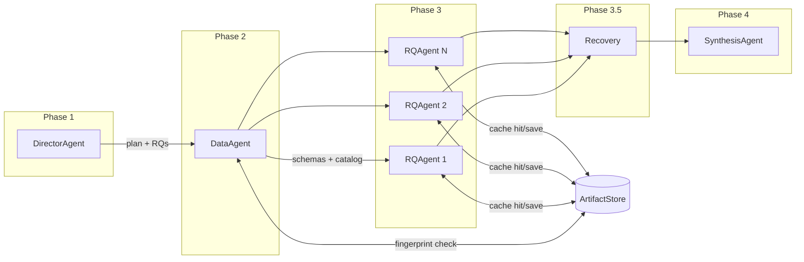
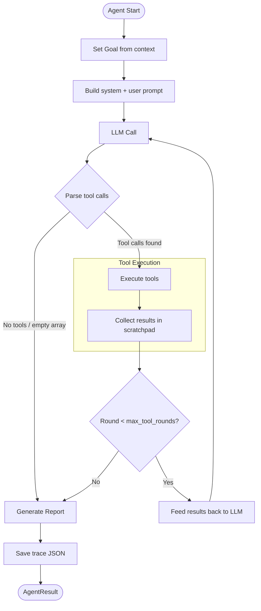
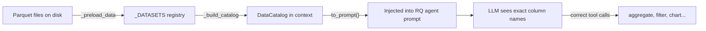
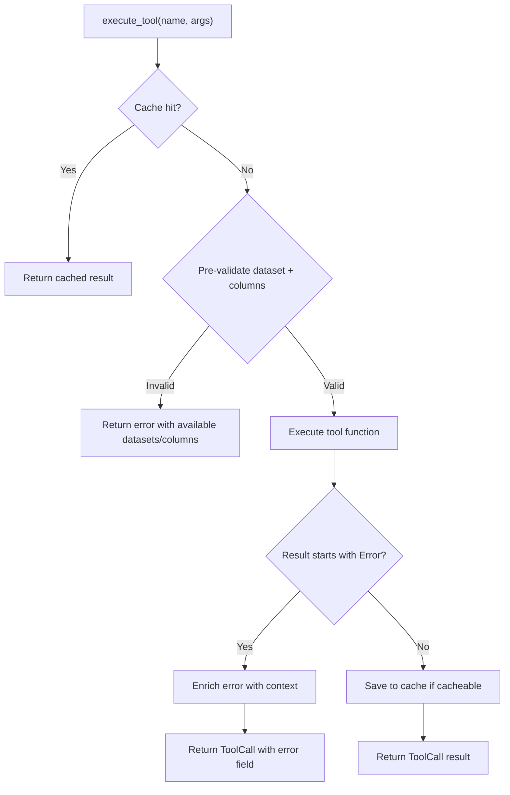
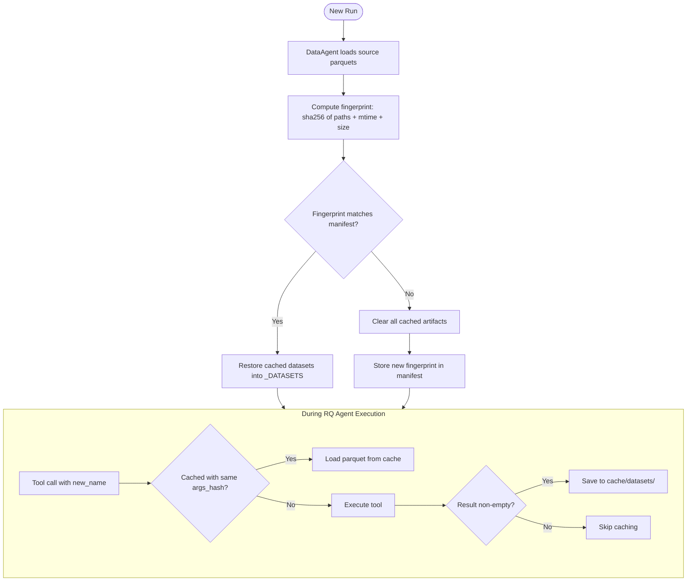

# Architecture

## Overview

The Health SUS Agent is a multi-agent research system that autonomously investigates public health patterns in Brazilian SUS data. Given a research question, it plans the investigation, loads and profiles datasets, runs structured analyses per sub-question, recovers from errors, and produces markdown research reports with charts and statistical findings.

The system uses a **spine architecture**: a rigid, named sequence of specialized agents that communicate through shared state and persist intermediate results in a cross-run cache.

## Spine Pipeline

The spine runs four phases sequentially, with an optional recovery phase between RQ analysis and synthesis:



| Phase | Agent | Input | Output | Duration |
|-------|-------|-------|--------|----------|
| 1 | DirectorAgent | Research question | `00_plan.md`, `context.json` with RQs, ICD-10, year range | ~12s |
| 2 | DataAgent | Context + data directory | `01_data_report.md`, loaded datasets, DataCatalog | ~20s |
| 3 | RQAgent (x N) | One ResearchQuestion + context | `NN_rq_id.md`, charts, findings | ~60s each |
| 3.5 | Recovery | Error collection from Phase 3 | Re-run of high-error agents with error context | 0-60s |
| 4 | SynthesisAgent | All reports + findings | `executive_summary.md`, `FINDINGS.md` | ~25s |

Each agent:
1. Receives the shared `InvestigationContext` (read/write)
2. Follows a Goal-Plan-Act-Observe-Reflect (GPAOR) reasoning loop
3. Uses pre-built tools via structured JSON tool calls
4. Produces a markdown report saved to `runs/{run_id}/reports/`
5. Saves a trace file to `runs/{run_id}/traces/`

## Agent Anatomy: GPAOR Loop

Every agent (except Director and Synthesis, which use single LLM calls) follows a multi-round reasoning loop:



The LLM outputs a JSON array of tool calls. The base agent framework parses them (handling multiple key naming conventions), executes each tool with pre-validation and cache checks, and feeds results back for the next round.

**Key parameters:**
- `max_tool_rounds`: Maximum reasoning iterations (default: 5, typically set to 3 for investigations)
- Each round can contain multiple tool calls executed sequentially

## Shared State: InvestigationContext

`InvestigationContext` is the contract between agents. It flows through the entire spine and is persisted as `context.json`.

| Field | Set by | Read by | Description |
|-------|--------|---------|-------------|
| `question` | Spine | All | Original research question |
| `icd10_prefix` | Director | Data, RQ | ICD-10 code prefix (e.g., `J96`) |
| `uf`, `year_range` | Director | Data, RQ | Geographic and temporal scope |
| `research_questions` | Director | RQ, Synthesis | List of `ResearchQuestion` objects |
| `domain_priors` | Director | RQ | What domain experts already know |
| `datasets_loaded` | Data | RQ, Synthesis | Names of loaded datasets |
| `data_catalog` | Data | RQ | `DataCatalog` with schemas, dtypes, sample values |
| `data_summary` | Data | Synthesis | Text summary of data quality |
| `findings` | RQ | Synthesis | Accumulated research findings |
| `open_questions` | RQ | Synthesis | Unanswered questions for future work |
| `completed_rqs` | RQ | Synthesis | Which RQs have been investigated |

## DataCatalog

The DataCatalog solves a critical problem: the LLM needs to know exact column names and data types to make valid tool calls. Without it, agents guess column names and produce errors.



The catalog stores per-dataset:
- Name, row count, column list
- Data types for up to 30 columns
- Sample values (up to 3 per column) so the LLM understands value encoding

This is populated by DataAgent after loading data and consumed by every downstream agent in their system prompts.

## Tool System

Agents interact with data through pre-built, deterministic tools rather than generating arbitrary code:

| Tool | Module | Key Args | Cacheable |
|------|--------|----------|-----------|
| `load_dataset` | `tools/data` | name, path, filters | No |
| `list_datasets` | `tools/data` | — | No |
| `describe_columns` | `tools/data` | dataset, columns | No |
| `filter_dataset` | `tools/data` | dataset, conditions, new_name | Yes |
| `aggregate` | `tools/analysis` | dataset, group_by, metrics, new_name | Yes |
| `time_series` | `tools/analysis` | dataset, date_col, value_col, freq, new_name | Yes |
| `cross_tabulate` | `tools/analysis` | dataset, row_var, col_var, new_name | Yes |
| `statistical_test` | `tools/analysis` | dataset, test_type, group_col, value_col | No |
| `logistic_regression` | `tools/analysis` | dataset, target, features | No |
| `create_chart` | `tools/visualization` | chart_type, dataset, x, y, title, filename | Yes |
| `record_finding` | `tools/findings` | finding_id, statement, evidence, so_what, confidence | No |
| `get_findings_summary` | `tools/findings` | — | No |
| `add_open_question` | `tools/findings` | question | No |

### Tool Execution Flow

Every tool call goes through a three-stage pipeline:



**Pre-validation** checks before execution:
- Does the dataset exist in `_DATASETS`?
- Do the referenced columns exist in the dataset?

**Error enrichment** adds context to error messages:
- Lists available datasets when a dataset is not found
- Lists available columns when a column is not found

This gives the LLM enough information to self-correct in the next round.

## ArtifactStore: Cache Layer

The ArtifactStore persists intermediate datasets (parquet) and charts (PNG) across runs. It uses source-data fingerprinting to detect staleness.



### Cache structure

```
cache/
├── manifest.json          # Fingerprint + artifact registry
├── datasets/              # Intermediate parquets (e.g., yearly_stats.parquet)
└── plots/                 # Chart PNGs (e.g., 01_mortality_trend.png)
```

### Key decisions

- **All-or-nothing invalidation**: If any source file changes, the entire cache is cleared. Simpler than per-artifact dependency graphs.
- **Cache is optional**: Controlled by `enable_cache` flag. Disabled = everything works as before.
- **Empty results are never cached**: Datasets with 0 rows and charts from empty data are skipped to avoid poisoning the cache.
- **Incremental saves**: Each tool call saves immediately. Partial runs still populate the cache.
- **Args-based matching**: Cache hits require both the same artifact name AND the same `args_hash` (SHA-256 of serialized arguments).

## Error Recovery

After all RQ agents finish, the Spine collects errors and decides which agents need a retry.

**Retry criteria:**
- Error rate > 30% AND at least 3 errors
- The agent is re-run with a `prior_errors` section injected into its prompt, listing the specific tool calls that failed and why

**What gets injected:**
```
## RETRY — Previous errors to avoid

A prior run of this agent failed on these calls.
Use the correct dataset names and column names.

- aggregate({"dataset": "wrong_name", ...}): Dataset 'wrong_name' not found...
- create_chart({"dataset": "empty_ds", ...}): dataset is empty (0 rows)...
```

This gives the LLM explicit guidance to avoid repeating the same mistakes.

## Output Structure

```
runs/{run_id}/
├── context.json                    # Final investigation state
├── FINDINGS.md                     # Top-level findings (human-readable)
├── reports/
│   ├── 00_plan.md                  # Investigation plan (Director)
│   ├── 01_data_report.md           # Data quality profile (DataAgent)
│   ├── 02_rq_topic.md              # Per-question research reports (RQAgent)
│   ├── ...
│   └── executive_summary.md        # Consolidated summary (Synthesis)
├── plots/
│   └── NN_chart_name.png           # Visualizations
└── traces/
    └── agent_name_trace.json       # Per-agent execution traces

cache/                              # Persistent across runs
├── manifest.json
├── datasets/*.parquet
└── plots/*.png
```

## LLM Configuration

Supports Anthropic and OpenAI-compatible APIs (Ollama, vLLM, LM Studio) via environment variables:

| Variable | Default | Description |
|----------|---------|-------------|
| `AGENT_LLM_PROVIDER` | `anthropic` | `openai` or `anthropic` |
| `AGENT_LLM_MODEL` | provider default | Model name (e.g., `gpt-oss:120b-cloud`) |
| `AGENT_LLM_BASE_URL` | — | API base URL (required for Ollama/vLLM) |
| `AGENT_LLM_API_KEY` | — | API key |
| `AGENT_LLM_MAX_TOKENS` | `4096` | Max output tokens per LLM call |
| `AGENT_LLM_TIMEOUT_SECONDS` | `120` | HTTP request timeout |

Example for Ollama with a cloud-hosted model:

```bash
export AGENT_LLM_PROVIDER=openai
export AGENT_LLM_BASE_URL=http://localhost:11434/v1
export AGENT_LLM_MODEL=gpt-oss:120b-cloud
export AGENT_LLM_API_KEY=ollama
```

## Skills

Skills are per-capability markdown files in `skills/`. Each agent loads only the skills it needs, keeping prompts focused:

| Skill | Content | Used By |
|-------|---------|---------|
| `sus_domain` | SIH columns, ICD-10 codes, IBGE codes | Director, Data, RQ |
| `data_loading` | Parquet loading patterns, validation | Data |
| `eda_patterns` | Decomposition strategies, chart types | Director, RQ |
| `statistical_tests` | Test selection, confounder adjustment | RQ |
| `report_writing` | Report structure, narrative style | RQ, Synthesis |
| `sus_gotchas` | String columns, date formats, leakage | Data, RQ |
| `ml_modeling` | Feature engineering, model config | RQ |

## Performance

Typical E2E investigation (J96 respiratory failure, 8 research questions, `gpt-oss:120b-cloud` via Ollama):

| Metric | Value |
|--------|-------|
| Director | ~13s |
| DataAgent | ~19s (8 datasets, ~19 tool calls) |
| 8 RQ Agents | ~55-96s each (~70s avg) |
| Recovery | 0s (no retries needed at <6% error rate) |
| Synthesis | ~25s |
| **Total** | **~11 minutes** |
| Tool calls | ~180 |
| Errors | ~11 (6% error rate) |
| Cache | ~55 datasets, ~33 charts persisted |
