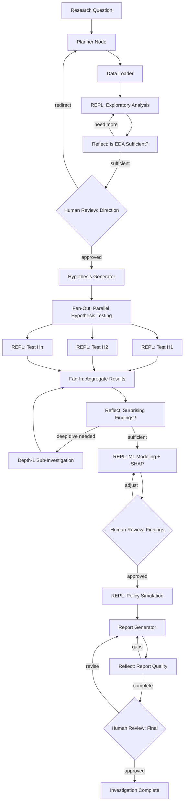

# PRD: SUS Deep-Dive Investigation Agent

## Overview

An autonomous LangGraph-based agent that accepts a health research question about the Brazilian public health system (SUS) and conducts a full investigation — from data loading through ML modeling to policy recommendations — with human-in-the-loop checkpoints at critical decision points.

The agent combines three architectural patterns:
1. **Python REPL execution** — The agent writes and runs arbitrary pandas/sklearn/matplotlib code, not just pre-defined tools
2. **Recursive subagent invocation** (RLM pattern) — When the agent spots an unexpected pattern, it spawns a depth-1 child investigation to drill deeper
3. **Deep Research reflection loops** — After each phase, the agent self-evaluates whether findings are sufficient or need iterative deepening

**First target:** Kidney stone investigation in São Paulo, using the patterns and domain knowledge encoded in the `sus-deep-dive` skill.

## Problem Statement

Health data investigations currently require a skilled data scientist to:
1. Understand SUS data schemas and quirks
2. Formulate hypotheses manually
3. Write analysis code from scratch each time
4. Iterate through EDA → hypothesis testing → ML modeling → simulation
5. Produce publishable-quality findings

This process takes weeks per condition. An agent with domain knowledge (the `sus-deep-dive` skill), a Python REPL for ad-hoc analysis, and recursive depth for unexpected findings can reduce this to hours, while maintaining research rigor through human checkpoints and reflection loops.

## Goals

1. **Accept any ICD-10 condition** and autonomously conduct a structured investigation
2. **Write and execute analysis code** via sandboxed Python REPL — not limited to pre-built tools
3. **Recursively deep-dive** when unexpected patterns emerge (depth-1 subagent invocation)
4. **Self-evaluate and iterate** through reflection loops before proceeding to next phase
5. **Produce research-quality outputs**: plots, metrics, FINDINGS.md, executive summary
6. **Human-in-the-loop**: Pause at key decision points for validation before proceeding
7. **Reproducible**: All code, outputs, and reasoning chains are logged and versioned

## Non-Goals

- Real-time dashboarding or monitoring
- Clinical decision support for individual patients
- Replacing epidemiologists — the agent assists, humans validate
- Deep recursion (depth > 1) — research shows this causes "overthinking" with degraded results

---

## Architecture

### Design Influences

| Pattern | Source | What We Take |
|---|---|---|
| **Python REPL** | RLM (arXiv 2512.24601), LangChain PythonAstREPLTool | Agent writes and executes ad-hoc analysis code instead of calling rigid pre-built tools |
| **Recursive Language Models** | RLM, "Think But Don't Overthink" (arXiv 2603.02615) | Depth-1 subagent invocation for deep-diving unexpected patterns. No depth > 1 (causes overthinking) |
| **Deep Research** | OpenAI Deep Research, LangGraph deep research patterns | Reflection loops, fan-out parallelization, iterative deepening based on evidence sufficiency |

### Graph Structure

The graph is **cyclic**, not linear. Reflection nodes can route back to earlier phases when evidence is insufficient.



### Key Architectural Differences from V1

| Aspect | V1 (Current PRD) | V2 (This Update) |
|---|---|---|
| Code execution | Pre-built tools only | **Python REPL** — agent writes pandas/sklearn code |
| Graph shape | Linear pipeline | **Cyclic** — reflection loops route back |
| Hypothesis testing | Sequential | **Fan-out/fan-in** — parallel testing |
| Unexpected findings | Ignored until human review | **Depth-1 subagent** spawns automatically |
| Quality control | Human checkpoints only | **Reflection nodes** + human checkpoints |
| Analysis flexibility | Fixed to tool signatures | **Arbitrary** — any valid Python |

### State Schema

```python
from typing import TypedDict, Literal, Annotated
from dataclasses import dataclass, field
from operator import add


class InvestigationState(TypedDict):
    # Input
    research_question: str
    icd10_prefix: str
    uf: str  # default "SP"
    year_range: tuple[int, int]

    # Planning
    investigation_plan: str
    hypotheses: list[Hypothesis]

    # Data
    data_loaded: bool
    n_records: int
    filtered_parquet_path: str
    cnes_parquet_path: str

    # REPL Context
    repl_variables: dict           # Persisted Python namespace (dataframes, models)
    code_history: Annotated[list[CodeExecution], add]  # All code executed, appended
    repl_errors: Annotated[list[str], add]             # Errors from code execution

    # EDA
    eda_metrics: dict
    eda_plots: Annotated[list[str], add]
    eda_summary: str

    # Hypothesis Testing (fan-out/fan-in)
    hypothesis_results: Annotated[list[HypothesisResult], add]  # Merged from parallel nodes
    pending_hypotheses: list[str]   # IDs not yet tested
    active_round: int               # Synchronization round for fan-out

    # Sub-investigations (depth-1 recursive)
    sub_investigations: Annotated[list[SubInvestigation], add]

    # Reflection
    reflection_log: Annotated[list[Reflection], add]

    # ML
    model_trained: bool
    ml_metrics: dict
    shap_top_features: list[str]
    ml_plots: Annotated[list[str], add]

    # Simulation
    simulation_results: dict
    simulation_plots: Annotated[list[str], add]

    # Report
    findings_md: str
    executive_summary_plot: str

    # Control
    current_step: str
    human_feedback: str | None
    errors: Annotated[list[str], add]


@dataclass
class CodeExecution:
    """Record of a single REPL execution."""
    node: str              # Which graph node ran this code
    code: str              # Python source code
    output: str            # stdout + return value
    error: str | None      # stderr if failed
    artifacts: list[str]   # File paths created (plots, parquets)
    duration_ms: int


@dataclass
class Hypothesis:
    id: str
    statement: str
    test_method: str
    status: Literal["pending", "confirmed", "rejected", "inconclusive"] = "pending"


@dataclass
class HypothesisResult:
    hypothesis_id: str
    verdict: Literal["confirmed", "rejected", "inconclusive"]
    evidence: str
    code_used: str         # The REPL code that produced this result
    metrics: dict
    plots: list[str] = field(default_factory=list)


@dataclass
class SubInvestigation:
    """Result of a depth-1 recursive sub-investigation."""
    trigger: str           # What finding triggered this
    question: str          # The sub-question investigated
    summary: str           # Key findings
    code_history: list[CodeExecution]
    plots: list[str] = field(default_factory=list)
    metrics: dict = field(default_factory=dict)


@dataclass
class Reflection:
    """Self-evaluation at a reflection point."""
    phase: str             # "eda", "hypothesis", "ml", "report"
    assessment: str        # What the agent thinks about current state
    gaps: list[str]        # Identified gaps or missing analyses
    decision: Literal["continue", "deepen", "subinvestigate", "sufficient"]
    reasoning: str
```

### Node Descriptions

#### 1. Planner Node
**Input:** Research question + domain knowledge from `sus-deep-dive/SKILL.md`
**Output:** Investigation plan, ICD-10 filter, year range, initial hypotheses
**LLM Role:** Parse the research question, identify the ICD-10 prefix, select relevant data sources, and generate pre-registered hypotheses based on common patterns from the skill.

#### 2. Data Loader Node
**Input:** ICD-10 prefix, year range, UF
**Output:** Filtered parquet files saved to `outputs/`, dataframe loaded into REPL namespace
**Tools:** `load_sih_data`, `load_cnes_data` (deterministic, no LLM needed)
**Post-condition:** `repl_variables["kidney"]` contains the filtered dataframe.

#### 3. REPL: Exploratory Analysis
**Input:** Dataframe in REPL namespace + SKILL.md guidance
**Output:** EDA metrics, plots, summary narrative
**Execution:** The LLM writes pandas/matplotlib code, executes it in the sandboxed REPL, observes the output, and writes more code based on what it sees. This is **not** a fixed sequence — the agent explores the data iteratively.

Example REPL interaction:
```python
# Agent writes:
print(kidney["SEXO"].astype(str).value_counts())
# REPL returns: "1"  97462, "3"  109038
# Agent observes more females than males, writes:
sex_yearly = kidney.groupby(["year", "SEXO"]).size().unstack()
sex_yearly.plot(kind="bar", stacked=True)
plt.savefig("outputs/plots/02_sex_yearly.png")
# Agent interprets the plot, decides whether to investigate further
```

#### 4. Reflect: Is EDA Sufficient?
**Input:** EDA summary, metrics, plots produced so far
**LLM Role:** Self-evaluate — "Have I looked at all relevant dimensions? Are there patterns I haven't explored? Am I missing a confound?"
**Output:** `Reflection` object with `decision`:
- `"deepen"` → route back to REPL for more EDA
- `"sufficient"` → proceed to human checkpoint

This prevents the agent from rushing to conclusions with shallow EDA.

#### 5. Hypothesis Generator Node
**Input:** EDA results + initial hypotheses + reflection
**Output:** Refined hypotheses with specific test methods and REPL code plans
**LLM Role:** Based on what the data actually showed (not assumptions), generate testable hypotheses. Each hypothesis includes the Python code needed to test it.

#### 6. Fan-Out: Parallel Hypothesis Testing
**Execution:** Each hypothesis is tested independently via a REPL node. Uses LangGraph's `Send()` API to fan out to parallel nodes, each writing and executing its own test code.
**Synchronization:** Round-based barrier — all hypothesis nodes must complete before fan-in.

#### 7. Reflect: Surprising Findings?
**Input:** Aggregated hypothesis results
**LLM Role:** Identify which findings are surprising, which need deeper investigation.
**Output:** `Reflection` with `decision`:
- `"subinvestigate"` → spawn a depth-1 sub-investigation (e.g., "why does Guarulhos have 3x the ER rate?")
- `"sufficient"` → proceed to ML modeling

#### 8. Depth-1 Sub-Investigation (RLM Pattern)
**Trigger:** Reflection node identifies a finding worth drilling into.
**Execution:** A child agent receives:
- The parent's dataframe (via REPL namespace)
- A focused sub-question
- The `sus-deep-dive` skill as context
- Its own REPL environment

The child runs its own mini EDA + hypothesis test cycle, produces a `SubInvestigation` result, and returns to the parent. **No further recursion** — the child cannot spawn grandchildren. Research (arXiv 2603.02615) shows depth > 1 degrades quality.

#### 9. REPL: ML Modeling + SHAP
**Input:** Dataframe + feature engineering guidance from SKILL.md
**Execution:** Agent writes LightGBM training code, SHAP analysis, and plot generation. Uses the REPL to iteratively refine features based on SHAP output.

#### 10. REPL: Policy Simulation
**Input:** Trained model in REPL namespace + SHAP insights
**Execution:** Agent writes counterfactual simulation code. Can test multiple interventions iteratively.

#### 11. Report Generator + Reflect
**Input:** All results, code history, plots
**LLM Role:** Write FINDINGS.md narrative, generate executive summary. Then self-evaluate: "Is the narrative coherent? Are claims supported by evidence? Are there gaps in the story?"
**Output:** Report + `Reflection` — loops back if quality is insufficient.

---

## Tools

The agent has two categories of tools: the **Python REPL** (primary) and **structured tools** (for safety-critical or data-access operations).

### Primary: Python REPL

The core analysis tool. The agent writes arbitrary Python code which executes in a sandboxed environment with a persistent namespace.

```python
@tool
def python_repl(code: str) -> str:
    """Execute Python code in a sandboxed REPL environment.

    The REPL namespace is pre-loaded with:
    - pandas as pd, numpy as np, matplotlib.pyplot as plt, seaborn as sns
    - scipy.stats, sklearn, lightgbm, shap
    - All previously created variables (dataframes, models, etc.)
    - Helper: save_plot(fig, name) -> saves to outputs/plots/ and returns path
    - Helper: save_metrics(data, name) -> saves to outputs/metrics/ and returns path

    Returns: stdout output (truncated to 50K chars). Plots are saved to disk.
    Errors: Returns stderr if execution fails.
    """
```

**Why REPL over pre-built tools:**
- Pre-built tools like `compute_yearly_trend(parquet_path, ...)` can only do what they were designed for
- When the agent discovers something unexpected (e.g., "why is Guarulhos 3x the ER rate?"), it needs to write a custom query — not pick from a fixed menu
- The kidney stone investigation required dozens of ad-hoc analyses that no pre-designed tool set would cover
- Code is self-documenting — every analysis step is recorded in `code_history`

**Safety constraints:**
- No network access from within the REPL
- No filesystem access outside `data/` (read) and `outputs/` (write)
- Execution timeout: 120 seconds per cell
- Output truncation: 50K chars (matches RLM pattern)
- `allow_dangerous_code=True` is required (LangChain config)

### Structured Tools (Data Access)

These remain as structured tools because they involve I/O operations with specific validation:

```python
@tool
def load_sih_data(
    icd10_prefix: str,
    columns: list[str],
    year_range: tuple[int, int] = (2016, 2025),
    uf: str = "SP",
) -> str:
    """Load SIH parquet files filtered by ICD-10 prefix.
    Loads into REPL namespace as 'sih_data'. Returns record count."""

@tool
def load_cnes_data(
    snapshot: str = "latest",
    uf: str = "SP",
) -> str:
    """Load CNES facility data into REPL namespace as 'cnes_data'.
    Returns column list and record count."""

@tool
def lookup_icd10(code: str) -> str:
    """Look up ICD-10 code description. Returns human-readable name."""

@tool
def lookup_procedure(code: str) -> str:
    """Look up SUS SIGTAP procedure code. Returns description."""

@tool
def lookup_municipality(code: str) -> str:
    """Look up IBGE municipality code. Returns city name."""
```

### Recursive Subagent Tool

```python
@tool
def spawn_sub_investigation(
    question: str,
    context_variables: list[str],
    max_iterations: int = 15,
) -> SubInvestigation:
    """Spawn a depth-1 child investigation (RLM pattern).

    The child agent receives:
    - Its own REPL with copies of the specified variables from parent namespace
    - The sus-deep-dive SKILL.md as context
    - The focused sub-question

    The child runs a mini EDA + hypothesis test cycle and returns
    a SubInvestigation with summary, code_history, plots, and metrics.

    Depth limit: 1. The child CANNOT call spawn_sub_investigation.
    Max iterations: configurable, default 15 (prevents runaway loops).
    """
```

### V1 → V2 Tool Migration

| V1 (Pre-built tools) | V2 (REPL-based) | Rationale |
|---|---|---|
| `compute_yearly_trend()` | Agent writes `df.groupby("year").agg(...)` | More flexible, handles any aggregation |
| `compute_migration_rate()` | Agent writes `(df["MUNIC_RES"] != df["MUNIC_MOV"]).mean()` | Trivial in pandas, no wrapper needed |
| `decompose_by_column()` | Agent writes `df.groupby(["year", col]).size().unstack()` | One-liner |
| `run_statistical_test()` | Agent writes `stats.mannwhitneyu(a, b)` | Direct scipy access |
| `engineer_features()` | Agent writes feature engineering code | Custom per investigation |
| `train_lightgbm()` | Agent writes `lgb.LGBMRegressor(...).fit(...)` | Full control over hyperparams |
| `compute_shap()` | Agent writes `shap.TreeExplainer(model).shap_values(X)` | Direct SHAP API |
| `generate_plot()` | Agent writes matplotlib code | Unlimited plot customization |
| `write_findings()` | Agent writes markdown string | Natural language is the LLM's strength |

---

## MCP Integration

### DATASUS MCP Server

A Model Context Protocol server for querying DATASUS data without loading full parquets into memory.

```json
{
  "name": "datasus-mcp",
  "description": "Query Brazilian public health (SUS) data",
  "tools": [
    {
      "name": "query_sih",
      "description": "Query hospital admission records",
      "parameters": {
        "icd10_prefix": "string",
        "uf": "string",
        "year_range": "[int, int]",
        "columns": "[string]",
        "aggregation": "string (count, mean, sum)",
        "group_by": "[string]"
      }
    },
    {
      "name": "query_cnes",
      "description": "Query facility characteristics",
      "parameters": {
        "cnes_id": "string (optional)",
        "municipality": "string (optional)",
        "columns": "[string]"
      }
    },
    {
      "name": "lookup_icd10",
      "description": "Look up ICD-10 code description",
      "parameters": {
        "code": "string"
      }
    },
    {
      "name": "lookup_procedure",
      "description": "Look up SUS SIGTAP procedure code",
      "parameters": {
        "code": "string"
      }
    },
    {
      "name": "lookup_municipality",
      "description": "Look up IBGE municipality code",
      "parameters": {
        "code": "string"
      }
    }
  ]
}
```

### Plotting MCP Server

For generating standardized research plots.

```json
{
  "name": "research-plots-mcp",
  "description": "Generate publication-quality research plots",
  "tools": [
    {
      "name": "bar_chart",
      "description": "Create a bar chart",
      "parameters": {
        "data": "dict",
        "x": "string",
        "y": "string",
        "title": "string",
        "output_path": "string"
      }
    },
    {
      "name": "time_series",
      "description": "Create a time series line chart",
      "parameters": {
        "data": "dict",
        "date_col": "string",
        "value_cols": "[string]",
        "title": "string",
        "output_path": "string"
      }
    },
    {
      "name": "shap_summary",
      "description": "Create SHAP summary plot from saved values",
      "parameters": {
        "shap_path": "string",
        "features_path": "string",
        "plot_type": "string (bar, beeswarm, dependence)",
        "output_path": "string"
      }
    },
    {
      "name": "executive_dashboard",
      "description": "Create multi-panel executive summary",
      "parameters": {
        "metrics": "dict",
        "output_path": "string"
      }
    }
  ]
}
```

---

## Skills Integration

The agent loads `.cursor/skills/sus-deep-dive/SKILL.md` as its primary domain knowledge. This provides:

1. **Data source locations and schemas** — where parquets live, column meanings, gotchas
2. **Investigation workflow** — the 7-step process from data loading to executive summary
3. **Feature engineering recipes** — what features to build, what to avoid (leakage)
4. **ML playbook** — model config, SHAP analysis, temporal splitting
5. **Output standards** — plot naming, metrics JSON schema, FINDINGS.md template
6. **Common pitfalls** — date parsing, column availability, emoji rendering

The agent reads the skill at startup and uses it as context for all planning and analysis decisions.

---

## Human-in-the-Loop Checkpoints

### Checkpoint 1: After EDA
**What the human sees:** EDA plots, summary metrics, proposed hypotheses.
**Human can:** Approve direction, redirect investigation, add/remove hypotheses, request deeper EDA on specific aspects.

### Checkpoint 2: After ML Modeling
**What the human sees:** Model metrics, SHAP feature importance, interaction plots.
**Human can:** Approve findings, request feature engineering changes, flag potential data leakage, ask for additional analysis.

### Checkpoint 3: Before Final Report
**What the human sees:** Draft FINDINGS.md, executive summary plot, simulation results.
**Human can:** Approve for publication, request revisions to narrative, adjust simulation parameters.

---

## Reflection Nodes: Design Detail

Reflection is the mechanism that turns a linear pipeline into an iterative research process.

### How Reflection Works

At each reflection point, the LLM receives:
1. **What was done** — summary of analyses, code executed, plots generated
2. **What was found** — key metrics, surprising patterns
3. **Evaluation prompt** — structured self-critique

```
You are a research quality evaluator. Given the EDA work done so far:

1. List dimensions NOT yet explored (e.g., did we check seasonality? demographics? geography? procedures? admission types?)
2. List potential confounds NOT yet controlled for
3. Rate evidence sufficiency: INSUFFICIENT / ADEQUATE / STRONG
4. Decision: DEEPEN (run more EDA), SUBINVESTIGATE (spawn child for specific finding), or CONTINUE (proceed to next phase)

Be conservative — it's better to explore one more dimension than to miss a key insight.
```

### Reflection Limits

- Maximum 3 reflection loops per phase (prevents infinite cycling)
- Each loop must address a specific gap identified in the previous reflection
- If 3 loops reached, force-proceed with an "incomplete" flag for human review

### Depth-1 Recursion: When and How

**Trigger:** Reflection identifies a finding that needs its own mini-investigation.

**Example from kidney stone research:**
> "Guarulhos has 3x the emergency rate of similar-volume cities. This is unexpected and could be a key driver. Spawning sub-investigation: 'Why does Guarulhos have such a high ER rate for kidney stones? Compare hospital-level data with matched cities.'"

**Implementation:**

```python
def spawn_sub_investigation(state: InvestigationState, question: str) -> SubInvestigation:
    child_state = InvestigationState(
        research_question=question,
        repl_variables={k: v for k, v in state["repl_variables"].items()
                       if k in ["kidney", "cnes", "hospital"]},
        # Child gets a fresh code_history and reflection_log
        code_history=[],
        reflection_log=[],
    )
    # Run the child graph (EDA + Reflect only, no ML/simulation)
    child_graph = build_sub_investigation_graph()  # Simplified graph without fan-out
    result = child_graph.invoke(child_state)
    return SubInvestigation(
        trigger="reflection",
        question=question,
        summary=result["eda_summary"],
        code_history=result["code_history"],
        plots=result["eda_plots"],
        metrics=result["eda_metrics"],
    )
```

**Why depth-1 only:** The "Think, But Don't Overthink" paper (arXiv 2603.02615, March 2026) shows that depth-2 recursion causes exponential execution time and *decreases* accuracy. The sweet spot is exactly one level of recursive decomposition.

---

## Implementation Plan

### Phase 1: REPL + Core Graph (Sprint 1)
- [ ] Set up LangGraph project with typed state (`InvestigationState`)
- [ ] Implement sandboxed Python REPL tool with persistent namespace
- [ ] Implement Data Loader node (structured tool, loads into REPL namespace)
- [ ] Implement REPL-based EDA node (agent writes pandas code)
- [ ] Implement Reflection node with evaluation prompt
- [ ] Implement Checkpoint 1 (human review)
- [ ] Test: agent can load kidney stone data and produce EDA plots via REPL

### Phase 2: Hypothesis Testing + Fan-Out (Sprint 2)
- [ ] Implement Hypothesis Generator node
- [ ] Implement fan-out/fan-in for parallel hypothesis testing using LangGraph `Send()`
- [ ] Implement round-based synchronization barrier
- [ ] Implement Reflection node after hypothesis testing
- [ ] Implement depth-1 subagent (`spawn_sub_investigation`)
- [ ] Test: agent generates and tests hypotheses in parallel, spawns sub-investigation when appropriate

### Phase 3: ML + Simulation (Sprint 3)
- [ ] Implement REPL-based ML node (agent writes LightGBM + SHAP code)
- [ ] Implement REPL-based simulation node (counterfactual code)
- [ ] Implement Checkpoint 2 (human review after ML)
- [ ] Validate against known kidney stone results (metrics within 5% of manual analysis)

### Phase 4: Report + Reflection Quality (Sprint 4)
- [ ] Implement Report Generator with reflection loop
- [ ] Implement Checkpoint 3 (human review before publish)
- [ ] Add code history export (reproducible notebook generation from REPL history)
- [ ] Test: full kidney stone investigation end-to-end

### Phase 5: MCP + Extensibility (Sprint 5)
- [ ] Build DATASUS MCP server for live data queries
- [ ] Build plotting MCP server for standardized charts
- [ ] Add SIM (mortality) and SINAN (diseases) data support
- [ ] Test on a second condition (e.g., dengue) — no code changes, only research question changes

---

## Tech Stack

| Component | Technology | Rationale |
|---|---|---|
| Graph framework | LangGraph 0.6+ | Stateful multi-step agent with checkpoints, fan-out/fan-in, `Send()` |
| LLM | Claude 3.5 Sonnet / GPT-4o | Planning, hypothesis generation, code writing, narrative |
| Code execution | PythonAstREPLTool (sandboxed) | Safe execution of agent-generated analysis code |
| ML | LightGBM | Fast, interpretable, works well on tabular data |
| Explainability | SHAP | Feature importance + interaction effects |
| Data | Pandas + PyArrow | Parquet I/O, data manipulation |
| Plotting | Matplotlib + Seaborn | Publication-quality static plots |
| MCP | FastMCP | Model Context Protocol servers |
| State persistence | LangGraph checkpoints (SQLite) | Resume interrupted investigations |
| Recursion | Custom subgraph invocation | Depth-1 RLM pattern for deep dives |

## Success Criteria

1. **Kidney stone reproduction:** Agent produces equivalent findings to the manual investigation (same key metrics within 5% tolerance)
2. **Adaptive analysis:** Agent discovers the SEXO string-type bug (or similar data quirk) through REPL exploration, not pre-programmed tool logic
3. **Recursive depth:** Agent autonomously spawns at least one sub-investigation when encountering an unexpected finding
4. **Reflection quality:** Agent identifies at least one gap in its own EDA through reflection before human review
5. **New condition:** Agent successfully investigates a second condition (e.g., dengue) without code changes — only the research question changes
6. **Time:** Full investigation completes in <2 hours (including human review pauses)
7. **Quality:** FINDINGS.md is publication-ready without manual editing
8. **Reproducibility:** Code history can be exported as a Jupyter notebook that reproduces all findings
