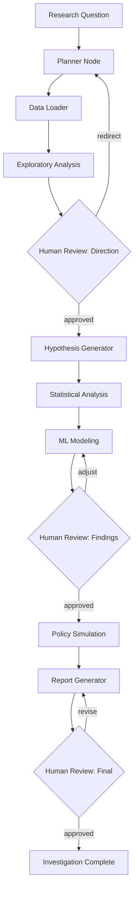

# PRD: SUS Deep-Dive Investigation Agent

## Overview

An autonomous LangGraph-based agent that accepts a health research question about the Brazilian public health system (SUS) and conducts a full investigation — from data loading through ML modeling to policy recommendations — with human-in-the-loop checkpoints at critical decision points.

**First target:** Kidney stone investigation in São Paulo, using the patterns and domain knowledge encoded in the `sus-deep-dive` skill.

## Problem Statement

Health data investigations currently require a skilled data scientist to:
1. Understand SUS data schemas and quirks
2. Formulate hypotheses manually
3. Write analysis code from scratch each time
4. Iterate through EDA → hypothesis testing → ML modeling → simulation
5. Produce publishable-quality findings

This process takes weeks per condition. An agent with domain knowledge (the `sus-deep-dive` skill) and structured tools can reduce this to hours, while maintaining research rigor through human checkpoints.

## Goals

1. **Accept any ICD-10 condition** and autonomously conduct a structured investigation
2. **Produce research-quality outputs**: plots, metrics, FINDINGS.md, executive summary
3. **Human-in-the-loop**: Pause at key decision points for validation before proceeding
4. **Reproducible**: All steps are logged, all outputs are versioned
5. **Extensible**: Easy to add new data sources, tools, or investigation patterns

## Non-Goals

- Real-time dashboarding or monitoring
- Clinical decision support for individual patients
- Replacing epidemiologists — the agent assists, humans validate

---

## Architecture

### Graph Structure



### State Schema

```python
from typing import TypedDict, Literal
from dataclasses import dataclass, field

class InvestigationState(TypedDict):
    # Input
    research_question: str
    icd10_prefix: str
    uf: str  # default "SP"
    year_range: tuple[int, int]

    # Planning
    investigation_plan: str
    hypotheses: list[Hypothesis]

    # Data
    data_loaded: bool
    n_records: int
    filtered_parquet_path: str
    cnes_parquet_path: str

    # EDA
    eda_metrics: dict
    eda_plots: list[str]
    eda_summary: str

    # Hypothesis Testing
    hypothesis_results: list[HypothesisResult]

    # ML
    model_trained: bool
    ml_metrics: dict
    shap_top_features: list[str]
    ml_plots: list[str]

    # Simulation
    simulation_results: dict
    simulation_plots: list[str]

    # Report
    findings_md: str
    executive_summary_plot: str

    # Control
    current_step: str
    human_feedback: str | None
    errors: list[str]


@dataclass
class Hypothesis:
    id: str
    statement: str
    test_method: str
    status: Literal["pending", "confirmed", "rejected", "inconclusive"] = "pending"


@dataclass
class HypothesisResult:
    hypothesis_id: str
    verdict: Literal["confirmed", "rejected", "inconclusive"]
    evidence: str
    metrics: dict
    plots: list[str] = field(default_factory=list)
```

### Node Descriptions

#### 1. Planner Node
**Input:** Research question + domain knowledge from `sus-deep-dive/SKILL.md`
**Output:** Investigation plan, ICD-10 filter, year range, initial hypotheses
**LLM Role:** Parse the research question, identify the ICD-10 prefix, select relevant data sources, and generate pre-registered hypotheses based on common patterns from the skill.

#### 2. Data Loader Node
**Input:** ICD-10 prefix, year range, UF
**Output:** Filtered parquet files saved to `outputs/`
**Tools:** `load_sih_data`, `filter_by_diagnosis`, `load_cnes_data`
**Logic:** Pure tool execution, no LLM needed. Follows the loading pattern from SKILL.md.

#### 3. Exploratory Analysis Node
**Input:** Filtered parquet path
**Output:** EDA metrics, plots, summary narrative
**Tools:** `compute_yearly_trend`, `compute_seasonality`, `compute_demographics`, `compute_geography`, `generate_plot`
**LLM Role:** Interpret EDA results, identify surprising patterns, refine hypotheses.

#### 4. Hypothesis Generator Node
**Input:** EDA results + initial hypotheses
**Output:** Refined hypotheses with specific test methods
**LLM Role:** Based on EDA findings, refine hypotheses and add new ones. Output structured `Hypothesis` objects.

#### 5. Statistical Analysis Node
**Input:** Hypotheses + filtered data
**Output:** Hypothesis results with evidence
**Tools:** `decompose_by_column`, `compute_migration_rate`, `run_statistical_test`
**LLM Role:** Interpret test results, write evidence summaries.

#### 6. ML Modeling Node
**Input:** Filtered data + feature engineering recipe from skill
**Output:** Trained model, SHAP analysis, metrics
**Tools:** `engineer_features`, `train_lightgbm`, `compute_shap`, `generate_plot`
**Logic:** Follows the ML playbook from SKILL.md. Feature engineering is deterministic; model training uses fixed hyperparameters.

#### 7. Policy Simulation Node
**Input:** Trained model + SHAP insights
**Output:** Counterfactual predictions, quantified impact
**Tools:** `run_counterfactual`, `compute_savings`
**LLM Role:** Design interventions based on SHAP top features. Quantify impact.

#### 8. Report Generator Node
**Input:** All results from previous nodes
**Output:** FINDINGS.md + executive summary plot
**Tools:** `generate_findings_md`, `generate_executive_plot`
**LLM Role:** Write the narrative, connect findings to policy implications.

---

## Tools

Each tool is a Python function registered with LangGraph's `ToolNode`.

### Data Tools

```python
@tool
def load_sih_data(
    icd10_prefix: str,
    columns: list[str],
    year_range: tuple[int, int] = (2014, 2024),
    uf: str = "SP",
) -> str:
    """Load SIH parquet files filtered by ICD-10 prefix.
    Returns path to saved filtered parquet."""

@tool
def load_cnes_data(
    snapshot: str = "latest",
    uf: str = "SP",
) -> str:
    """Load CNES facility data. Returns path to saved parquet."""

@tool
def filter_by_diagnosis(
    parquet_path: str,
    icd10_prefix: str,
) -> dict:
    """Filter a loaded SIH parquet by diagnosis prefix.
    Returns record count and sub-diagnosis breakdown."""
```

### Analysis Tools

```python
@tool
def compute_yearly_trend(
    parquet_path: str,
    date_column: str = "DT_INTER",
    metrics: list[str] = ["count", "avg_stay", "avg_cost"],
) -> dict:
    """Compute yearly aggregates. Returns metrics dict."""

@tool
def compute_migration_rate(
    parquet_path: str,
    residence_col: str = "MUNIC_RES",
    treatment_col: str = "MUNIC_MOV",
    group_by: str | None = None,
) -> dict:
    """Compute patient migration rates. Returns migration metrics."""

@tool
def decompose_by_column(
    parquet_path: str,
    column: str,
    date_column: str = "DT_INTER",
) -> dict:
    """Decompose admission trends by a categorical column.
    Returns yearly breakdown by category."""

@tool
def run_statistical_test(
    parquet_path: str,
    test_type: str,  # "chi2", "ttest", "mannwhitneyu"
    group_column: str,
    value_column: str,
) -> dict:
    """Run a statistical test comparing groups. Returns test statistic and p-value."""
```

### ML Tools

```python
@tool
def engineer_features(
    parquet_path: str,
    target: str = "DIAS_PERM",
    feature_recipe: str = "patient_hospital",
) -> str:
    """Apply feature engineering recipe from skill.
    Returns path to feature matrix parquet."""

@tool
def train_lightgbm(
    feature_parquet: str,
    target: str,
    train_years: tuple[int, int],
    test_years: tuple[int, int],
) -> dict:
    """Train LightGBM model. Returns metrics and model path."""

@tool
def compute_shap(
    model_path: str,
    test_data_path: str,
) -> dict:
    """Compute SHAP values. Returns top features and plot paths."""

@tool
def run_counterfactual(
    model_path: str,
    test_data_path: str,
    intervention: dict,
) -> dict:
    """Run counterfactual simulation.
    intervention = {"column": "is_emergency", "condition": "> 0.5", "new_value": 0, "fraction": 0.3}
    Returns predicted savings."""
```

### Output Tools

```python
@tool
def generate_plot(
    plot_type: str,
    data: dict,
    title: str,
    output_path: str,
) -> str:
    """Generate and save a plot. Returns path to saved PNG."""

@tool
def write_findings(
    template: str,
    metrics: dict,
    output_path: str,
) -> str:
    """Generate FINDINGS.md from template and metrics. Returns path."""
```

---

## MCP Integration

### DATASUS MCP Server

A Model Context Protocol server for querying DATASUS data without loading full parquets into memory.

```json
{
  "name": "datasus-mcp",
  "description": "Query Brazilian public health (SUS) data",
  "tools": [
    {
      "name": "query_sih",
      "description": "Query hospital admission records",
      "parameters": {
        "icd10_prefix": "string",
        "uf": "string",
        "year_range": "[int, int]",
        "columns": "[string]",
        "aggregation": "string (count, mean, sum)",
        "group_by": "[string]"
      }
    },
    {
      "name": "query_cnes",
      "description": "Query facility characteristics",
      "parameters": {
        "cnes_id": "string (optional)",
        "municipality": "string (optional)",
        "columns": "[string]"
      }
    },
    {
      "name": "lookup_icd10",
      "description": "Look up ICD-10 code description",
      "parameters": {
        "code": "string"
      }
    },
    {
      "name": "lookup_procedure",
      "description": "Look up SUS SIGTAP procedure code",
      "parameters": {
        "code": "string"
      }
    },
    {
      "name": "lookup_municipality",
      "description": "Look up IBGE municipality code",
      "parameters": {
        "code": "string"
      }
    }
  ]
}
```

### Plotting MCP Server

For generating standardized research plots.

```json
{
  "name": "research-plots-mcp",
  "description": "Generate publication-quality research plots",
  "tools": [
    {
      "name": "bar_chart",
      "description": "Create a bar chart",
      "parameters": {
        "data": "dict",
        "x": "string",
        "y": "string",
        "title": "string",
        "output_path": "string"
      }
    },
    {
      "name": "time_series",
      "description": "Create a time series line chart",
      "parameters": {
        "data": "dict",
        "date_col": "string",
        "value_cols": "[string]",
        "title": "string",
        "output_path": "string"
      }
    },
    {
      "name": "shap_summary",
      "description": "Create SHAP summary plot from saved values",
      "parameters": {
        "shap_path": "string",
        "features_path": "string",
        "plot_type": "string (bar, beeswarm, dependence)",
        "output_path": "string"
      }
    },
    {
      "name": "executive_dashboard",
      "description": "Create multi-panel executive summary",
      "parameters": {
        "metrics": "dict",
        "output_path": "string"
      }
    }
  ]
}
```

---

## Skills Integration

The agent loads `.cursor/skills/sus-deep-dive/SKILL.md` as its primary domain knowledge. This provides:

1. **Data source locations and schemas** — where parquets live, column meanings, gotchas
2. **Investigation workflow** — the 7-step process from data loading to executive summary
3. **Feature engineering recipes** — what features to build, what to avoid (leakage)
4. **ML playbook** — model config, SHAP analysis, temporal splitting
5. **Output standards** — plot naming, metrics JSON schema, FINDINGS.md template
6. **Common pitfalls** — date parsing, column availability, emoji rendering

The agent reads the skill at startup and uses it as context for all planning and analysis decisions.

---

## Human-in-the-Loop Checkpoints

### Checkpoint 1: After EDA
**What the human sees:** EDA plots, summary metrics, proposed hypotheses.
**Human can:** Approve direction, redirect investigation, add/remove hypotheses, request deeper EDA on specific aspects.

### Checkpoint 2: After ML Modeling
**What the human sees:** Model metrics, SHAP feature importance, interaction plots.
**Human can:** Approve findings, request feature engineering changes, flag potential data leakage, ask for additional analysis.

### Checkpoint 3: Before Final Report
**What the human sees:** Draft FINDINGS.md, executive summary plot, simulation results.
**Human can:** Approve for publication, request revisions to narrative, adjust simulation parameters.

---

## Implementation Plan

### Phase 1: Core Graph (Sprint 1)
- [ ] Set up LangGraph project with typed state
- [ ] Implement Data Loader node (deterministic, no LLM)
- [ ] Implement EDA node with basic tools
- [ ] Implement Checkpoint 1
- [ ] Run kidney stone investigation as end-to-end test

### Phase 2: ML Pipeline (Sprint 2)
- [ ] Implement feature engineering tool
- [ ] Implement LightGBM training + SHAP tools
- [ ] Implement Simulation node
- [ ] Implement Checkpoint 2
- [ ] Validate against known kidney stone results

### Phase 3: Report Generation (Sprint 3)
- [ ] Implement FINDINGS.md generation
- [ ] Implement executive summary plot generation
- [ ] Implement Checkpoint 3
- [ ] Add conversation memory for iterative refinement

### Phase 4: MCP + Extensibility (Sprint 4)
- [ ] Build DATASUS MCP server
- [ ] Build plotting MCP server
- [ ] Add support for SIM (mortality) and SINAN (diseases) data
- [ ] Test on a second condition (e.g., dengue, ICSAP)

---

## Tech Stack

| Component | Technology | Rationale |
|---|---|---|
| Graph framework | LangGraph | Stateful multi-step agent with checkpoints |
| LLM | GPT-4o / Claude 3.5 | Planning, hypothesis generation, narrative |
| ML | LightGBM | Fast, interpretable, works well on tabular data |
| Explainability | SHAP | Feature importance + interaction effects |
| Data | Pandas + PyArrow | Parquet I/O, data manipulation |
| Plotting | Matplotlib + Seaborn | Publication-quality static plots |
| MCP | FastMCP | Model Context Protocol servers |
| State persistence | LangGraph checkpoints (SQLite) | Resume interrupted investigations |

## Success Criteria

1. **Kidney stone reproduction:** Agent produces equivalent findings to the manual investigation (same key metrics within 5% tolerance)
2. **New condition:** Agent successfully investigates a second condition (e.g., dengue) without code changes — only the research question changes
3. **Time:** Full investigation completes in <2 hours (including human review pauses)
4. **Quality:** FINDINGS.md is publication-ready without manual editing
