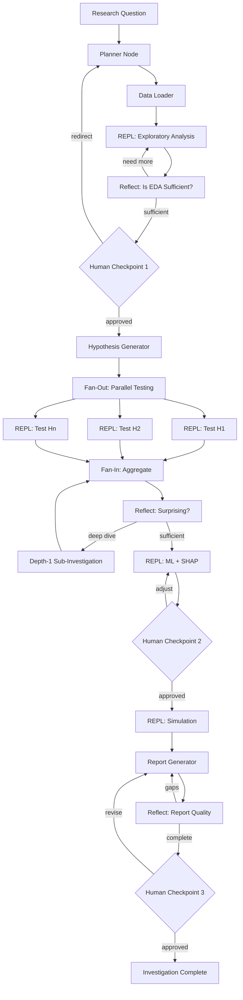

# Agent Architecture

> Technical architecture for the autonomous SUS research agent.
> Read `LESSONS_LEARNED.md` first (failure modes), then this doc (how we fix them),
> then `ROADMAP.md` (sprint plan).

---

## Design Influences

| Pattern | Source | What We Take |
|---|---|---|
| **Python REPL** | RLM (arXiv 2512.24601), LangChain PythonAstREPLTool | Agent writes and executes ad-hoc analysis code instead of calling rigid pre-built tools |
| **Recursive Language Models** | RLM, "Think But Don't Overthink" (arXiv 2603.02615) | Depth-1 subagent invocation for deep-diving unexpected patterns. No depth > 1. |
| **Deep Research** | OpenAI Deep Research, LangGraph deep research patterns | Reflection loops, fan-out parallelization, iterative deepening based on evidence sufficiency |

---

## System Overview

```
┌─────────────────────────────────────────────────────────────────────┐
│                     HUMAN: RESEARCH DIRECTOR                        │
│                                                                     │
│  Reviews at 3 checkpoints only:                                     │
│    1. After plan + EDA → "Is this the right question?"              │
│    2. After core analysis → "Are the findings real?"                │
│    3. Before final report → "Is this actionable?"                   │
└────────────────────────┬────────────────────────────────────────────┘
                         │
          ┌──────────────┴──────────────┐
          ▼                             ▼
┌──────────────────┐         ┌──────────────────────┐
│  PLANNER         │         │  CRITIC              │
│                  │         │                      │
│  Reads:          │         │  After each step:    │
│  • Skill         │         │  • 5-test quality    │
│  • Memory        │         │    gate              │
│  • Data registry │         │  • pass / deepen /   │
│                  │         │    fail decision      │
│  Produces:       │         │                      │
│  • Plan          │         │  Reads:              │
│  • Hypotheses    │         │  • Domain priors     │
│  • Data needs    │         │  • Findings so far   │
└────────┬─────────┘         └──────────┬───────────┘
         │                              │
         ▼                              │
┌─────────────────────────────────────────────────────────────────────┐
│                     ANALYSIS ENGINE (Python REPL)                    │
│                                                                     │
│  ┌─────────────┐  ┌──────────────┐  ┌────────────────────────────┐ │
│  │ Code        │  │ Structured   │  │ REPL Sandbox               │ │
│  │ Generator   │──│ Tools        │──│ Persistent namespace       │ │
│  │             │  │ (data I/O)   │  │ save_plot / save_metrics   │ │
│  └─────────────┘  └──────────────┘  └────────────────────────────┘ │
│                                                                     │
│  ┌─────────────────────────────────────────────────────────────┐   │
│  │ EXECUTION TRACE                                              │   │
│  │ Ordered, timestamped log of all code + output + artifacts    │   │
│  └─────────────────────────────────────────────────────────────┘   │
│                                                                     │
│  ┌─────────────────────────────────────────────────────────────┐   │
│  │ FINDINGS ACCUMULATOR                                         │   │
│  │ Facts (with confidence) · Contradictions · Open questions    │   │
│  └─────────────────────────────────────────────────────────────┘   │
└─────────────────────────────────────────────────────────────────────┘
         │
         ▼
┌─────────────────────────────────────────────────────────────────────┐
│                     CROSS-CUTTING CONCERNS                          │
│                                                                     │
│  ┌────────────┐  ┌────────────┐  ┌────────────┐  ┌─────────────┐  │
│  │ Skill      │  │ Memory     │  │ Data       │  │ Output      │  │
│  │ System     │  │ Store      │  │ Registry   │  │ Renderer    │  │
│  └────────────┘  └────────────┘  └────────────┘  └─────────────┘  │
└─────────────────────────────────────────────────────────────────────┘
```

---

## 1. Skill System

### What It Is

The agent's domain knowledge — loaded at startup and injected as context
into every LLM call that needs domain awareness (Planner, Code Generator,
Critic).

### Primary Skill: `sus-deep-dive`

Located at `.cursor/skills/sus-deep-dive/SKILL.md`. Provides:

| Knowledge Area | Examples |
|---|---|
| **Data schemas** | SIH column names, types, gotchas (`SEXO` is string `"1"`/`"3"`, not int) |
| **Loading patterns** | How to glob parquet dirs, filter by ICD-10, parse dates |
| **Investigation workflow** | 7-step process: load → EDA → hypothesize → test → ML → simulate → report |
| **Feature engineering** | What features to build, what causes leakage (`DIAS_PERM` derivatives) |
| **ML playbook** | LightGBM config, temporal split, SHAP analysis |
| **Output standards** | Plot naming, metrics JSON schema, FINDINGS.md template |
| **Common pitfalls** | Column availability across years, IBGE codes, date formats |

### How Skills Are Used

```
Planner:
  system_prompt = PLANNER_INSTRUCTIONS + skill_content
  → Knows what data sources exist, what columns mean, what workflow to follow

Code Generator:
  system_prompt = CODEGEN_INSTRUCTIONS + skill_content + namespace_state
  → Writes correct pandas code (string comparisons, proper column names)

Critic:
  domain_priors list is seeded from skill knowledge
  → Knows what findings are "obvious" vs "surprising" in SUS context
```

### Extensibility

New skills can be added for new domains. The agent selects the relevant
skill based on the research question. For SUS investigations, the
`sus-deep-dive` skill is always loaded. Future skills could cover other
health systems or data sources.

---

## 2. RLM Pattern (Recursive Language Models)

### Core Idea

From arXiv 2512.24601: instead of pre-built tools, the agent writes and
executes arbitrary code in a REPL, observes the output, and writes more
code based on what it sees. This is an **iterative conversation with data**,
not a one-shot code generation.

### REPL Loop

```
┌──────────────────────────────────────────────────────┐
│                                                       │
│   LLM observes          LLM writes         Engine    │
│   output + state  ────► Python code  ────► executes  │
│        ▲                                     │       │
│        │                                     │       │
│        └─────── stdout, metrics, plots ◄─────┘       │
│                                                       │
│   Repeats until Critic says "pass" or max iterations  │
└──────────────────────────────────────────────────────┘
```

**Why REPL over pre-built tools:**
- Pre-built tools can only answer questions they were designed for
- "Why does Guarulhos have 3x the ER rate?" requires custom pandas queries
- The kidney stone investigation needed dozens of ad-hoc analyses
- Code is self-documenting (every step in the execution trace)

### Depth-1 Recursion (Subagent)

When the Critic or Reflection node flags a surprising finding, the
orchestrator can spawn a **child investigation**:

```
Parent agent:
  "J96 mortality is rising" → "but why is it rising faster for age 70+?"
                                        │
                                        ▼
                              Child agent (depth-1):
                                Own REPL environment
                                Copies of parent's dataframes
                                Same skill context
                                Own Critic + Accumulator
                                Returns SubInvestigation result
                                        │
                                        ▼
                              Merged back into parent's
                              Findings Accumulator
```

**Depth limit: 1.** The child cannot spawn grandchildren. Research
(arXiv 2603.02615) shows depth > 1 causes exponential execution time and
*decreases* accuracy.

**Implementation:**
- Child gets a simplified graph (EDA + Reflect only, no ML/simulation)
- Child has max 15 iterations
- Child's findings merge back into parent's Accumulator

---

## 3. Memory

Three layers of memory, from short-term to long-term:

### 3.1 Within-Step: REPL Namespace

The `ReplSandbox` maintains a persistent Python namespace across code
executions within a single analysis step. Variables, dataframes, and
models survive between calls.

**Already implemented** in `src/agent/engine.py`.

### 3.2 Within-Investigation: Findings Accumulator

Cross-step knowledge that evolves as the investigation progresses:

| Component | Purpose |
|---|---|
| **Established facts** | Findings with confidence levels. Fed to Planner + Code Generator as context. |
| **Contradictions** | When a new finding conflicts with an earlier one (e.g., "mortality is falling" vs "mortality is rising for age 70+"). Triggers resolution steps. |
| **Open questions** | Unanswered questions discovered during analysis. Drive adaptive planning. |

The Accumulator's `summary()` is injected into every Critic evaluation
and every Code Generator call, so the agent always has the full picture.

**Already implemented** in `src/agent/accumulator.py`.

### 3.3 Within-Investigation: State Persistence (Checkpoints)

LangGraph checkpoints (SQLite) persist the full `InvestigationState` to
disk. This enables:
- **Resume interrupted investigations** — pick up where you left off
- **Human review pauses** — agent pauses at checkpoints, human reviews
  asynchronously, agent resumes
- **Branching** — try two different analysis directions from the same
  checkpoint

**Not yet implemented.** Requires LangGraph migration (Sprint 6).

### 3.4 Cross-Investigation: Investigation Memory

Learning from past investigations to improve future ones:

```
Investigation 1 (J96):
  Learned: "age dominates mortality variance for respiratory conditions"
  Learned: "post-COVID mortality persists after age adjustment"
  Learned: "hospital ranking requires case-mix adjustment"

Investigation 2 (N20):
  Memory provides: "check if age is a dominant factor here too"
  Memory provides: "always case-mix adjust hospital comparisons"
  Memory provides: "check for COVID-era effects"
```

**Implementation approach:**
- After each investigation, extract key learnings as structured facts
- Store in a `memory/` JSON or SQLite database
- At planning time, retrieve relevant memories based on condition type
- Feed as additional context to Planner and Critic

**Not yet implemented.** Planned for after the first two-condition
validation (Sprint 7+).

---

## 4. Reflection Nodes

The Critic (5-test quality gate) is one form of reflection. The full
architecture has reflection at multiple phases:

### 4.1 Critic (After Each Analysis Step)

Already implemented. Five tests: circularity, depth, surprise,
confounders, so-what. Returns pass/deepen/fail.

### 4.2 Phase Reflection (After Each Phase)

A broader evaluation than the per-step Critic. Asks:

```
Given the EDA / hypothesis testing / ML work done so far:
1. List dimensions NOT yet explored
2. List potential confounders NOT yet controlled for
3. Rate evidence sufficiency: INSUFFICIENT / ADEQUATE / STRONG
4. Decision: DEEPEN / SUBINVESTIGATE / CONTINUE
```

**Reflection limits:**
- Maximum 3 loops per phase (prevents infinite cycling)
- Each loop must address a specific gap from the previous reflection
- Force-proceed after 3 loops with "incomplete" flag for human review

### 4.3 Report Reflection (Before Final Output)

Self-evaluates the generated report:
- Is the narrative coherent?
- Are claims supported by evidence in the trace?
- Are there gaps in the story?
- Would the audience find this actionable?

---

## 5. Structured Tools

Alongside the REPL, the agent has structured tools for safety-critical
and data-access operations:

### Data Loading Tools

```python
load_sih_data(icd10_prefix, columns, year_range, uf)
    → Loads SIH parquets into REPL namespace as 'sih_data'

load_cnes_data(snapshot, uf)
    → Loads CNES facility data into REPL namespace as 'cnes_data'
```

These are structured (not REPL) because:
- They involve filesystem I/O with specific validation
- Column filtering prevents loading unnecessary data
- They enforce data source naming conventions

### Lookup Tools

```python
lookup_icd10(code)     → "J96: Respiratory failure"
lookup_procedure(code) → "04.13.04.012-2: Ureteroscopy"
lookup_municipality(code) → "355030: São Paulo"
```

Reference data lookups that don't need REPL flexibility.

### Subagent Tool

```python
spawn_sub_investigation(question, context_variables, max_iterations=15)
    → Returns SubInvestigation with summary, code_history, plots, metrics
```

Spawns a depth-1 child investigation (RLM pattern). The child cannot
call this tool (enforces depth limit).

---

## 6. Data Registry & Enrichment Engine

### The Problem

In manual investigations, mid-analysis discoveries like "we need IBGE
population data for per-capita rates" caused costly context switches.
The Planner should anticipate these needs upfront.

### Data Source Registry

A structured catalog the Planner consults at planning time:

| Source | When to Use | Location |
|---|---|---|
| **IBGE Census/Estimates** | Geographic comparisons → per-capita rates | `data/ibge/` |
| **IPCA (inflation index)** | Cost trends → deflate to real values | `data/ipca/` |
| **CNES subgroups** | Hospital comparisons → beds, staff, equipment | `data/cnes/` |
| **SIM (mortality)** | Cross-referencing deaths with admissions | `data/sim/` |
| **SINAN (diseases)** | Outbreak correlation analysis | `data/sinan/` |
| **SINASC (births)** | Maternal/neonatal health investigations | `data/sinasc/` |

### Enrichment Rules

```
IF analysis involves geographic comparison:
    REQUIRE population data (IBGE) for per-capita rates

IF analysis involves cost trends across years:
    REQUIRE inflation index (IPCA) for real-value deflation

IF analysis involves hospital comparison:
    REQUIRE case-mix variables (CNES subgroups)
    REQUIRE facility characteristics (beds, staff, equipment)

IF analysis involves temporal trends:
    REQUIRE population growth data for rate adjustment
```

The Planner checks these rules and adds data loading steps **before**
any analysis that needs enrichment.

---

## 7. MCP Integration (Future)

Model Context Protocol servers for external data access without loading
full datasets into memory:

### DATASUS MCP Server

```
Tools: query_sih, query_cnes, lookup_icd10, lookup_procedure, lookup_municipality
```

Enables SQL-like queries against DATASUS data without loading full
parquets. Useful for exploratory questions before committing to a
full data load.

### Plotting MCP Server

```
Tools: bar_chart, time_series, shap_summary, executive_dashboard
```

Standardized research-quality plot generation. Ensures consistent
styling across investigations without the agent managing matplotlib
configuration.

---

## 8. Graph Structure

The full LangGraph implementation uses a **cyclic** graph with reflection
loops that route back to earlier phases:



### Incremental Adoption

The graph structure is the **target** architecture. Sprint 1-4 use plain
function orchestration to keep things simple. LangGraph migration happens
in Sprint 6 when we need state persistence, fan-out/fan-in, and
checkpointing.

---

## 9. Component Inventory

### Implemented (Sprint 0)

| Component | File | Status |
|---|---|---|
| State schema | `src/agent/state.py` | Done |
| REPL Sandbox | `src/agent/engine.py` | Done |
| Analysis Engine | `src/agent/engine.py` | Done |
| Critic (5-test gate) | `src/agent/critic.py` | Done |
| Findings Accumulator | `src/agent/accumulator.py` | Done |
| Agent Config | `src/agent/config.py` | Done |
| Sprint 0 Runner | `src/agent/runner.py` | Done (to be replaced by Orchestrator) |
| Critic Eval Dataset | `eval/critic_dataset.py` | Done (20 cases) |
| Eval Runner + Sweep | `eval/run_critic_eval.py`, `eval/run_sweep.sh` | Done |

### To Build

| Component | File | Sprint |
|---|---|---|
| Planner | `src/agent/planner.py` | 1 |
| Code Generator | `src/agent/codegen.py` | 1 |
| Orchestrator | `src/agent/orchestrator.py` | 1 |
| Skill Loader | `src/agent/skill.py` | 1 |
| Phase Reflection | `src/agent/reflection.py` | 2 |
| Adaptive Planner | `src/agent/planner.py` (extend) | 2 |
| Data Registry | `src/agent/registry.py` | 3 |
| Report Renderer | `src/agent/renderer.py` | 4 |
| Notebook Generator | `src/agent/renderer.py` | 4 |
| Human Checkpoint UI | `src/agent/checkpoint.py` | 5 |
| Subagent Spawner | `src/agent/subagent.py` | 5 |
| LangGraph Graph | `src/agent/graph.py` | 6 |
| Investigation Memory | `src/agent/memory.py` | 7+ |
| DATASUS MCP Server | `src/mcp/datasus.py` | 7+ |

---

## 10. Key Design Decisions

These were learned the hard way. Don't revisit them.

1. **Notebooks are output, not execution.** The agent runs code, logs to
   a trace, and renders notebooks at the end. See `LESSONS_LEARNED.md` § 4.3.

2. **The Critic is the most important component.** Without it, the agent
   produces shallow, circular analyses. See `LESSONS_LEARNED.md` § 4.4.

3. **Data enrichment is planned upfront.** The Planner consults the data
   registry before analysis begins. See `LESSONS_LEARNED.md` § 4.5.

4. **Code, not tools.** The agent writes arbitrary Python via REPL.
   Pre-built tools can't handle novel questions.

5. **Depth-1 recursion only.** One level of subagent. No grandchildren.
   arXiv 2603.02615 shows depth > 1 degrades quality.

6. **3 human checkpoints.** After plan+EDA, after core analysis, before
   final report. Everything else is autonomous.

7. **Skills as domain knowledge.** The agent's SUS expertise comes from
   the skill file, not from training data. This makes the agent's
   knowledge explicit, auditable, and updatable.

8. **Local-first LLM.** Default to local models (Ollama) for development
   and cost control. Cloud models (Claude, GPT-4o) as an option for
   production quality.
