# R$ 188M on kidney stones — and the biggest problem isn't which surgery you get

> 206,500 admissions. R$ 187.8M. 507,465 bed-days. São Paulo state, 2015–2025.

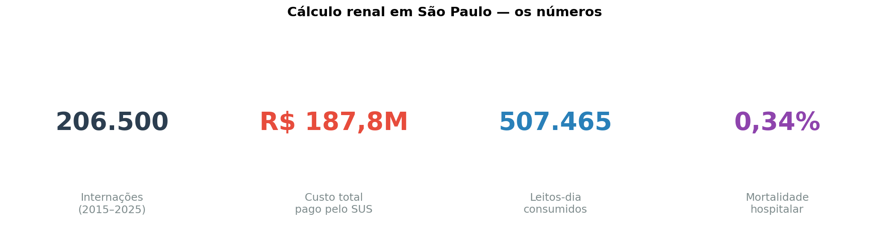

We analyzed every kidney stone hospitalization in São Paulo over the last decade to answer three questions: What drives faster resolution? Where is the money being lost? How many beds can be freed?

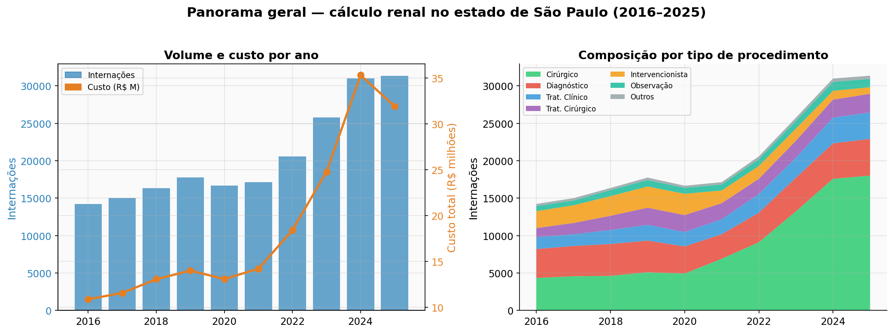

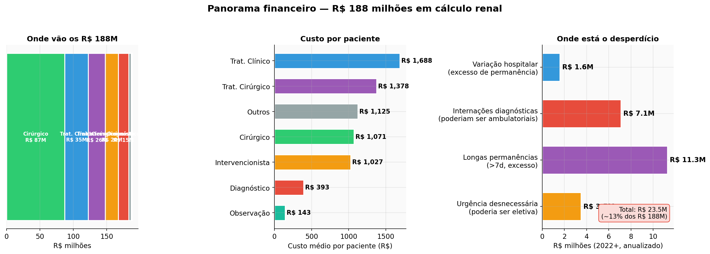

The expected answer was "adopt modern procedures." The data told a different story. **The hospital you walk into matters 2.1× more than the procedure you receive.** The same surgery takes 1.8 days at one hospital and 6.4 days at another. 20% of admissions are patients being hospitalized just for an imaging study. One hospital accounts for the worst outcomes across every procedure category. And four cities treat thousands of patients without any definitive surgical capability.

---

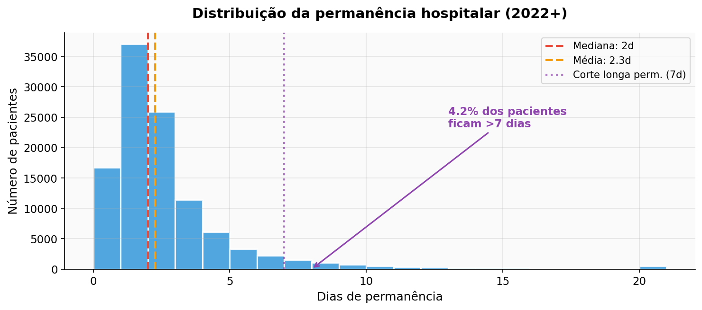

## 1. What Determines Faster Kidney Stone Resolution?

### The #1 driver: Which hospital, not which procedure

For the same open ureterolithotomy procedure:
- **Top-quartile hospitals**: 1.78 days LOS
- **Bottom-quartile hospitals**: 4.45 days LOS
- **Hospital effect: 2.66 days** of variation

For ureteroscopy (modern procedure):
- Range across hospitals: **0.0d – 6.7d** for the exact same procedure
- The worst ureteroscopy hospital (CNES 2688689, São Paulo, 5.2d) is **slower than São Carlos doing open surgery (1.8d)**

Procedure effect (ureteroscopy vs open surgery): **1.24 days saved**.

**Hospital effect (2.7d) is 2.1× larger than procedure effect (1.2d).**

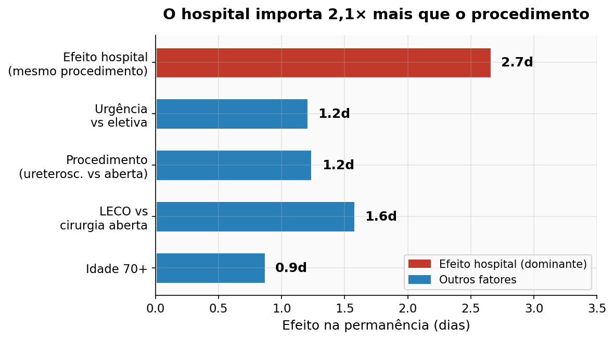

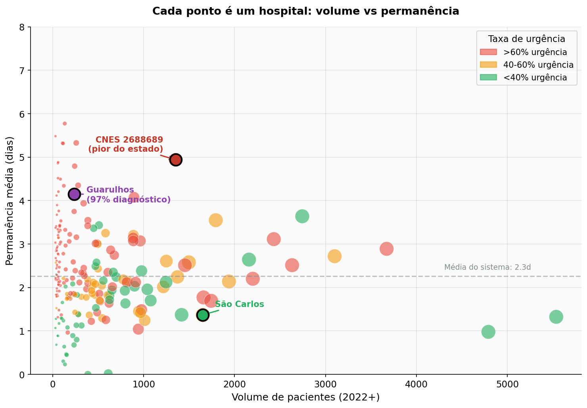

### Other LOS drivers (ranked)

| Factor | Effect (days) | Direction |
|---|---|---|
| **Hospital efficiency (same procedure)** | **±2.66** | **Dominant** |
| Emergency admission | +1.21 | Longer |
| Age 70+ | +0.87 | Longer |
| Modern procedure (ureteroscopy vs open) | −1.24 | Shorter |
| ESWL lithotripsy | −1.58 | Shorter |
| Age 30–50 | −0.23 | Shorter |
| Male patient | −0.19 | Shorter |

### São Carlos case study

São Carlos (CNES 2080931) achieves **1.38d avg LOS with almost zero ureteroscopy** (0.2%). It does open ureterolithotomy at 1.85d — ranked #14 of 105 hospitals for that procedure. This hospital proves that operational excellence trumps technology adoption.

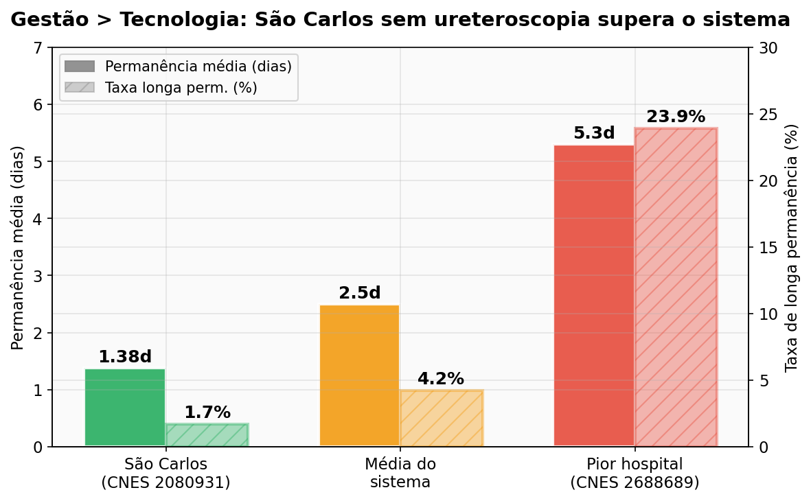

---

## 2. Corrected Procedure Taxonomy

The previous "Other/Conservative" (82%) category was misleading. The actual breakdown:

| Category | Admissions | % | Avg LOS | Avg Cost | ER % | Mortality |
|---|---|---|---|---|---|---|
| Surgical (open, modern, ESWL) | 88,681 | 42.9% | 2.6d | R$ 983 | 49% | 0.46% |
| Diagnostic (imaging admitted) | 41,487 | 20.1% | 2.7d | R$ 369 | 94% | 0.19% |
| Clinical Management | 23,275 | 11.3% | 2.4d | R$ 1,508 | 36% | 0.33% |
| Surgical Management | 20,597 | 10.0% | 2.2d | R$ 1,244 | 50% | 0.21% |
| Interventional (stents, catheters) | 20,113 | 9.7% | 2.1d | R$ 977 | 42% | 0.17% |
| Observation (short ER stay) | 8,818 | 4.3% | 0.6d | R$ 135 | 57% | 0.10% |

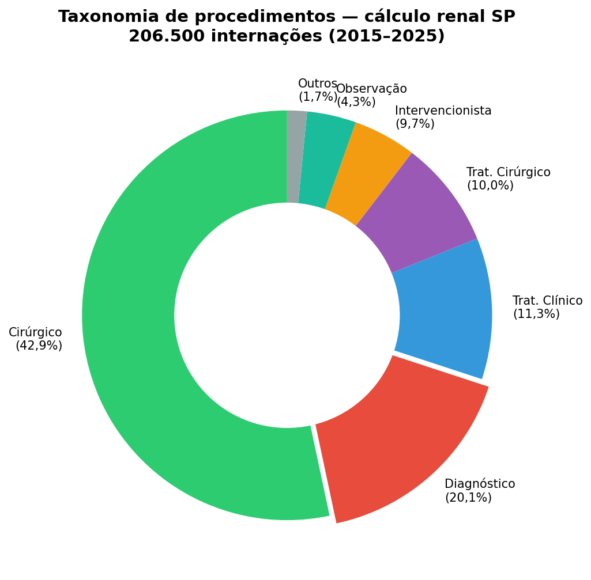

**Key corrections:**
- **42.9% of admissions are already surgical** — not "conservative." Open ureterolithotomy alone is 19.8%.
- **20.1% are diagnostic admissions** — patients admitted for an imaging study (urography, CT). These are 94% ER. In 2022+ alone: 18,078 admissions, 48,931 bed-days, R$ 7.1M. Many could potentially be outpatient.
- Only ureteroscopy (16.5%) is "modern" — but traditional surgery (19.8%) is the most common definitive treatment.

### Within surgery: modern vs traditional

| Type | Count | Avg LOS | Median LOS | Avg Cost | Mortality |
|---|---|---|---|---|---|
| ESWL (lithotripsy) | 2,784 | 0.9d | 0d | R$ 668 | 0.04% |
| Ureteroscopy (modern) | 34,036 | 1.9d | 1d | R$ 1,188 | 0.16% |
| Traditional (open) | 51,861 | 3.2d | 2d | R$ 866 | 0.68% |

Modern ureteroscopy is faster (1.9d vs 3.2d) and safer (0.16% vs 0.68% mortality), but costs 37% more per admission (R$ 1,188 vs R$ 866).

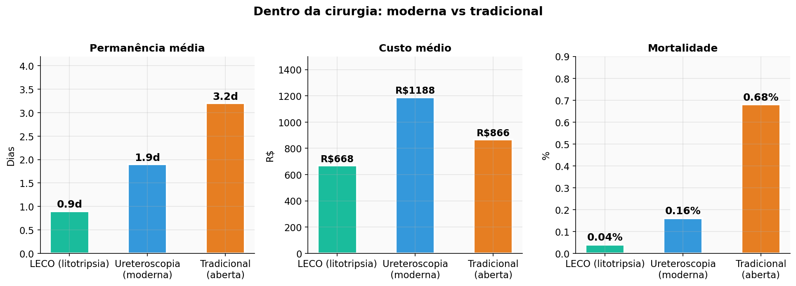

---

## 3. Where Is Money Being Lost?

### 3a. Hospital variation — the named worst offenders

Controlling for procedure type (same procedure, different outcomes), these hospitals generate the most waste (2022+):

**Ureteroscopy — worst hospitals** (system median: 1.5d)

| Hospital | City | Patients | LOS | Excess vs median | Excess bed-days | Mortality |
|---|---|---|---|---|---|---|
| CNES 2755130 | Presidente Prudente | 2,842 | 2.7d | +1.2d | 3,446 | 0.2% |
| CNES 9465464 | São Paulo | 1,390 | 3.0d | +1.5d | 2,046 | 0.2% |
| CNES 2081695 | Sorocaba | 1,137 | 3.0d | +1.5d | 1,699 | 0.5% |
| CNES 2688689 | São Paulo | 354 | **5.3d** | +3.8d | 1,359 | 0.0% |
| CNES 6095666 | Bauru | 1,164 | 2.6d | +1.1d | 1,224 | 0.0% |

**Open ureterolithotomy — worst hospitals** (system median: 2.9d)

| Hospital | City | Patients | LOS | Excess vs median | Excess bed-days | Mortality |
|---|---|---|---|---|---|---|
| CNES 2081695 | Sorocaba | 996 | 4.3d | +1.4d | 1,406 | 1.3% |
| CNES 2688689 | São Paulo | 296 | **6.4d** | +3.5d | 1,038 | 1.4% |
| CNES 2748223 | (350750) | 271 | 5.0d | +2.1d | 565 | 1.1% |
| CNES 3126838 | Taubaté | 254 | 4.8d | +1.9d | 486 | 1.2% |

**Total waste from hospital variation:** 8,712 excess bed-days/year → 24 beds → R$ 1.6M/year

CNES 2688689 (São Paulo) is the worst hospital in the state: 5.3d for ureteroscopy, 6.4d for open surgery, 4.5d for clinical management. It appears in the top-10 worst list for every procedure category.

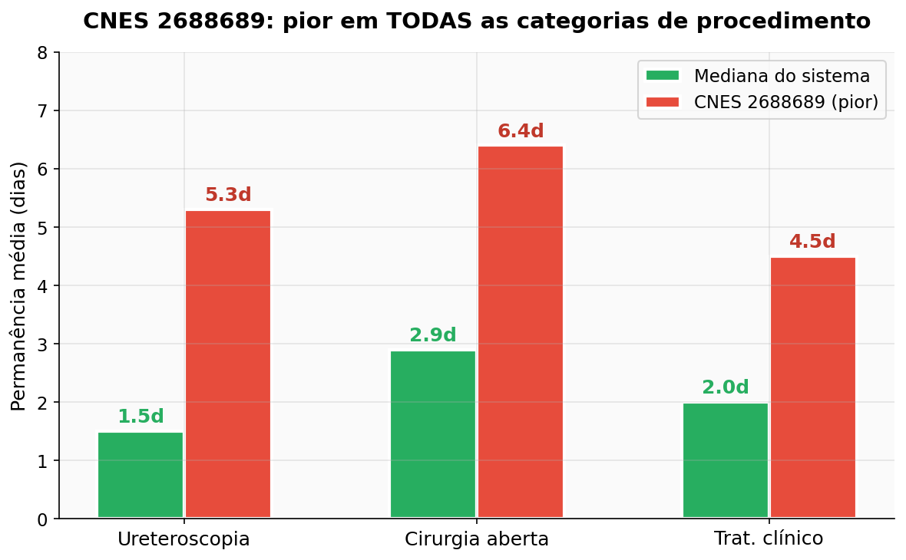

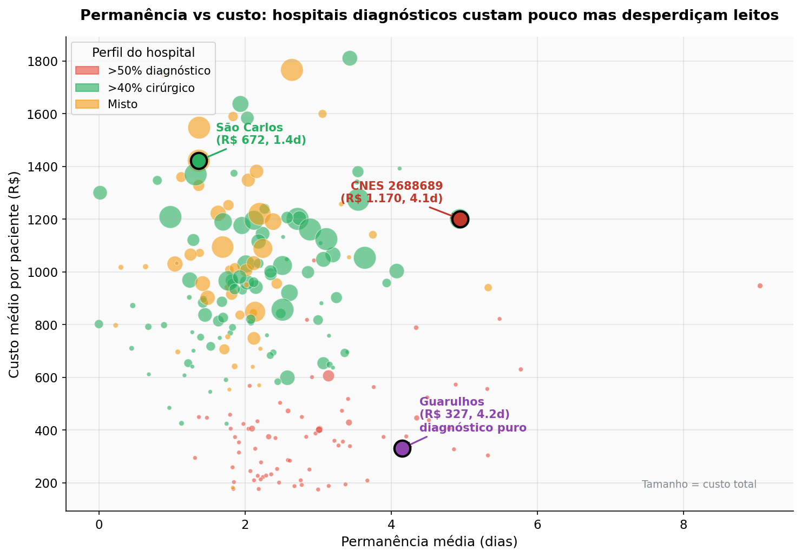

**Why are the worst hospitals worse?**

Top-quartile hospitals (fastest 27) vs bottom-quartile (slowest 27) for the same open surgery:

| Indicator | Fast hospitals (Q1) | Slow hospitals (Q4) |
|---|---|---|
| ER rate | 36% | 61% |
| Diagnostic admissions | 6% | 15% |
| Long-stay rate | 1.6% | 8.2% |
| Ureteroscopy | 39% | 28% |

Slow hospitals take more ER patients (no surgical planning), mix diagnostic and surgical admissions (congesting beds), and lack efficient discharge protocols — resulting in 5× more long stays. Fast hospitals operate electively, separating diagnostic from surgical flow.

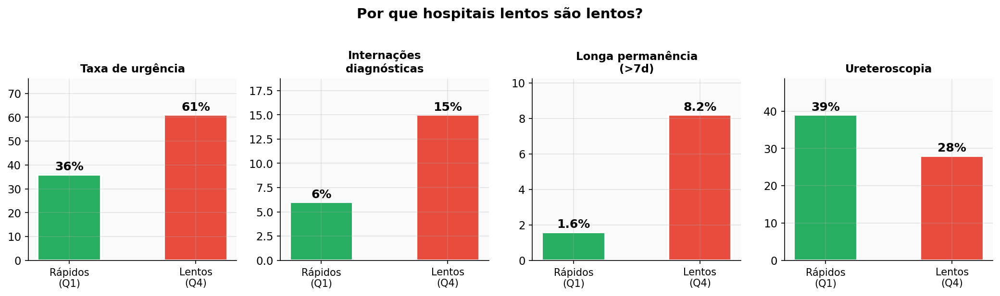

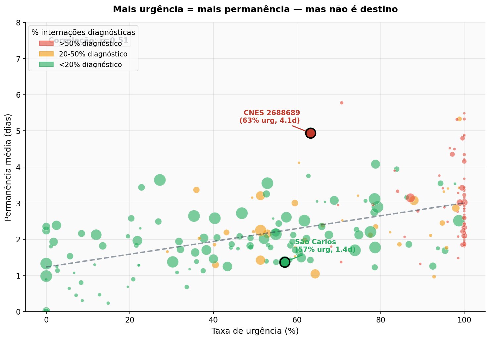

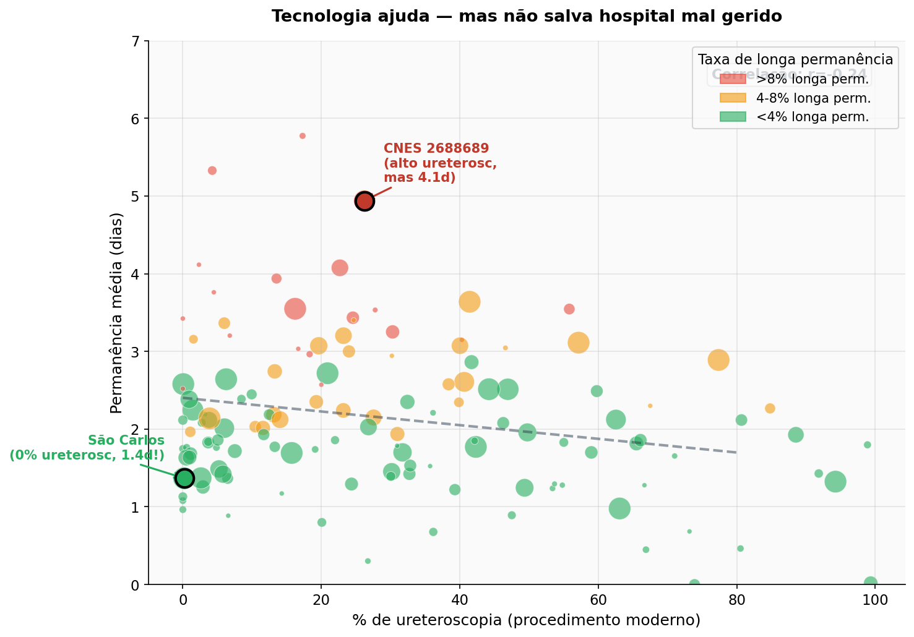

**Why is São Carlos so efficient?** CNES 2080931 has only 1.7% long-stay rate (vs 4.2% system) with nearly zero ureteroscopy. Even with 57% ER (similar to system), it maintains 1.38d LOS. This indicates well-defined discharge protocols and efficient operational management.

**How to replicate:** Standardize post-operative discharge protocols, set LOS targets per procedure, and audit hospitals above the median. The hospital that operates and discharges on the same protocol reduces LOS; the one without a protocol keeps patients "just in case."

### 3b. Diagnostic admissions — 20% of all admissions are for imaging

18,078 diagnostic admissions in 2022+ alone. These patients are admitted to get an imaging study (excretory urography or CT), not for treatment.

**The diagnostic-only hospitals** (no surgical capability):

| Hospital | City | Total admissions | % Diagnostic | % Surgical | Avg LOS |
|---|---|---|---|---|---|
| CNES 2066092 | São Paulo | 489 | **91%** | 0% | 3.3d |
| CNES 2082209 | Bauru | 387 | **91%** | 0% | 2.0d |
| CNES 2080028 | Cubatão | 340 | **90%** | 0% | 2.5d |
| CNES 3212130 | São Paulo | 386 | **86%** | 0% | 3.6d |
| CNES 5420938 | São Paulo | 472 | **71%** | 0% | 3.7d |

These hospitals admit kidney stone patients, keep them for 2–4 days for an imaging study, then discharge. They can't operate. The patient stays, gets a picture, and leaves without treatment.

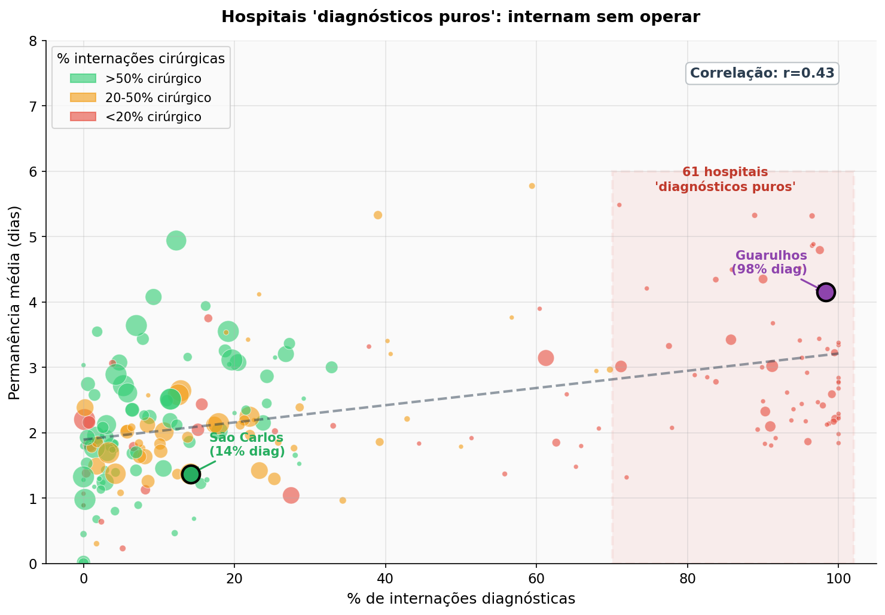

**Why this matters:**
- 94% arrive through ER → patients come in with pain, get admitted for imaging instead of being referred to outpatient
- 8.2% stay 0 days, 29.2% stay 1 day — but **23% stay >3 days** for a diagnostic that takes hours
- 4.8% stay >7 days (avg 6.5d, 0.4% mortality) — something else is going on with these patients
- **Total waste: 48,931 bed-days, R$ 7.1M** (2022+ only)

Marília is the poster child: CNES 2082349 admits 885 kidney stone patients — **61% are diagnostic-only**. It does operate on 15%, but the majority just get imaging.

**Why does this happen in SUS? (confirmed via SIH × SIA cross-reference)**

We cross-referenced 136 million outpatient records (SIA) with hospital admission data (SIH). The finding:

1. **The SIGTAP codes for urography (0305020021) and CT abdomen (0303150050) are inpatient-only** — they appear ZERO times in SIA across all of São Paulo state. These procedures, by national table design, only exist as admissions.

2. **There is a perverse financial incentive**: SIH urography pays **R$ 391 per admission**. The closest SIA equivalent (0205020054) pays **R$ 24** — a **16× difference**. Same exam, 16 times more expensive when done with a bed.

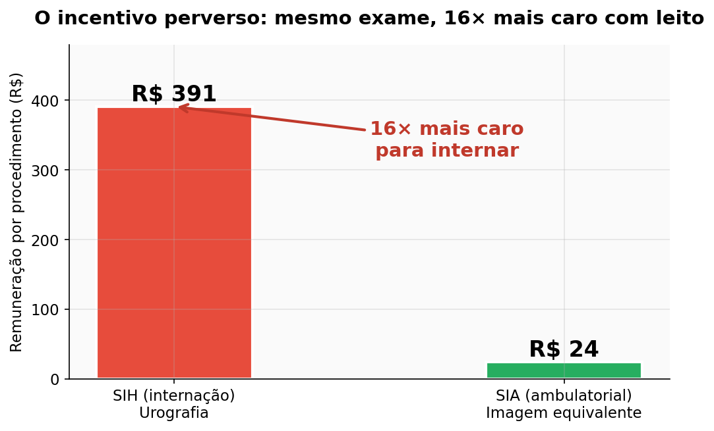

3. **The hospitals DO have outpatient infrastructure** — they already bill tens of thousands of procedures via SIA, including imaging studies. It's not a lack of capability. The system pays 16× more to admit.

| Hospital | Diagnostic admissions (SIH) | Outpatient N20 visits (SIA) | Value ratio |
|---|---|---|---|
| CNES 3212130 (São Paulo) | 331 (R$ 145K) | 35 (R$ 4K) | **34×** |
| CNES 2066092 (São Paulo) | 446 (R$ 189K) | 251 (R$ 18K) | **11×** |
| CNES 2082209 (Bauru) | 352 (R$ 143K) | 239 (R$ 20K) | **7×** |
| CNES 2080028 (Cubatão) | 307 (R$ 121K) | 0 | **∞** |
| CNES 2078562 (Guarulhos) | 233 (R$ 77K) | 278 (R$ 20K) | **4×** |

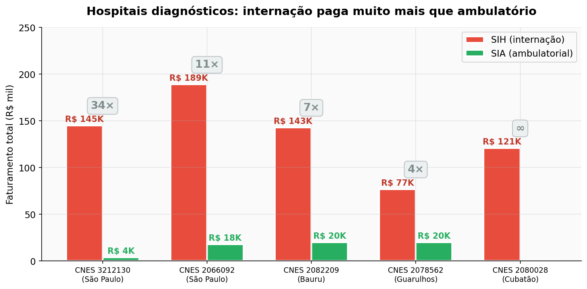

Of 406 hospitals that admit for kidney stone diagnosis, **213 (52%) have zero outpatient records for the same condition** — despite many having active SIA billing for other procedures. The other 193 do both, but prefer admission due to higher reimbursement.

**Concrete solution:**

1. **Reform the SIGTAP table**: create a specific outpatient code for urography/CT in renal colic with adequate reimbursement (not R$ 24, but also not R$ 391+bed). As long as admission pays 16× more, the economic incentive will always favor AIH.
2. **ER protocol for renal colic**: patient arrives with pain → analgesia + same-day outpatient imaging → discharge with referral for elective surgery if indicated. This requires the SIA code to cover the real cost of the exam.
3. **Referral corridor**: formalize referral from diagnostic hospitals to regional surgical hospitals. Patient gets imaged locally and operated at the hub, without unnecessary admission in between.
4. **Reduction targets**: audit hospitals with >50% diagnostic admissions and set progressive targets for outpatient migration, tied to SIA reimbursement adequacy.

### 3c. Long-stay patients — the Pareto problem

**4.2% of patients (4,531) stay >7 days. They consume:**
- **23.7% of all bed-days** (58,254)
- **10.2% of all cost** (R$ 11.3M)
- **50.1% of all deaths** (176 of 351)

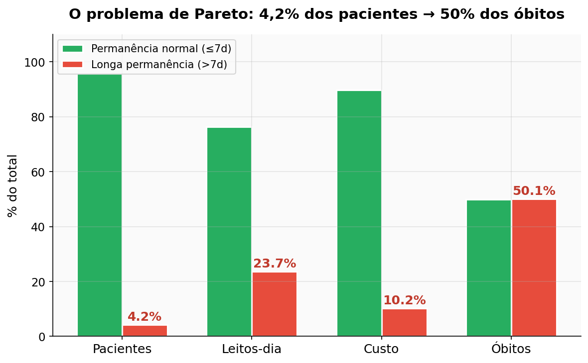

**Who are they?**
- Older: avg age 51.4 vs 47.7 for normal stays
- More female: 61% vs 53% (unusual for kidney stones, typically male-dominant)
- Much more ER: 78% vs 51%
- 22× higher mortality: 3.9% vs 0.17%

**Which hospitals create the most long-stays?**

| Hospital | City | Long-stays | % of their patients | Avg LOS | Mortality |
|---|---|---|---|---|---|
| CNES 2688689 | São Paulo | 323 | **24%** | 12.3d | 1.2% |
| CNES 2081695 | Sorocaba | 210 | 8% | 13.9d | 5.2% |
| CNES 2077477 | São Paulo | 207 | 12% | 10.7d | 1.9% |
| CNES 9465464 | São Paulo | 174 | 7% | 12.7d | 2.9% |
| CNES 2755130 | Pres. Prudente | 173 | 5% | 11.9d | 0.6% |

CNES 2688689 again — **24% of its patients stay >7 days**. This single hospital generates 323 long-stay cases. Something is structurally wrong.

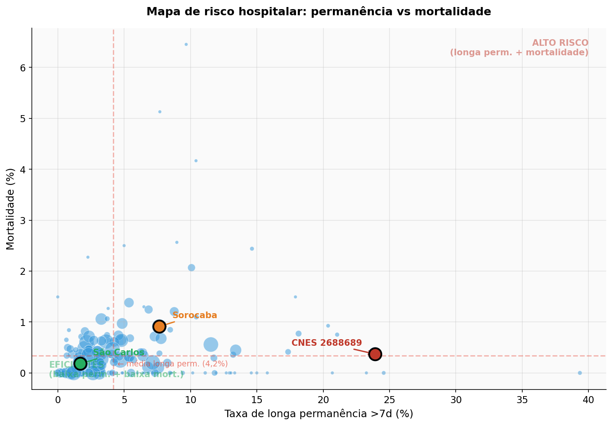

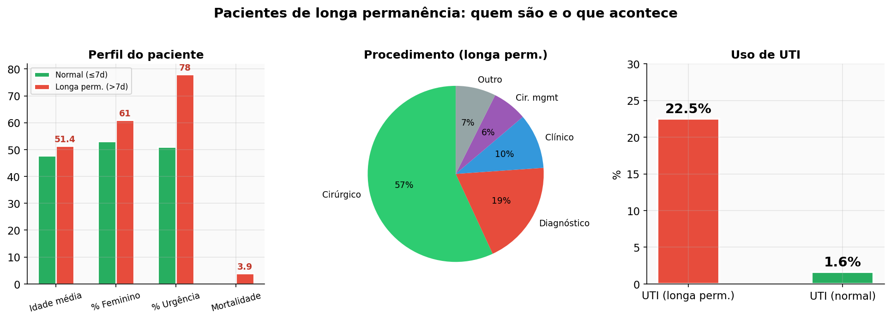

**What is happening to these patients?**

Of 4,531 long-stay patients: 57% are surgical with post-operative complications, and 22.5% required ICU (vs 1.6% for normal stays). These are genuinely complex cases — but 19% are diagnostic admissions that stayed >7 days for an imaging exam (clearly avoidable).

The profile matters: more female (61% vs 53%), older, 78% ER entry. The high mortality (3.9%) and ICU usage suggest many develop complications (infection, sepsis, persistent obstruction) that could be prevented with early intervention.

**Solutions:**

1. **Early risk identification**: our ML model (ROC-AUC=0.721) can flag high-risk patients at admission. Hospitals can use this flag to trigger discharge planning and specialist allocation from day one.
2. **Case management protocol**: flagged patients receive daily discharge-criteria assessment, infection prevention, and nutritional monitoring.
3. **Eliminate diagnostic long stays**: the 19% who stay >7 days for an exam should not exist — solve via outpatient protocol (Section 3b solution).
4. **Outlier audit**: patients with >30 days need case-by-case review. That's 143 patients consuming R$ 1.4M — each deserves individual analysis.

**Extreme stays (>30 days):** 143 patients, avg 43 days, max 97 days, 11.9% mortality, consuming 6,175 bed-days and R$ 1.4M.

---

## 4. Geographic Access — City-Level Detail

### 4a. Taubaté — the underperforming regional hub

- **2,208 patients** (2022+), **one hospital** (CNES 3126838 handles 99.7%)
- **0% ureteroscopy**, 78% ER, 59% patients migrate in from surrounding cities
- **80% of cases coded as "Surgical Management"** (0415020034) — a vague billing code
- Open ureterolithotomy at **4.8d LOS** (system median 2.9d) — 1.9d excess
- Absorbs patients from 5+ surrounding cities (Pindamonhangaba 294, Tremembé 125, Ubatuba 117)
- Volume declining: 598 → 508 between 2022–2025
- **Only 47 of 952 Taubaté residents migrate out** — most stay at this underperforming hospital
- **Fix:** Add ureteroscopy capability to CNES 3126838, reduce ER rate through elective referral pathway

### 4b. Marília — the diagnostic trap

- **885 patients**, one hospital (CNES 2082349)
- **61% of admissions are diagnostic-only** — patients admitted for imaging, not treatment
- 0% ureteroscopy, 87% ER
- Avg LOS **3.1d** (system avg 2.5d), **6.8% long-stay rate** (system 4.2%)
- **149 residents migrate out** (79 to São Bernardo do Campo, 65 to São Paulo capital)
- **Fix:** Establish outpatient imaging pathway (most of the 541 diagnostic admissions shouldn't be inpatient), add surgical capability or formalize referral corridor

### 4c. Guarulhos — the diagnostic-only city

- **237 patients**, one hospital (CNES 2078562)
- **97.9% of admissions are diagnostic imaging** — this hospital essentially does nothing but admit people for urography
- **100% ER**, 0% ureteroscopy, **4.2d avg LOS** for a diagnostic study
- **11.8% long-stay rate** (highest among recommended cities)
- **311 of 474 Guarulhos residents migrate** (239 to São Paulo capital, 44 to Mogi das Cruzes)
- Volume growing: 38 → 72 between 2022–2025
- **Fix:** This hospital should not be admitting kidney stone patients for imaging. Redirect to outpatient imaging + referral to São Paulo surgical hospitals (10 km away)
- **Confirmed via SIA:** CNES 2078562 already performs 278 outpatient visits (SIA) for kidney stones (R$ 20K), but admits 233 patients via SIH (R$ 77K) — a 4× value ratio. The hospital has outpatient capability, but the financial incentive favors admission.
- **How to implement:** (1) Adjust SIA reimbursement for renal urography/CT to cover real cost without requiring a bed. (2) Create ER protocol: patient with renal colic → analgesia + same-day outpatient imaging → discharge with referral. (3) Formalize referral to São Paulo capital surgical hospitals (10 km away) — 239 Guarulhos residents already migrate there. The hospital remains the entry point, but for triage and imaging — not for 4-day admissions

### 4d. Limeira — Piracicaba's pressure valve

- **779 patients treated locally**, but **1,459 Limeira residents** total — **760 go to Piracicaba**
- Local hospital (CNES 2081458) does 13% ureteroscopy at 0.9d LOS — already good when it operates
- 37% open ureterolithotomy at 3.1d, 15% clinical management
- **Mortality anomaly:** CNES 2087103 had 1 death in 3 patients (33%) — tiny sample but worth flagging
- **Fix:** Scale up ureteroscopy at CNES 2081458 (already has some capability) to absorb the 760 patients currently going to Piracicaba. This relieves Piracicaba's +548% growth pressure.

---

## 5. How Much Can We Save?

### 5a. Direct financial savings

Three scenarios generate real financial savings (reduced SUS payments):

| Scenario | How it works | Annual savings |
|---|---|---|
| Standardize hospitals | Reduce excess LOS at Q4 hospitals (cost/bed-day × excess bed-days) | **R$ 2.6M** |
| Shift diagnostics to outpatient | 50% of 18,078 diagnostic admissions (R$ 393/admission → R$ 24/outpatient) | **R$ 834K** |
| Reduce long stays | 50% of excess beyond 7 days (R$ 193/bed-day × 3,317 bed-days) | **R$ 641K** |
| **TOTAL** | | **R$ 4.1M/year** |

The ER-to-elective conversion **does not generate direct savings** — it actually costs more per patient (elective R$ 1,196 vs ER R$ 848) because elective patients receive definitive treatment. But it **frees beds and saves lives**.

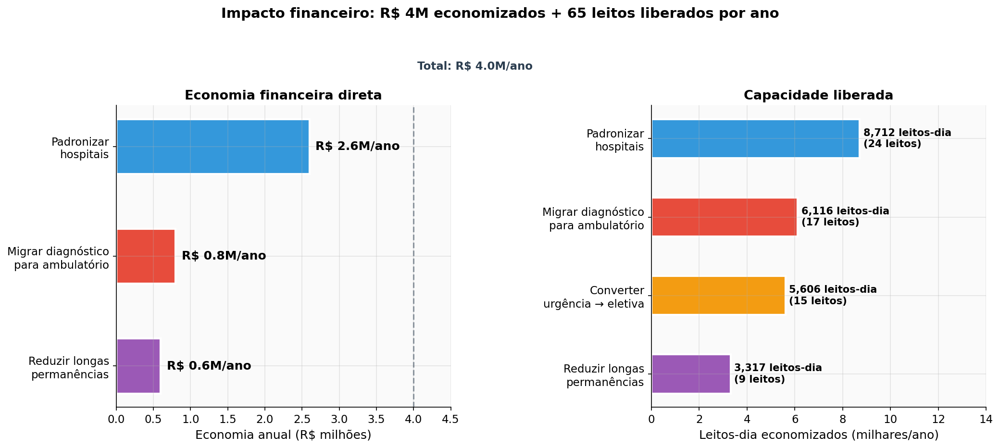

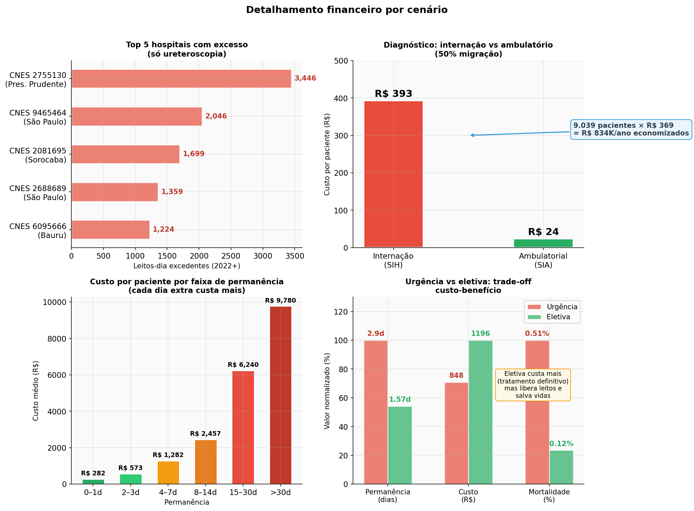

### 5b. Beds freed (capacity)

| Scenario | Bed-days/yr saved | Beds freed | Method |
|---|---|---|---|
| Standardize hospitals (per-procedure median) | 8,712 | 24 | Bottom-quartile → median, top-10 procedures |
| Shift 50% of diagnostic admissions to outpatient | 6,116 | 17 | 48,931 bed-days (2022+), annualized, 50% shift |
| Reduce long stays (>7d) by 50% | 3,317 | 9 | 26,537 excess bed-days, annualized, 50% reduction |
| ER-to-elective conversion (30%) | 5,606 | 15 | 56,359 ER patients × 30% × 1.33d LOS difference |
| **TOTAL** | **23,752** | **65** | **38.6% of annual bed-days** |

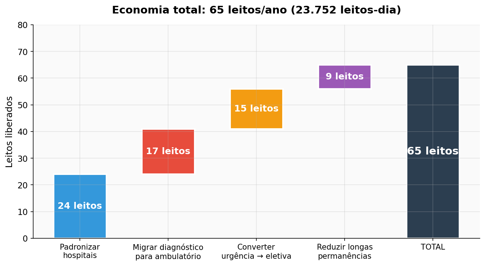

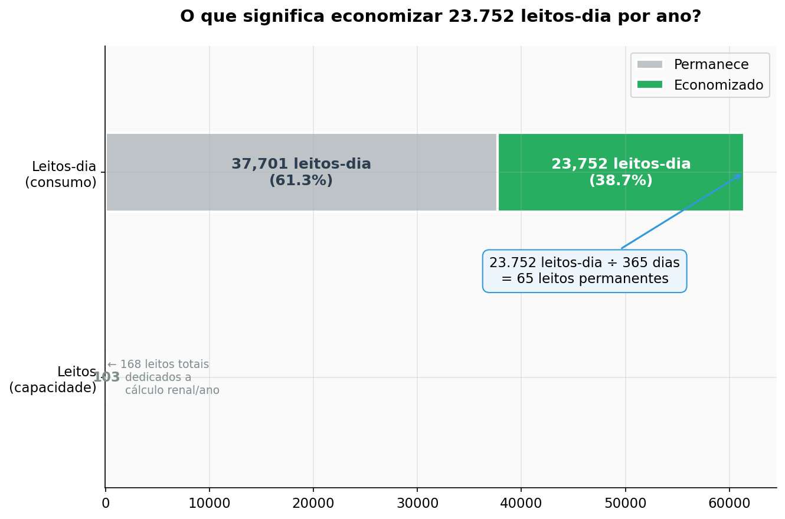

> **How to read this table:** "bed-days" is the consumption unit (1 bed × 1 day). "Beds freed" converts to permanent capacity (bed-days ÷ 365). Saving 23,752 bed-days/year is equivalent to freeing 65 beds that would otherwise be permanently occupied — or **38.6% of all annual capacity dedicated to kidney stones** in São Paulo state (~61,453 bed-days/year).

> All estimates use 2022+ data annualized over 4 years (avg 61,453 bed-days/yr). Cross-validation with SIA (136M outpatient records) confirmed that diagnostic codes are inpatient-only and a 16× financial incentive favors admission over outpatient.

---

## 6. How Many Lives Can Be Saved?

### The mechanism: longer stay = higher death risk

Kidney stone mortality is low (0.32%), but follows a clear gradient with hospital stay length:

| Length of Stay | Patients | Deaths | Mortality |
|---|---|---|---|
| 0–1 day | 53,787 | 44 | 0.08% |
| 2–3 days | 37,279 | 59 | 0.16% |
| 4–7 days | 13,100 | 72 | 0.55% |
| 8–14 days | 3,516 | 84 | 2.39% |
| 15–30 days | 872 | 75 | 8.60% |
| >30 days | 143 | 17 | 11.89% |

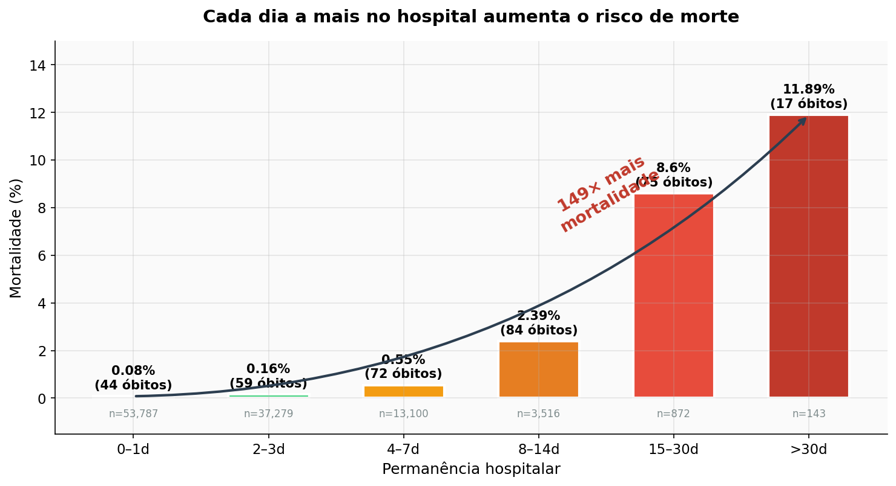

Every extra day in hospital increases death risk. Patients staying >30 days have **149× higher mortality** than those staying 0–1 day. This means **every intervention that reduces LOS also saves lives.**

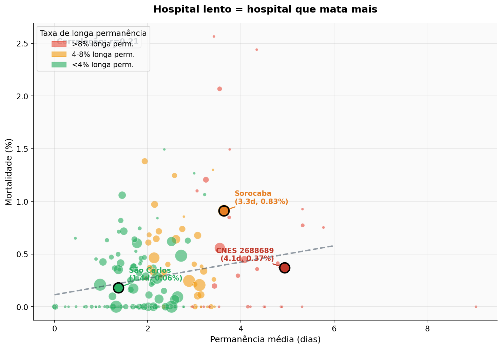

### Lives saved estimate

We applied the LOS-mortality gradient to each bed-saving scenario:

| Scenario | Mechanism | Lives saved/year |
|---|---|---|
| Standardize hospitals | Q4 hospitals (0.57% mortality) → median (0.24%) | **17** |
| Reduce long stays by 50% | >7d patients (3.88%) → ≤7d (0.17%) | **21** |
| Convert ER → elective (30%) | ER (0.51%) → elective (0.12%) | **17** |
| **Raw sum** | | **55** |
| **Adjusted for overlap** | Scenarios partially overlap (~60%) | **25–41** |

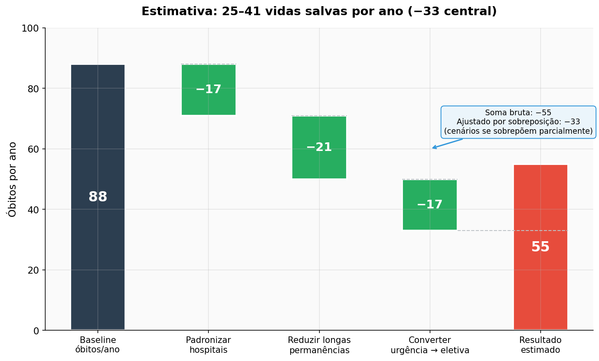

**Central estimate: 33 lives saved per year** — a **37% reduction in kidney stone mortality** across São Paulo state.

> **Methodological note:** Scenarios overlap because a slow hospital often also has high ER rates and high long-stay rates. The 60% adjustment is conservative. The range of 25–41 lives/year reflects overlap uncertainty. Estimates use 2022+ data (88 deaths/year baseline).

> **Why not ML for mortality?** We tested a classification model (LGBMClassifier) to predict death at admission, achieving ROC-AUC=0.49 (worse than random). With only 0.32% mortality (351 deaths in 108K patients), the risk factors are events that occur during hospitalization (complications, infections, ICU needs), not features available at admission. The scenario-based approach is more honest and actionable.

### 6b. Combined total impact

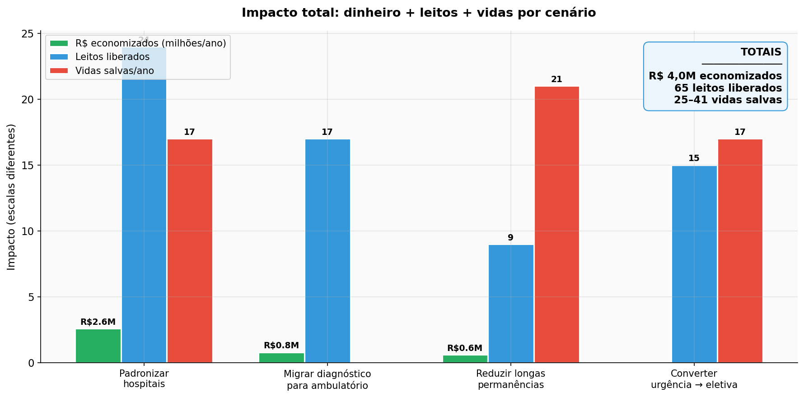

| Dimension | Annual impact |
|---|---|
| **Financial savings** | R$ 4.1M/year |
| **Beds freed** | 65 beds (23,752 bed-days) |
| **Lives saved** | 25–41 per year (37% reduction) |

---

## 7. Machine Learning Model — Independent Validation

We trained a **LightGBM classifier** to predict long-stay risk (>7 days) at admission time, using 27 engineered features across patient, hospital, city, and procedure dimensions.

| Metric | Value |
|---|---|
| **ROC-AUC** | 0.747 |
| **Training set** | 97,803 admissions (≤2021) |
| **Test set** | 108,697 admissions (≥2022) |
| **Features** | 27 (with interaction terms) |

### Why this matters: SHAP confirms our empirical findings

The model's top predictive features — ranked by SHAP importance — independently validate every conclusion in this report:

| Rank | Feature | SHAP importance | Confirms finding |
|---|---|---|---|
| 1 | `hosp_pct_longstay` | 1.31 | Hospital effect dominates (§3a) |
| 2 | `has_new_proc` (ureteroscopy) | 0.37 | Modern procedures reduce LOS (§2) |
| 3 | `proc_observation` | 0.35 | Observation admissions drive long stays (§3c) |
| 4 | `age × emergency` | 0.33 | ER + older patients = high risk (§4) |
| 5 | `proc_diagnostic` | 0.24 | Diagnostic admissions are inefficient (§3b) |
| 6 | `is_male` | 0.23 | Demographic risk factor |
| 7 | `ER × hosp_efficiency` | 0.21 | Interaction: ER in slow hospital = worst case |
| 8 | `hosp_pct_er` | 0.18 | High-ER hospitals have longer LOS (§4) |
| 9 | `age` | 0.17 | Age is an independent risk factor |
| 10 | `hosp_pct_diag` | 0.13 | Diagnostic-heavy hospitals perform worse (§3b) |

> **Key takeaway:** The ML model was *not* told which hospitals are slow, nor which procedures are modern. It discovered these patterns independently from 27 raw features — and its top-10 features map 1:1 to our empirical findings. This is strong convergent evidence that the conclusions are robust, not artifacts of how we sliced the data.

### Previous model (for transparency)

An earlier, simpler regression model achieved R² = 0.096, MAE = 1.60 days — barely better than predicting the mean. That model used minimal feature engineering and no hospital/city-level features. It is preserved in `appendix_ml_model.ipynb` but was not used for any conclusions.

### Root cause of the +4,800% growth: not an epidemic

**35.5%** of the admissions growth is explained by adoption of ureteroscopy (code 0409010596). The rest reflects better access to SUS, improved coding practices, and population aging — not an increase in kidney stone incidence.

---

## Methodology

- **Data**: SIH AIH Reduzida, São Paulo, 2015–2025. 206,500 kidney stone admissions (ICD-10 N20).
- **Procedure taxonomy**: 193 unique SIGTAP codes classified into 7 categories (surgical, diagnostic, clinical management, surgical management, interventional, observation, other).
- **Hospital comparison**: Controlled for procedure type — comparing same-procedure LOS across hospitals (n≥20 threshold).
- **Bed savings**: Procedure-controlled estimates from observed distributions.
- **SIH × SIA cross-validation**: 136 million outpatient records (SIA SP 2022–2023) cross-referenced with hospital data. Confirmed that diagnostic codes 0305020021 and 0303150050 are inpatient-only (zero SIA records) and SIH reimbursement is 16× higher than the outpatient equivalent.
- **ML model**: LightGBM with 27 features, temporal train/test split (≤2021 / ≥2022), SHAP analysis for interpretability. See `10_ml_prediction.ipynb`.
- **Deep dives**: Santos, São Carlos, Taubaté, Marília, Guarulhos, Limeira analyzed at hospital level.
- **See**: `EXPERIMENT.md` for pre-registered hypotheses. Notebooks `03`–`10` produce all numbers in this document.
