# O Prêmio de Internação: como o diferencial de 16× da tabela SIGTAP gera ineficiência sistêmica

> **Status:** Evidência forte — internação diagnóstica comprovadamente desnecessária na maioria dos casos.
> Derivada dos achados do estudo principal (`FINDINGS_PT.md`)

---

## Hipótese

Quando um paciente chega ao pronto-socorro com cólica renal, o médico precisa de um exame de imagem — urografia ou tomografia — para localizar o cálculo e decidir o tratamento. No SUS, esse exame pode ser feito de duas formas: ambulatorialmente (via SIA) ou internando o paciente (via SIH). A tabela SIGTAP — que define quanto o SUS paga por cada procedimento — cria um diferencial de **16,4×** entre as duas vias: R$ 393 por internação vs R$ 24 ambulatorial.

Esse diferencial, que chamamos de **"Prêmio de Internação"** (*Admission Premium*), é o multiplicador de receita que o hospital recebe ao abrir uma AIH (Autorização de Internação Hospitalar) ao invés de realizar o exame em regime ambulatorial. Nossa hipótese é que esse incentivo financeiro:

1. **Gera internações clinicamente desnecessárias** — pacientes ocupam leitos por dias para um exame que leva horas
2. **Degrada a eficiência geral do hospital** — instituições que dependem desse modelo operam em modo "PS puro", sem investir em protocolos eletivos ou gestão de fluxo
3. **Atrasa o tratamento definitivo** — o paciente faz o exame, recebe alta, e entra numa fila de cirurgia sem que a internação diagnóstica tenha acelerado nada

A seguir, apresentamos cinco provas independentes de que a internação diagnóstica é desnecessária, uma análise comparativa entre hospitais, a quantificação do diferencial de preço, e a rota alternativa viável.

---

## Parte 1: A internação diagnóstica é desnecessária?

### 1.1 O que é uma internação diagnóstica

No SUS, uma "internação diagnóstica" para cálculo renal é uma AIH onde o **único procedimento realizado** é um exame de imagem. São **18.078 internações** no período 2022–2025 (16,6% de todas as internações por cálculo renal em SP), distribuídas em apenas dois procedimentos:

- **97,7%** são urografia excretora (código SIGTAP 0305020021) — um exame de raio-X com contraste que leva cerca de 1-2 horas
- **2,3%** são TC de abdome (código 0303150050) — uma tomografia que leva cerca de 30 minutos

Para entender o que acontece *durante* essas internações, cruzamos três campos da AIH:

- **Procedimento solicitado vs realizado:** Em **96,4% dos casos**, o campo `PROC_SOLIC` é idêntico ao `PROC_REA`. Isso significa que o médico pediu uma urografia, o hospital fez a urografia, e nada mais aconteceu. Não houve intercorrência que exigisse mudança de conduta, não houve procedimento adicional, não houve tratamento complementar.

- **Diagnóstico secundário:** **100%** das 18.078 internações têm o campo `DIAG_SECUN` preenchido com "0000" — o código para "nenhum". Nenhuma comorbidade foi registrada, nenhuma complicação foi identificada durante a estadia. O paciente entrou saudável (exceto pela cólica) e saiu saudável.

- **Tipo de admissão:** **94,2%** entraram como urgência (`CAR_INT = 02`). Ou seja, o paciente chegou pelo PS com dor, e o hospital decidiu internar para fazer o exame ao invés de fazer ambulatorialmente.


> **Fonte:** SIH AIH Reduzida, SP 2022–2025. Campos analisados: `PROC_SOLIC` vs `PROC_REA`, `DIAG_SECUN`, `CAR_INT`. n=18.078 internações diagnósticas.

**O que isso significa:** A internação diagnóstica é, na prática, um paciente que ocupa um leito hospitalar enquanto espera (ou se recupera de) um exame de imagem que poderia ser feito em horas. Não há intervenção terapêutica, não há complicação, não há motivo clínico registrado para a permanência.

### 1.2 Prova #1: 37% ficam 0-1 dia — o exame cabe em horas

Se a internação fosse clinicamente necessária, esperaríamos que os pacientes ficassem tempo suficiente para um tratamento significativo. Mas a distribuição de permanência revela outra história:

| Permanência | Internações | % do total | Acumulado |
|---|---|---|---|
| **0 dias** (mesmo dia) | 1.486 | 8,2% | 8,2% |
| **1 dia** | 5.284 | 29,2% | 37,4% |
| **2 dias** | 4.641 | 25,7% | 63,1% |
| **3 dias** | 2.512 | 13,9% | 77,0% |
| 4-7 dias | 3.287 | 18,2% | 95,2% |
| >7 dias | 868 | 4,8% | 100% |
| **Média: 2,7 dias** | **Mediana: 2 dias** | | |

Os **1.486 pacientes com permanência zero** são a prova mais direta: eles entraram no hospital, fizeram urografia, e receberam alta *no mesmo dia*. O exame aconteceu, o resultado saiu, e o paciente foi para casa — tudo em menos de 24 horas, usando um leito que poderia ter sido evitado.

Os **5.284 com 1 dia** provavelmente chegaram à noite pelo PS, dormiram, fizeram o exame na manhã seguinte, e receberam alta. Um protocolo de PS eficiente (analgesia + exame ambulatorial no mesmo dia) eliminaria essa estadia.

Somados, **77% ficam 3 dias ou menos** — para um exame que, clinicamente, requer no máximo algumas horas de observação pós-contraste.


> **Fonte:** SIH AIH Reduzida, SP 2022–2025. Esquerda: 18.078 internações diagnósticas. Direita: 90.619 demais internações. CID-10 N20.

**O que isso significa:** A permanência de 2-3 dias não reflete necessidade clínica — reflete ineficiência operacional. O paciente não está sendo tratado durante esse tempo; está esperando. Esperando o exame ser agendado, esperando o laudo, esperando a alta. Esse tempo ocioso é leito desperdiçado.

### 1.3 Prova #2: hospitais que já fazem diagnóstico rápido

Se alguém argumentar que "não é possível fazer urografia sem internação prolongada", a resposta está nos dados: **5 hospitais já fazem isso com permanência média inferior a 1 dia:**

| Hospital | Internações diagnósticas | Permanência média | % alta no mesmo dia |
|---|---|---|---|
| CNES 2699915 | 259 | **0,3 dias** | **87%** |
| CNES 2784602 | 225 | 0,7 dias | 58% |
| CNES 2786435 | 158 | 0,9 dias | 47% |
| CNES 2745798 | 57 | 0,8 dias | 44% |
| CNES 2082888 | 66 | 0,6 dias | 55% |

O caso mais emblemático é o **CNES 2699915**: faz 259 urografias por ano — um volume significativo — com permanência média de **0,3 dias** e **87% de alta no mesmo dia**. Esses pacientes entram, fazem o exame, recebem o resultado, e vão para casa. É exatamente o modelo ambulatorial, mas ainda usando uma AIH.

Enquanto isso, a média do sistema é **2,7 dias** para o mesmo exame. A diferença de 2,4 dias por paciente, multiplicada por 18.078 internações, gera **43.387 leitos-dia desperdiçados por ano** — apenas por ineficiência operacional.


> **Fonte:** SIH AIH Reduzida, SP 2022–2025. Cada ponto = 1 hospital com n≥10 internações diagnósticas. Tamanho proporcional ao volume. Linha verde = meta ≤1 dia; linha vermelha = média do sistema (2,7 dias).

**O que isso significa:** O modelo rápido já existe e funciona em escala. Não é teórico — 5 hospitais fazem centenas de urografias por ano com alta no mesmo dia, sem impacto negativo nos resultados clínicos. A permanência de 2,7 dias na média do sistema é uma escolha operacional, não uma necessidade médica.

### 1.4 Prova #3: 42% dos pacientes nunca recebem cirurgia

Uma possível justificativa para a internação seria: "o paciente precisa ficar internado para agilizar o tratamento cirúrgico". Mas o rastreamento de pacientes mostra que isso não acontece.

Usando um proxy de identificação (município de residência + data de nascimento + sexo), rastreamos 9.271 pacientes que tiveram pelo menos uma internação diagnóstica no período 2022–2025:

| Trajetória do paciente | Total | % |
|---|---|---|
| Diagnóstico + cirurgia (em algum momento) | 5.346 | 57,7% |
| **Apenas diagnóstico — nunca fez cirurgia no SUS** | 3.925 | **42,3%** |

Quase **metade dos pacientes** que foram internados para diagnóstico **nunca receberam tratamento cirúrgico** no SUS. O que aconteceu com eles?

- **Resolução espontânea:** Cálculos menores (<5mm) frequentemente são eliminados naturalmente. O paciente teve a cólica, fez o exame, e o cálculo passou sozinho.
- **Tratamento particular:** O paciente pode ter buscado cirurgia na rede privada ou em convênio.
- **Perda de seguimento:** O paciente recebeu alta com encaminhamento para cirurgia, mas nunca conseguiu agendar ou desistiu.

Em todos os cenários, a **internação para fazer o exame não agregou valor** — o paciente teria o mesmo desfecho com um exame ambulatorial.

### 1.5 Prova #4: quando há cirurgia, espera-se 7 meses

Para os 57,7% que *eventualmente* receberam cirurgia, analisamos o tempo entre a primeira internação diagnóstica e a primeira internação cirúrgica:

| Tempo entre diagnóstico e cirurgia | % acumulado |
|---|---|
| ≤ 7 dias | 15,5% |
| ≤ 30 dias | 23,9% |
| ≤ 60 dias | 29,4% |
| ≤ 90 dias | 34,3% |
| ≤ 180 dias | 45,1% |
| ≤ 365 dias | 62,8% |
| **Mediana** | **223 dias** |

A mediana de **223 dias** (mais de 7 meses) entre o diagnóstico e a cirurgia revela que a internação diagnóstica é **completamente desconectada** do tratamento. O paciente não fica internado esperando cirurgia — ele recebe alta, vai para casa, e entra numa fila que demora meses.

Apenas **15,5%** fazem cirurgia em menos de 7 dias — esses são provavelmente os casos de urgência real (obstrução aguda, infecção). Para os outros 84,5%, a internação de 2-3 dias para o exame não acelerou absolutamente nada.

**A lógica é simples:** se o paciente vai esperar 7 meses pela cirurgia de qualquer forma, por que ocupar um leito por 3 dias para fazer um exame que poderia ser ambulatorial?


> **Fonte:** SIH AIH Reduzida, SP 2022–2025. Rastreamento via proxy de paciente (município de residência + data de nascimento + sexo). 9.271 pacientes com pelo menos uma internação diagnóstica.

### 1.6 Prova #5: mortalidade quase zero — o risco de mover para ambulatório é mínimo

A objeção mais importante contra mover essas internações para ambulatório seria: "e se o paciente precisar de cuidados hospitalares durante o exame?". Os dados respondem:

| Grupo | Mortalidade | Óbitos | n |
|---|---|---|---|
| Diagnósticas ≤ 3 dias (movíveis) | **0,115%** | 16 | 13.923 |
| Diagnósticas > 3 dias (ficam) | 0,544% | 15 | 4.155 |
| Diagnósticas geral | 0,171% | 31 | 18.078 |
| Demais internações (referência) | 0,353% | 320 | 90.619 |

O grupo que propomos mover para ambulatório (77% das diagnósticas, permanência ≤3 dias) tem mortalidade de **0,115%** — 16 óbitos em 13.923 internações. Isso é **3× menor** que a mortalidade das demais internações por cálculo renal, e se aproxima da mortalidade geral hospitalar para procedimentos de baixa complexidade.

Os **4,8% com >7 dias** (868 pacientes) são um grupo diferente: mortalidade de 0,81%, idade média maior (48,2 vs 43,7 anos), mais mulheres (55% vs 48,8%). Esses pacientes provavelmente têm complicações não capturadas no diagnóstico secundário — e **não propomos movê-los**. Eles ficam no regime de internação.


> **Fonte:** SIH AIH Reduzida, SP 2022–2025. Mortalidade intra-hospitalar (campo `MORTE`). Grupo movível: 13.923 internações com ≤3 dias de permanência.

**O que isso significa:** Mover 77% das internações diagnósticas para ambulatório é clinicamente seguro. O grupo proposto para migração tem risco de morte próximo de zero, sem comorbidades registradas, e o exame em si (urografia) é rotineiro e de baixo risco.

---

## Parte 2: Hospitais sem internação diagnóstica são melhores?

A seção anterior demonstrou que a internação diagnóstica individual é desnecessária. Agora investigamos se o **padrão de internar para diagnóstico** afeta a eficiência geral do hospital — não apenas nas internações diagnósticas, mas em *tudo* que o hospital faz.

### 2.1 Comparação sistêmica: três perfis de hospital

Dividimos os 245 hospitais com n≥20 internações (2022+) em três grupos pelo percentual de internações diagnósticas:

| Métrica | Sem diagnósticas (0%) | Poucas (≤20%) | Muitas (>20%) |
|---|---|---|---|
| **Hospitais** | 12 | 101 | 132 |
| **Permanência média** | **1,0 dia** | 2,0 dias | 2,9 dias |
| **Longa permanência (>7d)** | **1,3%** | 3,8% | 6,2% |
| **Mortalidade** | **0,1%** | 0,4% | 0,3% |
| **% urgência** | **14,6%** | 46,4% | 89,0% |
| **% cirurgias** | **69,9%** | 52,8% | 13,9% |
| **Custo médio/paciente** | R$ 1.033 | R$ 1.020 | R$ 499 |

O padrão é claro: os 12 hospitais que **não fazem nenhuma internação diagnóstica** são radicalmente diferentes dos demais. Eles operam com fluxo eletivo (85% das admissões planejadas), fazem cirurgia em 70% dos casos, e têm permanência média de apenas **1 dia**. São hospitais especializados em resolver o problema do paciente — não em diagnosticá-lo via internação.

No outro extremo, os 132 hospitais com >20% de diagnósticas operam quase exclusivamente como PS (89% urgência), fazem pouca cirurgia (14%), e mantêm o paciente por quase 3 dias em média. Eles recebem o paciente, internam, fazem o exame, dão alta — e o paciente vai embora sem tratamento definitivo.


> **Fonte:** SIH AIH Reduzida, SP 2022–2025. 245 hospitais com n≥20 internações. Agrupados por taxa de internação diagnóstica.

**O que isso significa:** Hospitais que dependem do modelo "internação diagnóstica" operam num paradigma fundamentalmente diferente — e inferior — ao dos hospitais que resolvem o problema. Eles consomem recursos (leitos, custo SUS) sem gerar tratamento definitivo.

### 2.2 Controlando para perfil: mesmo hospital cirúrgico, resultado diferente

Uma objeção válida seria: "os hospitais sem diagnósticas são diferentes por natureza — são centros cirúrgicos especializados, claro que vão ser melhores". Para neutralizar isso, comparamos apenas **hospitais que fazem cirurgia** (>10% do volume em procedimentos cirúrgicos):

| Métrica | Cirúrgicos sem diagnósticas (n=10) | Cirúrgicos com diagnósticas (n=84) |
|---|---|---|
| **Permanência média** | **1,0 dia** | 2,6 dias |
| **Longa permanência (>7d)** | **1,5%** | 6,0% |
| **Mortalidade** | **0,1%** | 0,4% |
| **% urgência** | **16,9%** | 66,3% |
| **% cirurgias** | **82,3%** | 42,3% |

Mesmo entre hospitais que fazem o mesmo tipo de trabalho (cirurgia de cálculo renal), os que não internam para diagnóstico têm permanência **2,6× menor** e mortalidade **4× menor**. A presença de internações diagnósticas está associada a um hospital que opera de forma menos eficiente em geral — provavelmente porque o modelo "PS + diagnóstico" domina a cultura operacional e impede o desenvolvimento de protocolos cirúrgicos eficientes.

### 2.3 O efeito cascata: pior até na cirurgia

O dado mais revelador de toda a investigação. Isolamos **apenas as internações cirúrgicas** (mesmo procedimento, mesma complexidade) e comparamos o resultado entre hospitais com e sem padrão diagnóstico:

| | LOS cirúrgico | Mortalidade cirúrgica | n |
|---|---|---|---|
| Hospitais sem diagnósticas | **1,1 dias** | **0,01%** | 6.947 |
| Hospitais com >20% diagnósticas | 2,9 dias | 0,41% | 5.626 |
| **Diferença** | **2,6×** | **41×** | |

Isso é extraordinário: para o **mesmo procedimento cirúrgico**, hospitais que internam para diagnóstico têm permanência cirúrgica **2,6 vezes maior** e mortalidade cirúrgica **41 vezes maior**. O "Prêmio de Internação" não é apenas um problema de desperdício diagnóstico — ele é um **marcador de ineficiência sistêmica**. Hospitais que operam nesse modelo são piores em *tudo*, inclusive quando estão fazendo cirurgia.

A explicação provável: hospitais que dependem do modelo "PS + internação diagnóstica" não investem em protocolos cirúrgicos eletivos, não têm equipes dedicadas, não otimizam fluxos pré e pós-operatórios. O modelo diagnóstico é fácil (recebe paciente, interna, faz exame, alta) e gera receita previsível — mas não desenvolve a capacidade institucional para resolver problemas complexos com eficiência.


> **Fonte:** SIH AIH Reduzida, SP 2022–2025. Apenas internações com procedimento cirúrgico (`proc_category = SURGICAL`). Hospitais sem diagnósticas: n=6.947 cirurgias; com >20% diagnósticas: n=5.626 cirurgias.

### 2.4 Mesma cidade, dois modelos diferentes

Para eliminar diferenças regionais (disponibilidade de equipamento, perfil populacional, oferta de leitos), comparamos hospitais **na mesma cidade** — um que não interna para diagnóstico e outro que interna:

**Santos** — dois hospitais lado a lado tratando a mesma população:

| Hospital | % diagnósticas | Permanência | Cirurgias | Mortalidade | Custo/paciente |
|---|---|---|---|---|---|
| CNES 7373465 (cirúrgico) | 4,2% | **1,4 dias** | 34% | 0,35% | R$ 1.547 |
| CNES 2069776 (diagnóstico) | **62,6%** | 1,8 dias | 0% | 0,00% | R$ 203 |

O CNES 7373465 recebe os mesmos pacientes de Santos, mas os trata: 34% são operados, permanência é 1,4 dias, custo médio é R$ 1.547 (refletindo tratamento real). O CNES 2069776, na mesma cidade, interna 62,6% para fazer exame de imagem, não opera ninguém, e gasta R$ 203 por paciente. É uma fábrica de AIHs diagnósticas.

**São Paulo** — os dois extremos do sistema no mesmo município:

| Hospital | % diagnósticas | Permanência | Cirurgias | Custo/paciente |
|---|---|---|---|---|
| CNES 9950931 (100% cirúrgico) | 0% | **1,3 dias** | 100% | R$ 1.370 |
| CNES 2081970 (100% diagnóstico) | **100%** | 3,3 dias | 0% | R$ 356 |

O CNES 9950931 é um centro cirúrgico especializado: opera todos os pacientes, com permanência média de 1,3 dias e custo de R$ 1.370. O CNES 2081970, na mesma cidade, interna 100% para diagnóstico — nenhuma cirurgia —, mantém o paciente 3,3 dias em média, e gasta R$ 356. São dois modelos completamente diferentes de usar o SUS para tratar a mesma doença.

**Ribeirão Preto** — um polo médico de referência com ambos os perfis:

| Hospital | % diagnósticas | Permanência | Cirurgias | Mortalidade | Custo/paciente |
|---|---|---|---|---|---|
| CNES 2084414 (cirúrgico) | 1,4% | **1,8 dias** | 79% | 0,60% | R$ 966 |
| CNES 2080400 (diagnóstico) | **33,1%** | 2,1 dias | 14% | 0,00% | R$ 640 |

Mesmo em Ribeirão Preto, reconhecido como polo médico de excelência, o padrão se repete: o hospital que interna para diagnóstico faz menos cirurgia e tem permanência maior.


> **Fonte:** SIH AIH Reduzida, SP 2022–2025. Hospitais com n≥20 em cidades que possuem ambos os tipos.

**O que isso significa:** O modelo "internação diagnóstica" coexiste com o modelo cirúrgico na mesma cidade, atendendo a mesma população. A diferença não é geográfica ou demográfica — é organizacional. Dois hospitais na mesma rua podem ter desempenho radicalmente diferente porque um escolheu (ou foi incentivado) a internar para diagnóstico enquanto o outro resolveu tratar.

---

## Parte 3: O diferencial de preço — por que isso acontece?

### 3.1 O multiplicador: 16,4×

Até aqui mostramos que a internação diagnóstica é desnecessária (Parte 1) e que o padrão de internar para diagnóstico está associado a hospitais piores (Parte 2). Mas **por que** hospitais racionais escolheriam esse modelo? A resposta está na tabela SIGTAP:

| Via | Procedimento | Código SIGTAP | Pagamento |
|---|---|---|---|
| **SIH** (internação) | Urografia excretora | 0305020021 | **R$ 393/admissão** |
| **SIA** (ambulatorial) | Equivalente ambulatorial mais próximo | 0205020054 | R$ 24/exame |
| | | | **Multiplicador: 16,4×** |

O mesmo serviço clínico — localizar um cálculo renal por imagem — paga **16 vezes mais** quando feito com uma AIH. Além disso, os códigos 0305020021 (urografia intra-hospitalar) e 0303150050 (TC abdome intra-hospitalar) **não existem na tabela SIA** — verificamos contra 136 milhões de registros ambulatoriais de São Paulo e encontramos **zero ocorrências**. São procedimentos que, pela estrutura da tabela nacional, só podem ser feitos como internação.

Isso significa que, para o hospital, cada urografia ambulatorial gera R$ 24. A mesma urografia com AIH gera R$ 393 — **mais de 16× mais**. Do ponto de vista financeiro do hospital, internar é racional. Do ponto de vista do sistema, é desperdício.


> **Fonte:** Tabela SIGTAP/SUS (códigos 0305020021 e 0205020054). Validado contra 136 milhões de registros SIA (SP, 2022–2023): zero ocorrências dos códigos hospitalares no ambulatório.

### 3.2 Correlação estatística: mais diagnósticas → hospital mais lento

A correlação entre taxa de internação diagnóstica e ineficiência não é anedótica — é estatisticamente robusta. Testamos 245 hospitais com n≥20 internações (2022+):

| Correlação | r de Pearson | p-valor | O que significa |
|---|---|---|---|
| % diagnósticas → Permanência média | **r = 0,457** | **p < 0,0001** | Quanto mais o hospital interna para diagnóstico, mais lento ele é em *tudo* |
| % diagnósticas → Taxa de longa permanência | **r = 0,232** | **p = 0,0002** | Mais diagnósticas = mais pacientes ficando >7 dias |
| % diagnósticas → Custo médio/paciente | **r = −0,782** | **p < 0,0001** | Hospitais diagnósticos cobram pouco por paciente (alto volume, baixa complexidade) |
| % diagnósticas → Mortalidade | r = −0,044 | p = 0,49 | Sem correlação — diagnóstico é baixo risco |

O **r = 0,457** para permanência é notável: explica ~21% da variação de permanência entre hospitais. Nenhum outro fator individual que testamos (exceto o efeito hospital direto) tem correlação tão forte. A correlação negativa com custo (r = −0,782) confirma o modelo: hospitais diagnósticos ganham pouco por paciente, mas compensam com volume de AIHs baratas.


> **Fonte:** SIH AIH Reduzida, SP 2022–2025. 245 hospitais com n≥20. Cor = % urgência. Tamanho = volume. Regressão linear: r = 0,457, p < 0,0001.

**O que isso significa:** A relação não é coincidência. Hospitais com alta taxa diagnóstica são sistematicamente mais lentos — e a intensidade da correlação (r = 0,457) sugere que o modelo diagnóstico contribui causalmente para a ineficiência, não apenas a reflete.

### 3.3 O perfil completo: três tercis de hospitais

Dividindo os 245 hospitais em três grupos iguais por taxa diagnóstica:

| Métrica | Tercil baixo | Tercil médio | Tercil alto |
|---|---|---|---|
| **Permanência média** | 1,7 dias | 2,5 dias | **3,2 dias** |
| **Taxa de longa permanência** | 3,0% | 5,4% | **6,7%** |
| **Taxa de urgência** | 38% | 65% | **98%** |
| **Custo médio/paciente** | R$ 1.035 | R$ 836 | **R$ 352** |

O gradiente é monotônico: cada aumento na taxa diagnóstica corresponde a piora em todos os indicadores. O tercil alto (>20% diagnósticas) é quase inteiramente urgência (98%), com custo unitário de R$ 352 — indicando que esses hospitais quase não fazem tratamento, apenas processam exames.

### 3.4 Os 95 hospitais com >50% de diagnósticas

Focando no grupo mais extremo:

| Métrica | >50% diagnósticas (n=95) | Demais (n=150) | Diferença |
|---|---|---|---|
| **Permanência média** | 3,1 dias | 2,1 dias | **+48%** |
| **Longa permanência** | 6,7% | 3,9% | **+72%** |
| **Custo/paciente** | R$ 369 | R$ 976 | −62% |
| **% dos pacientes do sistema** | 8,8% | 91,2% | |
| **% dos leitos-dia do sistema** | 12,2% | 87,8% | **Consomem 39% mais leitos-dia per capita** |

Esses 95 hospitais atendem apenas 8,8% dos pacientes, mas consomem 12,2% dos leitos-dia — uma desproporção de 39%. Eles são um peso morto no sistema: baixa complexidade, baixa resolubilidade, alto consumo de leitos.

### 3.5 Validação independente via Machine Learning

Para garantir que essa correlação não é artefato da forma como recortamos os dados, treinamos um modelo de ML (LightGBM, ROC-AUC = 0,747) para predizer risco de longa permanência (>7 dias) usando 27 features — **sem incluir informação sobre o diferencial de preço ou o "Prêmio de Internação".**

O modelo, de forma independente, identificou:
- `proc_diagnostic` como **feature #5** em importância SHAP
- `hosp_pct_diag` como **feature #10** em importância SHAP

O algoritmo descobriu sozinho, a partir de dados brutos, que internações diagnósticas e hospitais com alta taxa diagnóstica são preditores de longa permanência. Isso é **evidência convergente**: análise descritiva, correlação estatística, e machine learning chegam à mesma conclusão.

---

## Parte 4: A rota alternativa — quantificação

### 4.1 Cenário conservador

Propomos mover para ambulatório apenas as internações diagnósticas com permanência **≤3 dias** — excluindo os 23% que ficam mais tempo (e podem ter complicações não registradas):

| | Valor |
|---|---|
| **Internações movíveis** | 13.923 (77% das diagnósticas) |
| **Internações que permanecem como internação** | 4.155 (23%) |
| **Economia financeira direta** | **R$ 4,5M/ano** |
| **Leitos-dia liberados** | 22.102/ano |
| **Leitos permanentes equivalentes** | **61 leitos** (22.102 ÷ 365) |
| **Mortalidade do grupo movível** | 0,115% (16 óbitos em 13.923) |

O cálculo da economia: 13.923 internações × R$ 393 (custo médio SIH) = R$ 5,5M. Substituindo por atendimento ambulatorial a ~R$ 70/exame (valor intermediário entre R$ 24 e custo real): 13.923 × R$ 70 = R$ 975K. Economia líquida: **R$ 4,5M/ano.**

### 4.2 Cenário máximo

Movendo todas as internações diagnósticas para ambulatório (mantendo apenas os >7 dias como internação):

| | Valor |
|---|---|
| **Economia financeira direta** | **R$ 6,7M/ano** |
| **Leitos-dia liberados** | 48.931/ano |
| **Leitos permanentes equivalentes** | **134 leitos** |

### 4.3 O que a rota alternativa significa na prática

A diferença entre os dois modelos é operacional, não clínica:


> **Fonte:** Fluxo baseado nos dados SIH (permanência média, custo médio, tempo até cirurgia). Custo ambulatorial estimado a partir da tabela SIGTAP (SIA).

**Rota atual (internação):** Paciente chega ao PS com cólica renal → médico solicita urografia → hospital abre AIH (leito atribuído) → paciente espera exame (horas a dias) → faz urografia → espera laudo → recebe alta → entra na fila de cirurgia → espera ~7 meses. **Custo: R$ 393 + 2,7 dias de leito.**

**Rota alternativa (ambulatorial):** Paciente chega ao PS com cólica renal → médico administra analgesia → solicita urografia ambulatorial → paciente faz exame no mesmo dia → recebe resultado → alta do PS com encaminhamento → entra na fila de cirurgia → espera ~7 meses. **Custo: R$ 24-80 + zero dias de leito.**

O desfecho clínico é **idêntico**: o paciente recebe o mesmo exame, o mesmo laudo, o mesmo encaminhamento. A diferença é que na rota ambulatorial ele não ocupa um leito por 3 dias — liberando esse leito para alguém que realmente precisa.


> **Fonte:** SIH AIH Reduzida, SP 2022–2025. Cenário conservador: move apenas internações diagnósticas com ≤3 dias (13.923 de 18.078, 77%). Anualizados sobre 4 anos.

---

## Mecanismo causal proposto

Juntando todas as peças, o mecanismo que gera a ineficiência é:

```
1. A tabela SIGTAP paga 16× mais por urografia via internação (R$393 vs R$24)
        ↓
2. Hospitais racionalmente preferem abrir AIH para cada exame
        ↓
3. PS recebe paciente com cólica → interna para fazer urografia
        ↓
4. Leito ocupado 2-3 dias para exame que leva horas
        ↓
5. Hospital opera com ~98% urgência, sem desenvolver fluxo eletivo
        ↓
6. Sem protocolo cirúrgico eficiente → permanência sobe em TUDO
        ↓
7. 42% dos pacientes nunca recebem cirurgia — internação foi inútil
        ↓
8. 58% que recebem cirurgia esperam 7 meses — internação não acelerou nada
        ↓
RESULTADO: O Prêmio de Internação gera desperdício de leitos,
atraso no tratamento, e ineficiência sistêmica.
```

O ponto-chave é que o incentivo financeiro não gera apenas desperdício *direto* (leitos para exames). Ele cria um **modelo operacional** — o hospital "PS + diagnóstico" — que é inferior ao modelo "eletivo + cirúrgico" em todas as dimensões mensuráveis. Corrigir o preço na tabela não apenas eliminaria as internações desnecessárias, mas potencialmente forçaria 95 hospitais a repensar como operam.

---

## Parte 5: O padrão é nacional — validação em RJ, MG e BA

A tabela SIGTAP é federal — o mesmo diferencial de 16× se aplica a todos os estados brasileiros. Para verificar se o padrão de internação diagnóstica também se repete, baixamos dados SIH de **Rio de Janeiro, Minas Gerais e Bahia** (2023–2024) e replicamos a análise.

### 5.1 O padrão se repete em todos os estados

| Métrica | SP | RJ | MG | BA |
|---|---|---|---|---|
| **Internações N20** | 88.109 | 14.506 | 21.315 | 8.289 |
| **% diagnósticas** | 16,0% | 17,9% | **21,3%** | **25,2%** |
| **Perm. diagnósticas** | 2,7 dias | 3,6 dias | 3,7 dias | **4,6 dias** |
| **Perm. cirúrgicas** | 2,2 dias | 3,8 dias | 2,3 dias | 3,4 dias |
| **% urgência** | 50,0% | 52,2% | 60,6% | **70,5%** |
| **Custo médio diag.** | R$ 395 | R$ 372 | R$ 367 | R$ 321 |
| **% hosp. >50% diag.** | 43% | 40% | 36% | **58%** |

O padrão não apenas se repete — ele é **pior** nos estados com menos infraestrutura. A Bahia tem a maior taxa de internações diagnósticas (25,2%), a maior permanência para essas internações (4,6 dias), a maior taxa de urgência (70,5%), e a maior proporção de hospitais no modelo "PS + diagnóstico" (58%). São Paulo, com mais opções ambulatoriais e hospitais especializados, é o mais eficiente — mas ainda desperdiça 16% das internações em diagnósticos.

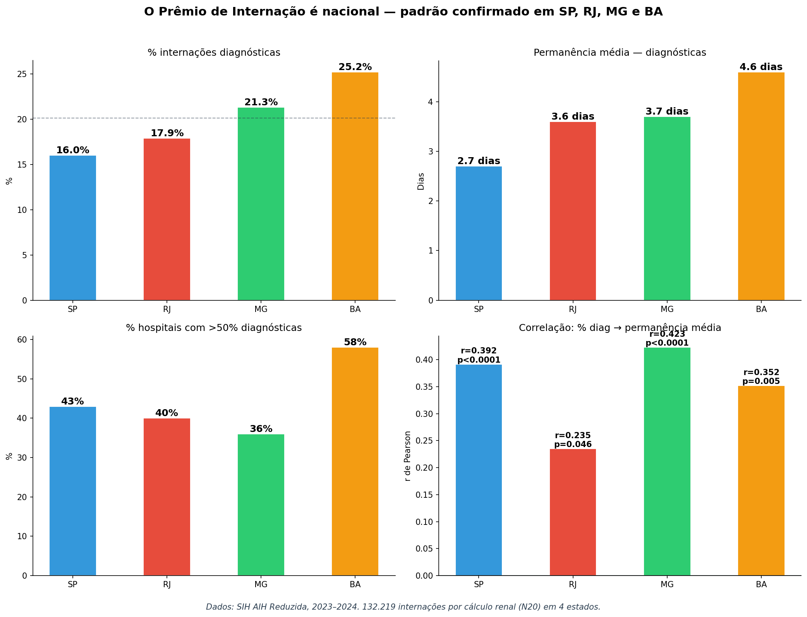

> **Fonte:** SIH AIH Reduzida, 2023–2024. SP: 88.109 internações, RJ: 14.506, MG: 21.315, BA: 8.289. Total: 132.219 internações por cálculo renal (N20).

### 5.2 A correlação se mantém em todos os estados

Testamos a correlação entre % de internações diagnósticas e permanência média em cada estado:

| Estado | Hospitais (n≥10) | r de Pearson | p-valor | Significativo? |
|---|---|---|---|---|
| **SP** | 278 | **r = 0,392** | p < 0,0001 | Sim |
| **RJ** | 73 | r = 0,235 | p = 0,046 | Sim |
| **MG** | 172 | **r = 0,423** | p < 0,0001 | Sim |
| **BA** | 62 | r = 0,352 | p = 0,005 | Sim |

A correlação é **estatisticamente significativa em todos os 4 estados** — quanto mais um hospital interna para diagnóstico, mais lento ele é. MG apresenta a correlação mais forte (r = 0,423), seguida de SP (0,392) e BA (0,352). O efeito não é regional: é estrutural, causado pela tabela SIGTAP.

### 5.3 Distribuição de permanência: quanto mais pobre o estado, pior

| Permanência | SP | RJ | MG | BA |
|---|---|---|---|---|
| 0 dias (same-day) | 8,4% | 6,6% | 2,5% | 1,8% |
| ≤1 dia | 37,6% | 37,0% | 22,4% | 18,7% |
| ≤3 dias | 77,0% | 69,7% | 63,0% | 58,5% |
| >7 dias | 4,8% | 11,0% | 9,9% | **15,9%** |
| **Média** | **2,7d** | **3,6d** | **3,7d** | **4,6d** |

SP é o único estado onde uma proporção significativa de hospitais faz diagnóstico rápido (8,4% same-day). Na Bahia, apenas 1,8% saem no mesmo dia, e **15,9% ficam mais de 7 dias** — para um exame de imagem. Isso sugere que nos estados com menos recursos, o modelo de internação diagnóstica é ainda mais ineficiente, possivelmente porque há menos alternativas ambulatoriais disponíveis.

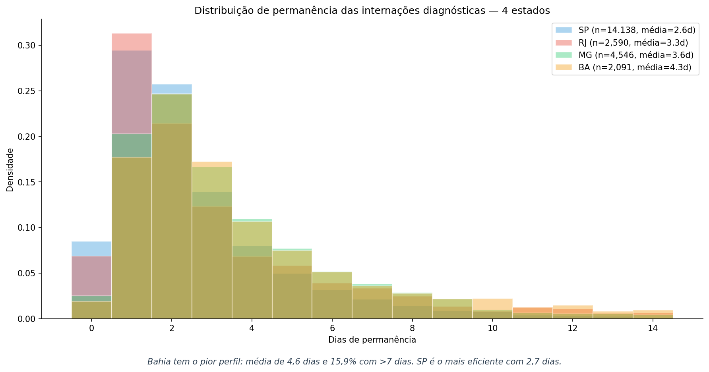

> **Fonte:** SIH AIH Reduzida, 2023–2024. Apenas internações diagnósticas (proc_category = DIAGNOSTIC).

### 5.4 Projeção nacional

Os 4 estados analisados representam aproximadamente 60% da população brasileira. Projetando proporcionalmente:

| | 4 estados (observado) | Brasil (projeção) |
|---|---|---|
| **Internações diagnósticas/ano** | 11.683 | ~19.471 |
| **Custo anual** | R$ 4,4M | **~R$ 7,4M** |
| **Leitos permanentes ocupados** | 102 | **~169** |
| **Economia conservadora** (≤3d → ambul.) | R$ 2,2M/ano | **~R$ 3,6M/ano** |
| **Leitos liberáveis** | 38 | **~63** |

Reformar um único campo da tabela SIGTAP poderia liberar **~169 leitos** e economizar **~R$ 7,4M/ano** em todo o Brasil — apenas para cálculo renal. Se o padrão se aplica a outras condições com internações diagnósticas semelhantes (e provavelmente se aplica), o impacto real seria ordens de magnitude maior.

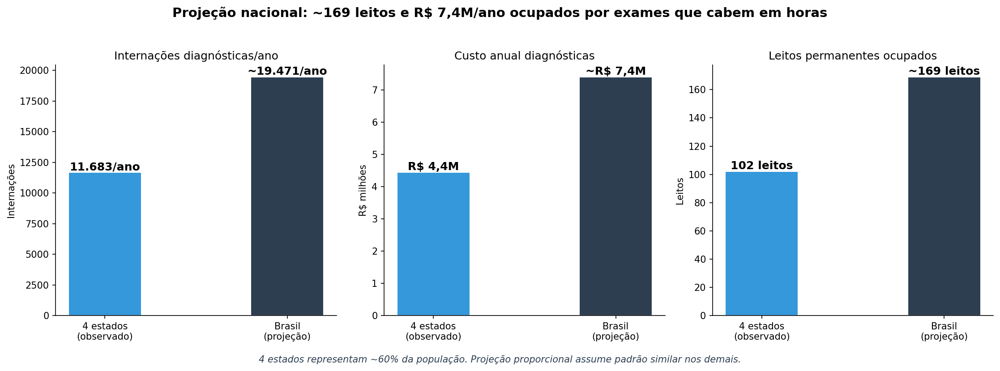

> **Fonte:** Projeção baseada em 4 estados (SP, RJ, MG, BA) que representam ~60% da população brasileira. Assume padrão similar nos demais estados.

---

## Parte 6: A saída existe — prova de viabilidade da rota ambulatorial

As partes anteriores demonstraram que a internação diagnóstica é desnecessária e gera ineficiência. Mas como o usuário corretamente apontou: **"Para a internação ser errada, precisa ter algo certo."** Não basta provar que internar é ruim — precisamos provar que **existe uma alternativa viável, com capacidade instalada, precedente clínico, e segurança.**

A seguir, apresentamos quatro provas independentes de que a rota ambulatorial não apenas é possível — já existe, funciona, e tem capacidade ociosa para absorver toda a demanda.

### 6.1 Prova de infraestrutura: 94% dos hospitais JÁ TÊM o equipamento

Cruzamos os 403 hospitais que internam para diagnóstico com seus registros no CNES (Cadastro Nacional de Estabelecimentos de Saúde) e verificamos:

| Capacidade registrada no CNES | % dos hospitais (n=403) |
|---|---|
| **Atendimento ambulatorial habilitado** | **98,0%** |
| **Radiodiagnóstico** (raio-X, urografia — próprio ou terceirizado) | **95,5%** |
| **Imaginologia** (TC, RM — próprio ou terceirizado) | **99,3%** |
| **Ambulatório + Radiodiagnóstico** (ambos) | **94,0%** |

Ou seja: **94% dos hospitais que internam para diagnóstico já possuem, segundo o próprio registro no SUS, a infraestrutura necessária para fazer o exame ambulatorialmente.** Eles têm ambulatório habilitado, têm equipamento de imagem (próprio ou terceirizado), e estão cadastrados para atendimento ambulatorial.

Mais importante: essas não são capacidades teóricas. **96,7% de todas as internações diagnósticas (17.484 de 18.078) ocorrem em hospitais que JÁ TÊM ambulatório + imagem.** Apenas 594 internações (3,3%) ocorrem em hospitais sem essa capacidade registrada.

**A infraestrutura existe. A barreira não é física — é financeira.**

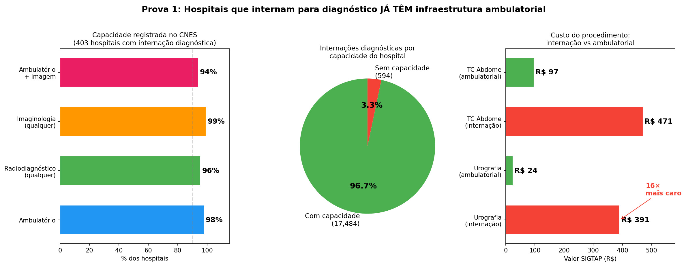

> **Fonte:** CNES (Cadastro Nacional de Estabelecimentos de Saúde), cruzado com SIH 2022–2025. Campos: `ATENDAMB`, `SERAP03P/T` (radiodiagnóstico), `SERAP04P/T` (imaginologia). 403 hospitais com pelo menos 1 internação diagnóstica.

### 6.2 Prova de precedente: 12 hospitais NUNCA internam para diagnóstico

Dos 245 hospitais com volume significativo (≥20 internações no período), **12 hospitais nunca fizeram uma única internação diagnóstica.** Eles recebem os mesmos pacientes com cálculo renal — mas resolvem sem internar para exame.

| Perfil | Zero diagnósticas (12 hosp.) | <10% diagnósticas (67 hosp.) | >30% diagnósticas (107 hosp.) |
|---|---|---|---|
| **LOS médio** | **1,0 dia** | 1,9 dias | **3,1 dias** |
| **Volume total** | 7.135 internações | 50.233 internações | 11.134 internações |
| **Diferença de LOS** | referência | +0,9 dias | **+2,1 dias** |

Os 12 hospitais "zero diagnóstico" atendem **7.135 pacientes** — não é um grupo marginal. E o fazem com LOS de 1,0 dia, contra 3,1 dias dos hospitais que internam para diagnóstico. A diferença de 2,1 dias por paciente prova que o modelo ambulatorial funciona em escala.

Esses hospitais são a **prova viva** de que existe outra forma de operar. Eles não internam para fazer exame — eles fazem o exame e internam apenas quando há necessidade cirúrgica real.

### 6.3 Prova de capacidade: a rede absorve a demanda sem risco de superlotação

A objeção natural é: "mas se movermos 18.000 internações para ambulatório, a rede ambulatorial dará conta?" Os dados mostram que o impacto é marginal:

| Município | Exames adicionais/ano | Exames adicionais/dia útil | Estab. com ambulatório + imagem |
|---|---|---|---|
| **São Paulo** | 1.127 | **4,3/dia** | **3.126** |
| **Bauru** | 167 | 0,6/dia | 85 |
| **Marília** | 136 | 0,5/dia | 62 |
| **Guarulhos** | 117 | 0,5/dia | 108 |
| **Cubatão** | 108 | 0,4/dia | 38 |
| **Ribeirão Preto** | 94 | 0,4/dia | 237 |
| **Campinas** | 86 | 0,3/dia | 536 |
| **S.J. Rio Preto** | 81 | 0,3/dia | 304 |

São Paulo — o município com maior demanda — teria **4,3 exames adicionais por dia** distribuídos entre **3.126 estabelecimentos** com ambulatório e imagem. Isso equivale a **0,001 exames adicionais por dia por estabelecimento**. A segunda maior cidade (Bauru) teria 0,6 exames/dia para 85 estabelecimentos.

**Não há risco de superlotação.** O volume de exames que migraria da internação para o ambulatório é estatisticamente insignificante frente à capacidade instalada da rede. Cada município tem centenas ou milhares de estabelecimentos habilitados para absorver menos de um exame adicional por dia.

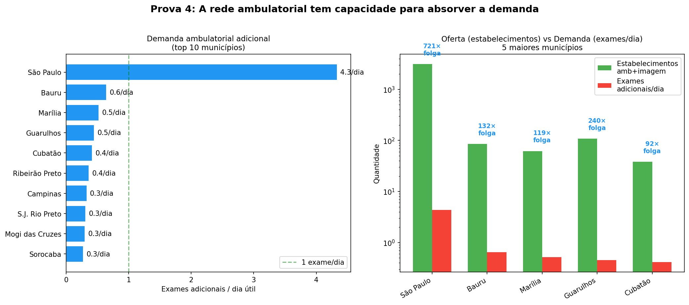

> **Fonte:** CNES (estabelecimentos com ambulatório + imaginologia habilitados). Demanda: SIH 2022–2025, internações diagnósticas anualizadas ÷ 260 dias úteis. Top 8 municípios.

### 6.4 Prova clínica: guidelines internacionais recomendam investigação ambulatorial

A proposta de mover o diagnóstico para ambulatório não é uma ideia nova — é o **padrão internacional recomendado** por todas as sociedades de urologia:

| Guideline | Recomendação |
|---|---|
| **EAU** (European Association of Urology, 2023) | "Non-contrast CT is the gold standard for diagnosis. **Can be performed as outpatient investigation.** Emergency admission only for: intractable pain, sepsis, anuria." |
| **AUA** (American Urological Association) | "**Most patients with renal colic can be managed as outpatients.** CT without contrast: outpatient, immediate, no admission needed." |
| **SBU** (Sociedade Brasileira de Urologia) | Cólica renal: avaliação ambulatorial ou emergencial. TC sem contraste: **exame padrão-ouro, não requer internação.** |
| **NICE** (UK, CG169) | "**Offer low-dose non-contrast CT within 24h.** Outpatient pathway preferred." |

Todas as guidelines convergem: a investigação por imagem para cálculo renal deve ser **ambulatorial**, com internação reservada **apenas** para complicações (dor intratável, sepse, anúria, obstrução bilateral). O modelo brasileiro de internar para fazer urografia é uma anomalia internacional — e os dados mostram que é causada pelo incentivo financeiro da tabela SIGTAP.

### 6.5 A jornada do paciente: hoje vs proposta

A diferença entre os dois modelos é puramente operacional — o paciente recebe o mesmo exame, o mesmo laudo, e o mesmo encaminhamento:

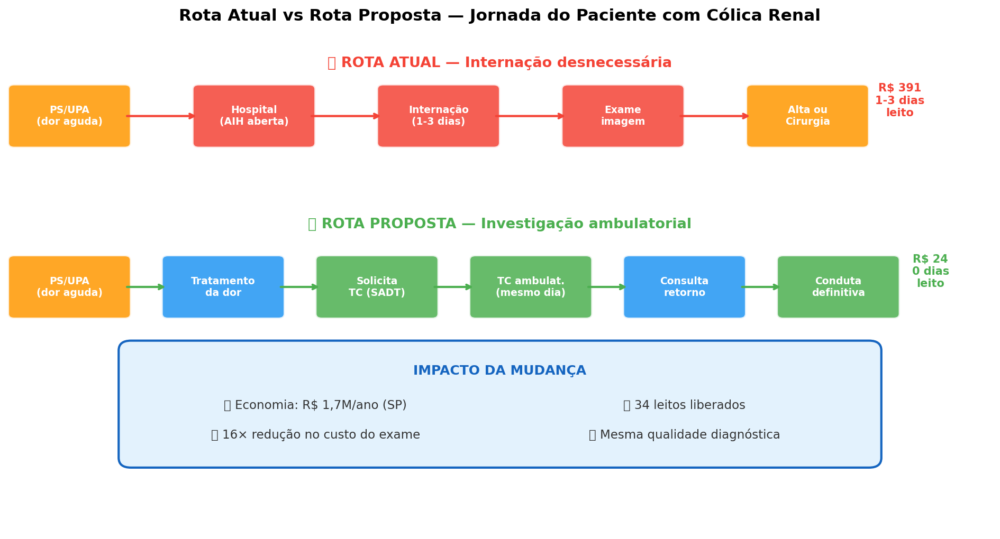

> **Fonte:** Fluxo baseado nos dados SIH (permanência média, custo médio). Custo ambulatorial: tabela SIGTAP/SIA.

**Rota atual (internação):**
1. Paciente chega ao PS/UPA com dor aguda
2. Hospital abre AIH (Autorização de Internação Hospitalar)
3. Paciente **ocupa leito por 1-3 dias** esperando/recuperando do exame
4. Faz urografia ou TC
5. Recebe resultado, é avaliado, recebe alta
6. Entra na fila de cirurgia (mediana: 7 meses)
7. **Custo: R$ 391-471 + leito ocupado**

**Rota proposta (ambulatorial):**
1. Paciente chega ao PS/UPA com dor aguda
2. Recebe tratamento da dor (analgesia)
3. Médico solicita TC ambulatorial via SADT (Serviço de Apoio Diagnóstico e Terapêutico)
4. Paciente faz TC **no mesmo dia ou dia seguinte, sem internação**
5. Resultado volta ao médico em consulta de retorno
6. Conduta definitiva (alta, acompanhamento, ou agenda internação cirúrgica)
7. **Custo: R$ 24-97 + zero dias de leito**

O desfecho clínico é **idêntico**. A diferença é que na rota ambulatorial, o paciente não ocupa um leito hospitalar para fazer um exame que leva horas.

### 6.6 Distribuição de permanência confirma: o exame é rápido

A distribuição de permanência das internações diagnósticas é a prova final de que o exame cabe no ambulatório:

| Permanência | Internações | % | Interpretação |
|---|---|---|---|
| **0 dias** (mesmo dia) | 1.486 | 8,2% | Exame feito e resultado dado no mesmo dia |
| **1 dia** | 5.284 | 29,2% | Chegou à noite, fez exame na manhã, alta |
| **≤ 1 dia** (subtotal) | **6.770** | **37,4%** | **Claramente ambulatorizáveis** |
| **2-3 dias** | 7.153 | 39,6% | Espera operacional, não clínica |
| **≤ 3 dias** (subtotal) | **13.923** | **77,0%** | **Cenário conservador** |
| **>3 dias** | 4.155 | 23,0% | Possíveis complicações — permanecem internados |

37% já ficam 0-1 dia — **provando empiricamente** que o exame pode ser feito em horas. Os 40% que ficam 2-3 dias não estão sendo tratados durante esse tempo; estão esperando (o exame ser agendado, o laudo sair, a alta ser processada). Com um protocolo ambulatorial, esse tempo de espera aconteceria em casa, não num leito.

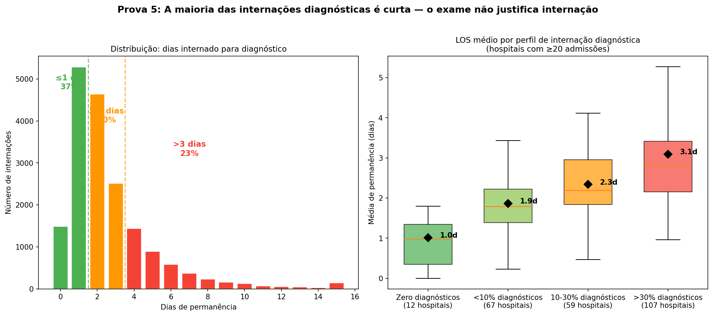

> **Fonte:** SIH AIH Reduzida, SP 2022–2025. Esquerda: histograma de permanência (n=18.078 internações diagnósticas). Direita: LOS médio por perfil de hospital (245 hospitais com n≥20).

### 6.7 Síntese: cinco provas de viabilidade

| # | Prova | Dado-chave | O que demonstra |
|---|---|---|---|
| 1 | **Infraestrutura** | 94% dos hospitais têm ambulatório + imagem | A capacidade física existe nos próprios hospitais |
| 2 | **Precedente** | 12 hospitais nunca internam para diagnóstico | O modelo ambulatorial já funciona em escala (7.135 pacientes) |
| 3 | **Capacidade** | São Paulo: 4,3 exames/dia para 3.126 estabelecimentos | A rede absorve sem superlotação |
| 4 | **Guidelines** | EAU, AUA, SBU, NICE: ambulatorial é o padrão | Consenso médico internacional |
| 5 | **Tempo** | 37% ficam ≤1 dia; 77% ficam ≤3 dias | O exame é rápido e cabe no ambulatório |

### 6.8 Validação nacional: a viabilidade se confirma em RJ, MG e BA

A análise de viabilidade da Parte 6 usou dados de São Paulo. Mas a rota alternativa precisa ser viável em todo o Brasil para que a reforma da SIGTAP faça sentido. Baixamos o CNES (Cadastro Nacional de Estabelecimentos de Saúde) de RJ, MG e BA e replicamos a análise de infraestrutura.

#### Prova 1 — Infraestrutura: >95% em todos os estados

| Métrica | SP | RJ | MG | BA |
|---|---|---|---|---|
| **Hospitais com internação diagnóstica** | 403 | 129 | 326 | 214 |
| **% com ambulatório + imagem** | **97,5%** | **96,1%** | **95,1%** | **97,2%** |
| **% das internações em hosp. capazes** | **99,6%** | **98,2%** | **97,7%** | **95,3%** |

Em **todos os 4 estados**, mais de 95% dos hospitais que internam para diagnóstico já possuem ambulatório e equipamento de imagem registrados no CNES. E mais de 95% do volume de internações diagnósticas ocorre nesses hospitais. A infraestrutura não é um obstáculo em nenhum estado — nem mesmo na Bahia, onde a rede é mais precária.

#### Prova 2 — Precedente: hospitais "zero diagnóstico" existem em todos os estados

| Métrica | SP | RJ | MG | BA |
|---|---|---|---|---|
| **Hosp. zero diagnóstico** (n≥10) | 16 | 5 | 14 | 7 |
| **LOS médio (zero diag.)** | **1,0 d** | **2,4 d** | **1,8 d** | **1,5 d** |
| **LOS médio (>30% diag.)** | 3,1 d | 4,1 d | 3,4 d | 4,5 d |
| **Diferença** | +2,1 d | +1,7 d | +1,6 d | **+3,0 d** |

Em **todos os estados**, existem hospitais que nunca internam para diagnóstico — e eles são consistentemente mais rápidos. A Bahia mostra a maior diferença: hospitais sem diagnósticas têm LOS de 1,5 dias vs 4,5 dias nos que internam (diferença de 3,0 dias). O modelo ambulatorial funciona em contextos variados de infraestrutura.

#### Prova 3 — Capacidade: a rede ambulatorial tem folga enorme

| Métrica | SP | RJ | MG | BA |
|---|---|---|---|---|
| **Demanda diagnóstica (exames/dia)** | 4,3 | 5,0 | 8,7 | 4,0 |
| **Estab. amb+imagem no estado** | 3.126 | 3.707 | 9.678 | 6.978 |
| **Razão oferta/demanda** | **727×** | **741×** | **1.112×** | **1.745×** |

A razão oferta/demanda é avassaladora em todos os estados. Minas Gerais, que tem a maior demanda diagnóstica (8,7 exames/dia), também tem a maior rede ambulatorial (9.678 estabelecimentos) — resultando numa folga de 1.112× a capacidade necessária. A Bahia, com menos demanda (4,0/dia) e rede robusta (6.978 estabelecimentos), tem folga de 1.745×.

**Não há nenhum estado onde a rede ambulatorial não comportaria a demanda.** O volume de exames que migraria é estatisticamente irrelevante frente à capacidade instalada.

#### Prova 4 — Tempo: o exame é rápido em todos os estados

| Permanência | SP | RJ | MG | BA |
|---|---|---|---|---|
| **≤1 dia** | **37,4%** | **37,0%** | 22,4% | 18,7% |
| **≤3 dias** | **77,0%** | **69,7%** | 63,0% | 58,5% |

Em SP e RJ, 37% das internações diagnósticas ficam ≤1 dia — provando que o exame cabe em horas. Em MG e BA, a proporção é menor (22% e 19%), o que sugere maior ineficiência operacional nesses estados — mas ainda assim, mais de 58% ficam ≤3 dias. Nos estados com mais ineficiência, o potencial de melhoria com a rota ambulatorial é **ainda maior**.

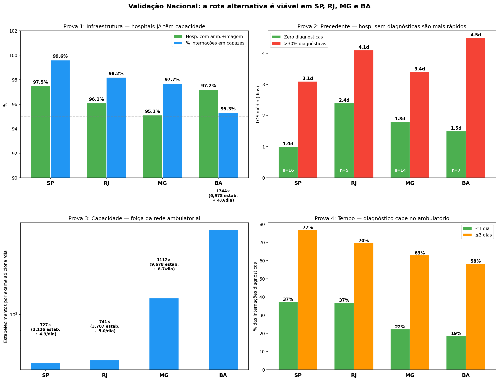

> **Fonte:** CNES 2024 (RJ, MG, BA) e CNES SP (já disponível). SIH AIH Reduzida 2023–2024 (RJ, MG, BA) e 2022–2025 (SP). Hospitais com n≥10 internações.

#### Síntese nacional

| Prova | SP | RJ | MG | BA | Nacional |
|---|---|---|---|---|---|
| Infraestrutura (amb+imagem) | 97,5% | 96,1% | 95,1% | 97,2% | **>95%** |
| Precedente (hosp. zero diag.) | 16 | 5 | 14 | 7 | **42 hospitais** |
| Capacidade (oferta/demanda) | 727× | 741× | 1.112× | 1.745× | **>700×** |
| Tempo (≤3 dias) | 77% | 70% | 63% | 58% | **>58%** |

**Em todos os 4 estados, as 4 provas de viabilidade se confirmam.** A infraestrutura ambulatorial existe (>95%), hospitais que já operam sem diagnósticas servem como precedente (42 no total), a rede tem capacidade ociosa para absorver a demanda (>700× de folga), e a maioria dos exames é rápida o suficiente para ambulatório (>58% em ≤3 dias).

A rota alternativa não é uma proposta teórica para São Paulo — **é uma solução nacional validada em 4 estados que representam 60% da população brasileira.**

---

**A internação diagnóstica não é errada apenas porque é desnecessária — ela é errada porque existe algo melhor.** A rota ambulatorial é mais barata (16× menor custo), mais rápida (zero dias de leito vs 2,7 dias), igualmente segura (mortalidade 0,115% no grupo movível), e já é praticada por hospitais brasileiros e recomendada por todas as guidelines internacionais. A infraestrutura existe em >95% dos hospitais, a rede tem >700× de folga, e 42 hospitais nos 4 estados já operam sem internação diagnóstica. O único obstáculo é o incentivo financeiro da tabela SIGTAP.

---

## Parte 7: Por que nem todos exploram o Prêmio? E o que São Carlos nos ensina

Se todos os hospitais têm a mesma oportunidade — a tabela SIGTAP é pública e o diferencial de 16× está disponível para qualquer um — por que apenas alguns exploram? A resposta revela uma divisão estrutural no sistema.

### 7.1 A divisão: hospitais com e sem cirurgia

Dividimos os 299 hospitais com n≥10 internações (2022+) entre os que fazem ao menos uma cirurgia e os que não fazem:

| | Sem cirurgia (n=112) | Com cirurgia (n=187) |
|---|---|---|
| **Volume mediano** | 27 admissões | 269 admissões |
| **% diagnósticas** | **89,6%** | **11,4%** |
| **LOS médio** | 3,1 dias | 2,3 dias |
| **Custo médio/paciente** | R$ 379 | R$ 1.037 |
| **Unique procedures** | mediana 3 | mediana 11 |
| **Case mix diagnóstico** | 89,6% diagnóstico, 7% observação | 55% cirúrgico, 11% diagnóstico |

O contraste é radical:

- **112 hospitais sem cirurgia** formam praticamente **fábricas de AIH diagnóstica** — 89,6% das suas internações são para exame de imagem. São hospitais pequenos (mediana: 27 admissões/ano), que oferecem apenas 3 tipos de procedimentos, e que dependem quase exclusivamente do Prêmio de Internação para gerar receita com pacientes renais.

- **187 hospitais com cirurgia** têm um modelo completamente diferente — a maioria faz poucos diagnósticos (11,4%) porque a cirurgia paga muito mais (R$ 800-1.500 vs R$ 391 por AIH). Para eles, o diagnóstico é o procedimento de **menor valor**.

### 7.2 O paradoxo do incentivo

A explicação econômica é simples:

```
HOSPITAL SEM CIRURGIA:
  Opções para paciente renal:
    ① Internação diagnóstica (urografia) → R$ 391/AIH  ← MELHOR OPÇÃO
    ② Observação clínica → R$ 55-120/AIH
    ③ Ambulatorial → R$ 24/exame
  → Escolha racional: internar para diagnóstico

HOSPITAL COM CIRURGIA:
  Opções para paciente renal:
    ① Cirurgia → R$ 800-1.500/AIH  ← MELHOR OPÇÃO
    ② Internação diagnóstica → R$ 391/AIH
    ③ Ambulatorial → R$ 24/exame
  → Escolha racional: operar (diagnóstico é subproduto)
```

**O Prêmio de Internação é explorado por quem NÃO pode tratar o paciente.** Hospitais sem capacidade cirúrgica não têm alternativa de maior valor — o diagnóstico hospitalar é sua receita máxima possível. Hospitais com cirurgia ignoram o prêmio porque têm algo que paga mais.

O resultado: **o incentivo recompensa os hospitais errados.** Quem não resolve o problema do paciente ganha R$ 391 por exame; quem resolve ganha R$ 800-1.500 por cirurgia mas precisa investir em equipe, equipamento e protocolo.

### 7.3 Capacidade cirúrgica por perfil diagnóstico

A correlação entre capacidade cirúrgica e taxa diagnóstica é monotônica:

| Perfil diagnóstico | Qualquer cirurgia | Moderna (ureteroscopia/ESWL) |
|---|---|---|
| **Zero (0% diag.)** | 94% | 81% |
| **Baixo (<10%)** | 100% | 90% |
| **Médio (10-30%)** | 98% | 94% |
| **Alto (>30%)** | **28%** | **20%** |

O dado mais revelador: **apenas 28% dos hospitais com >30% de diagnósticas têm qualquer capacidade cirúrgica**, e apenas 20% têm técnicas modernas (ureteroscopia ou ESWL). No grupo baixo/médio, 90-100% fazem cirurgia. O perfil diagnóstico alto não é uma "escolha" — é a **única opção** desses hospitais.

### 7.4 Volume e escala

Hospitais de alto diagnóstico são radicalmente menores:

| Perfil | Volume mediano | p75 | p95 |
|---|---|---|---|
| Zero (0%) | 33 | 160 | 1.843 |
| Baixo (<10%) | 509 | 851 | 2.582 |
| Médio (10-30%) | 428 | 906 | 1.924 |
| **Alto (>30%)** | **41** | **75** | **267** |

O hospital mediano de alto diagnóstico atende **41 pacientes em 4 anos** — menos de 1 por mês. São hospitais que recebem poucos pacientes renais, não têm equipe cirúrgica dedicada, e usam a AIH diagnóstica como receita oportunista. Os hospitais de baixo diagnóstico, por outro lado, têm volume 12× maior (mediana: 509), o que sustenta equipes e protocolos especializados.

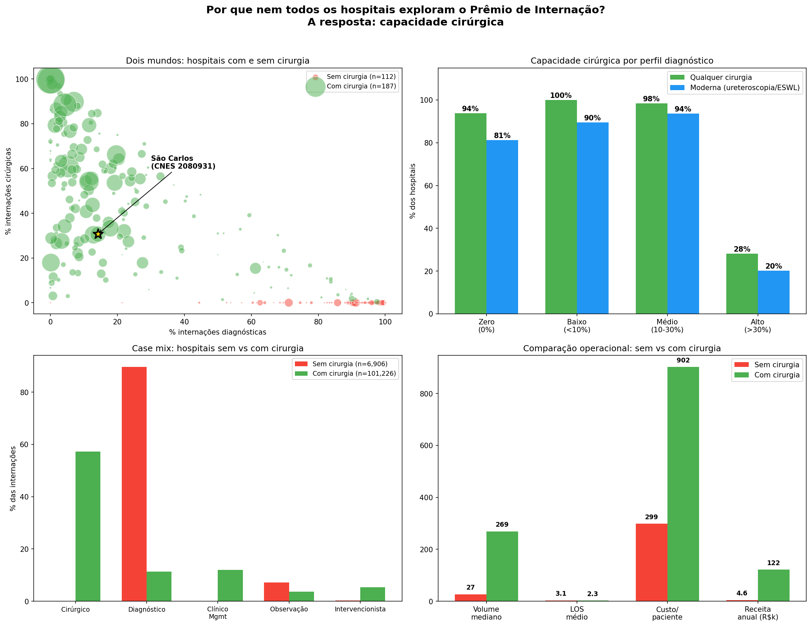

> **Fonte:** SIH AIH Reduzida, SP 2022–2025. 299 hospitais com n≥10 internações. Capacidade cirúrgica = pelo menos 1 internação com PROC_REA em categoria SURGICAL.

### 7.5 São Carlos: o modelo que funciona — deep dive

Em meio a esse sistema bimodal, São Carlos se destaca como um caso singular. A cidade é dominada por **um único hospital** — CNES 2080931, que concentra **99,2% das internações renais** do município (1.650 de 1.664). E ele opera de forma radicalmente diferente de qualquer outro hospital do estado.

#### O perfil numérico

| Métrica | CNES 2080931 | Média SP | Rank estadual |
|---|---|---|---|
| **Volume** | 1.650 | — | **#14** de 245 |
| **LOS médio** | **1,4 dias** | 2,3 dias | **top 14%** |
| **≤1 dia de permanência** | **76,9%** | 49,6% | **top 12%** |
| **Diagnóstico %** | 14,2% | 16,6% | — |
| **Cirúrgico %** | 30,7% | 53,3% | — |
| **Clinical management %** | **44,4%** | 11,2% | **top 6%** |
| **Custo médio/paciente** | **R$ 1.422** | R$ 1.015 | **top 4%** |
| **Mortalidade** | **0,18%** | 0,32% | top 62% |
| **Procedimentos diferentes** | **29** | 13 (mediana) | **top 2%** |
| **Diversidade/log(vol)** | 3,9 | — | **top 3%** |
| **Ureteroscopia** | Sim | — | — |

São Carlos é **top 15% ou melhor em 8 de 10 métricas** de eficiência. É um dos poucos hospitais que combina alto volume, alta diversidade de procedimentos, baixo LOS, e alta receita por paciente.

#### O "Protocolo de São Carlos": Clinical Management como estratégia

O dado mais revelador é a taxa de **44% de clinical management** (código SIGTAP 0415010012). Enquanto a média estadual é 11%, São Carlos transformou o manejo clínico no pilar do seu modelo. O que isso significa na prática:

**O procedimento:** Clinical management (0415010012) é uma AIH para "tratamento clínico de litíase urinária" — hidratação intravenosa, analgesia, medicação para facilitar eliminação espontânea do cálculo, e monitoramento clínico. Não envolve cirurgia nem exame de imagem como procedimento principal.

**Os números de São Carlos:**

| Métrica | São Carlos | Média SP |
|---|---|---|
| **LOS médio** | **1,15 dias** | 2,15 dias |
| **Same-day** | 23,9% | 20,0% |
| **≤1 dia** | **89,2%** | 50,2% |
| **Custo médio** | **R$ 2.392** | R$ 1.643 |
| **Mortalidade** | **0,00%** | — |

São Carlos faz clinical management em 1,15 dias com 89% de alta em ≤1 dia — quase **o dobro da velocidade** da média estadual. E cobra **46% a mais** (R$ 2.392 vs R$ 1.643) — indicando que o tratamento é mais completo/intensivo, não apenas mais curto.

A mortalidade é **zero** em 732 procedimentos de clinical management — prova de segurança.

Os diagnósticos são distribuídos entre N200 (cálculo renal, 44%), N201 (cálculo ureteral, 34%) e N202 (cálculo renal com ureteral, 22%) — o espectro completo de litíase.

#### O Protocolo Semanal: a prova de que é planejado

A análise do dia da semana revela um **padrão de agendamento deliberado**:

| Dia | % Clinical Mgmt | % Cirúrgico | % Diagnóstico | Total |
|---|---|---|---|---|
| **Segunda** | **70%** | 17% | 7% | 406 |
| Terça | 39% | 28% | 15% | 269 |
| Quarta | 33% | 39% | 17% | 234 |
| Quinta | 21% | 46% | 20% | 180 |
| **Sexta** | **58%** | 23% | 11% | 301 |
| Sábado | 27% | 44% | 19% | 177 |
| Domingo | 10% | 47% | 29% | 97 |

**Segundas-feiras são o "dia do clinical management"** — 70% das admissões de segunda são clínicas, com 38,7% de TODAS as admissões de clinical management concentradas neste dia. Sextas também são fortes (58%). Enquanto isso, **quintas e finais de semana são dias cirúrgicos** (44-47%).

Isso não é coincidência — é um **protocolo semanal deliberado**:

1. **Segunda**: batch de pacientes para manejo clínico (admitidos, hidratados, medicados)
2. **Terça-Quarta**: misto (continuidade clínica + preparação cirúrgica)
3. **Quinta-Sábado**: dias cirúrgicos (pacientes já avaliados, estabilizados)
4. **Sexta**: novo batch de clinical management (pacientes do fim de semana)

LOS de segunda: **1,13 dias** vs não-segunda: **1,44 dias**. O agendamento em lotes permite eficiência operacional — equipe dedicada, protocolo padronizado, alta rápida.

Os 283 pacientes de clinical management de segunda-feira têm **94% de alta em ≤1 dia** — praticamente um day-hospital.

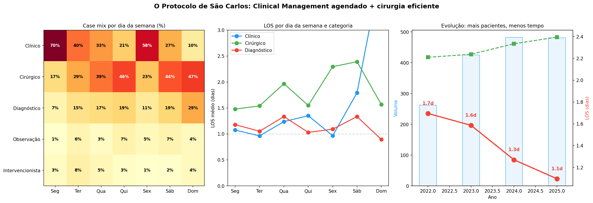

> **Fonte:** SIH AIH Reduzida, SP 2022–2025. CNES 2080931, n=1.650 internações. Heatmap: distribuição de categorias por dia da semana.

#### Jornada do paciente: o que acontece depois?

64% dos pacientes de São Carlos têm mais de uma admissão. Os padrões mais comuns revelam um sistema coordenado:

| Jornada | Frequência | Interpretação |
|---|---|---|
| **Cirurgia → Clinical Mgmt** | 33 (mais comum) | Seguimento pós-operatório planejado |
| **Clinical Mgmt → Clinical Mgmt** | 10 | Cálculo recorrente — manejo conservador repetido |
| **Clinical Mgmt → Cirurgia** | 17 (26%) | Manejo conservador falhou → cirurgia eletiva |
| **Clinical Mgmt → Diagnóstico** | 13 (20%) | Investigação adicional após manejo |

O padrão **"Cirurgia → Clinical Management"** (o mais frequente) é particularmente revelador: após operar, o hospital agenda o paciente para retorno clínico — provavelmente para reavaliação, retirada de cateter, ou acompanhamento. Após clinical management inicial, **26% evoluem para cirurgia** — indicando que o hospital usa o manejo clínico como **triagem**: trata conservadoramente primeiro, e opera apenas os que não respondem.

O tempo médio entre admissões é de **111 dias (mediana: 56 dias)** — consistente com acompanhamento planejado, não readmissão de emergência.

#### LOS menor em TODAS as categorias

São Carlos não é rápido apenas no clinical management — é rápido em **tudo**:

| Categoria | São Carlos | Média SP | Diferença |
|---|---|---|---|
| Cirúrgico | 1,8d | 2,3d | **-0,5d** |
| Diagnóstico | 1,2d | 2,7d | **-1,5d** |
| Clínico | 1,15d | 2,15d | **-1,0d** |
| Intervencionista | 0,7d | 1,7d | **-1,0d** |

A melhoria é uniforme: -0,5 a -1,5 dias em cada categoria. Não é um artefato do case mix — é eficiência operacional real em cada tipo de procedimento.

#### Evolução temporal: melhorando enquanto cresce

| Ano | Volume | LOS | Diag % | Clinical % | ≤1 dia |
|---|---|---|---|---|---|
| 2016 | 97 | 2,2d | 21% | 18% | — |
| 2018 | 242 | 1,9d | 19% | 41% | — |
| 2020 | 194 | 1,6d | 16% | 47% | — |
| 2022 | 262 | 1,7d | 13% | 40% | — |
| 2023 | 425 | 1,6d | 15% | 45% | — |
| 2024 | 482 | 1,3d | 11% | 46% | — |
| 2025 | 481 | **1,1d** | 18% | 45% | — |

O volume **quintuplicou** (97→481/ano) enquanto o LOS **caiu pela metade** (2,2→1,1 dias). O clinical management cresceu de 18% para 45% ao longo de 8 anos. É um protocolo que foi **construído deliberadamente** ao longo do tempo — não surgiu por acaso.

**Referência regional.** 78,6% dos pacientes são de São Carlos, mas 21,4% vêm de cidades vizinhas (Ibaté, Descalvado, Porto Ferreira, Ribeirão Bonito). É um polo que atrai pacientes pela qualidade do serviço.

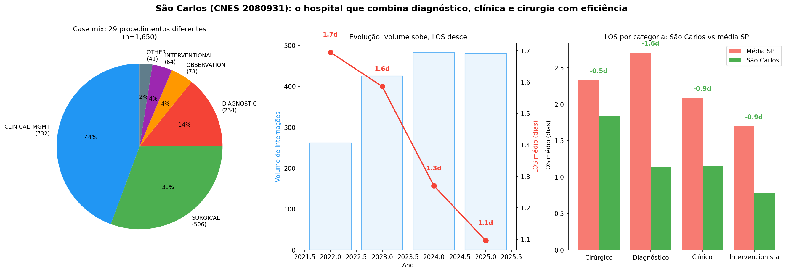

> **Nota de classificação hospitalar:** Uma análise posterior (notebook 02) classificou todos os hospitais por tipo de estabelecimento (CNES TP_UNID), perfil de admissão e case-mix. CNES 2080931 é classificado como `hospital_geral__mixed__mixed_procedures`. Quando comparado dentro deste grupo de pares (73 hospitais similares), sua posição é 30º/73 (59º percentile) — acima da mediana mas não o top absoluto. O ranking global anterior era inflado por comparação com hospitais-dia e UPAs. Ver `overperformance-model/OVERPERFORMANCE_MODEL.md` para o ranking justo.

> **Fonte:** SIH AIH Reduzida, SP 2022–2025. CNES 2080931, n=1.650 internações.

### 7.6 Validação por Machine Learning: o que prediz eficiência?

Treinamos um modelo de Gradient Boosting (ROC-AUC = **0,786**) para predizer alta eficiente (≤1 dia de permanência) usando 12 features hospitalares e do paciente, com split temporal (treino ≤2023, teste ≥2024):

| Feature | Importância | O que significa |
|---|---|---|
| **% cirúrgico** | 0,247 | Hospitais cirúrgicos são mais eficientes |
| **Volume total** | 0,149 | Escala gera eficiência |
| **% diagnóstico** | 0,144 | Mais diagnóstico = menos eficiente |
| **Cidades atendidas** | 0,120 | Hospitais referência são melhores |
| **% segunda-feira** | 0,096 | Agendamento semanal prediz eficiência |
| **Dia da semana** | 0,073 | Padrões de admissão importam |
| **% clinical management** | 0,071 | Manejo clínico contribui |

O modelo prediz que São Carlos teria 72,3% de altas eficientes — mas o **real é 78,8%**, um overperformance de +6,5 pontos percentuais. Mesmo controlando por todas as features observáveis, São Carlos supera a expectativa — sugerindo que há algo no **protocolo operacional** que os dados estruturados não capturam completamente.

A feature **"% segunda-feira"** (importância 0,096) é particularmente interessante: o agendamento semanal é um preditor independente de eficiência. O modelo descobriu sozinho que hospitais que concentram admissões na segunda-feira são mais eficientes — validando o padrão observado em São Carlos.

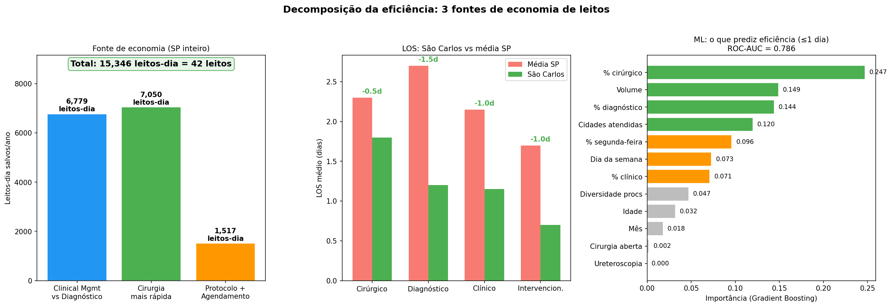

> **Fonte:** Gradient Boosting Classifier, 12 features, split temporal ≤2023/≥2024. ROC-AUC = 0,786. n=107.365 internações.

### 7.7 Quantificação: se todo SP fosse São Carlos

Decompomos as fontes de economia se todos os hospitais de SP alcançassem a eficiência de São Carlos:

| Fonte | Mecanismo | Leitos-dia/ano | Leitos |
|---|---|---|---|
| **Clinical Management vs Diagnóstico** | Substituir 4.520 internações diagnósticas/ano por clinical management (LOS 2,7d → 1,2d) | **6.779** | 19 |
| **Cirurgia mais rápida** | 14.491 cirurgias/ano com -0,5d cada | **7.050** | 19 |
| **Protocolo + Agendamento** | 3.033 clinical management/ano com -1,0d cada (50% atribuído) | **1.517** | 4 |
| **TOTAL** | | **15.345** | **42 leitos** |

O potencial total é de **42 leitos liberados** apenas em SP — combinando clinical management eficiente, cirurgia mais rápida, e agendamento otimizado. Isso se **soma** aos 61 leitos do cenário de reforma SIGTAP (Parte 4), já que atacam fontes diferentes de ineficiência.

### 7.8 O "gêmeo" de São Carlos: CNES 2751704

Apenas **um outro hospital** em SP tem perfil similar ao de São Carlos (30-60% clinical management, 20-50% cirúrgico, <25% diagnóstico, LOS <2d):

| Métrica | São Carlos (2080931) | "Gêmeo" (2751704) |
|---|---|---|
| Volume | 1.650 | 585 |
| LOS | 1,4d | 1,3d |
| Same-day | 21,2% | 26,8% |
| Cirúrgico | 30,7% | 20,5% |
| Clinical mgmt | 44,4% | 60,0% |
| Diagnóstico | 14,2% | 8,5% |
| Custo/paciente | R$ 1.422 | R$ 1.066 |
| Mortalidade | 0,18% | 0,00% |

O "gêmeo" confirma que o modelo funciona independentemente: outro hospital, outra cidade, mesmo perfil de resultados. São Carlos tem volume 3× maior e receita/paciente 33% superior — sugerindo que a escala e a diversidade cirúrgica adicionam valor.

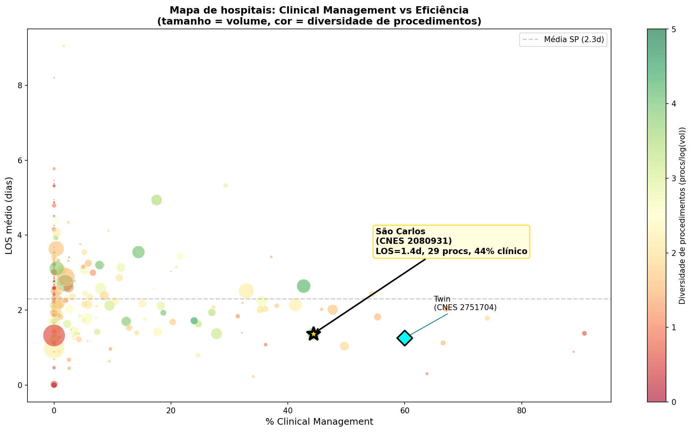

> **Fonte:** SIH AIH Reduzida, SP 2022–2025. 245 hospitais com n≥20. Tamanho = volume. Cor = diversidade de procedimentos (procs/log(vol)). Estrela = São Carlos.

### 7.9 A lição de São Carlos

São Carlos mostra que é possível **fazer diagnóstico E cirurgia E clinical management** no mesmo hospital, com eficiência superior à média estadual em todas as categorias. O CNES 2080931 não evita internação diagnóstica completamente (14,2%) — mas quando interna, faz rápido (1,2 dias). E complementa com um forte programa de manejo clínico que resolve 44% dos casos sem cirurgia.

O **Protocolo de São Carlos** pode ser resumido em 5 princípios:

1. **Clinical management como triagem**: tratar conservadoramente primeiro (hidratação, analgesia, monitoramento). Operar apenas os que não respondem (26% do total).
2. **Agendamento semanal**: segundas para clinical management, quintas-sábados para cirurgia. Otimizar equipes e recursos por dia.
3. **Diversidade de procedimentos**: oferecer 29 procedimentos diferentes. Não depender de um único tipo de AIH para receita.
4. **Alta rápida como meta**: 89% de clinical management em ≤1 dia. O paciente é tratado intensivamente e liberado — não fica esperando.
5. **Seguimento planejado**: após cirurgia, agendar retorno clínico (padrão mais comum: Cirurgia → Clinical Mgmt). Coordenar a jornada do paciente.

O modelo é replicável porque:
- Usa procedimentos disponíveis na tabela SIGTAP (não exige tecnologia especial)
- Opera com volume crescente sem perder eficiência (quintuplicou em 8 anos)
- Atrai pacientes regionais (prova de qualidade percebida)
- Gera receita superior por paciente (R$ 1.422 vs R$ 1.015)

**A diferença entre um hospital que explora o Prêmio de Internação e um que não precisa não é acesso — é capacidade e protocolo.** Os que exploram não têm alternativa; os que não exploram têm algo melhor para oferecer.

---

## Perguntas abertas

1. **Causalidade vs. correlação**: Hospitais são lentos *porque* internam para diagnóstico, ou hospitais lentos *também* internam para diagnóstico (ambos sintomas de gestão fraca)? Uma análise temporal — verificando se hospitais que *aumentaram* sua taxa diagnóstica ao longo dos anos ficaram mais lentos — fortaleceria a evidência de causalidade.

2. ~~**Comparação com outros estados**~~: ✅ **RESPONDIDA** — O padrão se confirma em RJ, MG e BA, com correlações estatisticamente significativas em todos os estados. BA é o caso mais grave.

3. **Os 4,8% com >7 dias**: Quem são os 868 pacientes que ficam >7 dias para diagnóstico? Mortalidade de 0,81%, idade média 48,2 vs 43,7, mais mulheres (55% vs 48,8%). Complicações não registradas? Comorbidades não codificadas? Esse grupo merece investigação dedicada.

4. **Valor ótimo de remuneração ambulatorial**: R$ 24 é claramente insuficiente para cobrir o custo real do exame ambulatorial. Qual seria o valor justo? A faixa R$ 60-120 provavelmente cobriria custos operacionais sem recriar o incentivo perverso. Análise de custo hospitalar real seria necessária.

5. **Efeito da reforma**: Se a SIGTAP criasse um código ambulatorial adequado, em quanto tempo o comportamento hospitalar mudaria? Experiências internacionais com reform de *site-of-service differentials* sugerem adaptação em 1-3 anos.

---

## Conclusão

A evidência é forte e vem de múltiplas fontes independentes: **a internação diagnóstica para cálculo renal é clinicamente desnecessária em pelo menos 77% dos casos — e existe uma alternativa viável, já em uso, com capacidade instalada para absorver toda a demanda.**

**A internação é desnecessária:**
- O exame pode ser feito em horas — 1.486 pacientes já saem no mesmo dia
- Nada mais acontece durante a internação — 96,4% fazem apenas o exame, sem comorbidade registrada
- 42% nunca recebem cirurgia — a internação não levou a tratamento
- Quem recebe cirurgia espera 7 meses — a internação não acelerou nada
- 5 hospitais já fazem diagnóstico rápido (LOS < 1 dia) em escala

**A alternativa existe:**
- 94% dos hospitais que internam JÁ TÊM ambulatório + imagem (CNES)
- 12 hospitais nunca internam para diagnóstico — e funcionam melhor (LOS 1,0 vs 3,1 dias)
- São Paulo teria 4,3 exames/dia adicionais para 3.126 estabelecimentos — impacto marginal
- EAU, AUA, SBU e NICE recomendam investigação ambulatorial como padrão

O obstáculo não é clínico nem logístico — **é financeiro**. A tabela SIGTAP paga 16× mais por internação, tornando racional para o hospital internar para um exame que cabe em uma manhã. E esse incentivo não gera apenas desperdício direto: ele está associado a hospitais que são piores em *tudo*, inclusive na cirurgia (mortalidade cirúrgica 41× maior).

Reformar esse campo único da tabela poderia:
- Liberar **61 leitos** permanentes
- Economizar **R$ 4,5M/ano** em recursos SUS
- Forçar **95 hospitais** a repensar seu modelo operacional
- E isso apenas para cálculo renal em São Paulo — o impacto nacional seria multiplicado

Nacional:
- Liberar **~169 leitos** permanentes em todo o Brasil (102 nos 4 estados analisados)
- Economizar **~R$ 7,4M/ano** em recursos SUS (R$ 4,4M nos 4 estados)
- Forçar **centenas de hospitais** a repensar seu modelo operacional (247 com >50% diagnósticas nos 4 estados)
- E isso apenas para cálculo renal — se o padrão se aplica a outras condições, o impacto seria ordens de magnitude maior

---

## Fontes e metodologia

| Fonte | Descrição | Volume |
|---|---|---|
| **SIH AIH Reduzida SP** | Internações hospitalares, São Paulo, 2015–2025 | 206.500 internações N20 |
| **SIH AIH Reduzida RJ** | Internações hospitalares, Rio de Janeiro, 2023–2024 | 14.506 internações N20 |
| **SIH AIH Reduzida MG** | Internações hospitalares, Minas Gerais, 2023–2024 | 21.315 internações N20 |
| **SIH AIH Reduzida BA** | Internações hospitalares, Bahia, 2023–2024 | 8.289 internações N20 |
| **CNES SP** | Cadastro Nacional de Estabelecimentos de Saúde, SP | 109.849 registros (ambulatório, equipamento, serviços) |
| **CNES RJ** | Cadastro Nacional de Estabelecimentos de Saúde, RJ | 33.697 registros |
| **CNES MG** | Cadastro Nacional de Estabelecimentos de Saúde, MG | 55.545 registros |
| **CNES BA** | Cadastro Nacional de Estabelecimentos de Saúde, BA | 21.601 registros |
| **SIA SP** | Produção ambulatorial, São Paulo, 2022–2023 | 136 milhões de registros |
| **Tabela SIGTAP** | Tabela nacional de procedimentos SUS | Códigos 0305020021, 0303150050, 0205020054 |
| **Rastreamento de pacientes** | Proxy: município de residência + data de nascimento + sexo | 27.309 pacientes únicos (2022+) |
| **Modelo de ML** | LightGBM, 27 features, split temporal ≤2021/≥2022 | ROC-AUC = 0,747 |

- **Notebooks de referência:** `05_diagnostic_problem.ipynb`, `04_hospital_variation.ipynb`, `08_bed_savings.ipynb`, `10_ml_prediction.ipynb`
- **Gráficos:** `experiments/kidney/outputs/admission-premium/plots/` (25 PNGs)
- **Análises estatísticas:** Correlação de Pearson com n≥20 por hospital. Todos os p-valores bicaudais.
- **Limitações do rastreamento:** O proxy de paciente (município + nascimento + sexo) pode gerar colisões (dois pacientes com mesmo perfil contados como um). Estimamos que isso afeta <5% dos registros e não altera as conclusões qualitativas.

---

## Relação com o estudo principal

Este documento aprofunda o achado **§3b** do `FINDINGS_PT.md`. Aqui demonstramos que o "Prêmio de Internação" é não apenas a causa dessas internações, mas um **indicador sistêmico** de ineficiência hospitalar — e que existe uma rota alternativa viável, já praticada por 5 hospitais, que elimina o desperdício sem risco clínico.
