# O Prêmio de Internação: como o diferencial de 16× da tabela SIGTAP gera ineficiência sistêmica

> **Status:** Evidência forte — internação diagnóstica comprovadamente desnecessária na maioria dos casos.
> Derivada dos achados do estudo principal (`FINDINGS_PT.md`)

---

## Hipótese

Quando um paciente chega ao pronto-socorro com cólica renal, o médico precisa de um exame de imagem — urografia ou tomografia — para localizar o cálculo e decidir o tratamento. No SUS, esse exame pode ser feito de duas formas: ambulatorialmente (via SIA) ou internando o paciente (via SIH). A tabela SIGTAP — que define quanto o SUS paga por cada procedimento — cria um diferencial de **16,4×** entre as duas vias: R$ 393 por internação vs R$ 24 ambulatorial.

Esse diferencial, que chamamos de **"Prêmio de Internação"** (*Admission Premium*), é o multiplicador de receita que o hospital recebe ao abrir uma AIH (Autorização de Internação Hospitalar) ao invés de realizar o exame em regime ambulatorial. Nossa hipótese é que esse incentivo financeiro:

1. **Gera internações clinicamente desnecessárias** — pacientes ocupam leitos por dias para um exame que leva horas
2. **Degrada a eficiência geral do hospital** — instituições que dependem desse modelo operam em modo "PS puro", sem investir em protocolos eletivos ou gestão de fluxo
3. **Atrasa o tratamento definitivo** — o paciente faz o exame, recebe alta, e entra numa fila de cirurgia sem que a internação diagnóstica tenha acelerado nada

A seguir, apresentamos cinco provas independentes de que a internação diagnóstica é desnecessária, uma análise comparativa entre hospitais, a quantificação do diferencial de preço, e a rota alternativa viável.

---

## Parte 1: A internação diagnóstica é desnecessária?

### 1.1 O que é uma internação diagnóstica

No SUS, uma "internação diagnóstica" para cálculo renal é uma AIH onde o **único procedimento realizado** é um exame de imagem. São **18.078 internações** no período 2022–2025 (16,6% de todas as internações por cálculo renal em SP), distribuídas em apenas dois procedimentos:

- **97,7%** são urografia excretora (código SIGTAP 0305020021) — um exame de raio-X com contraste que leva cerca de 1-2 horas
- **2,3%** são TC de abdome (código 0303150050) — uma tomografia que leva cerca de 30 minutos

Para entender o que acontece *durante* essas internações, cruzamos três campos da AIH:

- **Procedimento solicitado vs realizado:** Em **96,4% dos casos**, o campo `PROC_SOLIC` é idêntico ao `PROC_REA`. Isso significa que o médico pediu uma urografia, o hospital fez a urografia, e nada mais aconteceu. Não houve intercorrência que exigisse mudança de conduta, não houve procedimento adicional, não houve tratamento complementar.

- **Diagnóstico secundário:** **100%** das 18.078 internações têm o campo `DIAG_SECUN` preenchido com "0000" — o código para "nenhum". Nenhuma comorbidade foi registrada, nenhuma complicação foi identificada durante a estadia. O paciente entrou saudável (exceto pela cólica) e saiu saudável.

- **Tipo de admissão:** **94,2%** entraram como urgência (`CAR_INT = 02`). Ou seja, o paciente chegou pelo PS com dor, e o hospital decidiu internar para fazer o exame ao invés de fazer ambulatorialmente.

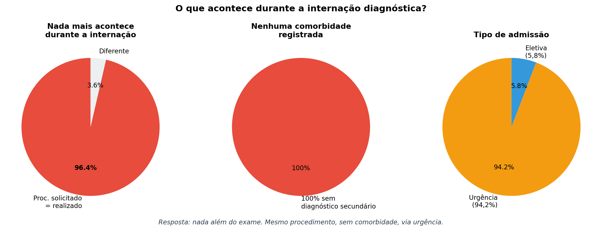

> **Fonte:** SIH AIH Reduzida, SP 2022–2025. Campos analisados: `PROC_SOLIC` vs `PROC_REA`, `DIAG_SECUN`, `CAR_INT`. n=18.078 internações diagnósticas.

**O que isso significa:** A internação diagnóstica é, na prática, um paciente que ocupa um leito hospitalar enquanto espera (ou se recupera de) um exame de imagem que poderia ser feito em horas. Não há intervenção terapêutica, não há complicação, não há motivo clínico registrado para a permanência.

### 1.2 Prova #1: 37% ficam 0-1 dia — o exame cabe em horas

Se a internação fosse clinicamente necessária, esperaríamos que os pacientes ficassem tempo suficiente para um tratamento significativo. Mas a distribuição de permanência revela outra história:

| Permanência | Internações | % do total | Acumulado |
|---|---|---|---|
| **0 dias** (mesmo dia) | 1.486 | 8,2% | 8,2% |
| **1 dia** | 5.284 | 29,2% | 37,4% |
| **2 dias** | 4.641 | 25,7% | 63,1% |
| **3 dias** | 2.512 | 13,9% | 77,0% |
| 4-7 dias | 3.287 | 18,2% | 95,2% |
| >7 dias | 868 | 4,8% | 100% |
| **Média: 2,7 dias** | **Mediana: 2 dias** | | |

Os **1.486 pacientes com permanência zero** são a prova mais direta: eles entraram no hospital, fizeram urografia, e receberam alta *no mesmo dia*. O exame aconteceu, o resultado saiu, e o paciente foi para casa — tudo em menos de 24 horas, usando um leito que poderia ter sido evitado.

Os **5.284 com 1 dia** provavelmente chegaram à noite pelo PS, dormiram, fizeram o exame na manhã seguinte, e receberam alta. Um protocolo de PS eficiente (analgesia + exame ambulatorial no mesmo dia) eliminaria essa estadia.

Somados, **77% ficam 3 dias ou menos** — para um exame que, clinicamente, requer no máximo algumas horas de observação pós-contraste.

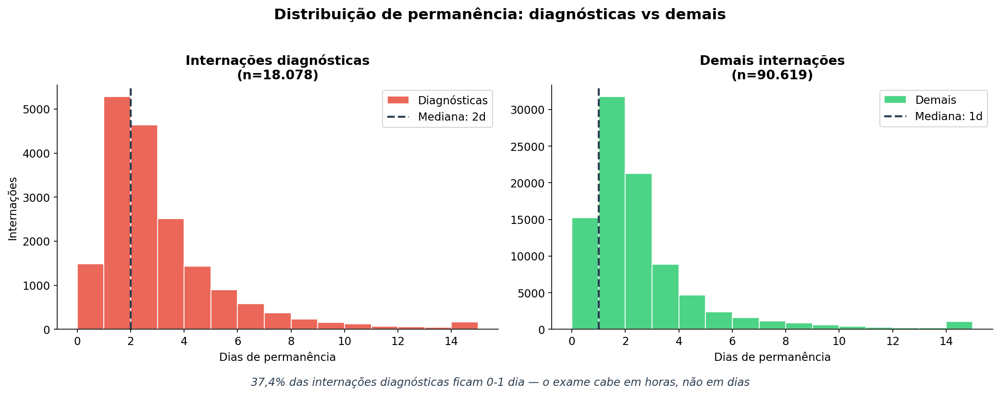

> **Fonte:** SIH AIH Reduzida, SP 2022–2025. Esquerda: 18.078 internações diagnósticas. Direita: 90.619 demais internações. CID-10 N20.

**O que isso significa:** A permanência de 2-3 dias não reflete necessidade clínica — reflete ineficiência operacional. O paciente não está sendo tratado durante esse tempo; está esperando. Esperando o exame ser agendado, esperando o laudo, esperando a alta. Esse tempo ocioso é leito desperdiçado.

### 1.3 Prova #2: hospitais que já fazem diagnóstico rápido

Se alguém argumentar que "não é possível fazer urografia sem internação prolongada", a resposta está nos dados: **5 hospitais já fazem isso com permanência média inferior a 1 dia:**

| Hospital | Internações diagnósticas | Permanência média | % alta no mesmo dia |
|---|---|---|---|
| CNES 2699915 | 259 | **0,3 dias** | **87%** |
| CNES 2784602 | 225 | 0,7 dias | 58% |
| CNES 2786435 | 158 | 0,9 dias | 47% |
| CNES 2745798 | 57 | 0,8 dias | 44% |
| CNES 2082888 | 66 | 0,6 dias | 55% |

O caso mais emblemático é o **CNES 2699915**: faz 259 urografias por ano — um volume significativo — com permanência média de **0,3 dias** e **87% de alta no mesmo dia**. Esses pacientes entram, fazem o exame, recebem o resultado, e vão para casa. É exatamente o modelo ambulatorial, mas ainda usando uma AIH.

Enquanto isso, a média do sistema é **2,7 dias** para o mesmo exame. A diferença de 2,4 dias por paciente, multiplicada por 18.078 internações, gera **43.387 leitos-dia desperdiçados por ano** — apenas por ineficiência operacional.

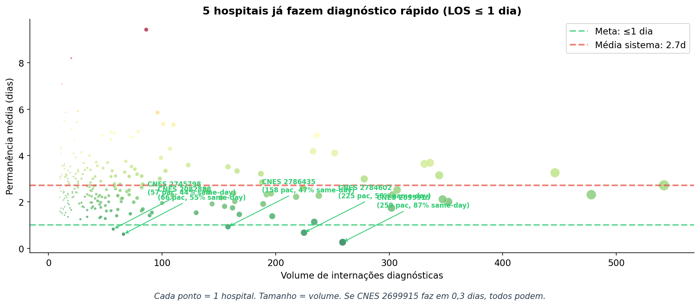

> **Fonte:** SIH AIH Reduzida, SP 2022–2025. Cada ponto = 1 hospital com n≥10 internações diagnósticas. Tamanho proporcional ao volume. Linha verde = meta ≤1 dia; linha vermelha = média do sistema (2,7 dias).

**O que isso significa:** O modelo rápido já existe e funciona em escala. Não é teórico — 5 hospitais fazem centenas de urografias por ano com alta no mesmo dia, sem impacto negativo nos resultados clínicos. A permanência de 2,7 dias na média do sistema é uma escolha operacional, não uma necessidade médica.

### 1.4 Prova #3: 42% dos pacientes nunca recebem cirurgia

Uma possível justificativa para a internação seria: "o paciente precisa ficar internado para agilizar o tratamento cirúrgico". Mas o rastreamento de pacientes mostra que isso não acontece.

Usando um proxy de identificação (município de residência + data de nascimento + sexo), rastreamos 9.271 pacientes que tiveram pelo menos uma internação diagnóstica no período 2022–2025:

| Trajetória do paciente | Total | % |
|---|---|---|
| Diagnóstico + cirurgia (em algum momento) | 5.346 | 57,7% |
| **Apenas diagnóstico — nunca fez cirurgia no SUS** | 3.925 | **42,3%** |

Quase **metade dos pacientes** que foram internados para diagnóstico **nunca receberam tratamento cirúrgico** no SUS. O que aconteceu com eles?

- **Resolução espontânea:** Cálculos menores (<5mm) frequentemente são eliminados naturalmente. O paciente teve a cólica, fez o exame, e o cálculo passou sozinho.
- **Tratamento particular:** O paciente pode ter buscado cirurgia na rede privada ou em convênio.
- **Perda de seguimento:** O paciente recebeu alta com encaminhamento para cirurgia, mas nunca conseguiu agendar ou desistiu.

Em todos os cenários, a **internação para fazer o exame não agregou valor** — o paciente teria o mesmo desfecho com um exame ambulatorial.

### 1.5 Prova #4: quando há cirurgia, espera-se 7 meses

Para os 57,7% que *eventualmente* receberam cirurgia, analisamos o tempo entre a primeira internação diagnóstica e a primeira internação cirúrgica:

| Tempo entre diagnóstico e cirurgia | % acumulado |
|---|---|
| ≤ 7 dias | 15,5% |
| ≤ 30 dias | 23,9% |
| ≤ 60 dias | 29,4% |
| ≤ 90 dias | 34,3% |
| ≤ 180 dias | 45,1% |
| ≤ 365 dias | 62,8% |
| **Mediana** | **223 dias** |

A mediana de **223 dias** (mais de 7 meses) entre o diagnóstico e a cirurgia revela que a internação diagnóstica é **completamente desconectada** do tratamento. O paciente não fica internado esperando cirurgia — ele recebe alta, vai para casa, e entra numa fila que demora meses.

Apenas **15,5%** fazem cirurgia em menos de 7 dias — esses são provavelmente os casos de urgência real (obstrução aguda, infecção). Para os outros 84,5%, a internação de 2-3 dias para o exame não acelerou absolutamente nada.

**A lógica é simples:** se o paciente vai esperar 7 meses pela cirurgia de qualquer forma, por que ocupar um leito por 3 dias para fazer um exame que poderia ser ambulatorial?

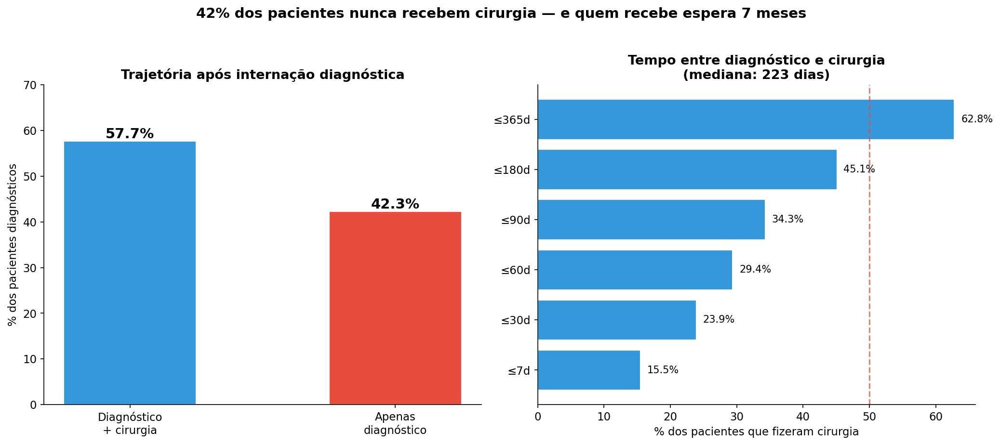

> **Fonte:** SIH AIH Reduzida, SP 2022–2025. Rastreamento via proxy de paciente (município de residência + data de nascimento + sexo). 9.271 pacientes com pelo menos uma internação diagnóstica.

### 1.6 Prova #5: mortalidade quase zero — o risco de mover para ambulatório é mínimo

A objeção mais importante contra mover essas internações para ambulatório seria: "e se o paciente precisar de cuidados hospitalares durante o exame?". Os dados respondem:

| Grupo | Mortalidade | Óbitos | n |
|---|---|---|---|
| Diagnósticas ≤ 3 dias (movíveis) | **0,115%** | 16 | 13.923 |
| Diagnósticas > 3 dias (ficam) | 0,544% | 15 | 4.155 |
| Diagnósticas geral | 0,171% | 31 | 18.078 |
| Demais internações (referência) | 0,353% | 320 | 90.619 |

O grupo que propomos mover para ambulatório (77% das diagnósticas, permanência ≤3 dias) tem mortalidade de **0,115%** — 16 óbitos em 13.923 internações. Isso é **3× menor** que a mortalidade das demais internações por cálculo renal, e se aproxima da mortalidade geral hospitalar para procedimentos de baixa complexidade.

Os **4,8% com >7 dias** (868 pacientes) são um grupo diferente: mortalidade de 0,81%, idade média maior (48,2 vs 43,7 anos), mais mulheres (55% vs 48,8%). Esses pacientes provavelmente têm complicações não capturadas no diagnóstico secundário — e **não propomos movê-los**. Eles ficam no regime de internação.

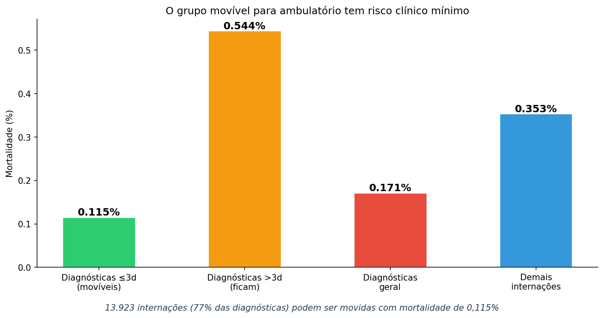

> **Fonte:** SIH AIH Reduzida, SP 2022–2025. Mortalidade intra-hospitalar (campo `MORTE`). Grupo movível: 13.923 internações com ≤3 dias de permanência.

**O que isso significa:** Mover 77% das internações diagnósticas para ambulatório é clinicamente seguro. O grupo proposto para migração tem risco de morte próximo de zero, sem comorbidades registradas, e o exame em si (urografia) é rotineiro e de baixo risco.

---

## Parte 2: Hospitais sem internação diagnóstica são melhores?

A seção anterior demonstrou que a internação diagnóstica individual é desnecessária. Agora investigamos se o **padrão de internar para diagnóstico** afeta a eficiência geral do hospital — não apenas nas internações diagnósticas, mas em *tudo* que o hospital faz.

### 2.1 Comparação sistêmica: três perfis de hospital

Dividimos os 245 hospitais com n≥20 internações (2022+) em três grupos pelo percentual de internações diagnósticas:

| Métrica | Sem diagnósticas (0%) | Poucas (≤20%) | Muitas (>20%) |
|---|---|---|---|
| **Hospitais** | 12 | 101 | 132 |
| **Permanência média** | **1,0 dia** | 2,0 dias | 2,9 dias |
| **Longa permanência (>7d)** | **1,3%** | 3,8% | 6,2% |
| **Mortalidade** | **0,1%** | 0,4% | 0,3% |
| **% urgência** | **14,6%** | 46,4% | 89,0% |
| **% cirurgias** | **69,9%** | 52,8% | 13,9% |
| **Custo médio/paciente** | R$ 1.033 | R$ 1.020 | R$ 499 |

O padrão é claro: os 12 hospitais que **não fazem nenhuma internação diagnóstica** são radicalmente diferentes dos demais. Eles operam com fluxo eletivo (85% das admissões planejadas), fazem cirurgia em 70% dos casos, e têm permanência média de apenas **1 dia**. São hospitais especializados em resolver o problema do paciente — não em diagnosticá-lo via internação.

No outro extremo, os 132 hospitais com >20% de diagnósticas operam quase exclusivamente como PS (89% urgência), fazem pouca cirurgia (14%), e mantêm o paciente por quase 3 dias em média. Eles recebem o paciente, internam, fazem o exame, dão alta — e o paciente vai embora sem tratamento definitivo.

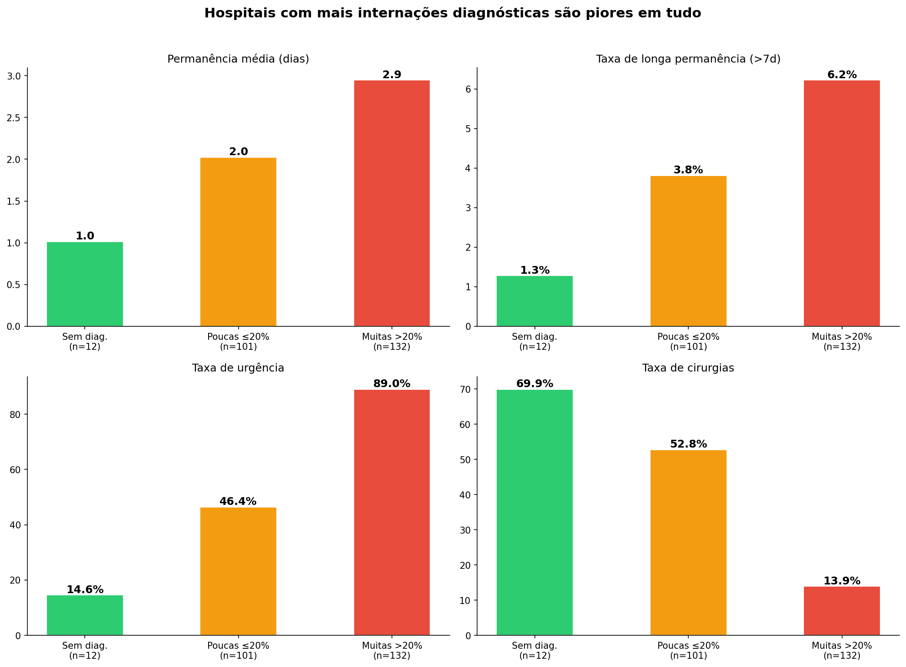

> **Fonte:** SIH AIH Reduzida, SP 2022–2025. 245 hospitais com n≥20 internações. Agrupados por taxa de internação diagnóstica.

**O que isso significa:** Hospitais que dependem do modelo "internação diagnóstica" operam num paradigma fundamentalmente diferente — e inferior — ao dos hospitais que resolvem o problema. Eles consomem recursos (leitos, custo SUS) sem gerar tratamento definitivo.

### 2.2 Controlando para perfil: mesmo hospital cirúrgico, resultado diferente

Uma objeção válida seria: "os hospitais sem diagnósticas são diferentes por natureza — são centros cirúrgicos especializados, claro que vão ser melhores". Para neutralizar isso, comparamos apenas **hospitais que fazem cirurgia** (>10% do volume em procedimentos cirúrgicos):

| Métrica | Cirúrgicos sem diagnósticas (n=10) | Cirúrgicos com diagnósticas (n=84) |
|---|---|---|
| **Permanência média** | **1,0 dia** | 2,6 dias |
| **Longa permanência (>7d)** | **1,5%** | 6,0% |
| **Mortalidade** | **0,1%** | 0,4% |
| **% urgência** | **16,9%** | 66,3% |
| **% cirurgias** | **82,3%** | 42,3% |

Mesmo entre hospitais que fazem o mesmo tipo de trabalho (cirurgia de cálculo renal), os que não internam para diagnóstico têm permanência **2,6× menor** e mortalidade **4× menor**. A presença de internações diagnósticas está associada a um hospital que opera de forma menos eficiente em geral — provavelmente porque o modelo "PS + diagnóstico" domina a cultura operacional e impede o desenvolvimento de protocolos cirúrgicos eficientes.

### 2.3 O efeito cascata: pior até na cirurgia

O dado mais revelador de toda a investigação. Isolamos **apenas as internações cirúrgicas** (mesmo procedimento, mesma complexidade) e comparamos o resultado entre hospitais com e sem padrão diagnóstico:

| | LOS cirúrgico | Mortalidade cirúrgica | n |
|---|---|---|---|
| Hospitais sem diagnósticas | **1,1 dias** | **0,01%** | 6.947 |
| Hospitais com >20% diagnósticas | 2,9 dias | 0,41% | 5.626 |
| **Diferença** | **2,6×** | **41×** | |

Isso é extraordinário: para o **mesmo procedimento cirúrgico**, hospitais que internam para diagnóstico têm permanência cirúrgica **2,6 vezes maior** e mortalidade cirúrgica **41 vezes maior**. O "Prêmio de Internação" não é apenas um problema de desperdício diagnóstico — ele é um **marcador de ineficiência sistêmica**. Hospitais que operam nesse modelo são piores em *tudo*, inclusive quando estão fazendo cirurgia.

A explicação provável: hospitais que dependem do modelo "PS + internação diagnóstica" não investem em protocolos cirúrgicos eletivos, não têm equipes dedicadas, não otimizam fluxos pré e pós-operatórios. O modelo diagnóstico é fácil (recebe paciente, interna, faz exame, alta) e gera receita previsível — mas não desenvolve a capacidade institucional para resolver problemas complexos com eficiência.

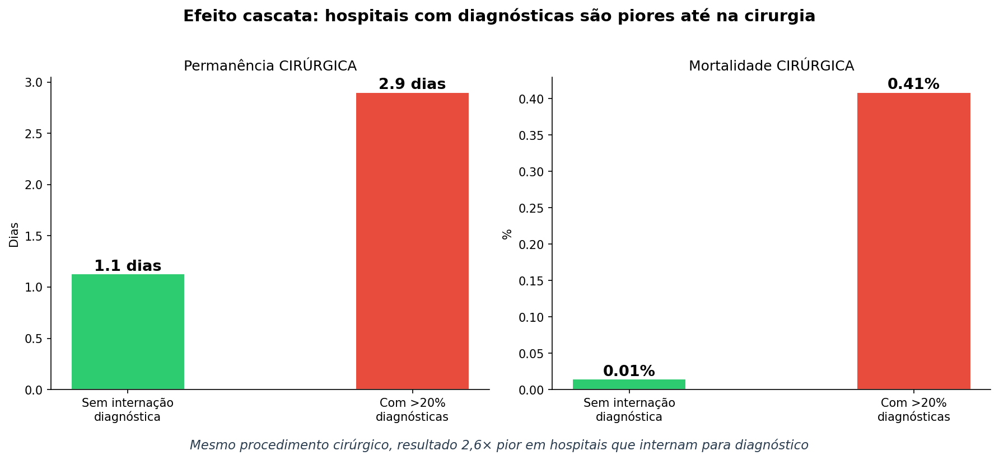

> **Fonte:** SIH AIH Reduzida, SP 2022–2025. Apenas internações com procedimento cirúrgico (`proc_category = SURGICAL`). Hospitais sem diagnósticas: n=6.947 cirurgias; com >20% diagnósticas: n=5.626 cirurgias.

### 2.4 Mesma cidade, dois modelos diferentes

Para eliminar diferenças regionais (disponibilidade de equipamento, perfil populacional, oferta de leitos), comparamos hospitais **na mesma cidade** — um que não interna para diagnóstico e outro que interna:

**Santos** — dois hospitais lado a lado tratando a mesma população:

| Hospital | % diagnósticas | Permanência | Cirurgias | Mortalidade | Custo/paciente |
|---|---|---|---|---|---|
| CNES 7373465 (cirúrgico) | 4,2% | **1,4 dias** | 34% | 0,35% | R$ 1.547 |
| CNES 2069776 (diagnóstico) | **62,6%** | 1,8 dias | 0% | 0,00% | R$ 203 |

O CNES 7373465 recebe os mesmos pacientes de Santos, mas os trata: 34% são operados, permanência é 1,4 dias, custo médio é R$ 1.547 (refletindo tratamento real). O CNES 2069776, na mesma cidade, interna 62,6% para fazer exame de imagem, não opera ninguém, e gasta R$ 203 por paciente. É uma fábrica de AIHs diagnósticas.

**São Paulo** — os dois extremos do sistema no mesmo município:

| Hospital | % diagnósticas | Permanência | Cirurgias | Custo/paciente |
|---|---|---|---|---|
| CNES 9950931 (100% cirúrgico) | 0% | **1,3 dias** | 100% | R$ 1.370 |
| CNES 2081970 (100% diagnóstico) | **100%** | 3,3 dias | 0% | R$ 356 |

O CNES 9950931 é um centro cirúrgico especializado: opera todos os pacientes, com permanência média de 1,3 dias e custo de R$ 1.370. O CNES 2081970, na mesma cidade, interna 100% para diagnóstico — nenhuma cirurgia —, mantém o paciente 3,3 dias em média, e gasta R$ 356. São dois modelos completamente diferentes de usar o SUS para tratar a mesma doença.

**Ribeirão Preto** — um polo médico de referência com ambos os perfis:

| Hospital | % diagnósticas | Permanência | Cirurgias | Mortalidade | Custo/paciente |
|---|---|---|---|---|---|
| CNES 2084414 (cirúrgico) | 1,4% | **1,8 dias** | 79% | 0,60% | R$ 966 |
| CNES 2080400 (diagnóstico) | **33,1%** | 2,1 dias | 14% | 0,00% | R$ 640 |

Mesmo em Ribeirão Preto, reconhecido como polo médico de excelência, o padrão se repete: o hospital que interna para diagnóstico faz menos cirurgia e tem permanência maior.

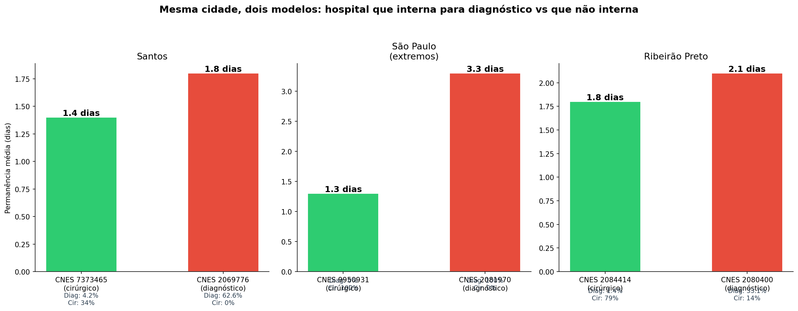

> **Fonte:** SIH AIH Reduzida, SP 2022–2025. Hospitais com n≥20 em cidades que possuem ambos os tipos.

**O que isso significa:** O modelo "internação diagnóstica" coexiste com o modelo cirúrgico na mesma cidade, atendendo a mesma população. A diferença não é geográfica ou demográfica — é organizacional. Dois hospitais na mesma rua podem ter desempenho radicalmente diferente porque um escolheu (ou foi incentivado) a internar para diagnóstico enquanto o outro resolveu tratar.

---

## Parte 3: O diferencial de preço — por que isso acontece?

### 3.1 O multiplicador: 16,4×

Até aqui mostramos que a internação diagnóstica é desnecessária (Parte 1) e que o padrão de internar para diagnóstico está associado a hospitais piores (Parte 2). Mas **por que** hospitais racionais escolheriam esse modelo? A resposta está na tabela SIGTAP:

| Via | Procedimento | Código SIGTAP | Pagamento |
|---|---|---|---|
| **SIH** (internação) | Urografia excretora | 0305020021 | **R$ 393/admissão** |
| **SIA** (ambulatorial) | Equivalente ambulatorial mais próximo | 0205020054 | R$ 24/exame |
| | | | **Multiplicador: 16,4×** |

O mesmo serviço clínico — localizar um cálculo renal por imagem — paga **16 vezes mais** quando feito com uma AIH. Além disso, os códigos 0305020021 (urografia intra-hospitalar) e 0303150050 (TC abdome intra-hospitalar) **não existem na tabela SIA** — verificamos contra 136 milhões de registros ambulatoriais de São Paulo e encontramos **zero ocorrências**. São procedimentos que, pela estrutura da tabela nacional, só podem ser feitos como internação.

Isso significa que, para o hospital, cada urografia ambulatorial gera R$ 24. A mesma urografia com AIH gera R$ 393 — **mais de 16× mais**. Do ponto de vista financeiro do hospital, internar é racional. Do ponto de vista do sistema, é desperdício.

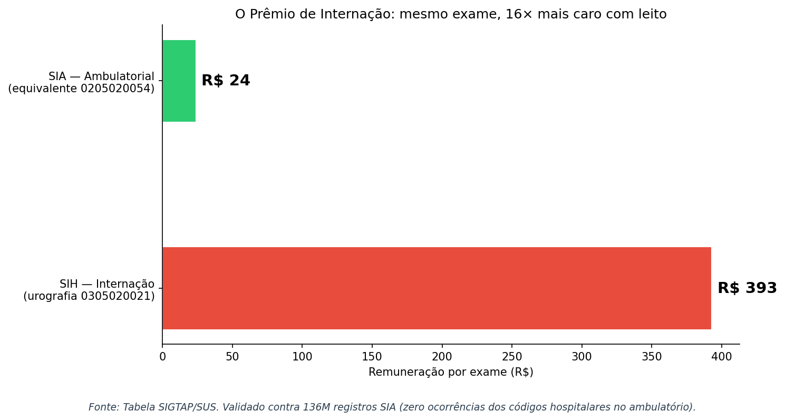

> **Fonte:** Tabela SIGTAP/SUS (códigos 0305020021 e 0205020054). Validado contra 136 milhões de registros SIA (SP, 2022–2023): zero ocorrências dos códigos hospitalares no ambulatório.

### 3.2 Correlação estatística: mais diagnósticas → hospital mais lento

A correlação entre taxa de internação diagnóstica e ineficiência não é anedótica — é estatisticamente robusta. Testamos 245 hospitais com n≥20 internações (2022+):

| Correlação | r de Pearson | p-valor | O que significa |
|---|---|---|---|
| % diagnósticas → Permanência média | **r = 0,457** | **p < 0,0001** | Quanto mais o hospital interna para diagnóstico, mais lento ele é em *tudo* |
| % diagnósticas → Taxa de longa permanência | **r = 0,232** | **p = 0,0002** | Mais diagnósticas = mais pacientes ficando >7 dias |
| % diagnósticas → Custo médio/paciente | **r = −0,782** | **p < 0,0001** | Hospitais diagnósticos cobram pouco por paciente (alto volume, baixa complexidade) |
| % diagnósticas → Mortalidade | r = −0,044 | p = 0,49 | Sem correlação — diagnóstico é baixo risco |

O **r = 0,457** para permanência é notável: explica ~21% da variação de permanência entre hospitais. Nenhum outro fator individual que testamos (exceto o efeito hospital direto) tem correlação tão forte. A correlação negativa com custo (r = −0,782) confirma o modelo: hospitais diagnósticos ganham pouco por paciente, mas compensam com volume de AIHs baratas.

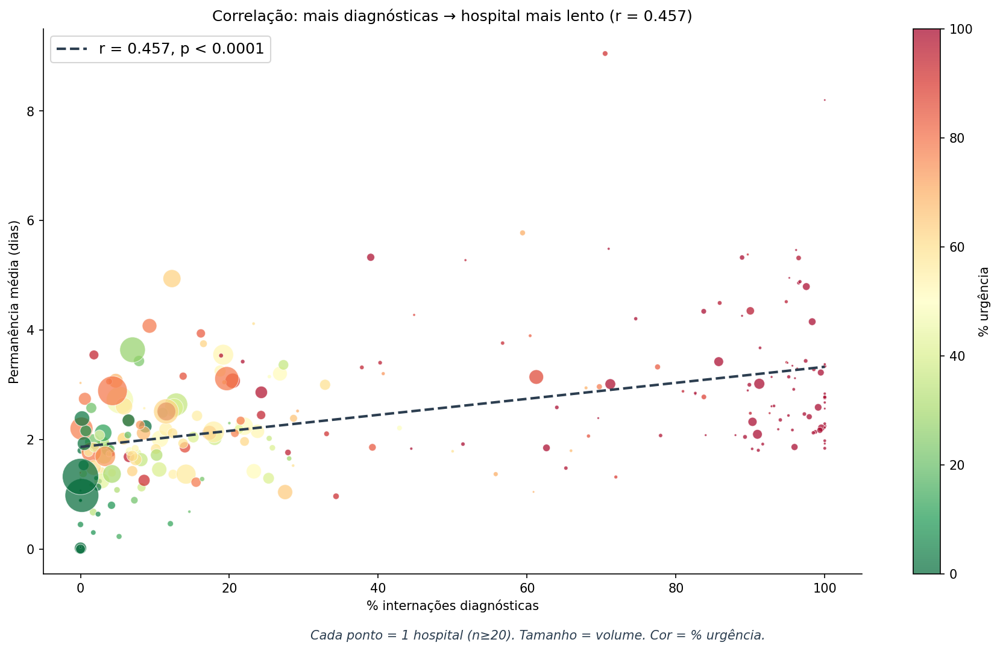

> **Fonte:** SIH AIH Reduzida, SP 2022–2025. 245 hospitais com n≥20. Cor = % urgência. Tamanho = volume. Regressão linear: r = 0,457, p < 0,0001.

**O que isso significa:** A relação não é coincidência. Hospitais com alta taxa diagnóstica são sistematicamente mais lentos — e a intensidade da correlação (r = 0,457) sugere que o modelo diagnóstico contribui causalmente para a ineficiência, não apenas a reflete.

### 3.3 O perfil completo: três tercis de hospitais

Dividindo os 245 hospitais em três grupos iguais por taxa diagnóstica:

| Métrica | Tercil baixo | Tercil médio | Tercil alto |
|---|---|---|---|
| **Permanência média** | 1,7 dias | 2,5 dias | **3,2 dias** |
| **Taxa de longa permanência** | 3,0% | 5,4% | **6,7%** |
| **Taxa de urgência** | 38% | 65% | **98%** |
| **Custo médio/paciente** | R$ 1.035 | R$ 836 | **R$ 352** |

O gradiente é monotônico: cada aumento na taxa diagnóstica corresponde a piora em todos os indicadores. O tercil alto (>20% diagnósticas) é quase inteiramente urgência (98%), com custo unitário de R$ 352 — indicando que esses hospitais quase não fazem tratamento, apenas processam exames.

### 3.4 Os 95 hospitais com >50% de diagnósticas

Focando no grupo mais extremo:

| Métrica | >50% diagnósticas (n=95) | Demais (n=150) | Diferença |
|---|---|---|---|
| **Permanência média** | 3,1 dias | 2,1 dias | **+48%** |
| **Longa permanência** | 6,7% | 3,9% | **+72%** |
| **Custo/paciente** | R$ 369 | R$ 976 | −62% |
| **% dos pacientes do sistema** | 8,8% | 91,2% | |
| **% dos leitos-dia do sistema** | 12,2% | 87,8% | **Consomem 39% mais leitos-dia per capita** |

Esses 95 hospitais atendem apenas 8,8% dos pacientes, mas consomem 12,2% dos leitos-dia — uma desproporção de 39%. Eles são um peso morto no sistema: baixa complexidade, baixa resolubilidade, alto consumo de leitos.

### 3.5 Validação independente via Machine Learning

Para garantir que essa correlação não é artefato da forma como recortamos os dados, treinamos um modelo de ML (LightGBM, ROC-AUC = 0,747) para predizer risco de longa permanência (>7 dias) usando 27 features — **sem incluir informação sobre o diferencial de preço ou o "Prêmio de Internação".**

O modelo, de forma independente, identificou:
- `proc_diagnostic` como **feature #5** em importância SHAP
- `hosp_pct_diag` como **feature #10** em importância SHAP

O algoritmo descobriu sozinho, a partir de dados brutos, que internações diagnósticas e hospitais com alta taxa diagnóstica são preditores de longa permanência. Isso é **evidência convergente**: análise descritiva, correlação estatística, e machine learning chegam à mesma conclusão.

---

## Parte 4: A rota alternativa — quantificação

### 4.1 Cenário conservador

Propomos mover para ambulatório apenas as internações diagnósticas com permanência **≤3 dias** — excluindo os 23% que ficam mais tempo (e podem ter complicações não registradas):

| | Valor |
|---|---|
| **Internações movíveis** | 13.923 (77% das diagnósticas) |
| **Internações que permanecem como internação** | 4.155 (23%) |
| **Economia financeira direta** | **R$ 4,5M/ano** |
| **Leitos-dia liberados** | 22.102/ano |
| **Leitos permanentes equivalentes** | **61 leitos** (22.102 ÷ 365) |
| **Mortalidade do grupo movível** | 0,115% (16 óbitos em 13.923) |

O cálculo da economia: 13.923 internações × R$ 393 (custo médio SIH) = R$ 5,5M. Substituindo por atendimento ambulatorial a ~R$ 70/exame (valor intermediário entre R$ 24 e custo real): 13.923 × R$ 70 = R$ 975K. Economia líquida: **R$ 4,5M/ano.**

### 4.2 Cenário máximo

Movendo todas as internações diagnósticas para ambulatório (mantendo apenas os >7 dias como internação):

| | Valor |
|---|---|
| **Economia financeira direta** | **R$ 6,7M/ano** |
| **Leitos-dia liberados** | 48.931/ano |
| **Leitos permanentes equivalentes** | **134 leitos** |

### 4.3 O que a rota alternativa significa na prática

A diferença entre os dois modelos é operacional, não clínica:

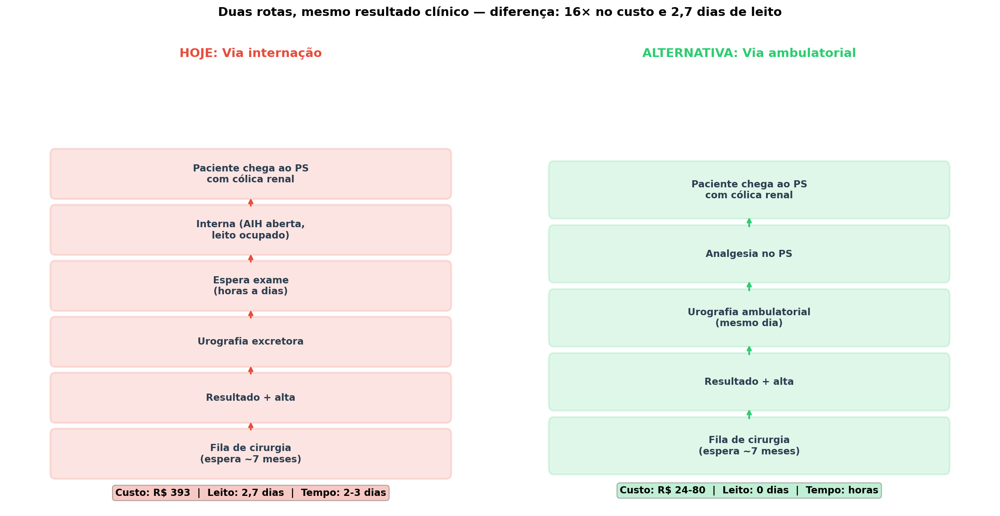

> **Fonte:** Fluxo baseado nos dados SIH (permanência média, custo médio, tempo até cirurgia). Custo ambulatorial estimado a partir da tabela SIGTAP (SIA).

**Rota atual (internação):** Paciente chega ao PS com cólica renal → médico solicita urografia → hospital abre AIH (leito atribuído) → paciente espera exame (horas a dias) → faz urografia → espera laudo → recebe alta → entra na fila de cirurgia → espera ~7 meses. **Custo: R$ 393 + 2,7 dias de leito.**

**Rota alternativa (ambulatorial):** Paciente chega ao PS com cólica renal → médico administra analgesia → solicita urografia ambulatorial → paciente faz exame no mesmo dia → recebe resultado → alta do PS com encaminhamento → entra na fila de cirurgia → espera ~7 meses. **Custo: R$ 24-80 + zero dias de leito.**

O desfecho clínico é **idêntico**: o paciente recebe o mesmo exame, o mesmo laudo, o mesmo encaminhamento. A diferença é que na rota ambulatorial ele não ocupa um leito por 3 dias — liberando esse leito para alguém que realmente precisa.

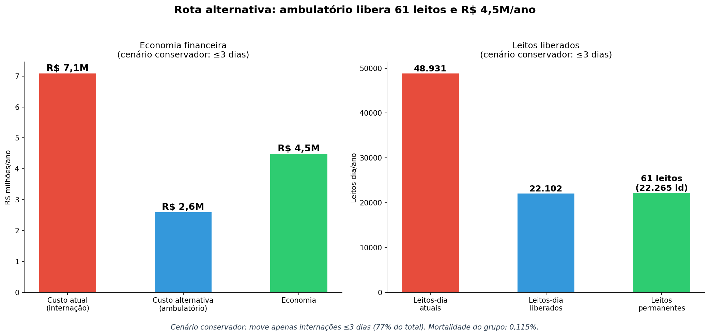

> **Fonte:** SIH AIH Reduzida, SP 2022–2025. Cenário conservador: move apenas internações diagnósticas com ≤3 dias (13.923 de 18.078, 77%). Anualizados sobre 4 anos.

---

## Mecanismo causal proposto

Juntando todas as peças, o mecanismo que gera a ineficiência é:

```
1. A tabela SIGTAP paga 16× mais por urografia via internação (R$393 vs R$24)
        ↓
2. Hospitais racionalmente preferem abrir AIH para cada exame
        ↓
3. PS recebe paciente com cólica → interna para fazer urografia
        ↓
4. Leito ocupado 2-3 dias para exame que leva horas
        ↓
5. Hospital opera com ~98% urgência, sem desenvolver fluxo eletivo
        ↓
6. Sem protocolo cirúrgico eficiente → permanência sobe em TUDO
        ↓
7. 42% dos pacientes nunca recebem cirurgia — internação foi inútil
        ↓
8. 58% que recebem cirurgia esperam 7 meses — internação não acelerou nada
        ↓
RESULTADO: O Prêmio de Internação gera desperdício de leitos,
atraso no tratamento, e ineficiência sistêmica.
```

O ponto-chave é que o incentivo financeiro não gera apenas desperdício *direto* (leitos para exames). Ele cria um **modelo operacional** — o hospital "PS + diagnóstico" — que é inferior ao modelo "eletivo + cirúrgico" em todas as dimensões mensuráveis. Corrigir o preço na tabela não apenas eliminaria as internações desnecessárias, mas potencialmente forçaria 95 hospitais a repensar como operam.

---

## Perguntas abertas

1. **Causalidade vs. correlação**: Hospitais são lentos *porque* internam para diagnóstico, ou hospitais lentos *também* internam para diagnóstico (ambos sintomas de gestão fraca)? Uma análise temporal — verificando se hospitais que *aumentaram* sua taxa diagnóstica ao longo dos anos ficaram mais lentos — fortaleceria a evidência de causalidade.

2. **Comparação com outros estados**: O diferencial de 16× é nacional (tabela SIGTAP é federal). O mesmo padrão se repete em MG, RJ, BA? Se sim, o impacto nacional poderia ser ordens de magnitude maior.

3. **Os 4,8% com >7 dias**: Quem são os 868 pacientes que ficam >7 dias para diagnóstico? Mortalidade de 0,81%, idade média 48,2 vs 43,7, mais mulheres (55% vs 48,8%). Complicações não registradas? Comorbidades não codificadas? Esse grupo merece investigação dedicada.

4. **Valor ótimo de remuneração ambulatorial**: R$ 24 é claramente insuficiente para cobrir o custo real do exame ambulatorial. Qual seria o valor justo? A faixa R$ 60-120 provavelmente cobriria custos operacionais sem recriar o incentivo perverso. Análise de custo hospitalar real seria necessária.

5. **Efeito da reforma**: Se a SIGTAP criasse um código ambulatorial adequado, em quanto tempo o comportamento hospitalar mudaria? Experiências internacionais com reform de *site-of-service differentials* sugerem adaptação em 1-3 anos.

---

## Conclusão

A evidência é forte e vem de cinco fontes independentes: **a internação diagnóstica para cálculo renal é clinicamente desnecessária em pelo menos 77% dos casos.**

- O exame pode ser feito em horas — 1.486 pacientes já saem no mesmo dia
- Nada mais acontece durante a internação — 96,4% fazem apenas o exame, sem comorbidade registrada
- 42% nunca recebem cirurgia — a internação não levou a tratamento
- Quem recebe cirurgia espera 7 meses — a internação não acelerou nada
- 5 hospitais já fazem diagnóstico rápido (LOS < 1 dia) em escala

O obstáculo não é clínico — **é financeiro**. A tabela SIGTAP paga 16× mais por internação, tornando racional para o hospital internar para um exame que cabe em uma manhã. E esse incentivo não gera apenas desperdício direto: ele está associado a hospitais que são piores em *tudo*, inclusive na cirurgia (mortalidade cirúrgica 41× maior).

Reformar esse campo único da tabela poderia:
- Liberar **61 leitos** permanentes
- Economizar **R$ 4,5M/ano** em recursos SUS
- Forçar **95 hospitais** a repensar seu modelo operacional
- E isso apenas para cálculo renal em São Paulo — o impacto nacional seria multiplicado

---

## Fontes e metodologia

| Fonte | Descrição | Volume |
|---|---|---|
| **SIH AIH Reduzida** | Internações hospitalares, São Paulo, 2015–2025 | 206.500 internações N20 |
| **SIA SP** | Produção ambulatorial, São Paulo, 2022–2023 | 136 milhões de registros |
| **Tabela SIGTAP** | Tabela nacional de procedimentos SUS | Códigos 0305020021, 0303150050, 0205020054 |
| **Rastreamento de pacientes** | Proxy: município de residência + data de nascimento + sexo | 27.309 pacientes únicos (2022+) |
| **Modelo de ML** | LightGBM, 27 features, split temporal ≤2021/≥2022 | ROC-AUC = 0,747 |

- **Notebooks de referência:** `05_diagnostic_problem.ipynb`, `04_hospital_variation.ipynb`, `08_bed_savings.ipynb`, `10_ml_prediction.ipynb`
- **Gráficos:** `experiments/kidney/outputs/plots/` (12 PNGs)
- **Análises estatísticas:** Correlação de Pearson com n≥20 por hospital. Todos os p-valores bicaudais.
- **Limitações do rastreamento:** O proxy de paciente (município + nascimento + sexo) pode gerar colisões (dois pacientes com mesmo perfil contados como um). Estimamos que isso afeta <5% dos registros e não altera as conclusões qualitativas.

---

## Relação com o estudo principal

Este documento aprofunda o achado **§3b** do `FINDINGS_PT.md`. Aqui demonstramos que o "Prêmio de Internação" é não apenas a causa dessas internações, mas um **indicador sistêmico** de ineficiência hospitalar — e que existe uma rota alternativa viável, já praticada por 5 hospitais, que elimina o desperdício sem risco clínico.
