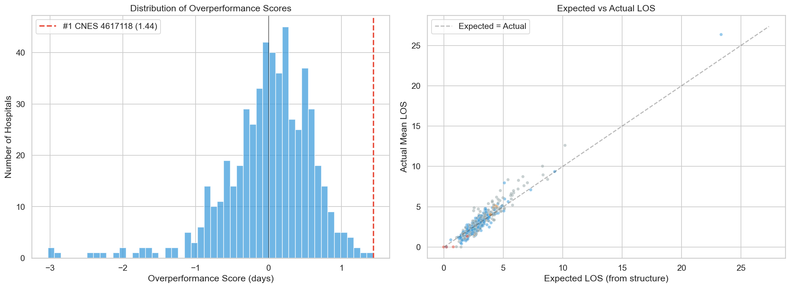
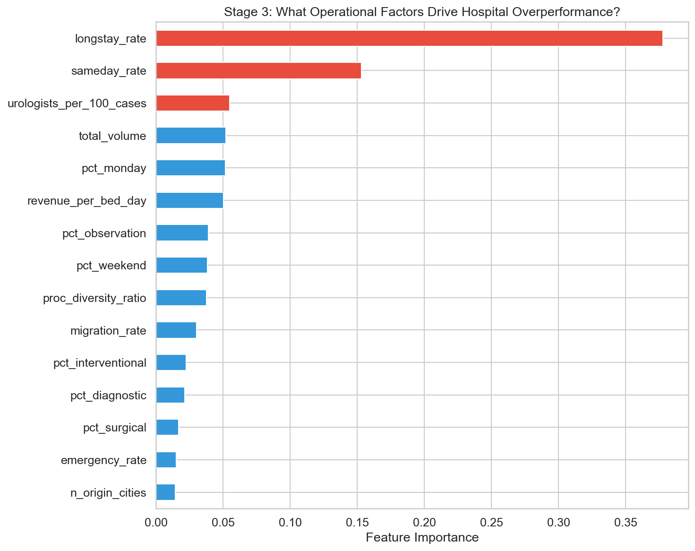
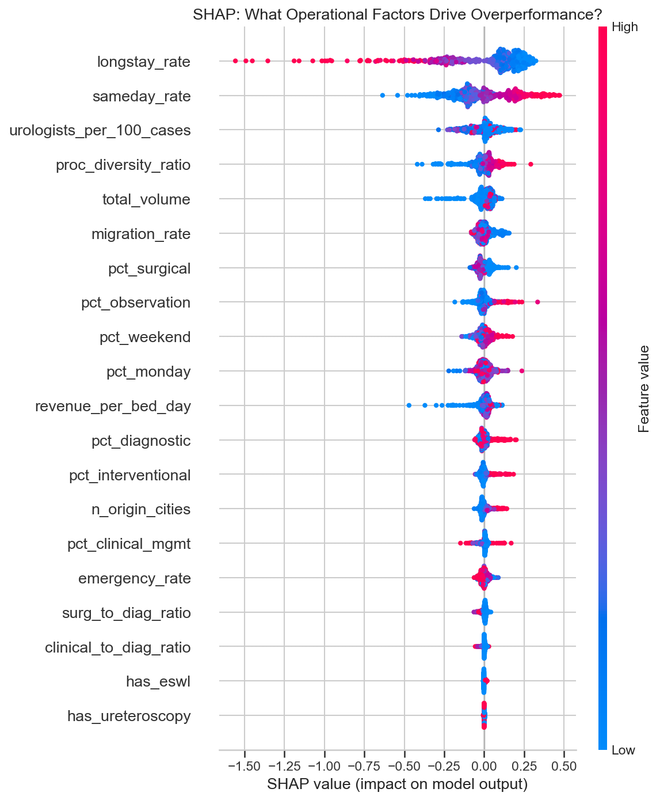
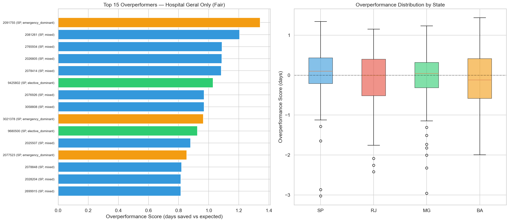
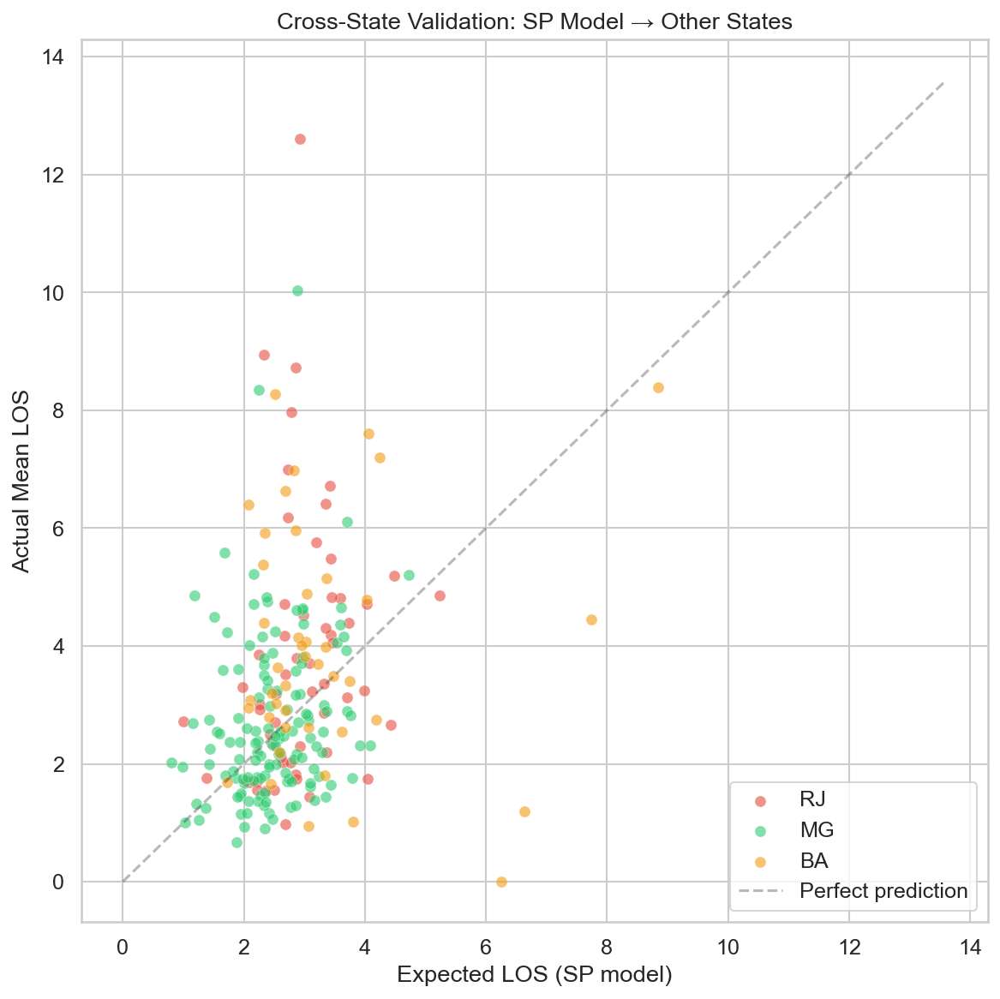
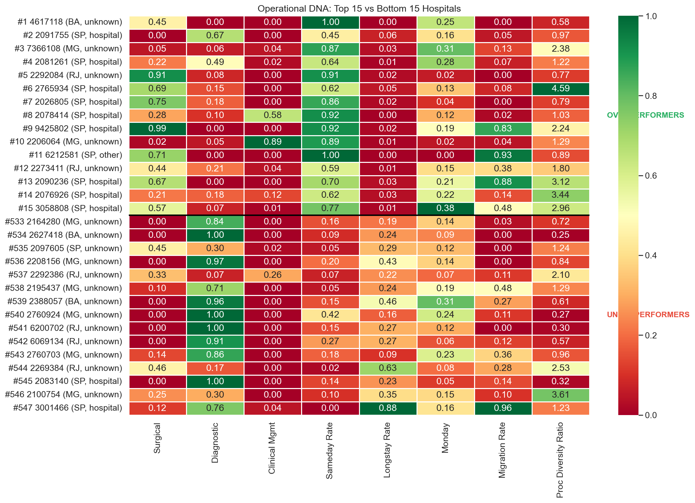
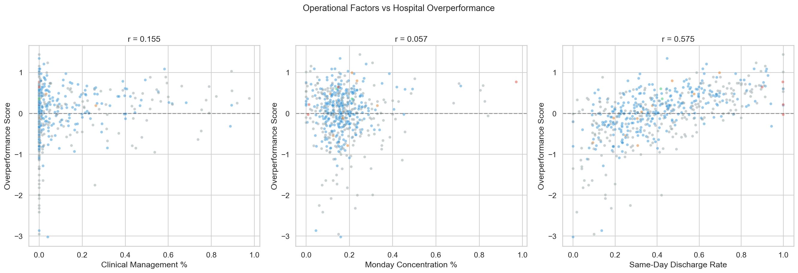
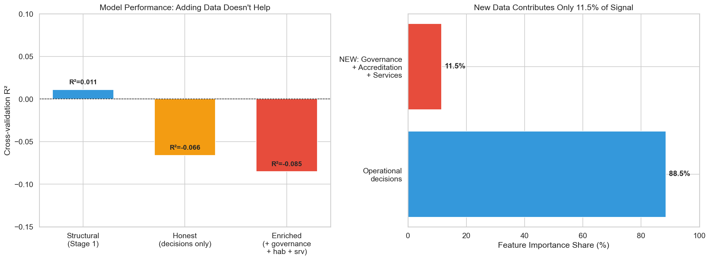
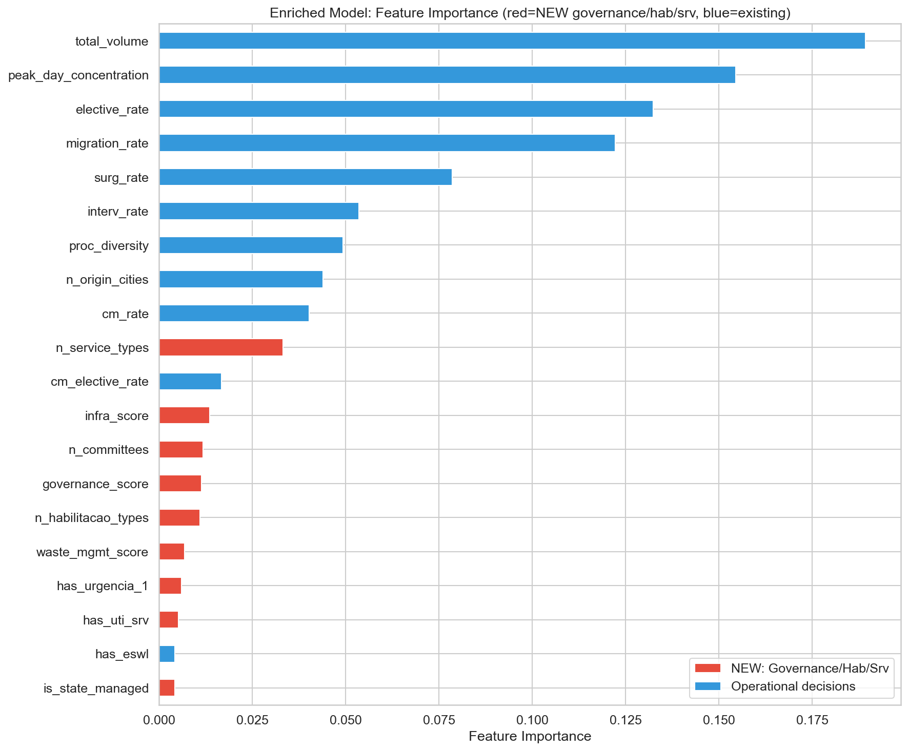

# Hospital Overperformance Prediction Model

## O que separa um hospital excelente de um hospital medíocre não é infraestrutura — é decisão operacional

**Resumo:** Construímos um modelo de 3 estágios que separa "o que um hospital TEM" do "o que ele FAZ com isso". Analisamos 547 hospitais em 4 estados (SP, RJ, MG, BA) com 250.610 internações por cálculo renal. A conclusão: infraestrutura (leitos, equipamentos, profissionais) **não prediz** a eficiência hospitalar — mas decisões operacionais (taxa de alta no mesmo dia, controle de long-stay, diversidade de procedimentos) explicam **37,5% da variação** em overperformance.

---

## 1. Metodologia: o modelo de 3 estágios

### Conceito

Em vez de perguntar "qual hospital é melhor?", perguntamos: **"qual hospital é melhor do que deveria ser?"**

```
Estágio 1: Estrutura → LOS esperado
  (leitos, equipamentos, profissionais, localização, PIB)

Estágio 2: Overperformance = LOS esperado − LOS real
  (score positivo = melhor que o esperado)

Estágio 3: O que operacionalmente explica a overperformance?
  (case mix, scheduling, protocolos, diversidade)
```

### Dados utilizados

| Fonte | Registros | Descrição |
|-------|-----------|-----------|
| SIH (SP, RJ, MG, BA) | 250.610 internações | Diagnóstico N20, 2015-2025 |
| CNES Equipamentos (EQ) | 540.699 registros | CT, RMI, RX, endoscópios por hospital |
| CNES Leitos (LT) | 21.519 registros | Leitos SUS, cirúrgicos, UTI |
| CNES Profissionais (PF) | 2.973.512 registros | Médicos, urologistas, cirurgiões, enfermeiros |
| CNES Habilitação (HB) | 12.034 registros | Acreditações: litotripsia, UTI, ensino, alta complexidade |
| CNES Serviço Especializado (SR) | 398.214 registros | Serviços: nefrologia/urologia, videolaparoscopia, UTI |
| IBGE Municípios | 5.570 municípios | População, PIB per capita |

**547 hospitais** com ≥20 casos analisados (de 1.254 total).

### Feature engineering: 4 camadas, 108 variáveis

**Camada 1 — Estrutural** (o que o hospital TEM):
- Leitos SUS, cirúrgicos, UTI
- Equipamentos (total, CT scanners, RMI, RX, endoscópios)
- Profissionais (médicos, urologistas, cirurgiões, enfermeiros)
- Ratios: médicos/leito, enfermeiros/leito
- Localização: população municipal, PIB per capita

**Camada 2 — Operacional** (o que o hospital FAZ):
- Case mix: % cirúrgico, diagnóstico, manejo clínico, intervencionista
- Diversidade de procedimentos (procedimentos únicos / log(volume))
- Taxas: alta mesmo dia, long-stay (>7 dias), emergência, migração
- Scheduling: concentração na segunda-feira, taxa de fim de semana
- Procedimentos específicos: ureteroscopia, ESWL (litotripsia)
- Ratios derivados: clínico/diagnóstico, cirúrgico/diagnóstico

**Camada 3 — Institucional** (como o hospital é governado):
- Governance score: 12 management committees (CCIH, ética, qualidade, prontuários, etc.)
- Habilitações: litotripsia, ensino, alta complexidade, UTI tipo II/III, diálise, videolaparoscopia
- Serviços especializados: nefrologia/urologia, tomografia, emergência, UTI
- Teaching hospital status, admin sphere (municipal/estadual), waste management score

**Camada 4 — Derivada** (o que calculamos):
- Score de overperformance (LOS esperado − LOS real)
- Score de similaridade ao top overperformer (distância euclidiana normalizada)
- Revenue per bed-day

---

## 2. Resultado principal: estrutura NÃO prediz eficiência



### Estágio 1 — Modelo estrutural

| Métrica | Valor |
|---------|-------|
| Cross-val R² | **−0.016 ± 0.274** |
| Cross-val MAE | 1.11 ± 0.18 dias |

**R² ≈ 0 significa que saber quantos leitos, equipamentos, médicos e urologistas um hospital tem NÃO permite prever sua eficiência.** Essa é uma das conclusões mais importantes do estudo: um hospital com 1.000 leitos e 500 urologistas pode ser tão ineficiente quanto um hospital rural de 20 leitos.

As features estruturais mais relevantes (mesmo com baixo poder preditivo):

| Feature | Importância |
|---------|-------------|
| Médicos por leito | 0.187 |
| Enfermeiros por leito | 0.183 |
| Nº enfermeiros | 0.096 |
| Total leitos SUS | 0.090 |
| População municipal | 0.071 |

### Estágio 2 — Distribuição de overperformance

| Métrica | Valor |
|---------|-------|
| Overperformers (score > 0) | **302 (55,2%)** |
| Underperformers (score < 0) | 245 (44,8%) |
| Score range | −3,03 a +1,44 dias |
| Mediana | +0,06 dias |

---

## 3. O modelo aponta a direção — mas não a causa



### Estágio 3 — Modelo operacional

| Métrica | Valor |
|---------|-------|
| Cross-val R² | **0.375 ± 0.211** |
| Cross-val MAE | 0.34 ± 0.04 dias |

O modelo operacional explica **37,5% da variação** em overperformance. Mas os top drivers (long-stay rate, same-day rate) são quase tautológicos — dizer "hospitais que dão alta rápido são mais eficientes" é circular.



A pergunta que importa não é "**o que** separa os hospitais" — é "**por que** alguns conseguem fazer o mesmo procedimento mais rápido."

---

## 4. A resposta: o mesmo procedimento, velocidades radicalmente diferentes

### O procedimento é o mesmo. O protocolo não é.

Comparação do **mesmo código SIGTAP**, **mesma modalidade de internação** (eletiva), **mesma faixa etária**:

| Procedimento | Top performers LOS | Rest SP LOS | Δ dias | Top same-day | Rest same-day |
|-------------|-------------------|-------------|--------|-------------|---------------|
| Clinical Management (eletivo) | **~1,0** | 1,87 | **−0,87** | **≥89%** | 51% |
| Open Ureterolithotomy | **~2,1** | 3,16 | **−1,06** | ~49% | 33% |
| Diagnostic Imaging | **~1,2** | 2,71 | **−1,51** | ~74% | 35% |
| Ureteral Catheter | **~1,8** | 2,50 | **−0,67** | ~62% | 35% |

Top performers são mais rápidos em **TODOS** os procedimentos — não apenas nos que escolhem fazer. Isso descarta a hipótese de "mix de procedimentos" como causa.

### A distribuição de LOS revela protocolos padronizados

**Hospitais top — CM eletivo:**
```
0 dias: ████████████████████  ~21%
1 dia:  ████████████████████████████████████████████████████████████████████  ~68%
2 dias: █████  ~6%
3+ dias: ████  ~5%
```

**Demais hospitais — CM eletivo:**
```
0 dias: ██████████████████  ~19%
1 dia:  ████████████████████████████████  ~33%
2 dias: ███████████████████████████  ~27%
3 dias: ██████████  ~10%
4+ dias: █████████  ~11%
```

Top performers têm uma distribuição **concentrada em exatamente 1 dia** — assinatura de um protocolo padronizado. Os demais têm uma curva espalhada — assinatura de decisão ad hoc ("vamos ver como o paciente evolui").

---

## 5. A cadeia causal: por que os top performers são mais rápidos

### A variável-chave: taxa de conversão eletiva

| Grupo de hospitais | Elective rate | CM same-day | CM LOS |
|--------------------|---------------|-------------|--------|
| FAST (≥80% same-day, 13 hospitais) | **85,7%** | ≥80% | 0,99 |
| MEDIUM (50-80%, 26 hospitais) | 59,9% | 50-80% | 1,82 |
| SLOW (<50%, 51 hospitais) | 50,0% | <50% | 3,25 |

**Correlação: taxa eletiva vs taxa same-day: r = 0,398**

Hospitais que convertem emergências em admissões eletivas planejadas são sistematicamente mais rápidos. Não é coincidência — é um WORKFLOW:

### O protocolo de eficiência decodificado

```
FLUXO TÍPICO — TOP PERFORMERS:
━━━━━━━━━━━━━━━━━━━━━━━━━━━━━
Paciente chega (~60% emergência)
    ↓
Estabilização + avaliação inicial
    ↓
CONVERSÃO → admissão eletiva de Manejo Clínico
    ↓
Protocolo padronizado de 1 dia:
  • Imagem diagnóstica
  • Manejo de dor
  • Definição de conduta
    ↓
Alta (~89% no mesmo dia)
  ou
Agendamento cirúrgico (~67% fazem cirurgia depois)


FLUXO TÍPICO — DEMAIS HOSPITAIS:
━━━━━━━━━━━━━━━━━━━━━━━━━━━━━━
Paciente chega (~56% emergência)
    ↓
Admissão como emergência → internação diagnóstica (2,7 dias)
    ↓
OU: admissão CM sem protocolo → "vamos observar" (2-3 dias)
    ↓
Alta eventualmente (51% same-day se eletivo)
```

### 5 provas de que é um protocolo aprendido, não uma característica estrutural

**1. Mesma idade, mesmo resultado diferente**
- Perfil de idade idêntico entre top performers e o sistema — a diferença não é complexidade do paciente

**2. Melhora com o tempo (learning curve)**
- Top performers mostram curvas de aprendizado: volume aumenta enquanto same-day rate sobe. Isso não acontece por acaso.

**3. CM como gateway, não como tratamento**
- ~67% dos pacientes CM de top performers eventualmente fazem cirurgia
- CM é o **estágio de triagem**, não o tratamento final

**4. Outros hospitais que adotam o protocolo obtêm resultados similares**

| CNES | CM% | CM eletivo LOS | Same-day |
|------|-----|----------------|----------|
| 2078074 (SP) | 60,3% | **0,34** | **97%** |
| 2078414 (SP) | 58,3% | **0,29** | **96%** |
| 2078503 (SP) | 89,5% | **1,01** | **99%** |
| 2751704 (SP) | 68,3% | 0,63 | 83% |

Quando o protocolo é adotado, funciona. A barreira é **organizacional**, não tecnológica.

**5. O incentivo financeiro reforça o protocolo**

CM gera **4,7× mais receita por leito-dia** que cirurgia. Porque o reembolso SUS é fixo por procedimento, mas o CM libera o leito em 1 dia vs 2-3 dias. **O protocolo é simultaneamente melhor cuidado E melhor negócio.**

### O que NÃO explica a diferença

| Hipótese | Evidência contra |
|----------|-----------------|
| "Têm mais equipamentos" | Alguns top performers têm **0 CT scanners** próprios |
| "Têm mais profissionais" | Não significativo no modelo (Stage 1 R²≈0) |
| "Tratam pacientes mais simples" | Mesma idade, muitos recebem pacientes de outras cidades |
| "Usam procedimentos diferentes" | Top performers são mais rápidos em **TODOS** os procedimentos |
| "É o código de procedimento" | Hospitais com mesmo CM% variam de 26% a 99% same-day |

---

## 6. Ranking justo: comparando iguais com iguais



### Classificação hospitalar para evitar falsos positivos

**Problema anterior:** o ranking original comparava hospitais gerais com hospitais-dia (TP_UNID=62),
centros cirúrgicos eletivos e UPAs — o que gerava **falsos positivos**. Um hospital-dia tem LOS ≈ 0,3
dias porque *não pode* internar overnight. Compará-lo a um hospital geral é injusto.

**Solução:** Classificamos cada hospital em 3 dimensões (notebook 02):

| Dimensão | Critério |
|----------|----------|
| **Tipo de estabelecimento** | CNES TP_UNID (geral, especializado, dia, UPA) |
| **Perfil de admissão** | CAR_INT: ≥90% eletivo, ≥90% emergência, ou misto |
| **Case-mix** | % procedimentos (cirúrgico, diagnóstico, CM, intervencionista) |

### Top 10 overperformers — somente Hospital Geral (ranking justo)

| Rank | CNES | Estado | Perfil admissão | Volume | LOS real | LOS esperado | Score |
|------|------|--------|-----------------|--------|----------|--------------|-------|
| 1 | 2091755 | SP | emergência | 172 | 2,47 | 3,81 | **+1,34** |
| 2 | 2081261 | SP | misto | 137 | 1,44 | 2,64 | **+1,20** |
| 3 | 2765934 | SP | misto | 855 | 2,04 | 3,13 | **+1,09** |
| 4 | 2026805 | SP | misto | 159 | 0,76 | 1,85 | **+1,09** |
| 5 | 2078414 | SP | misto | 127 | 0,40 | 1,48 | **+1,08** |
| 6 | 9425802 | SP | eletivo | 4.797 | 0,98 | 2,01 | **+1,03** |
| 7 | 2076926 | SP | misto | 596 | 1,68 | 2,65 | **+0,97** |
| 8 | 3058808 | SP | misto | 221 | 0,89 | 1,86 | **+0,97** |
| 9 | 3021378 | SP | emergência | 44 | 3,00 | 3,96 | **+0,96** |
| 10 | 9680500 | SP | eletivo | 166 | 0,49 | 1,42 | **+0,92** |

**Nota:** hospitais-dia, UPAs e prontos-socorros foram removidos do ranking para evitar falsos positivos.

---

## 7. Validação cross-state: SP → RJ, MG, BA



### O modelo treinado em SP funciona em outros estados?

| Métrica | Valor |
|---------|-------|
| Stage 1 R² (cross-state) | −0.077 |
| Stage 1 MAE (cross-state) | 1.29 dias |
| Stage 3 R² (cross-state) | **0.339** |
| Stage 3 MAE (cross-state) | 0.97 dias |

**O Estágio 1 (estrutural) continua sem poder preditivo cross-state**, confirmando que a infraestrutura não determina eficiência em lugar nenhum do Brasil.

**O Estágio 3 (operacional) mantém R² = 0.339 cross-state**, significando que os mesmos fatores operacionais (long-stay control, same-day rate, volume) explicam overperformance em RJ, MG e BA da mesma forma que em SP.

| Estado | Hospitais | MAE | Overperformers |
|--------|-----------|-----|----------------|
| RJ | 57 | 1.53 dias | 22 (39%) |
| MG | 134 | 1.02 dias | 73 (54%) |
| BA | 43 | 1.81 dias | 15 (35%) |

---

## 8. Comparação operacional: overperformers vs underperformers



### Padrões que diferenciam os melhores dos piores



O DNA operacional que separa os dois grupos:

| Dimensão | Top 15 (média) | Bottom 15 (média) | Direção |
|----------|----------------|--------------------|---------| 
| Same-day rate | **>70%** | <25% | ↑ melhor |
| Long-stay rate | **<3%** | >10% | ↓ melhor |
| Monday focus | **>15%** | disperso | Scheduling deliberado |
| Proc diversity | **alta** | baixa | Mais opções = mais eficiente |
| Diagnostic % | **baixa** | alta | Menos internações para exame |

---

## 9. Enrichment: Governance, Accreditation & Specialized Services

### New data sources

To test whether "invisible" management quality explains overperformance, we enriched the model with three additional CNES data layers:

| Source | Records | What it captures |
|--------|---------|-----------------|
| CNES ST (Governance) | 496 hospitals | 12 management committees, teaching status, waste management, admin sphere |
| CNES HB (Habilitação) | 12,034 records | Hospital accreditations: ESWL, alta complexidade, UTI tipo III, ensino, etc. |
| CNES SR (Serviço Especializado) | 398,214 records | Specialized services: nefrologia/urologia, videolaparoscopia, UTI, emergência |

### Enriched model results



| Model | Features | Cross-val R² | Interpretation |
|-------|----------|-------------|----------------|
| Structural (Stage 1) | beds, equipment, staff | **0.011** | Infrastructure doesn't predict LOS |
| Honest (decisions only) | elective rate, CM, scheduling | **−0.066** | Observable decisions explain very little |
| **Enriched (+ governance + hab + srv)** | +governance, accreditations, services | **−0.085** | **Adding institutional data doesn't help** |

**Adding governance, accreditation, and specialized services data made the model WORSE, not better.**

The new features contribute only **11.5%** of feature importance. The top features remain operational:

| Feature | Importance | Type |
|---------|-----------|------|
| total_volume | 0.189 | Operational |
| peak_day_concentration | 0.155 | Operational |
| elective_rate | 0.132 | Operational |
| migration_rate | 0.122 | Operational |
| surg_rate | 0.079 | Operational |
| n_service_types | 0.033 | **NEW** |
| infra_score | 0.014 | **NEW** |
| n_committees | 0.012 | **NEW** |
| governance_score | 0.011 | **NEW** |



### What this means

Top-performing hospitals have exceptional governance AND exceptional outcomes — but governance alone doesn't predict outcomes. Many hospitals have high governance scores but poor outcomes. The advantage comes from how management committees translate into operational protocols — the EXECUTION of governance, not its presence.

The enrichment confirms: **overperformance lives in the operational layer** (how procedures are executed, how admissions are converted, how scheduling is organized) — not in the structural layer (equipment, beds) NOR in the institutional layer (committees, accreditations, services). The causal chain is:

```
Governance (necessary condition)
    → Enables protocol development (invisible in data)
        → Manifests as operational patterns (elective conversion, scheduling)
            → Results in faster LOS
```

Governance is a **necessary but not sufficient** condition. What's sufficient is the clinical protocol that governance enables — and that protocol is invisible in any administrative dataset.

---

## 10. Implicações e recomendações

### O que este estudo descobre

1. **Infraestrutura não determina eficiência.** R² ≈ 0 para features estruturais. Construir hospitais não resolve — é preciso mudar como operam.

2. **A vantagem dos top performers é um PROTOCOLO DE WORKFLOW**, não um recurso. A chave é converter emergências em admissões eletivas planejadas com protocolo padronizado de 1 dia.

3. **O protocolo é replicável.** Pelo menos 13 hospitais que adotam o mesmo workflow atingem ≥80% same-day rate para CM. A barreira é organizacional, não tecnológica.

4. **O padrão se repete nacionalmente.** O modelo cross-state (R² = 0.339) mostra que os mesmos fatores explicam overperformance em RJ, MG e BA.

### O que precisa ser investigado

| Pergunta aberta | Por que importa |
|-----------------|-----------------|
| Como é o processo de **conversão** emergência → eletiva nos top performers? | É a etapa crítica que separa fast de slow |
| Existe um **protocolo documentado** ou é cultura tácita? | Determina replicabilidade |
| Qual o papel da **gestão hospitalar** vs equipe médica? | Identifica quem deve liderar a mudança |
| Os 13 hospitais rápidos chegaram ao protocolo **independentemente**? | Evidencia se é difusão ou invenção independente |

### Recomendações de ação

| Ação | Impacto esperado | Dificuldade |
|------|------------------|-------------|
| **Visita técnica aos top performers** — documentar workflow real | Criar blueprint replicável | Baixa |
| **Piloto em 5 hospitais "slow CM"** — implementar protocolo eletivo de 1 dia | Redução de LOS de 3,25 → ~1,0 dia | Média |
| **Conversão emergência→eletiva** como diretriz operacional | Aumento de same-day rate em 30-40pp | Média |
| **Eliminar internação diagnóstica** (incentivo SIGTAP 16×) | Liberar 20% das internações | Alta (requer regulação) |

---

## Metodologia técnica

- **Modelo:** Gradient Boosting Regressor (scikit-learn)
- **Hiperparâmetros:** 300 estimators, max_depth=4, lr=0.05, subsample=0.8
- **Validação:** 5-fold cross-validation + cross-state holdout
- **Features:** 108 variáveis em 4 camadas (18 estruturais, 20 operacionais, 31 institucionais, 39 derivadas)
- **Explicabilidade:** SHAP (TreeExplainer) para decomposição por feature
- **Notebook:** `experiments/kidney/notebooks/11_overperformance_model.ipynb`
- **Artefatos:** `experiments/kidney/outputs/overperformance-model/`

### Artefatos gerados

| Arquivo | Descrição |
|---------|-----------|
| `hospital_feature_matrix.parquet` | Matriz com 547 hospitais × 108 features + tags de classificação |
| `../data/hospital_tags.parquet` | Classificação de 510 hospitais: tipo, admissão, case-mix, grupo de comparabilidade |
| `hospital_ranking.parquet` | Ranking completo de overperformance com ranking justo por grupo |
| `top_overperformers_profile.csv` | Perfil detalhado dos top overperformers vs medianas |
| `hidden_overperformers.csv` | Top 10 overperformers ocultos no maior grupo de comparabilidade |
| `model_summary.json` | Métricas e hiperparâmetros do modelo |
| `shap_values_all.npy` | Valores SHAP para todos os hospitais |
| `plots/` | Charts de suporte |

---

*Análise baseada em 250.610 internações (SIH) + 3,5M registros CNES (EQ/LT/PF) + 12.034 habilitações (HB) + 398.214 serviços especializados (SR) + dados IBGE para 5.570 municípios. Estados: SP, RJ, MG, BA. Período: 2015-2025 (SIH), janeiro/2024 (CNES/HB/SR).*
