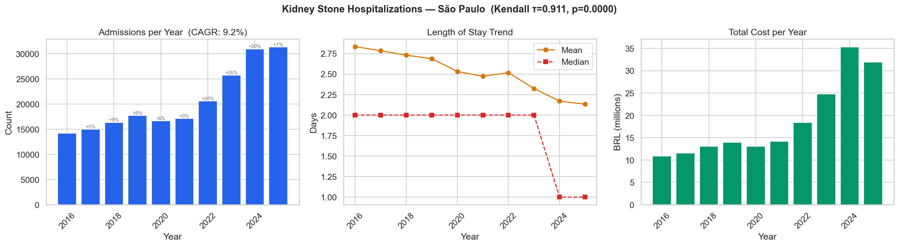
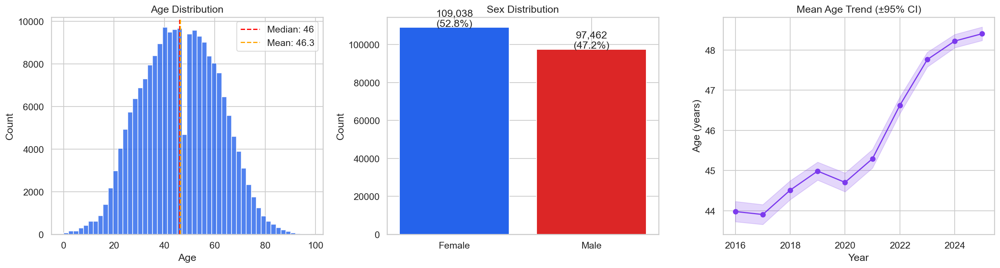
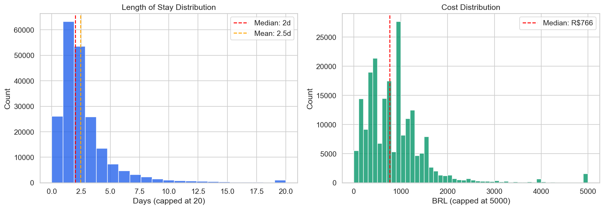
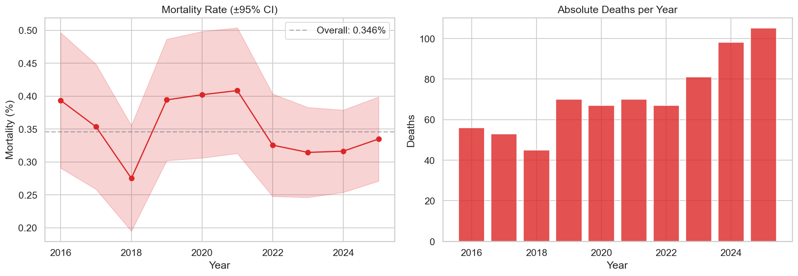
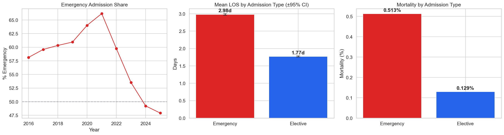
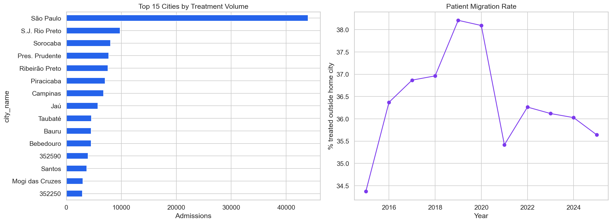
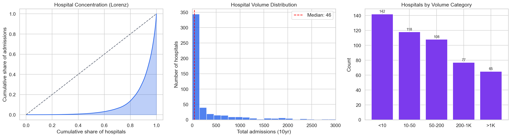
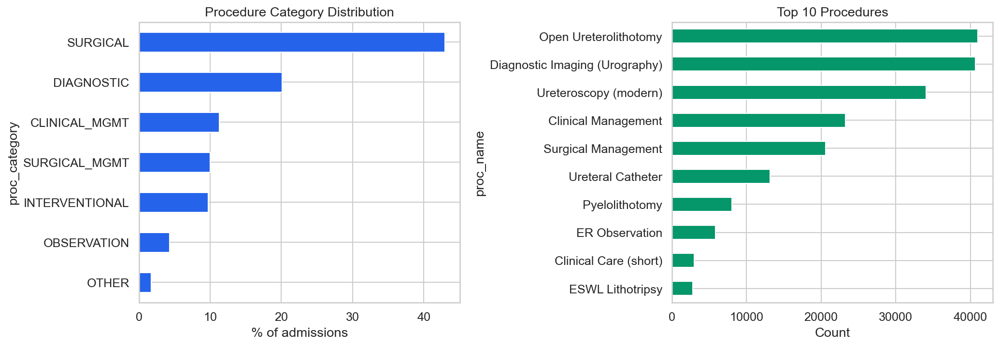
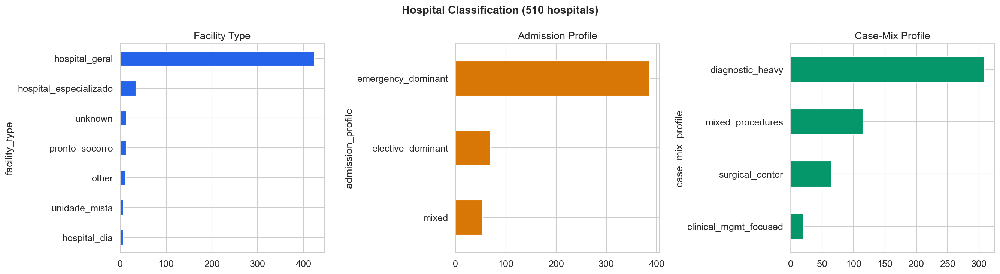

# Relatório 02 — Visão Geral

> **Pergunta de Pesquisa (RQ0):** Como se apresenta o cenário de atendimento hospitalar a cálculos renais no sistema público de saúde de São Paulo?

**Notebook:** `notebooks/02_general_overview.ipynb`
**Tipo:** Análise descritiva exploratória — sem hipóteses pré-registradas
**Escopo:** 206.500 internações · 510 hospitais · Estado de São Paulo · 2016–2025

---

## Método

Todas as internações faturadas pelo SUS com diagnóstico principal CID-10 N20 (litíase renal e ureteral) foram extraídas da base SIH AIH Reduzida para São Paulo. Os dados abrangem 120 arquivos mensais em formato parquet (jan/2016 – dez/2025). Características das unidades de saúde foram vinculadas a partir do CNES (foto mais recente). Os hospitais foram classificados em 31 grupos de comparabilidade com base no tipo de unidade, perfil de internação e perfil de mix de procedimentos.

Significância de tendência: correlação de postos de Kendall (tau). ICs de mortalidade: aproximação normal à distribuição binomial. Diferenças entre grupos: teste de Mann-Whitney U.

---

## Principais Achados

### 1. Crescimento Explosivo do Volume — CAGR 9,2%

As internações mais que dobraram, de 14.234 (2016) para 31.362 (2025). A aceleração pós-2022 é extraordinária: crescimento anual de 20–25% entre 2022–2024, adicionando ~10.000 internações em dois anos, antes de uma estabilização em 2025.

| Ano | Internações | Crescimento YoY |
|---|---|---|
| 2016 | 14.234 | linha de base |
| 2017 | 15.002 | +5,4% |
| 2018 | 16.362 | +9,1% |
| 2019 | 17.757 | +8,5% |
| 2020 | 16.664 | −6,2% (COVID) |
| 2021 | 17.144 | +2,9% |
| 2022 | 20.588 | +20,1% |
| 2023 | 25.762 | +25,1% |
| 2024 | 30.985 | +20,3% |
| 2025 | 31.362 | +1,2%* |

*\*Dezembro de 2025 apresenta 1.984 internações vs ~2.500/mês de média — possível atraso na publicação do DATASUS.*

- Kendall τ = 0,911, p < 0,0001 — tendência monotônica ascendente quase perfeita
- Média pré-COVID: 15.839/ano → Média pós-COVID: 25.168/ano (+59%)
- A população de São Paulo cresceu apenas ~0,5%/ano no período

### 2. Envelhecimento da População, Maioria Feminina

- **Idade mediana:** 46 anos (IQR: 35–57)
- **Sexo:** 52,8% feminino, 47,2% masculino — relevante porque cálculos renais são clinicamente mais comuns em homens na maioria dos estudos epidemiológicos
- **Tendência de envelhecimento:** A idade média subiu de 43,9 (2016) para 48,2 (2024), Kendall τ = 0,911, p < 0,0001

### 3. Queda Expressiva no Tempo de Permanência (−25%)

O LOS médio caiu de 2,83 dias (2016) para 2,13 dias (2025). A distribuição é fortemente assimétrica à direita (assimetria: 6,63; curtose: 91,78):

| LOS | Pacientes | Participação |
|---|---|---|
| 0 dias | 26.023 | 12,6% |
| 1 dia | 63.282 | 30,6% |
| 2–7 dias | 107.865 | 52,2% |
| >7 dias (longa permanência) | 9.330 | **4,5%** |

A cauda de 4,5% de longa permanência consome 23,5% de todos os leitos-dia e 50% de todos os óbitos.

### 4. Mortalidade Estável Apesar do Crescimento de Volume

Mortalidade geral: **0,346%** (IC 95%: 0,320%–0,371%), 714 óbitos no total.

Sem tendência estatisticamente significativa (Kendall τ = −0,111, p = 0,73). O sistema absorveu um aumento de 120% no volume sem deteriorar a segurança. Porém, os óbitos absolutos subiram de 56 (2016) para 105 (2025).

### 5. Transição Estrutural de Urgência para Eletiva

As internações de urgência caíram de 58,1% (2016) para 49,2% (2024). Pacientes de urgência apresentam desfechos materialmente piores:

| Métrica | Urgência | Eletiva | Teste Estatístico |
|---|---|---|---|
| LOS médio | 2,98d | 1,77d | Mann-Whitney U, p < 1e-100 |
| Mortalidade | 0,513% | 0,129% | 4x maior |

### 6. Concentração Geográfica e Hospitalar

O tratamento está concentrado em cidades-polo — as 10 maiores cidades atendem 51,2% de todos os casos. 36,5% dos pacientes são tratados fora de seu município de residência.

A concentração hospitalar segue uma lei de potência (Gini: 0,801):
- 50 maiores hospitais: 65,7% das internações
- 133 hospitais (26,1%): menos de 10 casos em 10 anos

### 7. Mix de Procedimentos — 20% de Internações Diagnósticas

Uma em cada cinco internações (20,1%) é para exames de imagem que, em muitos sistemas de saúde, seriam realizados ambulatorialmente. Procedimentos cirúrgicos representam 42,9%.

### 8. Classificação Hospitalar

94,4% das internações ocorrem em hospitais gerais. O maior grupo por contagem (244 hospitais) é `predominância de urgência + alta taxa diagnóstica` — o grupo com maior probabilidade de conter internações desnecessárias.

---

## Discussão

Cinco padrões demandam investigação nos notebooks subsequentes:

1. **A explosão de volume** (CAGR 9,2%) não pode ser explicada apenas pelo crescimento populacional. É adoção de nova tecnologia ou incentivos de faturamento? A estabilização de 2025 (+1,2%) também é inexplicada. → RQ1
2. **Queda simultânea do LOS + aumento do volume** — o sistema é mais rápido por caso, mas trata muito mais. Efeito líquido na demanda de leitos? → RQ4
3. **20% de internações diagnósticas** — fonte potencial de ~20.000 leitos-dia desnecessários/ano → RQ3, RQ6
4. **Transição urgência→eletiva** — isso está causando a queda do LOS, ou ambos são causados pela adoção da ureteroscopia? → RQ6
5. **244 hospitais com predominância de urgência e alta taxa diagnóstica** — provavelmente internando para exames que não requerem internação → RQ6

## Ameaças à Validade

- **Dados parciais de 2015** (640 registros) excluídos das tendências, mas permanecem nos datasets derivados
- **Queda em dezembro de 2025** — dez/2025 mostra 1.984 internações vs ~2.500/mês de média; pode refletir atraso na publicação do DATASUS e não um declínio real. O crescimento de +1,2% YoY de 2025 pode subestimar o volume real
- **Apenas SUS** — exclui internações de planos de saúde privados
- **Sem vinculação de pacientes** — não é possível identificar reinternações ou episódios do mesmo paciente
- **Junção com foto mais recente do CNES** — características da unidade obtidas da foto mais recente, não contemporânea a cada internação
- **Deriva na codificação de subdiagnósticos** — sem alterações documentadas do CID-10 para N20, mas o comportamento de codificação pode ter mudado

---

## Glossário

| Sigla | Significado |
|---|---|
| **LOS** | Length of Stay — tempo de permanência hospitalar (em dias) |
| **CAGR** | Compound Annual Growth Rate — taxa de crescimento anual composta |
| **SUS** | Sistema Único de Saúde — sistema público de saúde brasileiro |
| **SIH** | Sistema de Informações Hospitalares — base de dados de internações hospitalares do SUS |
| **CNES** | Cadastro Nacional de Estabelecimentos de Saúde — registro de unidades de saúde |
| **SIA** | Sistema de Informações Ambulatoriais — base de dados de produção ambulatorial do SUS |
| **AIH** | Autorização de Internação Hospitalar — formulário de autorização de cada internação |
| **CID-10** | Classificação Internacional de Doenças, 10ª revisão (N20 = litíase renal/ureteral) |
| **SIGTAP** | Sistema de Gerenciamento da Tabela de Procedimentos — tabela oficial de procedimentos e valores do SUS |
| **DATASUS** | Departamento de Informática do SUS — órgão responsável pela publicação dos dados |
| **IC** | Intervalo de Confiança (95% neste relatório) |
| **YoY** | Year-over-Year — comparação ano contra ano |
| **Kendall τ** | Teste estatístico de correlação de postos para tendência monotônica |
| **Mann-Whitney U** | Teste não-paramétrico para comparação de distribuições entre dois grupos |
| **Gini** | Coeficiente de Gini — medida de desigualdade/concentração (0 = uniforme, 1 = totalmente concentrado) |
| **RQ** | Research Question — pergunta de pesquisa |
| **ESWL** | Extracorporeal Shock Wave Lithotripsy — litotripsia extracorpórea por ondas de choque |
| **UTI** | Unidade de Terapia Intensiva |
| **IQR** | Intervalo Interquartil — faixa entre o percentil 25 e 75 |
| **BRL / R$** | Real brasileiro — moeda corrente |
