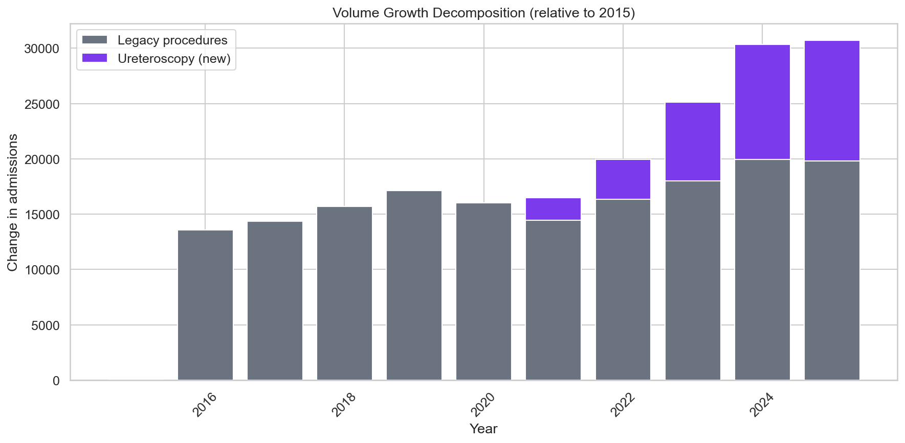
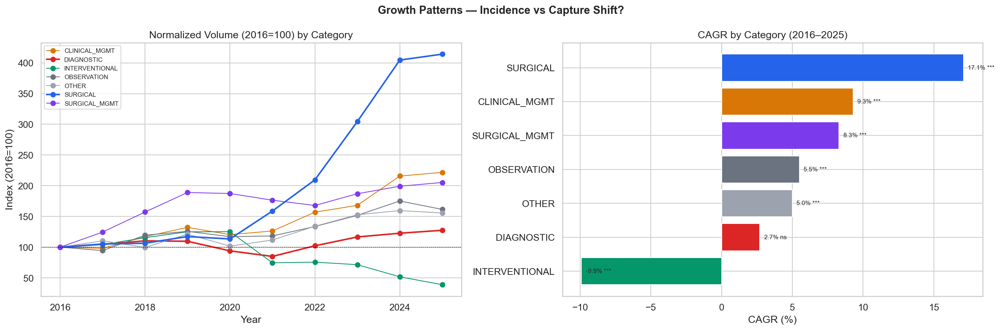
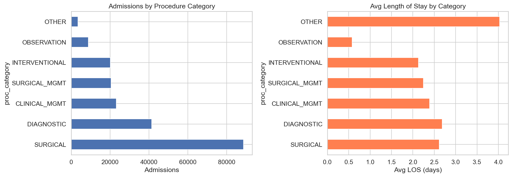
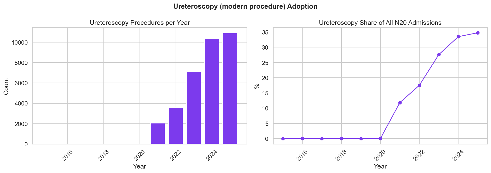
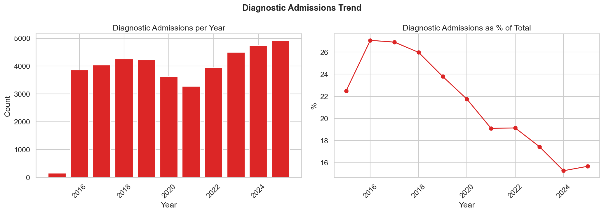

# Relatório 03 — Drivers de Volume (RQ1)

> **Pergunta de Pesquisa:** O que está impulsionando o volume de hospitalizações?

**Notebook:** `notebooks/03_volume_drivers.ipynb`
**Tipo:** Análise de decomposição com testes de tendência
**Escopo:** 206.500 internações · 193 códigos de procedimento · 7 categorias · 2016–2025

---

## Método

O crescimento de volume foi decomposto ao longo de três eixos:
1. **Categoria de procedimento** — CAGR e teste de tendência Kendall tau por categoria (2016–2025)
2. **Novos vs procedimentos legados** — atribuição do crescimento absoluto à ureteroscopia (introduzida pela Portaria SAES/MS nº 1.127 em dezembro de 2020) vs procedimentos pré-existentes
3. **Comparação SIA** — verificação se procedimentos realizados em internação possuem alternativas ambulatoriais com menor remuneração (prêmio de internação)

---

## Principais Achados

### 1. Ureteroscopia Representa 63,7% de Todo o Crescimento

O volume total cresceu de 14.234 (2016) para 31.362 (2025) — CAGR de **9,2%** (Kendall τ = 0,911, p < 0,0001).

A ureteroscopia (procedimento endoscópico moderno, SIGTAP 0409010596) saiu de 0 casos em 2016 para 10.907 em 2025, representando agora **34,8%** de todas as internações por cálculo renal. Ela responde por **63,7%** do crescimento total (+10.907 de +17.128 novas internações).

Procedimentos legados ainda contribuíram com 36,3% do crescimento (+6.221), impulsionados principalmente pela Ureterolitotomia Aberta (+2.593) e Manejo Clínico (+1.937).

### 2. Categoria Cirúrgica Cresce Mais Rápido (CAGR 17,1%)

| Categoria | 2016 | 2025 | CAGR | Kendall τ | Significativo |
|---|---|---|---|---|---|
| CIRÚRGICO | 4.349 | 18.013 | **17,1%** | 0,956 | Sim (p < 0,001) |
| MANEJO CLÍNICO | 1.591 | 3.528 | 9,3% | 0,867 | Sim |
| MANEJO CIRÚRGICO | 1.212 | 2.489 | 8,3% | 0,644 | Sim |
| OBSERVAÇÃO | 678 | 1.095 | 5,5% | 0,733 | Sim |
| OUTROS | 282 | 439 | 5,0% | 0,733 | Sim |
| DIAGNÓSTICO | 3.853 | 4.913 | **2,7%** | 0,422 | **Não** (p = 0,108) |
| INTERVENCIONISTA | 2.269 | 885 | **−9,9%** | −0,511 | Sim |

Internações diagnósticas **não** são um driver de crescimento estatisticamente significativo — sua tendência é estável (p = 0,108). Procedimentos intervencionistas estão em **declínio** (−9,9% CAGR), provavelmente substituídos por tratamento cirúrgico definitivo.

### 3. Taxonomia de Procedimentos

Sete categorias funcionais abrangem todos os 193 códigos de procedimento. Procedimentos cirúrgicos dominam (42,9%), seguidos por Diagnósticos (20,1%).

| Categoria | Participação | LOS Médio | Custo Médio | Mortalidade |
|---|---|---|---|---|
| CIRÚRGICO | 42,9% | 2,61d | R$983 | 0,46% |
| DIAGNÓSTICO | 20,1% | 2,69d | R$369 | 0,19% |
| MANEJO CLÍNICO | 11,3% | 2,39d | R$1.508 | 0,33% |
| MANEJO CIRÚRGICO | 10,0% | 2,25d | R$1.244 | 0,21% |
| INTERVENCIONISTA | 9,7% | 2,13d | R$977 | 0,17% |
| OBSERVAÇÃO | 4,3% | 0,58d | R$135 | 0,10% |
| OUTROS | 1,7% | 4,03d | R$1.074 | 1,79% |

Manejo Clínico tem o maior custo médio (R$1.508) — são pacientes complexos que requerem manejo médico de múltiplos dias sem cirurgia.

### 4. Adoção da Ureteroscopia — Impulsionada pela Portaria SAES/MS nº 1.127/2020

O crescimento explosivo da ureteroscopia tem uma origem regulatória clara. A **Portaria SAES/MS nº 1.127, de 10 de dezembro de 2020** incluiu o código de procedimento `0409010596` (Ureterolitotripsia Transureteroscópica) na tabela SIGTAP, tornando-o faturável pelo SUS pela primeira vez.

Os dados confirmam isso precisamente:

| Período | Casos de Ureteroscopia | Hospitais Realizando |
|---|---|---|
| Antes de dez/2020 | 0 | 0 |
| Dez/2020 | 1 | 1 |
| 2021 | 2.030 | 82 |
| 2022 | 3.605 | 103 |
| 2023 | 7.113 | 126 |
| 2024 | 10.380 | 129 |
| 2025 | 10.907 | 139 |

O procedimento foi classificado como Média Complexidade, remunerado a R$756,15, com permanência esperada de 1 dia, podendo ser realizado em Hospital ou Hospital-Dia.

**O crescimento foi aditivo, não substituição.** A Ureterolitotomia Aberta — a cirurgia aberta legada — continuou crescendo de 4.062 (2021) para 5.342 (2025) mesmo após a introdução da ureteroscopia. O único procedimento que declinou foi a Pielolitotomia (1.099 em 2016 → 721 em 2025), sugerindo substituição parcial especificamente para cirurgia de cálculo renal. Procedimentos intervencionistas paliativos (cateter JJ, nefrostomia) também caíram (CAGR −9,9%), provavelmente porque mais pacientes agora recebem tratamento cirúrgico definitivo em vez de medidas temporárias.

Isso significa que a portaria criou **capacidade genuinamente nova de tratamento** — pacientes que antes não tinham acesso a tratamento minimamente invasivo (ou eram faturados sob códigos menos específicos) agora têm um caminho adequado. A adoção rápida por 139 hospitais em todo o estado de São Paulo confirma demanda reprimida.

**ESWL (litotripsia) também disparou em 2023** (de 96 casos em 2022 para 440 em 2023 e 820 em 2024), o que pode indicar uma mudança regulatória ou de remuneração similar para esse procedimento.

### 5. Comparação SIA — Prêmio de Internação

14 códigos de procedimento aparecem tanto no faturamento hospitalar (SIH) quanto no ambulatorial (SIA). Vários apresentam prêmios de internação expressivos:

| Procedimento | Custo SIA | Custo SIH | Prêmio |
|---|---|---|---|
| Urografia (0409010170) | R$133 | R$735 | **5,5x** |
| Manejo Cirúrgico (0409020176) | R$51 | R$382 | **7,5x** |
| Manejo Clínico (0409010090) | R$33 | R$718 | **22,0x** |

O mesmo procedimento de imagem diagnóstica custa 5,5x mais quando realizado em internação. Isso cria um incentivo financeiro para hospitais internarem pacientes para diagnóstico em vez de realizá-lo ambulatorialmente.

### 6. Internações Diagnósticas — Estáveis, Sem Crescimento

Apesar do incentivo do prêmio de internação, as internações diagnósticas **não** são um driver significativo de volume (41.487 no total, 20,1% de todas as internações). Sua taxa de crescimento não é estatisticamente significativa (p = 0,108). A explosão de volume é cirúrgica, não diagnóstica.

---

## Discussão

**Resposta à RQ1:** O crescimento de volume é primariamente uma **expansão de opções de tratamento impulsionada por política pública**, não uma epidemia ou abuso de faturamento. A introdução da ureteroscopia via Portaria SAES/MS nº 1.127/2020 criou um novo código SIGTAP que responde por 63,7% de todo o crescimento desde 2016. De forma crucial, esse crescimento foi **aditivo** — procedimentos legados como a Ureterolitotomia Aberta continuaram crescendo (+2.593), e 139 hospitais adotaram a nova técnica em 5 anos.

**O que isso NÃO é:** Evidência de uma epidemia de cálculo renal. Se a incidência real estivesse impulsionando o volume, esperaríamos crescimento proporcional em todas as categorias. Em vez disso, o crescimento está concentrado em procedimentos cirúrgicos (CAGR 17,1%) enquanto procedimentos diagnósticos estão estáveis e intervencionistas em declínio.

**O que isso É:** Uma combinação de (a) inclusão regulatória da ureteroscopia no SIGTAP habilitando uma via de tratamento moderna, (b) adoção rápida pelos hospitais criando nova capacidade cirúrgica, (c) crescimento contínuo de procedimentos cirúrgicos legados refletindo melhoria de acesso, e (d) substituição de intervenções paliativas temporárias (cateter JJ, nefrostomia) por tratamento cirúrgico definitivo — uma tendência clínica positiva.

### Nota interpretativa: demanda reprimida, não epidemia

O crescimento no volume de internações **não significa que mais pessoas estão ficando doentes** — significa que mais pessoas que já estavam doentes **finalmente conseguiram tratamento definitivo**. Antes da Portaria 1.127/2020, pacientes com cálculo renal no SUS que precisavam de ureteroscopia tinham opções limitadas:

1. Cirurgia aberta (mais invasiva, mais dias de internação, mais risco)
2. Tratamento paliativo temporário (cateter JJ, nefrostomia) enquanto aguardavam na fila
3. Pagamento particular na rede privada
4. Convivência com a dor, sem tratamento

Três evidências nos dados sustentam a interpretação de **demanda reprimida sendo atendida**:

- **Crescimento aditivo:** A cirurgia aberta (ureterolitotomia) continuou crescendo mesmo após a introdução da ureteroscopia — os novos casos não substituíram os antigos, eles se somaram
- **Queda nos procedimentos temporários:** Intervenções paliativas como cateter JJ e nefrostomia caíram (CAGR −9,9%) — pacientes que antes recebiam apenas soluções provisórias agora recebem tratamento definitivo
- **Adoção rápida por 139 hospitais:** A velocidade de adoção indica que a capacidade técnica já existia; o que faltava era o código SIGTAP para viabilizar o pagamento pelo SUS

Não é possível descartar completamente um aumento real na incidência de cálculo renal — a doença está de fato aumentando globalmente (associada a mudanças de dieta, obesidade e aquecimento climático). Porém, sem dados epidemiológicos populacionais (incidência por 100 mil habitantes), não há como separar o efeito de "mais acesso" do efeito de "mais doença". O que os dados permitem afirmar com confiança é que **a maior parte do crescimento é explicada pela expansão de acesso ao tratamento moderno**.

**Preocupação sobre o prêmio de internação:** Embora as internações diagnósticas não estejam crescendo, elas ainda representam 20,1% do volume. O prêmio SIH/SIA de 5,5x para urografia cria um incentivo perverso. Isso não afeta o crescimento de volume (RQ1), mas é relevante para a análise financeira (RQ3) e economia de leitos (RQ4).

## Ameaças à Validade

- **Introdução de código de procedimento:** O código de ureteroscopia `0409010596` foi incluído em dez/2020 (Portaria SAES/MS nº 1.127). Antes disso, alguns procedimentos de ureteroscopia podem ter sido faturados sob outros códigos (ex.: Ureterolitotomia Aberta), o que significa que o volume pré-2021 pode subestimar procedimentos minimamente invasivos
- **Amostragem do SIA:** Apenas 6 meses de dados do SIA foram amostrados para a comparação do prêmio de internação — uma comparação completa seria mais robusta
- **Dados de incidência indisponíveis:** Sem dados epidemiológicos populacionais, não é possível separar definitivamente o aumento real de incidência do aumento de acesso/captura
- **Dados parciais de 2015:** O dataset começa em meados de 2015 com apenas 640 internações — todas as tendências usam 2016 como ano-base

---

## Resumo de Resultados — RQ1

| Pergunta | Resultado | Evidência |
|---|---|---|
| Há aumento real de incidência? | **Não** — crescimento é expansão de acesso | Crescimento concentrado em cirúrgicos (CAGR 17,1%), diagnósticos estáveis (p = 0,108), intervencionistas em declínio (−9,9%) |
| Novos códigos criaram novas vias de faturamento? | **Sim** — ureteroscopia (Portaria 1.127/2020) | 0 → 10.907 casos, 139 hospitais em 5 anos, **63,7% do crescimento total** |
| O crescimento substituiu procedimentos antigos? | **Não** — foi aditivo | Ureterolitotomia aberta continuou crescendo (+2.593). Apenas intervenções paliativas caíram (−9,9%) |
| Pacientes são internados para procedimentos ambulatoriais? | **Sim, mas estável** | 20,1% do volume são diagnósticos, com prêmio de internação de até 22x. Volume diagnóstico não está crescendo |

**Conclusão:** O crescimento de volume é primariamente uma **expansão de opções de tratamento impulsionada por política pública**, não epidemia nem abuso de faturamento. A Portaria 1.127/2020 criou capacidade genuinamente nova. O crescimento foi aditivo — demanda reprimida sendo atendida.

---

## Glossário

| Sigla | Significado |
|---|---|
| **LOS** | Length of Stay — tempo de permanência hospitalar (em dias) |
| **CAGR** | Compound Annual Growth Rate — taxa de crescimento anual composta |
| **SUS** | Sistema Único de Saúde — sistema público de saúde brasileiro |
| **SIH** | Sistema de Informações Hospitalares — base de dados de internações |
| **SIA** | Sistema de Informações Ambulatoriais — base de dados ambulatoriais |
| **SIGTAP** | Sistema de Gerenciamento da Tabela de Procedimentos do SUS |
| **CNES** | Cadastro Nacional de Estabelecimentos de Saúde |
| **Kendall τ** | Teste não-paramétrico para tendência monotônica |
| **BRL / R$** | Real brasileiro — moeda corrente |
| **ESWL** | Extracorporeal Shock Wave Lithotripsy — litotripsia extracorpórea |
| **RQ** | Research Question — pergunta de pesquisa |
| **YoY** | Year-over-Year — comparação ano a ano |
| **Portaria** | Ato normativo do Ministério da Saúde que regulamenta procedimentos e políticas do SUS |
| **SAES** | Secretaria de Atenção Especializada à Saúde — órgão do Ministério da Saúde |
