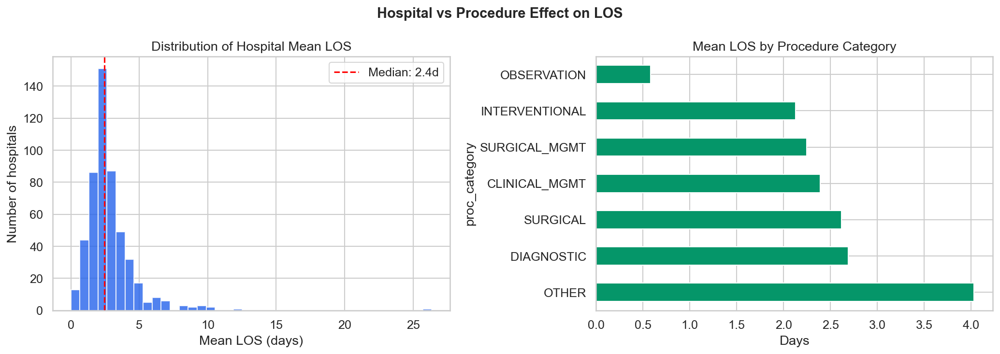
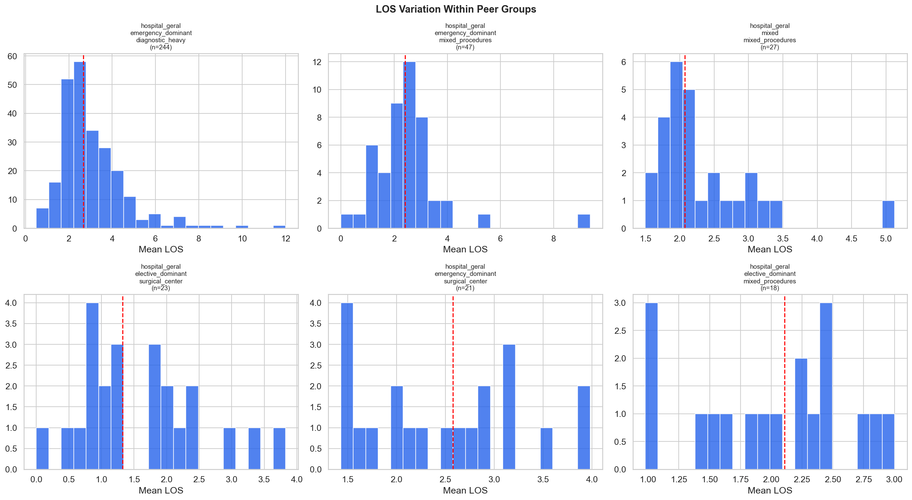
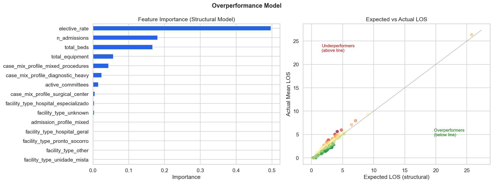
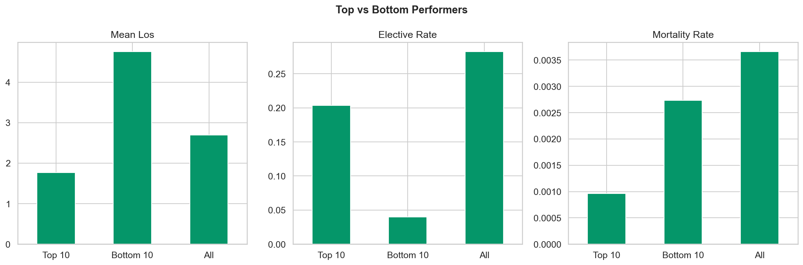
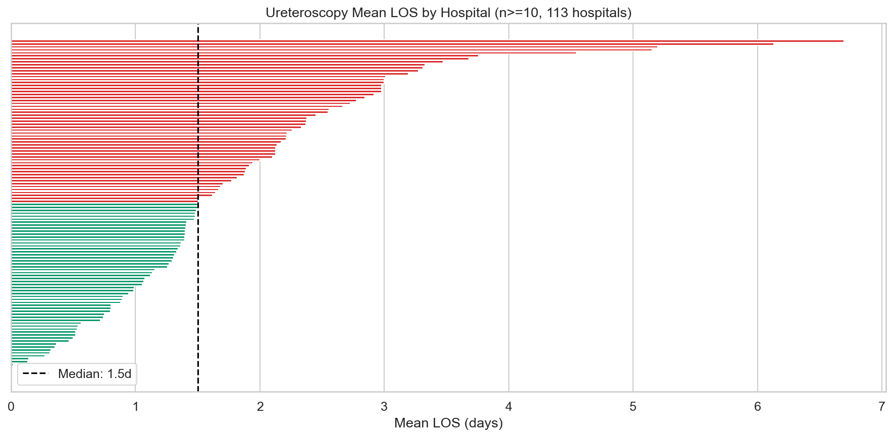
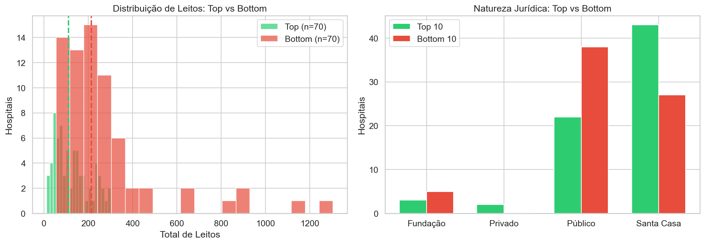
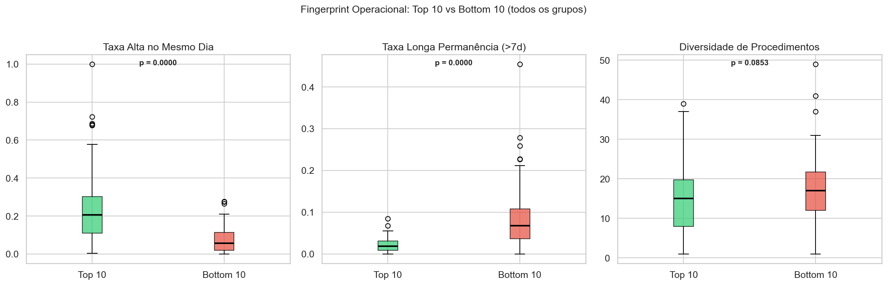
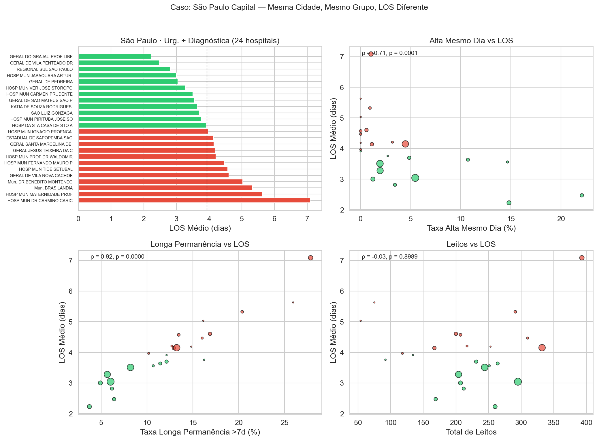
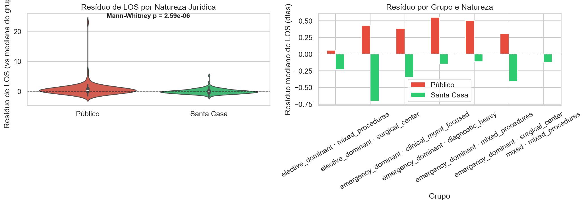

# Relatório 04 — Eficiência Hospitalar (RQ2)

> **Pergunta de Pesquisa:** Como se caracteriza um hospital eficiente?

**Notebook:** `notebooks/04_hospital_efficiency.ipynb`
**Tipo:** Análise de variação hospitalar com modelo de sobre-desempenho
**Escopo:** 313 hospitais modelados (≥20 internações) · 510 hospitais totais · 7 grupos de comparabilidade com ≥10 hospitais · modelo estrutural R² = 0,944 · deep dive causal com 3 eixos independentes

---

## Método

1. **Efeito hospital vs procedimento:** Comparação da variabilidade do LOS médio entre hospitais vs entre categorias de procedimento
2. **Comparação justa dentro de grupos:** Hospitais classificados em grupos de comparabilidade (tipo de unidade × perfil de internação × perfil de mix de procedimentos) antes de qualquer ranking
3. **Modelo de sobre-desempenho:** Gradient Boosting para prever o LOS esperado de cada hospital com base em suas características estruturais (taxa de eletivas, volume, leitos, equipamentos, equipe, etc.). A diferença entre o esperado e o real = sobre-desempenho
4. **Variação em ureteroscopia:** Análise específica da variação de LOS entre hospitais que realizam o procedimento mais moderno

Teste entre grupos: Kruskal-Wallis H. Diferença top vs bottom: Mann-Whitney U.

---

## Principais Achados

### 1. O Hospital Importa Mais que o Procedimento

A variabilidade do LOS médio entre hospitais (desvio padrão: 1,90 dias) é **1,9x maior** que a variabilidade entre categorias de procedimento (desvio padrão: 1,02 dias).

Isso significa que **escolher o hospital certo tem mais impacto no tempo de internação do que o tipo de procedimento realizado**. Dois hospitais realizando a mesma cirurgia podem ter diferenças de LOS maiores do que a diferença entre uma cirurgia e um exame diagnóstico.

### 2. Variação Enorme Dentro dos Grupos de Comparabilidade

Mesmo comparando hospitais similares (mesmo tipo, perfil de admissão e mix de procedimentos), a variação é grande:

| Grupo de Comparabilidade | Hospitais | LOS Médio | CV | Amplitude |
|---|---|---|---|---|
| Hospital geral · urgência · alta diagnóstica | 244 | 3,07d | 0,50 | 0,5–12,0d |
| Hospital geral · urgência · mix | 47 | 2,51d | 0,56 | 0,0–9,4d |
| Hospital geral · misto · mix | 27 | 2,32d | 0,33 | 1,5–5,1d |
| Hospital geral · eletiva · cirúrgico | 23 | 1,61d | 0,59 | 0,0–3,8d |
| Hospital geral · urgência · cirúrgico | 21 | 2,51d | 0,32 | 1,4–4,0d |

O teste de Kruskal-Wallis confirma que os grupos são significativamente diferentes entre si (H = 85,4, p < 1e-10). Porém, **dentro** do maior grupo (244 hospitais gerais com predominância de urgência e alta taxa diagnóstica), o LOS varia de 0,5 a 12,0 dias — uma amplitude de 11,5 dias.

Se o hospital com maior LOS nesse grupo igualasse a mediana, economizaria 9,3 dias por paciente.

### 3. Ranking Detalhado por Grupo de Comparabilidade

Abaixo, o top 10 (mais eficientes) e bottom 10 (menos eficientes) de cada grupo com ≥10 hospitais. Apenas hospitais com ≥20 internações são incluídos. **Δ Med.** = diferença entre o LOS do hospital e a mediana do grupo (negativo = mais eficiente). Nomes obtidos via API pública do CNES (nome fantasia).

#### Hospital Geral · Urgência Dominante · Alta Diagnóstica

**142 hospitais** | LOS mediano: **2,72d** | Amplitude: 1,3–8,0d

**Top 10 — Mais Eficientes (menor LOS):**

| Hospital | Cidade | N | LOS | Δ Med. | Mort. | % Urg. | % Cir. | % Diag. |
|---|---|---:|---:|---:|---:|---:|---:|---:|
| Major Antonio Candido Batatais | Batatais | 302 | 1,33d | −1,40d | 0,33% | 62% | 1% | 54% |
| São Luiz | Boituva | 137 | 1,44d | −1,29d | 0,00% | 80% | 22% | 49% |
| Bebedouro Julia Pinto Calixto | Bebedouro | 38 | 1,47d | −1,25d | 0,00% | 79% | 3% | 71% |
| Santa Casa De Louveira | Louveira | 24 | 1,54d | −1,18d | 0,00% | 88% | 0% | 83% |
| Santa Casa Anna Cintra | Amparo | 139 | 1,58d | −1,14d | 0,00% | 78% | 9% | 64% |
| Complexo Municipal De Saúde | Campos do Jordão | 40 | 1,62d | −1,10d | 0,00% | 95% | 0% | 90% |
| São Camilo Águas De Lindóia | Águas de Lindóia | 45 | 1,69d | −1,04d | 0,00% | 100% | 0% | 82% |
| De Urgência | Santos | 670 | 1,70d | −1,03d | 0,00% | 100% | 0% | 83% |
| Unid. Retaguarda Urgência | Araraquara | 48 | 1,71d | −1,02d | 0,00% | 100% | 0% | 100% |
| Maternidade Reg. Regente Feijó | Regente Feijó | 59 | 1,81d | −0,91d | 0,00% | 100% | 0% | 98% |

**Bottom 10 — Menos Eficientes (maior LOS):**

| Hospital | Cidade | N | LOS | Δ Med. | Mort. | % Urg. | % Cir. | % Diag. |
|---|---|---:|---:|---:|---:|---:|---:|---:|
| Mun. Tide Setúbal | São Paulo | 119 | 4,57d | +1,85d | 0,00% | 98% | 3% | 89% |
| Geral Vila Nova Cachoeirinha | São Paulo | 172 | 4,60d | +1,88d | 0,00% | 98% | 1% | 97% |
| Est. Prof. Carlos Da Silva Lacaz | Francisco Morato | 50 | 4,62d | +1,90d | 0,00% | 100% | 0% | 96% |
| Santo Amaro | Guarujá | 167 | 4,78d | +2,06d | 1,80% | 98% | 13% | 81% |
| Complexo Hosp. Pe. Bento | Guarulhos | 52 | 4,88d | +2,16d | 1,92% | 94% | 0% | 92% |
| Dr. Benedito Montenegro | São Paulo | 31 | 5,03d | +2,31d | 0,00% | 100% | 0% | 97% |
| Brasilândia | São Paulo | 108 | 5,32d | +2,60d | 0,93% | 100% | 0% | 89% |
| Mun. Mat. Prof. Mário Degni | São Paulo | 27 | 5,63d | +2,90d | 0,00% | 96% | 0% | 85% |
| Mun. Dr. Carmino Caricchio | São Paulo | 291 | 7,09d | +4,36d | 0,34% | 96% | 17% | 68% |
| Sta. Casa De Santa Isabel | Santa Isabel | 22 | 7,95d | +5,23d | 0,00% | 100% | 0% | 100% |

> **Padrão:** Os mais eficientes são hospitais do interior com volume moderado. Os piores concentram-se em São Paulo capital — unidades de urgência que realizam diagnóstico com LOS até 6x maior que os melhores pares.

---

#### Hospital Geral · Urgência Dominante · Mix de Procedimentos

**32 hospitais** | LOS mediano: **2,62d** | Amplitude: 0,9–9,4d

**Top 10 — Mais Eficientes (menor LOS):**

| Hospital | Cidade | N | LOS | Δ Med. | Mort. | % Urg. | % Cir. | % Diag. |
|---|---|---:|---:|---:|---:|---:|---:|---:|
| Universitário Da UFSCar | São Carlos | 59 | 0,88d | −1,74d | 0,00% | 90% | 0% | 29% |
| Benef. Santo Antonio | Orlândia | 267 | 1,12d | −1,51d | 0,00% | 89% | 46% | 28% |
| E Maternidade São José | Sertãozinho | 918 | 1,66d | −0,97d | 0,22% | 60% | 39% | 7% |
| Sta. Casa S. Joaquim Da Barra | S. Joaquim da Barra | 1.079 | 1,88d | −0,74d | 0,28% | 68% | 16% | 39% |
| Imaculada Conceição | Ribeirão Preto | 353 | 1,92d | −0,70d | 0,28% | 78% | 32% | 21% |
| HCSVP São Vicente | Jundiaí | 1.909 | 2,12d | −0,50d | 0,52% | 70% | 38% | 22% |
| Santa Casa De Ourinhos | Ourinhos | 660 | 2,16d | −0,46d | 0,76% | 65% | 34% | 17% |
| Santa Casa De Mogi Guaçu | Mogi Guaçu | 942 | 2,31d | −0,31d | 0,21% | 74% | 48% | 23% |
| São Vicente | S.J. Rio Pardo | 335 | 2,32d | −0,30d | 0,30% | 98% | 32% | 27% |
| Regional Do Vale Do Paraíba | Taubaté | 4.533 | 2,36d | −0,26d | 0,26% | 75% | 19% | 0% |

**Bottom 10 — Menos Eficientes (maior LOS):**

| Hospital | Cidade | N | LOS | Δ Med. | Mort. | % Urg. | % Cir. | % Diag. |
|---|---|---:|---:|---:|---:|---:|---:|---:|
| Geral Pirajussara | Taboão da Serra | 1.351 | 3,02d | +0,40d | 0,22% | 66% | 42% | 37% |
| Santa Casa De Votuporanga | Votuporanga | 1.012 | 3,07d | +0,45d | 0,30% | 98% | 38% | 21% |
| Est. Mirandópolis Dr. Leopoldo | Mirandópolis | 89 | 3,24d | +0,61d | 0,00% | 65% | 13% | 36% |
| De Ilha Solteira | Ilha Solteira | 115 | 3,26d | +0,64d | 0,87% | 66% | 35% | 28% |
| Santa Casa S.J. Campos | São José dos Campos | 301 | 3,27d | +0,64d | 1,66% | 83% | 15% | 5% |
| Santa Casa De Andradina | Andradina | 120 | 3,53d | +0,91d | 0,83% | 79% | 48% | 33% |
| Frei Galvão | Guaratinguetá | 115 | 3,60d | +0,98d | 0,00% | 97% | 45% | 23% |
| Santa Casa De São Paulo | São Paulo | 2.870 | 4,08d | +1,46d | 0,28% | 67% | 46% | 11% |
| Sta. Casa Dr. Aristóteles | Pres. Prudente | 179 | 4,08d | +1,46d | 1,12% | 96% | 13% | 37% |
| Heliópolis | São Paulo | 22 | 9,36d | +6,74d | 0,00% | 68% | 0% | 14% |

> **Padrão:** Heliópolis (São Paulo, LOS 9,36d) é um outlier extremo. Universitário Da UFSCar e Benef. Santo Antonio de Orlândia lideram com LOS abaixo de 1,2d, ambos no interior.

---

#### Hospital Geral · Misto · Mix de Procedimentos

**23 hospitais** | LOS mediano: **2,08d** | Amplitude: 1,6–5,1d

**Top 10 — Mais Eficientes (menor LOS):**

| Hospital | Cidade | N | LOS | Δ Med. | Mort. | % Urg. | % Cir. | % Diag. |
|---|---|---:|---:|---:|---:|---:|---:|---:|
| Univ. São Francisco De Assis | Botucatu | 1.975 | 1,58d | −0,50d | 0,56% | 56% | 28% | 2% |
| Universitário Da USP | São Paulo | 596 | 1,68d | −0,39d | 0,00% | 55% | 21% | 18% |
| Sta. Casa De Mogi Mirim | Mogi Mirim | 283 | 1,72d | −0,35d | 0,00% | 49% | 25% | 19% |
| Augusto De Oliveira Camargo | Indaiatuba | 1.952 | 1,80d | −0,28d | 0,61% | 54% | 27% | 20% |
| De Base De Bauru | Bebedouro | 3.457 | 1,87d | −0,21d | 0,14% | 53% | 23% | 5% |
| De Câncer S.B. Do Campo | Santos | 1.530 | 1,88d | −0,19d | 0,00% | 47% | 31% | 15% |
| Santa Casa De Assis | Assis | 1.064 | 1,89d | −0,18d | 0,28% | 49% | 25% | 14% |
| Complexo Hosp. Sta. Casa Botucatu | Botucatu | 424 | 1,93d | −0,14d | 0,47% | 59% | 35% | 2% |
| Sta. Casa De Valinhos | Valinhos | 474 | 1,93d | −0,14d | 0,42% | 51% | 29% | 10% |
| Santa Casa De Limeira | Limeira | 1.555 | 1,98d | −0,10d | 0,39% | 52% | 48% | 8% |

**Bottom 10 — Menos Eficientes (maior LOS):**

| Hospital | Cidade | N | LOS | Δ Med. | Mort. | % Urg. | % Cir. | % Diag. |
|---|---|---:|---:|---:|---:|---:|---:|---:|
| Geral Henrique Altimeyer | São Paulo | 2.038 | 2,21d | +0,13d | 0,10% | 46% | 43% | 22% |
| Mun. Dr. José Carvalho Florence | S.J. Campos | 1.752 | 2,41d | +0,34d | 0,74% | 51% | 41% | 21% |
| HC FAEPA Ribeirão Preto | Ribeirão Preto | 3.544 | 2,58d | +0,50d | 0,14% | 52% | 34% | 18% |
| De Base S.J. Rio Preto | S.J. Rio Preto | 6.891 | 2,62d | +0,55d | 0,32% | 50% | 45% | 10% |
| Universitário De Marília | Marília | 181 | 2,84d | +0,76d | 1,10% | 48% | 34% | 15% |
| Sta. Casa Pindamonhangaba | Pindamonhangaba | 94 | 2,99d | +0,91d | 1,06% | 40% | 36% | 27% |
| Escola Emílio Carlos | Catanduva | 56 | 3,04d | +0,96d | 1,79% | 59% | 41% | 18% |
| HC UNICAMP | Campinas | 1.974 | 3,25d | +1,17d | 0,46% | 49% | 46% | 28% |
| Luzia De Pinho Melo | Mogi das Cruzes | 2.766 | 3,43d | +1,35d | 1,01% | 54% | 31% | 16% |
| BP (Beneficência Portuguesa) | São Paulo | 24 | 5,12d | +3,05d | 4,17% | 54% | 46% | 8% |

> **Padrão:** BP São Paulo (24 internações) combina o maior LOS (5,12d) com a maior mortalidade (4,17%) — um sinal de alerta. Botucatu e Bebedouro (Hospital de Base) lideram com alto volume e baixo LOS.

---

#### Hospital Geral · Eletiva Dominante · Centro Cirúrgico

**22 hospitais** | LOS mediano: **1,56d** | Amplitude: 0,0–3,8d

**Top 10 — Mais Eficientes (menor LOS):**

| Hospital | Cidade | N | LOS | Δ Med. | Mort. | % Urg. | % Cir. | % Diag. |
|---|---|---:|---:|---:|---:|---:|---:|---:|
| Quarteirão Da Saúde | Cubatão | 27 | 0,00d | −1,56d | 0,00% | 0% | 89% | 0% |
| Sta. Casa De Garça | Garça | 166 | 0,49d | −1,07d | 0,60% | 10% | 68% | 2% |
| Santa Casa De Guariba | Guariba | 159 | 0,76d | −0,80d | 0,00% | 18% | 75% | 18% |
| Sta. Casa Sta. Rita Passa Quatro | Sta. Rita do P. Quatro | 44 | 0,77d | −0,79d | 0,00% | 25% | 70% | 18% |
| Santa Casa De São Pedro | São Pedro | 361 | 0,83d | −0,73d | 0,00% | 14% | 51% | 6% |
| Santa Casa De Caconde | Caconde | 61 | 0,89d | −0,68d | 0,00% | 0% | 64% | 0% |
| Regional De Bebedouro HRB | Bebedouro | 221 | 0,89d | −0,67d | 0,45% | 21% | 57% | 7% |
| Regional De Piracicaba | Piracicaba | 4.797 | 0,98d | −0,58d | 0,21% | 0% | 99% | 0% |
| Est. Rib. Preto Dr. Carlos Lacaz | Ribeirão Preto | 365 | 1,22d | −0,34d | 0,00% | 5% | 93% | 4% |
| Municipal De Itu | Itu | 135 | 1,22d | −0,34d | 0,00% | 4% | 53% | 4% |

**Bottom 10 — Menos Eficientes (maior LOS):**

| Hospital | Cidade | N | LOS | Δ Med. | Mort. | % Urg. | % Cir. | % Diag. |
|---|---|---:|---:|---:|---:|---:|---:|---:|
| Do Litoral Norte | Catanduva | 629 | 1,82d | +0,25d | 0,32% | 14% | 81% | 4% |
| Sta. Casa Paraguaçu Paulista | Paraguaçu Paulista | 115 | 1,83d | +0,26d | 0,00% | 34% | 66% | 33% |
| De Paulínia | Paulínia | 425 | 1,99d | +0,43d | 0,71% | 28% | 61% | 11% |
| Est. João Paulo II | S.J. Rio Preto | 1.766 | 1,99d | +0,43d | 0,00% | 6% | 71% | 1% |
| Complexo Hosp. Clínicas | São Caetano do Sul | 1.107 | 2,20d | +0,64d | 0,99% | 38% | 57% | 5% |
| Est. Américo Brasiliense | Araraquara | 1.133 | 2,38d | +0,82d | 0,09% | 0% | 58% | 8% |
| Transplantes SP (Euryclides) | São Paulo | 3.477 | 2,39d | +0,83d | 0,09% | 11% | 73% | 1% |
| Estadual Bauru | Bebedouro | 1.042 | 3,05d | +1,49d | 0,10% | 38% | 63% | 27% |
| São Paulo — Ensino (HSP) | São Paulo | 2.336 | 3,31d | +1,75d | 0,09% | 6% | 67% | 7% |
| Conjunto Hospitalar Sorocaba | Sorocaba | 4.005 | 3,83d | +2,27d | 0,87% | 37% | 82% | 11% |

> **Padrão:** Regional De Piracicaba (4.797 casos, 99% cirúrgico) consegue LOS de 0,98d — o benchmark de "fábrica cirúrgica". Conjunto Hospitalar Sorocaba (4.005 casos, LOS 3,83d) é o maior centro com desempenho abaixo do esperado.

---

#### Hospital Geral · Urgência Dominante · Centro Cirúrgico

**21 hospitais** | LOS mediano: **2,58d** | Amplitude: 1,4–4,0d

**Top 10 — Mais Eficientes (menor LOS):**

| Hospital | Cidade | N | LOS | Δ Med. | Mort. | % Urg. | % Cir. | % Diag. |
|---|---|---:|---:|---:|---:|---:|---:|---:|
| Santa Casa De Rio Claro | Rio Claro | 640 | 1,43d | −1,15d | 0,62% | 78% | 61% | 13% |
| José Venâncio | Colina | 43 | 1,53d | −1,04d | 0,00% | 60% | 56% | 28% |
| Santa Bárbara | Sta. Bárbara d'Oeste | 940 | 1,54d | −1,04d | 0,53% | 72% | 61% | 6% |
| São Domingos Prov. De Deus | Nhandeara | 244 | 1,55d | −1,02d | 0,00% | 91% | 54% | 4% |
| Caridade Vargem Grande Do Sul | Vargem Grande do Sul | 287 | 1,61d | −0,97d | 0,00% | 63% | 83% | 3% |
| Sta. Casa De Jales | Jales | 589 | 1,74d | −0,84d | 0,00% | 95% | 51% | 10% |
| Sta. Casa Novo Horizonte | Novo Horizonte | 802 | 1,97d | −0,61d | 0,00% | 91% | 78% | 19% |
| Clínicas De São Sebastião | São Sebastião | 855 | 2,04d | −0,54d | 0,23% | 73% | 69% | 15% |
| Mat. Sta. Isabel Jaboticabal | Jaboticabal | 357 | 2,17d | −0,41d | 0,56% | 87% | 64% | 6% |
| Santa Casa De Ribeirão Preto | Ribeirão Preto | 3.298 | 2,28d | −0,30d | 0,39% | 82% | 55% | 3% |

**Bottom 10 — Menos Eficientes (maior LOS):**

| Hospital | Cidade | N | LOS | Δ Med. | Mort. | % Urg. | % Cir. | % Diag. |
|---|---|---:|---:|---:|---:|---:|---:|---:|
| Santa Casa De Sorocaba | Sorocaba | 1.717 | 2,67d | +0,09d | 0,64% | 65% | 76% | 8% |
| UGA SP (Unid. Gestão Assist.) | São Paulo | 2.219 | 2,76d | +0,19d | 0,14% | 91% | 58% | 30% |
| Domingos L. Ceravolo | Pres. Prudente | 7.516 | 2,88d | +0,31d | 0,27% | 79% | 59% | 4% |
| Santa Casa De Barretos | Barretos | 1.410 | 2,90d | +0,32d | 0,57% | 75% | 72% | 8% |
| Mun. Josanias Castanha Braga | São Paulo | 2.436 | 3,12d | +0,54d | 0,21% | 79% | 66% | 20% |
| Santa Casa De Olímpia | Olímpia | 106 | 3,12d | +0,54d | 0,00% | 70% | 55% | 26% |
| São Luiz De Araras | Araras | 599 | 3,18d | +0,60d | 1,00% | 80% | 66% | 16% |
| Fornecedores De Cana (Usina) | Piracicaba | 738 | 3,58d | +1,01d | 2,03% | 93% | 54% | 5% |
| HC Fac. Medicina Botucatu | Botucatu | 2.377 | 3,98d | +1,40d | 0,46% | 87% | 61% | 8% |
| Sta. Casa De Araçatuba | Araçatuba | 654 | 3,98d | +1,40d | 0,61% | 89% | 51% | 21% |

> **Padrão:** Santa Casa De Rio Claro lidera com LOS 1,43d apesar de 78% de urgência. Fornecedores De Cana (Piracicaba) combina alto LOS (3,58d) com a mortalidade mais alta do grupo (2,03%).

---

#### Hospital Geral · Eletiva Dominante · Mix de Procedimentos

**17 hospitais** | LOS mediano: **2,22d** | Amplitude: 1,0–3,0d

**Top 10 — Mais Eficientes (menor LOS):**

| Hospital | Cidade | N | LOS | Δ Med. | Mort. | % Urg. | % Cir. | % Diag. |
|---|---|---:|---:|---:|---:|---:|---:|---:|
| De Votorantim | Votorantim | 139 | 0,98d | −1,24d | 0,72% | 7% | 11% | 4% |
| Itatiba | Hortolândia | 51 | 1,04d | −1,18d | 0,00% | 0% | 0% | 0% |
| Domingo Marcolino Braile | S.J. Rio Preto | 30 | 1,07d | −1,15d | 0,00% | 7% | 7% | 0% |
| Clínicas Municipal | Santos | 1.492 | 1,42d | −0,80d | 0,34% | 32% | 34% | 5% |
| Santa Casa De Pitangueiras | Pitangueiras | 129 | 1,51d | −0,71d | 0,00% | 37% | 47% | 31% |
| Sta. Casa De Guaratinguetá | Guaratinguetá | 322 | 1,66d | −0,56d | 0,00% | 29% | 50% | 14% |
| Complexo Hosp. Pref. Campinas | Campinas | 1.197 | 1,87d | −0,35d | 0,58% | 35% | 29% | 11% |
| Santa Lucinda Sorocaba | Sorocaba | 1.297 | 1,89d | −0,33d | 0,23% | 4% | 45% | 0% |
| Complexo Hosp. Estivadores | S.J. Campos | 588 | 2,22d | +0,00d | 0,00% | 10% | 4% | 1% |
| De Jundiaí | Jundiaí | 1.989 | 2,28d | +0,06d | 0,00% | 3% | 25% | 0% |

**Bottom 10 — Menos Eficientes (maior LOS):**

| Hospital | Cidade | N | LOS | Δ Med. | Mort. | % Urg. | % Cir. | % Diag. |
|---|---|---:|---:|---:|---:|---:|---:|---:|
| De Jundiaí | Jundiaí | 1.989 | 2,28d | +0,06d | 0,00% | 3% | 25% | 0% |
| Pio XII | São José dos Campos | 32 | 2,31d | +0,09d | 6,25% | 34% | 28% | 3% |
| Sta. Casa Sta. Cruz Rio Pardo | Sta. Cruz do Rio Pardo | 428 | 2,41d | +0,19d | 0,23% | 32% | 35% | 22% |
| Estadual Sumaré | Sumaré | 1.561 | 2,45d | +0,23d | 0,19% | 31% | 32% | 15% |
| Geral De Itapevi | Itapevi | 2.896 | 2,47d | +0,25d | 0,03% | 39% | 43% | 12% |
| Mun. Gilson Marques Figueiredo | São Paulo | 1.208 | 2,70d | +0,49d | 1,49% | 26% | 38% | 1% |
| Est. Mário Covas | S.B. do Campo | 1.860 | 2,87d | +0,66d | 0,97% | 0% | 42% | 10% |
| Guilherme Álvaro | S.J. Campos | 800 | 3,00d | +0,78d | 0,38% | 20% | 49% | 10% |

> **Padrão:** Grupo mais homogêneo (amplitude 1,0–3,0d). Pio XII (S.J. Campos, 32 casos) tem mortalidade alarmante de 6,25% — requer investigação.

---

#### Hospital Geral · Urgência Dominante · Foco Clínico

**11 hospitais** | LOS mediano: **2,25d** | Amplitude: 1,2–6,0d

**Top 10 — Mais Eficientes (menor LOS):**

| Hospital | Cidade | N | LOS | Δ Med. | Mort. | % Urg. | % Cir. | % Diag. |
|---|---|---:|---:|---:|---:|---:|---:|---:|
| Santa Casa De Vinhedo | Votuporanga | 1.101 | 1,21d | −1,04d | 0,36% | 64% | 18% | 26% |
| Sta. Casa De Ituverava | Ituverava | 1.273 | 1,39d | −0,86d | 0,24% | 85% | 11% | 13% |
| Santa Casa De São Carlos | São Carlos | 2.689 | 1,56d | −0,69d | 0,30% | 61% | 31% | 16% |
| Dr. Leopoldo Bevilacqua | Pariquera-Açu | 2.829 | 2,12d | −0,13d | 0,11% | 62% | 41% | 16% |
| Santa Casa De Itu | Itu | 196 | 2,14d | −0,11d | 0,51% | 68% | 13% | 30% |
| Casa De Saúde Stella Maris | Catanduva | 1.139 | 2,25d | +0,00d | 0,53% | 67% | 32% | 12% |
| Santa Casa De Araraquara | Araraquara | 1.040 | 2,39d | +0,14d | 0,87% | 67% | 40% | 17% |
| Mun. Barueri Dr. Francisco Moran | Bauru | 3.923 | 2,64d | +0,39d | 0,10% | 63% | 41% | 16% |
| Santa Casa De Pirassununga | Pirassununga | 177 | 2,91d | +0,66d | 1,13% | 90% | 28% | 11% |
| Antonio Giglio | Osasco | 518 | 3,57d | +1,32d | 1,54% | 74% | 11% | 28% |

**Bottom 10 — Menos Eficientes (maior LOS):**

| Hospital | Cidade | N | LOS | Δ Med. | Mort. | % Urg. | % Cir. | % Diag. |
|---|---|---:|---:|---:|---:|---:|---:|---:|
| Casa De Saúde Stella Maris | Catanduva | 1.139 | 2,25d | +0,00d | 0,53% | 67% | 32% | 12% |
| Santa Casa De Araraquara | Araraquara | 1.040 | 2,39d | +0,14d | 0,87% | 67% | 40% | 17% |
| Mun. Barueri Dr. Francisco Moran | Bauru | 3.923 | 2,64d | +0,39d | 0,10% | 63% | 41% | 16% |
| Santa Casa De Pirassununga | Pirassununga | 177 | 2,91d | +0,66d | 1,13% | 90% | 28% | 11% |
| Antonio Giglio | Osasco | 518 | 3,57d | +1,32d | 1,54% | 74% | 11% | 28% |
| Mun. Prof. Dr. Alípio Corrêa Netto | São Paulo | 640 | 5,96d | +3,71d | 0,94% | 97% | 22% | 39% |

> **Padrão:** Mun. Prof. Dr. Alípio Corrêa Netto (São Paulo, LOS 5,96d) é o outlier extremo — quase 3x a mediana do grupo. Votuporanga e Ituverava no interior demonstram que foco clínico com urgência pode operar com LOS ≤1,4d.

---

### 4. Modelo de Sobre-Desempenho (R² = 0,944)

O modelo estrutural captura 94,4% da variância no LOS hospitalar usando apenas características da unidade (volume, taxa de eletivas, leitos, equipamentos, equipe, comitês). A diferença residual — o **sobre-desempenho** — representa a eficiência operacional que não é explicada pela estrutura.

| Grupo | LOS Médio | Sobre-Desempenho Médio |
|---|---|---|
| Top 10 | 1,77d | +0,82d (melhor que esperado) |
| Bottom 10 | 4,75d | −1,05d (pior que esperado) |

Mann-Whitney U p < 0,0001. A diferença entre top e bottom é estatisticamente significativa e substancial.

### 5. Perfil dos Melhores e Piores Hospitais

**Top 10 (sobre-desempenho ≥ +0,72d):**
- 9 de 10 são hospitais gerais
- 7 de 10 são de predominância de urgência — ou seja, conseguem ser eficientes mesmo atendendo urgência
- LOS médio de 1,77d com mortalidade zero ou muito baixa
- O hospital com maior volume (CNES 7373465, 1.492 casos) é um dos top performers

**Bottom 10 (sobre-desempenho ≤ −0,78d):**
- Todos são hospitais gerais com predominância de urgência
- LOS médio de 4,75d — 2,7x mais que os melhores
- Um hospital (CNES 2082829, 640 casos) tem LOS de 5,96d E mortalidade de 0,94%

### 6. Variação em Ureteroscopia

Entre os 113 hospitais que realizam ureteroscopia, o LOS médio varia de 0,0 a 6,7 dias. O procedimento tem LOS esperado de 1 dia (conforme a Portaria). A variação reflete diferenças em protocolos hospitalares, não na técnica em si.

---

## 7. Deep Dive: Por Que Alguns Hospitais São Melhores?

As seções anteriores mostram **que** hospitais diferem enormemente dentro do mesmo grupo de comparabilidade. Esta seção investiga **por quê**, usando três eixos independentes para evitar raciocínio circular.

### 7a. Controle do Mix de Pacientes — "Tratam os Mesmos Pacientes?"

Comparamos os top 10 vs bottom 10 de cada grupo em variáveis que **não são resultado** (idade, sexo, sub-diagnóstico, uso de UTI):

| Variável | Grupos com diferença significativa | Conclusão |
|---|---|---|
| Idade média | 0 de 7 | Idade **similar** entre top e bottom |
| % Idosos (65+) | 0 de 7 | Proporção de idosos **similar** |
| % Masculino | 1 de 7 | Gênero **similar** |
| Sub-diagnóstico (N20.0/N20.1) | 0 de 7 | Diagnóstico **similar** |
| Taxa de UTI | 3 de 7 | **Diferente** — bottom usa 3-5x mais UTI |

**Veredito:** Idade, sexo e sub-diagnóstico são estatisticamente similares entre top e bottom (Mann-Whitney U, p > 0,05 em todos os grupos). A diferença de LOS **não é explicada pelo perfil do paciente**. A exceção é a taxa de UTI — significativamente maior nos piores hospitais — que reflete complicações durante a internação, não gravidade na chegada.

### 7b. Perfil Estrutural — "O Que Eles Têm?"

Comparamos recursos físicos (CNES) entre top e bottom:

| Recurso | Top 10 (mediana) | Bottom 10 (mediana) | p-value | Direção |
|---|---|---|---|---|
| **Total de leitos** | 61–80 | 181–360 | < 0,01 | Menores = melhores |
| **Total de equipamentos** | 20–29 | 29–47 | < 0,05 | Menos equip. = melhores |
| **Comitês ativos** | 5–6 | 7–10 | < 0,01 | Menos burocracia = melhores |
| CT scanners | 0 | 0–1 | ns | Sem diferença |

**Achado contra-intuitivo:** Hospitais **menores** e com **menos infraestrutura** têm LOS mais curto. Isso não significa que recursos prejudicam — significa que complexidade institucional (hospital grande, muitos comitês, múltiplas especialidades) cria inércia operacional. O hospital menor é mais ágil.

**Natureza jurídica:**
- Top 10: 50–100% Santa Casas (associação privada)
- Bottom 10: 60–80% hospitais públicos (municipais/estaduais)

### 7c. Fingerprint Operacional — "Como Eles Operam?"

Derivamos métricas operacionais do SIH que descrevem **processos**, não resultados:

| Métrica | Top 10 (mediana) | Bottom 10 (mediana) | Spearman ρ vs LOS | Interpretação |
|---|---|---|---|---|
| **Alta no mesmo dia** | 15–51% | 1–5% | −0,42 a −0,73 | Protocolo eficiente de resolve-e-libera |
| **Longa permanência >7d** | 0,4–3% | 7–28% | +0,84 a +0,90 | **Preditor mais forte** — cauda de complicações |
| **Diversidade de procedimentos** | 5–7 | 13–20 | +0,47 a +0,67 | Especialista > generalista |
| Taxa de migração | 6–20% | 5–58% | variável | Hospitais referência atraem casos mais complexos |
| Taxa de UTI | 0–1% | 2–5% | +0,30 a +0,77 | Complicações, não gravidade de entrada |

**O achado central:** A taxa de longa permanência (>7 dias) tem correlação Spearman de **ρ = 0,84–0,90** com o ranking de LOS dentro do grupo (p < 1e-8). Isso não é circular — é mecânico: hospitais onde pacientes "ficam presos" na cauda da distribuição (complicações, espera por leito, falta de protocolo de alta) têm LOS médio inflado.

O segundo preditor é a taxa de alta no mesmo dia: hospitais que conseguem resolver o caso em <24h (diagnóstico por imagem, procedimento simples, alta) comprimem o LOS médio drasticamente.

### 7d. Estudo de Caso: São Paulo Capital

24 hospitais na **mesma cidade**, **mesmo grupo** (Urgência + Diagnóstica), **mesma regulação**. LOS varia de 2,2 a 7,1 dias. A geografia não explica nada — o que explica?

| Dimensão | Top 3 (média) | Bottom 3 (média) |
|---|---|---|
| LOS | 2,51d | 6,02d |
| Alta mesmo dia | 13,4% | 0,6% |
| Longa permanência >7d | 5,4% | 24,7% |
| Idade média | 40,6 | 41,9 |
| % Idosos 65+ | 7,7% | 11,7% |
| Taxa UTI | 0,14% | 2,80% |
| Total de leitos | 214 | 253 |

Os pacientes são similares em idade e diagnóstico. A diferença está inteiramente nos **processos**: os piores hospitais praticamente não fazem alta no mesmo dia (0,6% vs 13,4%) e têm 5x mais pacientes na cauda >7 dias.

O Hosp. Mun. Dr. Carmino Caricchio (LOS 7,09d) tem a maior diversidade de procedimentos (19 códigos) e 17% de cirurgias — sugerindo que atua como hospital geral que também trata litíase, sem protocolo dedicado. O Hosp. Geral do Grajaú (LOS 2,23d), ao contrário, é focado: 7 procedimentos, 73% diagnóstico, resolve e libera.

### 7e. Efeito da Natureza Jurídica — Santa Casa vs Público

Controlando pelo grupo de comparabilidade (resíduo = LOS real − mediana do grupo):

| Natureza | N | Resíduo mediano | % abaixo da mediana | p-value |
|---|---|---|---|---|
| **Santa Casa** (assoc. privada) | 159 | −0,17d | 59,7% | — |
| **Público** (municipal/estadual) | 133 | +0,25d | 32,3% | — |
| **Diferença** | — | **0,42d** | — | **< 0,0001** |

Em **todos os 7 grupos** de comparabilidade, Santa Casas têm resíduo de LOS menor que hospitais públicos. A diferença de 0,42 dias por internação, aplicada ao volume total, representa milhares de leitos-dia.

Possíveis mecanismos (não confirmados nesta análise):
- Santa Casas têm gestão mais autônoma (menos burocracia para alta)
- Incentivo financeiro diferente (leito ocupado = custo, não receita)
- Cultura organizacional de resolução rápida (filantrópica vs burocrática)

---

## Discussão

**Resposta à RQ2:** Um hospital eficiente se caracteriza por três atributos concretos e mensuráveis:

1. **Alta capacidade de resolução rápida** — taxa de alta no mesmo dia 3-10x maior que os piores pares (15-51% vs 1-5%)
2. **Gestão eficaz da cauda** — taxa de longa permanência >7d de 0,4-3% vs 7-28% nos piores
3. **Foco operacional** — menor diversidade de procedimentos (especialização), menos complexidade institucional (menos leitos, menos burocracia)

A eficiência **não depende** do tipo de paciente que chega (idade, sexo e diagnóstico são similares entre top e bottom), nem de ter mais recursos (hospitais menores são sistematicamente melhores). Depende de **como o hospital se organiza para resolver o caso e liberar o leito**.

O efeito da natureza jurídica é robusto: Santa Casas superam hospitais públicos em todos os grupos de comparabilidade (p < 0,0001). Isso sugere que a gestão autônoma e o incentivo à rotatividade de leitos fazem diferença operacional mensurável.

**Implicações acionáveis:**

1. **Protocolo de alta no mesmo dia** — Hospitais com <5% de alta D0 devem implementar protocolos para diagnóstico por imagem + alta em <24h
2. **Gestão de longa permanência** — Cada hospital deve monitorar sua taxa >7d e investigar caso a caso. A cauda é onde o LOS médio é decidido
3. **Benchmarking intra-grupo** — Na mesma cidade e grupo, transferir práticas do melhor para o pior (ex: Grajaú → Carmino Caricchio em São Paulo)
4. **Investigar governança** — A vantagem das Santa Casas deve ser estudada para replicar os mecanismos em hospitais públicos

## Ameaças à Validade

- **Complexidade do caso não capturada:** O SIH não inclui tamanho do cálculo, comorbidades detalhadas ou gravidade clínica. Hospitais com piores LOS podem atender casos genuinamente mais complexos — embora o controle por mix de pacientes sugira que esse efeito é pequeno
- **Viés de seleção nas Santa Casas:** Santa Casas podem recusar pacientes mais complexos (encaminhando para hospitais públicos), inflando artificialmente sua eficiência
- **Taxa de alta no mesmo dia como proxy:** Parte da diferença pode ser mecânica (se o hospital admite para observação e libera em <24h, o LOS cai), não necessariamente refletindo melhor cuidado
- **Causalidade reversa na longa permanência:** Hospitais com menos recursos podem ter mais complicações (causa), mas complicações também podem ser resultado de protocolos inadequados (efeito). A direção causal não é separável com dados observacionais
- **CNES como foto estática:** Os dados estruturais (leitos, equipamentos) vêm do CNES mais recente e podem não refletir a realidade durante todo o período 2016-2025
- **R² alto pode indicar overfitting:** R² = 0,944 é muito alto para dados de saúde. Validação cruzada seria necessária para confirmar

---

## Resumo de Resultados — RQ2

| Pergunta | Resultado | Evidência |
|---|---|---|
| Qual a variação de LOS entre hospitais? | **1,9x maior que entre procedimentos** | DP entre hospitais: 1,90d vs DP entre categorias: 1,02d |
| A diferença é explicada pelo perfil do paciente? | **Não** | Idade, sexo e sub-diagnóstico similares entre top e bottom (Mann-Whitney U, p > 0,05 em todos os grupos) |
| O que diferencia hospitais eficientes? | **Processos operacionais** | Alta D0: 15-51% (top) vs 1-5% (bottom). Longa permanência >7d: 0,4-3% (top) vs 7-28% (bottom). ρ = 0,84-0,90 |
| Tamanho e recursos importam? | **Sim, inversamente** | Hospitais menores e com menos infraestrutura têm LOS mais curto. Complexidade institucional cria inércia |
| Natureza jurídica faz diferença? | **Sim** — Santa Casas melhores | Resíduo −0,17d (Santa Casas) vs +0,25d (públicos), p < 0,0001, consistente em todos os 7 grupos |
| Modelo estrutural funciona? | **Sim** — R² = 0,944 | Top 10 sobre-desempenho: LOS 1,77d. Bottom 10: LOS 4,75d (p < 0,0001) |

**Conclusão:** Um hospital eficiente se caracteriza por **alta capacidade de resolução rápida** (D0), **gestão eficaz da cauda de longa permanência**, e **foco operacional** (especialização). A eficiência não depende do tipo de paciente — depende de como o hospital se organiza. Santa Casas superam hospitais públicos em todos os grupos de comparabilidade.

---

## Glossário

| Sigla | Significado |
|---|---|
| **LOS** | Length of Stay — tempo de permanência hospitalar (em dias) |
| **SUS** | Sistema Único de Saúde — sistema público de saúde brasileiro |
| **SIH** | Sistema de Informações Hospitalares — base de dados de internações |
| **CNES** | Cadastro Nacional de Estabelecimentos de Saúde |
| **R²** | Coeficiente de determinação — proporção da variância explicada pelo modelo (0 a 1) |
| **CV** | Coeficiente de Variação — desvio padrão dividido pela média |
| **Kruskal-Wallis H** | Teste não-paramétrico para diferenças entre múltiplos grupos |
| **Mann-Whitney U** | Teste não-paramétrico para comparação entre dois grupos |
| **Gradient Boosting** | Algoritmo de machine learning por ensemble de árvores de decisão |
| **ESWL** | Extracorporeal Shock Wave Lithotripsy — litotripsia extracorpórea |
| **BRL / R$** | Real brasileiro — moeda corrente |
| **RQ** | Research Question — pergunta de pesquisa |
| **Spearman ρ** | Coeficiente de correlação de postos de Spearman — mede associação monotônica entre duas variáveis |
| **D0** | Dia zero — alta no mesmo dia da internação |
| **UTI** | Unidade de Terapia Intensiva |
| **Santa Casa** | Hospital filantrópico de associação privada (Irmandade/Misericórdia) |
| **Resíduo** | Diferença entre valor real e valor esperado (ou mediana do grupo) |
