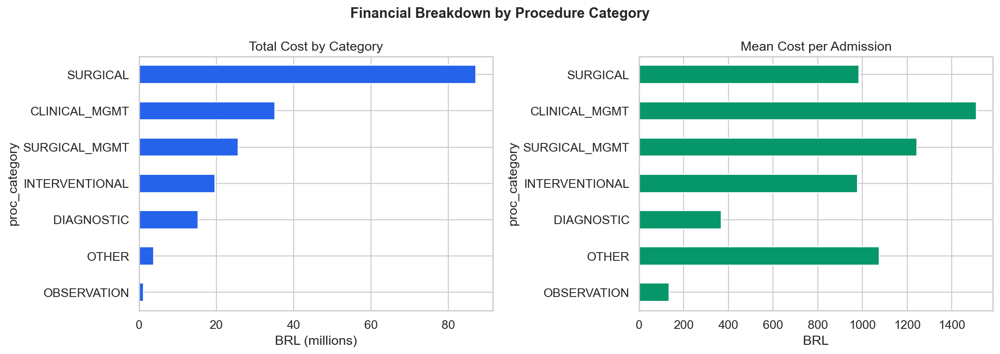
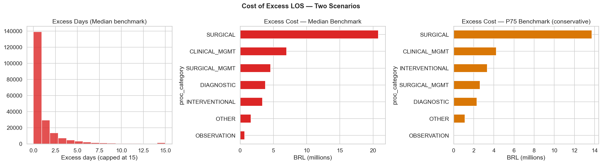
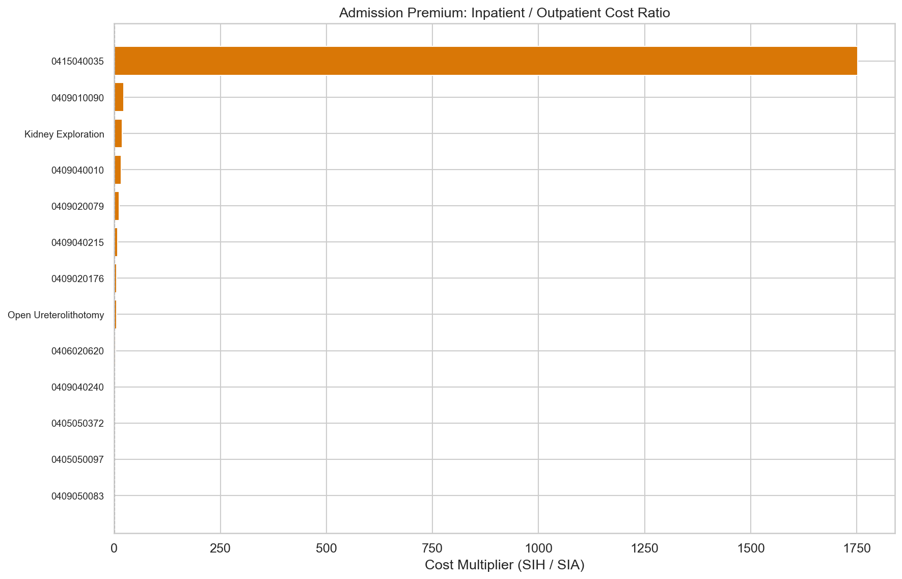
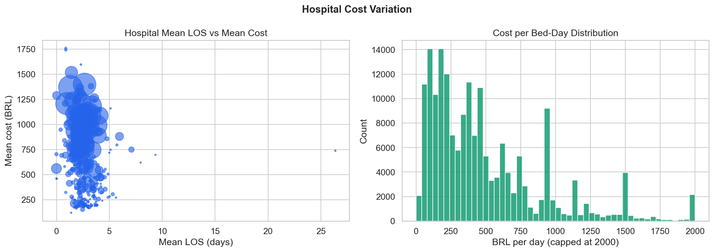
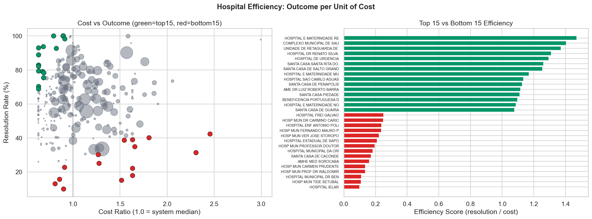
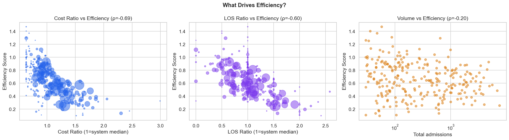
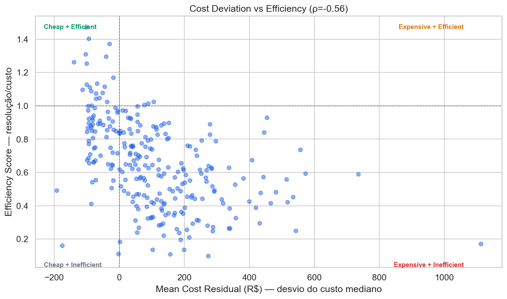
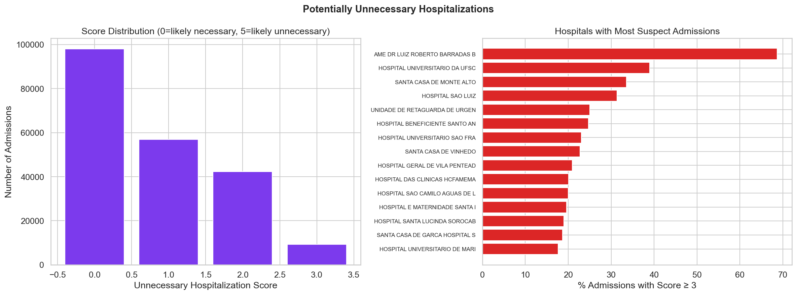

# Relatório 05 — Análise Financeira (RQ3)

> **Pergunta de Pesquisa:** Onde o sistema está perdendo dinheiro?

**Notebook:** `notebooks/05_financial_analysis.ipynb`
**Tipo:** Análise de custos com decomposição por categoria e comparação SIH/SIA
**Escopo:** R$187,8M em custo total · 206.500 internações · 271 hospitais com score de eficiência · 13 procedimentos com comparação ambulatorial

---

## Método

1. **Custo por categoria de procedimento** — decomposição do custo total por categoria funcional
2. **Custo excedente de longas permanências** — para cada internação, computar os dias acima de um benchmark (mediana ou P75 da categoria) e estimar o custo excedente usando custo/dia linearizado
3. **Prêmio de internação SIH vs SIA** — comparar a remuneração do mesmo procedimento quando realizado em internação (SIH) vs ambulatorial (SIA)
4. **Variação de custo entre hospitais** — distribuição do custo médio por hospital
5. **Eficiência hospitalar real** — para cada combinação hospital × procedimento (≥10 casos), calcular: `taxa_resolução` (% pacientes vivos com LOS ≤ mediana do procedimento) e `razão_custo` (mediana de custo do hospital / mediana do sistema). Eficiência = resolução / custo, ponderada por volume
6. **Desvio do custo mediano** — para cada internação, calcular o resíduo de custo (custo real − mediana do mesmo PROC_REA). Mede quanto cada hospital cobra acima/abaixo da mediana, independente do resultado clínico. Cruzamento com o score de eficiência para mapear quadrantes

---

## Principais Achados

### 1. Distribuição de Custos por Categoria

O custo total do sistema para litíase renal no SUS-SP é de **R$187,8 milhões** (2016–2025).

| Categoria | Custo Total | Participação | Custo Médio | LOS Médio |
|---|---|---|---|---|
| CIRÚRGICO | R$87,2M | **46,4%** | R$983 | 2,61d |
| MANEJO CLÍNICO | R$35,1M | 18,7% | R$1.508 | 2,39d |
| MANEJO CIRÚRGICO | R$25,6M | 13,6% | R$1.244 | 2,25d |
| INTERVENCIONISTA | R$19,6M | 10,5% | R$977 | 2,13d |
| DIAGNÓSTICO | R$15,3M | **8,1%** | R$369 | 2,69d |
| OUTROS | R$3,8M | 2,0% | R$1.074 | 4,03d |
| OBSERVAÇÃO | R$1,2M | 0,6% | R$135 | 0,58d |

Procedimentos cirúrgicos dominam o custo (46,4%), mas o Manejo Clínico tem o maior custo médio por internação (R$1.508) — são pacientes complexos que demandam cuidado prolongado sem resolução cirúrgica.

Internações diagnósticas representam apenas 8,1% do custo, mas 20,1% do volume — são baratas por unidade (R$369), mas sua quantidade massiva gera ocupação de leitos.



### 2. Custo Excedente — Duas Estimativas

Para cada internação, calculamos os dias acima de um benchmark de LOS para a categoria do procedimento e estimamos o custo desses dias extras usando `custo_por_dia = VAL_TOT / DIAS_PERM`.

**Benchmarks por categoria (LOS em dias):**

| Categoria | Mediana | P75 | Média |
|---|---|---|---|
| CIRÚRGICO | 2,0 | 3,0 | 2,6 |
| DIAGNÓSTICO | 2,0 | 3,0 | 2,7 |
| MANEJO CLÍNICO | 2,0 | 3,0 | 2,4 |
| MANEJO CIRÚRGICO | 2,0 | 3,0 | 2,2 |
| INTERVENCIONISTA | 2,0 | 2,0 | 2,1 |
| OBSERVAÇÃO | 0,0 | 1,0 | 0,6 |
| OUTROS | 3,0 | 5,0 | 4,0 |

**Dois cenários:**

| Cenário | Custo Excedente | % do Total | Leitos-dia | Internações Sinalizadas |
|---|---|---|---|---|
| **Mediana (limite superior)** | **R$41,8M** | **22,2%** | 212.761 | 67.355 (32,6%) |
| **P75 (conservador)** | **R$27,4M** | **14,6%** | 149.423 | 40.035 (19,4%) |

**Como interpretar:**
- O cenário **Mediana** sinaliza toda internação acima da mediana da categoria — é um limite superior teórico. Por definição, ~50% das internações ficam acima da mediana, então não é clinicamente realista
- O cenário **P75** sinaliza apenas o quartil de pior desempenho — é mais conservador e captura os casos com LOS verdadeiramente excessivo
- **Ambos superestimam** o custo real dos dias extras, pois a fórmula `custo_por_dia = VAL_TOT / DIAS_PERM` assume custo linear por dia. Na prática, os custos hospitalares são concentrados no início da internação (cirurgia, anestesia, exames). Os dias adicionais custam principalmente "hotelaria" — significativamente menos que a média

**Interpretação mais segura:** O custo excedente real está provavelmente entre R$15M e R$27M, considerando que o cenário P75 já superestima o custo por dia.



### 3. Prêmio de Internação — Até 22x Mais Caro que Ambulatorial

13 procedimentos realizados em internações por cálculo renal também são realizados ambulatorialmente. A comparação de remuneração revela incentivos perversos:

| Procedimento | Custo SIH | Custo SIA | Prêmio |
|---|---|---|---|
| Manejo Clínico | R$718 | R$33 | **22,0x** |
| Exploração Renal | R$2.030 | R$105 | **19,3x** |
| Ureterolitotomia Aberta | R$735 | R$132 | **5,6x** |

A Ureterolitotomia Aberta — o procedimento mais realizado (40.973 internações) — custa 5,6x mais quando feito em internação comparado ao ambulatorial. Para os 40.973 casos, isso representa uma diferença potencial de R$24,7M em remuneração.

**Ressalva importante:** Nem toda internação é evitável. Muitos casos requerem internação por razões clínicas legítimas (anestesia geral, monitoramento pós-operatório, complicações). A comparação SIH/SIA identifica o **incentivo financeiro**, não necessariamente o **desperdício real**.



### 4. Variação de Custo Entre Hospitais

O custo médio por internação varia de R$118 a R$1.758 entre os 313 hospitais com ≥20 internações. O IQR é R$288–R$874 — uma variação de 3x.



### 5. Eficiência Hospitalar — Resultado por Unidade de Custo

Desvio de custo da mediana **não é eficiência**. Um hospital barato que mata pacientes não é eficiente. Eficiência real é: **qual resultado o hospital entrega por unidade de custo?**

**Definição do Score de Eficiência:**

Para cada combinação hospital × procedimento (mínimo 10 casos), calculamos:
- `taxa_resolução` = % pacientes que sobreviveram **E** tiveram alta dentro da mediana de LOS do procedimento
- `razão_custo` = mediana de custo do hospital / mediana de custo do sistema para o mesmo procedimento

```
Eficiência = taxa_resolução / razão_custo
```

Depois agregamos por hospital, ponderado pelo volume de cada procedimento. Hospitais com ≥30 internações elegíveis: **271**.

Um hospital com eficiência = 1.0 resolve 100% dos casos na mediana de custo. Acima de 1.0 = melhor que a média; abaixo = pior.

#### 5a. Top 15 Mais Eficientes

| Hospital | N | Efic. | Resolução | Custo× | LOS× | Mort% |
|---|---|---|---|---|---|---|
| Hosp. Mat. Regional Regente | 58 | **1,47** | 93,1% | 0,63 | 1,00 | 0,00% |
| Complexo Municipal de Saúde | 36 | **1,40** | 88,9% | 0,63 | 0,50 | 0,00% |
| Unid. Retaguarda Urg. e Diag. | 48 | **1,37** | 93,8% | 0,68 | 0,50 | 0,00% |
| Hosp. Dr. Renato Silva de Socorro | 88 | **1,31** | 83,0% | 0,63 | 1,00 | 0,00% |
| Hospital de Urgência | 646 | **1,29** | 82,2% | 0,63 | 0,57 | 0,00% |
| Santa Casa Santa Rita do Passa Quatro | 30 | **1,26** | 100,0% | 0,79 | 0,00 | 0,00% |
| Santa Casa de Salto Grande | 34 | **1,25** | 79,4% | 0,63 | 1,00 | 0,00% |
| Hosp. Mat. Municipal N.S. do Rosário | 91 | **1,17** | 79,1% | 0,68 | 0,92 | 0,00% |
| Hospital São Camilo Águas de Lindóia | 37 | **1,13** | 78,4% | 0,69 | 1,00 | 0,00% |
| Santa Casa de Penápolis | 274 | **1,13** | 92,7% | 0,82 | 0,53 | 0,73% |
| AME Dr. Luiz Roberto (São Paulo) | 987 | **1,12** | 100,0% | 0,90 | 0,00 | 0,00% |
| Santa Casa Piedade | 54 | **1,11** | 70,4% | 0,63 | 1,00 | 0,00% |
| Benef. Portuguesa de Amparo | 163 | **1,10** | 75,5% | 0,69 | 0,83 | 0,00% |
| Hosp. Mat. N.S. das Graças | 61 | **1,09** | 68,9% | 0,63 | 1,00 | 0,00% |
| Santa Casa de Guaíra | 118 | **1,08** | 98,3% | 0,91 | 0,06 | 0,00% |

**Padrão:** Resolvem 85,6% dos casos na mediana de LOS, a 0,71× o custo do sistema — mortalidade 0,05%.

#### 5b. Top 15 Menos Eficientes

| Hospital | N | Efic. | Resolução | Custo× | LOS× | Mort% |
|---|---|---|---|---|---|---|
| Hospital IELAR | 53 | **0,10** | 15,1% | 1,52 | 2,42 | 0,00% |
| Hosp. Mun. Tide Setúbal | 106 | **0,11** | 17,9% | 1,63 | 2,00 | 0,00% |
| Hosp. Mun. Dr. Benedito Montenegr. | 30 | **0,11** | 10,0% | 0,90 | 2,00 | 0,00% |
| Hosp. Mun. Prof. Dr. Waldomiro de Paula | 45 | **0,14** | 22,2% | 1,63 | 2,00 | 0,00% |
| Hosp. Mun. Carmen Prudente | 614 | **0,14** | 31,4% | 2,31 | 1,57 | 0,00% |
| AMHE Med Sorocaba | 176 | **0,16** | 13,1% | 0,81 | 2,00 | 0,00% |
| Santa Casa de Caconde | 52 | **0,17** | 42,3% | 2,45 | 1,37 | 0,00% |
| Hosp. Mun. Criança e Adolescente | 51 | **0,18** | 15,7% | 0,86 | 2,00 | 0,00% |
| Hosp. Mun. Prof. Dr. Alípio Corrêa | 606 | **0,20** | 25,1% | 1,28 | 2,10 | 0,99% |
| Hosp. Est. Sapopemba (São Paulo) | 169 | **0,21** | 34,9% | 1,66 | 1,50 | 0,59% |
| Hosp. Mun. Ver. José Storopoli | 543 | **0,22** | 40,1% | 1,81 | 1,51 | 0,00% |
| Hosp. Mun. Fernando Mauro P. da Rocha | 63 | **0,24** | 30,2% | 1,27 | 1,50 | 0,00% |
| Hosp. Enf. Antonio Policarpo Oliveira | 82 | **0,24** | 39,0% | 1,63 | 1,50 | 0,00% |
| Hosp. Mun. Dr. Carmino Caricchio | 238 | **0,25** | 22,7% | 0,91 | 2,22 | 0,42% |
| Hospital Frei Galvão | 106 | **0,25** | 38,7% | 1,54 | 1,61 | 0,00% |

**Padrão:** Resolvem apenas 26,6% dos casos na mediana de LOS, a 1,48× o custo do sistema — mortalidade 0,13%.

#### 5c. Comparação: Eficientes vs Ineficientes

| Métrica | Top 15 | Bottom 15 |
|---|---|---|
| **Score de eficiência** | **1,22** | **0,18** |
| Taxa de resolução | 85,6% | 26,6% |
| Razão de custo (1=média) | 0,71 | 1,48 |
| Razão de LOS (1=média) | 0,66 | 1,82 |
| Mortalidade | 0,05% | 0,13% |

**Perfil das internações (nível paciente):**

| Métrica | Eficientes (2.849 adm.) | Ineficientes (3.138 adm.) |
|---|---|---|
| LOS médio | 1,1d | 4,3d |
| Custo médio | R$466 | R$628 |
| Alta D0 | **45,7%** | **1,9%** |
| Longa permanência (>7d) | 0,7% | 13,3% |
| Mortalidade | 0,07% | 0,32% |
| % Emergência | **51,8%** | **90,6%** |
| % Diagnóstico | 40,6% | 63,0% |
| % Cirúrgico | 39,6% | 15,6% |

#### 5d. Mesmos Procedimentos, Resultados Opostos

Para os procedimentos realizados em **ambos** os grupos, a diferença de resolução é enorme:

| Procedimento | Top 15 Resolução | Bot 15 Resolução | Top 15 Custo× | Bot 15 Custo× |
|---|---|---|---|---|
| Ureteroscopia (moderna) | **99,7%** | **12,3%** | 0,96 | 0,85 |
| Ureterolitotomia Aberta | **98,3%** | **23,1%** | 0,86 | 1,44 |
| Manejo Clínico | **95,2%** | **33,5%** | 0,82 | 0,86 |
| Urografia Diagnóstica | **79,1%** | **31,1%** | 0,64 | 1,51 |
| Cuidado Clínico (curto) | 97,6% | 96,4% | 0,65 | 2,92 |

**Achado crítico:** Na Ureteroscopia, os hospitais ineficientes custam **menos** (0,85×) mas resolvem **8× menos** (12,3% vs 99,7%). O problema não é custo — é que os pacientes ficam muito além da mediana de LOS. Esses hospitais recebem remuneração menor mas mantêm o paciente internado por mais tempo, gerando ineficiência sistêmica.

Para a Ureterolitotomia, o padrão é duplo: os ineficientes custam 1,44× mais **e** resolvem 4× menos.

**Perfil de demanda:** 90,6% das admissões dos hospitais ineficientes são emergenciais (vs 51,8% nos eficientes) e 63% são diagnósticas (vs 40,6%). Esses hospitais usam a internação como ferramenta diagnóstica via PS — o paciente entra por emergência, faz exames, e permanece além do necessário.



### 6. O Que Impulsiona a Eficiência?

Correlações com o score de eficiência (Spearman ρ):

| Driver | ρ | p-valor | Interpretação |
|---|---|---|---|
| Razão de custo | −0,694 | 2,9e-40 | Forte: custo alto → eficiência baixa |
| Razão de LOS | −0,596 | 1,7e-27 | Forte: LOS longo → eficiência baixa |
| Volume | −0,203 | 7,8e-04 | Fraca: hospitais maiores tendem a ser menos eficientes |

O volume negativo é contra-intuitivo — esperaria-se que hospitais de alto volume fossem mais eficientes por experiência. Na prática, os hospitais de alto volume em SP são grandes complexos hospitalares (HC-FMUSP, HC-Unicamp) que recebem casos complexos via referência.



### 7. Desvio do Custo Mediano — Quem Cobra Mais pelo Mesmo Procedimento?

Independente da eficiência, é relevante saber quais hospitais recebem **mais dinheiro** pelo mesmo procedimento. Para cada internação: `resíduo = custo real − mediana do sistema para o mesmo PROC_REA`. Isso **não é eficiência** — é desvio de preço.

Dos 283 hospitais com ≥30 internações, o resíduo médio varia de **R$−193** a **R$+1.112**.

#### 7a. Menor Desvio (pagam menos que a mediana)

| Hospital | N | Custo Médio | Resíduo | LOS | Principal Driver |
|---|---|---|---|---|---|
| Hosp. São Domingos (Nhandeara) | 244 | R$548 | **−R$193** | 1,6d | Manejo Clínico (−R$456/caso) |
| AMHE Med Sorocaba | 178 | R$768 | **−R$176** | 1,8d | Ureteroscopia (−R$179/caso) |
| Santa Casa Sta Rita Passa Quatro | 44 | R$579 | **−R$140** | 0,8d | Ureteroscopia (−R$186/caso) |
| Benef. Portuguesa de Amparo | 191 | R$316 | **−R$113** | 2,1d | Urografia (−R$98/caso) |
| Hosp. Dr. Renato Silva Socorro | 92 | R$178 | **−R$103** | 1,9d | Urografia (−R$100/caso) |
| Santa Casa de Penápolis | 285 | R$1.065 | **−R$100** | 1,4d | Manejo Clínico (−R$153/caso) |

#### 7b. Maior Desvio (pagam mais que a mediana)

| Hospital | N | Custo Médio | Resíduo | LOS | Principal Driver |
|---|---|---|---|---|---|
| Santa Casa de Caconde | 61 | R$1.758 | **+R$1.112** | 0,9d | Cateter Ureteral (+R$1.851/caso, n=22) |
| Hosp. de Clínicas Municipal | 1.492 | R$1.518 | **+R$735** | 1,4d | Manejo Clínico (+R$1.347/caso) |
| Hospital Pio XII | 32 | R$1.596 | **+R$684** | 2,3d | Ureterolitotomia (+R$1.243/caso) |
| Complexo Hospitalar de Clínicas | 1.107 | R$1.310 | **+R$557** | 2,2d | Ureteroscopia (+R$1.040/caso) |
| Hospital Frei Galvão | 115 | R$1.237 | **+R$542** | 3,6d | Ureterolitotomia (+R$1.544/caso) |
| HC da FMUSP (São Paulo) | 5.012 | R$1.398 | **+R$514** | 2,7d | Manejo Clínico (+R$697/caso) |

#### 7c. Cruzamento: Desvio de Custo × Eficiência

| Quadrante | Hospitais | % |
|---|---|---|
| Barato + Eficiente | 69 | **25%** |
| Barato + Ineficiente | 10 | 4% |
| Caro + Eficiente | 66 | **24%** |
| Caro + Ineficiente | 126 | **46%** |

Correlação: ρ = −0,564 (p = 3,9e-24). Hospitais que cobram mais tendem a ser menos eficientes, mas **24% são caros e eficientes** — cobram acima da mediana porém resolvem bem os casos. Podem ser hospitais de referência com casos mais graves que justificam o custo adicional.

O quadrante mais preocupante: **46% são caros e ineficientes** — cobram mais que a mediana E não resolvem os casos dentro do tempo esperado.



### 8. Internações Potencialmente Desnecessárias

Quais internações poderiam ter sido atendidas ambulatorialmente? Usamos 4 indicadores:

| Indicador | Internações | Custo |
|---|---|---|
| Internação diagnóstica (só imagem/exame) | 41.487 (20,1%) | R$15,3M |
| Alta no mesmo dia (D0) | 26.023 (12,6%) | R$18,0M |
| Observação clínica | 8.818 (4,3%) | R$1,2M |
| Procedimento disponível no SIA (ambulatorial) | 41.613 (20,2%) | R$31,3M |

**Score composto:** Combinando os indicadores, **9.236 internações (4,5%)** acumulam ≥3 flags de suspeita. Essas internações representam apenas **R$2,0M (1,1% do custo total)**, com LOS médio de 0,0 dias e mortalidade de 0,06%.

| Score | Internações | % | Custo |
|---|---|---|---|
| 0 (provavelmente necessária) | 98.014 | 47,5% | R$124,6M |
| 1 | 56.966 | 27,6% | R$49,1M |
| 2 | 42.284 | 20,5% | R$12,1M |
| 3 (alta suspeita) | 9.236 | 4,5% | R$2,0M |

**Top hospitais com maior % de internações suspeitas:**

| Hospital | N | Suspeitas | % |
|---|---|---|---|
| AME Dr. Luiz Roberto (São Paulo) | 987 | 678 | **68,7%** |
| Hospital Universitário UFSCar | 59 | 23 | 39,0% |
| Santa Casa de Monte Alto | 393 | 132 | 33,6% |
| Hosp. São Luiz | 137 | 43 | 31,4% |
| Hosp. Benef. Santo Antonio (Orlândia) | 267 | 66 | 24,7% |

**Nota importante:** O AME (Ambulatório de Especialidades) lidera com 68,7% — mas isso é esperado, pois é uma unidade ambulatorial que registra alguns procedimentos como internação no SIH. Não é necessariamente abuso; pode ser uma questão de categorização administrativa.

**O impacto financeiro direto é pequeno** (R$2,0M). A questão maior é a **ocupação de leitos**: 26.023 admissões D0 são pacientes que passam pelo processo de internação (admissão, registro, alta) sem pernoitar — consumindo recursos administrativos e potencialmente bloqueando leitos para pacientes que realmente precisam.



---

## Discussão

**Resposta à RQ3:** O sistema perde dinheiro em quatro frentes:

1. **Longas permanências:** Entre R$15M e R$27M em custo excedente (estimativa conservadora usando benchmark P75, corrigida pela superestimativa do custo linear por dia)
2. **Incentivos de faturamento:** O SUS paga até 22x mais pela mesma intervenção quando feita em internação vs ambulatorial, criando um incentivo estrutural para internar
3. **Ineficiência hospitalar real:** Os 15 hospitais menos eficientes resolvem apenas 26,6% dos casos dentro da mediana de LOS, a 1,48× o custo do sistema — enquanto os 15 melhores resolvem 85,6% a 0,71× o custo, com 4,6× menos mortalidade
4. **Internações potencialmente desnecessárias:** 9.236 internações (4,5%) acumulam múltiplos indicadores de desnecessidade — impacto financeiro direto pequeno (R$2M), mas impacto operacional em ocupação de leitos

O achado mais revelador é o perfil dos hospitais ineficientes: **90,6% de admissões por emergência** e **63% de internações diagnósticas**. Esses hospitais usam a internação como ferramenta diagnóstica em vez de resolver o problema — o paciente fica mais tempo, custa mais, e tem piores desfechos. Isso contrasta com os eficientes, que operam com 39,6% de procedimentos cirúrgicos e resolvem rapidamente.

**Implicação acionável:**
1. **Reduzir dependência de internação emergencial** nos hospitais ineficientes — protocolos de fast-track para cólica renal que resolvam no ambulatório ou PS sem necessidade de internação
2. **Rever a tabela SIGTAP** para reduzir o diferencial de remuneração entre internação e ambulatorial
3. **Disseminar práticas** dos hospitais eficientes (Hosp. de Urgência com efic. 1,29 e 646 casos; AME São Paulo com efic. 1,12 e 987 casos) — alto volume, alta resolução, custo baixo
4. **Migrar internações D0 para ambulatorial** — 26.023 internações com alta no mesmo dia poderiam ser reclassificadas como procedimentos ambulatoriais

## Ameaças à Validade

- **Custo por dia linear:** A estimativa de custo excedente usa `VAL_TOT / DIAS_PERM`, que assume distribuição uniforme do custo ao longo da internação. Na prática, cirurgia e exames iniciais concentram os custos nos primeiros dias, tornando os dias adicionais mais baratos que a média. Isso **superestima** o custo excedente
- **Mediana como benchmark:** O cenário Mediana sinaliza ~50% das internações por definição, o que não é clinicamente realista. O cenário P75 é mais conservador, mas ainda imperfeito
- **Amostragem do SIA:** A comparação SIH/SIA usa 12 meses de dados ambulatoriais — uma amostra parcial do volume real
- **Custo SIH ≠ custo real:** O `VAL_TOT` do SIH é o valor pago pelo SUS, não o custo real do hospital. Hospitais filantrópicos e públicos frequentemente operam com custos superiores ao reembolso
- **Score de eficiência não controla gravidade do caso:** A resolução (sobreviver com LOS ≤ mediana) penaliza hospitais que recebem casos mais graves dentro do mesmo código de procedimento. Dois pacientes com o mesmo PROC_REA podem ter complexidades muito diferentes
- **Hospitais universitários e de referência:** Hospitais de alto volume como HC-FMUSP recebem casos complexos via referência, o que pode explicar parte da menor taxa de resolução e maior custo. O score não ajusta para isso
- **Prêmio de internação não mede desperdício:** Alguns procedimentos classificados como ambulatoriais no SIA podem requerer internação em casos específicos (complicações, idade avançada, comorbidades)

---

## Glossário

| Sigla | Significado |
|---|---|
| **LOS** | Length of Stay — tempo de permanência hospitalar (em dias) |
| **SUS** | Sistema Único de Saúde — sistema público de saúde brasileiro |
| **SIH** | Sistema de Informações Hospitalares — base de dados de internações |
| **SIA** | Sistema de Informações Ambulatoriais — base de dados ambulatoriais |
| **SIGTAP** | Sistema de Gerenciamento da Tabela de Procedimentos do SUS |
| **CNES** | Cadastro Nacional de Estabelecimentos de Saúde |
| **VAL_TOT** | Valor total da internação — campo do SIH com o valor pago pelo SUS |
| **BRL / R$** | Real brasileiro — moeda corrente |
| **RQ** | Research Question — pergunta de pesquisa |
| **Score de eficiência** | taxa_resolução / razão_custo — mede quanto resultado (pacientes resolvidos dentro da mediana de LOS) o hospital entrega por unidade de custo relativo ao sistema |
| **Taxa de resolução** | % de pacientes que sobreviveram E tiveram alta dentro da mediana de LOS do sistema para o mesmo procedimento |
| **Razão de custo** | Mediana de custo do hospital / mediana de custo do sistema para o mesmo procedimento. 1,0 = igual ao sistema |
| **P75** | Percentil 75 — o valor abaixo do qual estão 75% das observações |
| **Case-mix** | Combinação de tipos de procedimentos realizados por um hospital |
| **D0** | Alta no mesmo dia da internação (DIAS_PERM = 0) |
| **Pareto** | Princípio de concentração — poucos itens geram a maior parte do efeito |
| **Score de desnecessidade** | Soma de indicadores (0–5) que sugerem que uma internação poderia ser ambulatorial: diagnóstico, observação, D0, disponível no SIA, baixo custo |
| **Santa Casa** | Irmandade de Misericórdia — entidade filantrópica que opera hospitais no SUS |
| **AIH** | Autorização de Internação Hospitalar — documento que autoriza e registra a internação no SIH |
| **AME** | Ambulatório Médico de Especialidades — unidade ambulatorial do SUS em SP |
