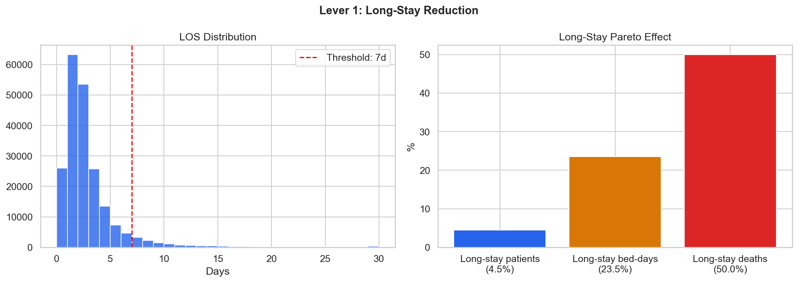
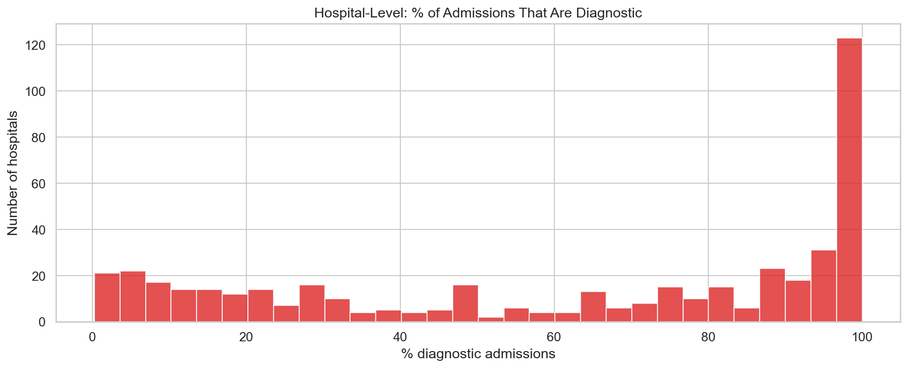
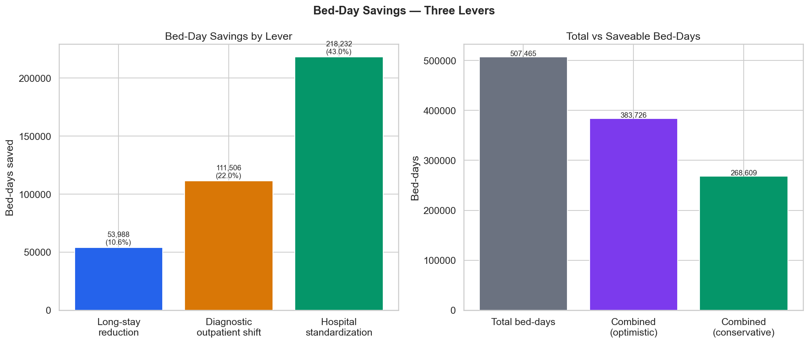

# Relatório 06 — Economia de Leitos (RQ4)

> **Pergunta de Pesquisa:** Quantos leitos podem ser liberados?

**Notebook:** `notebooks/06_bed_savings.ipynb`
**Tipo:** Modelagem de cenários com três alavancas independentes
**Escopo:** 507.465 leitos-dia totais · 206.500 internações · 3 alavancas de economia

---

## Método

Três alavancas de redução de leitos-dia foram modeladas independentemente:
1. **Alavanca 1 — Redução de longas permanências:** Reduzir LOS de pacientes >7 dias para 7 dias
2. **Alavanca 2 — Migração de diagnósticos para ambulatorial:** Eliminar internações puramente diagnósticas (deslocando-as para SIA)
3. **Alavanca 3 — Padronização hospitalar:** Se cada hospital igualasse a mediana de LOS do seu grupo de comparabilidade

Os cenários foram computados de forma independente e depois combinados com ajuste de sobreposição.

---

## Principais Achados

### 1. Alavanca 1 — Longas Permanências: 53.988 Leitos-Dia (10,6%)

Apenas 4,5% dos pacientes (9.330) ficam internados mais de 7 dias, mas consomem **23,5%** de todos os leitos-dia (119.298). Se esses pacientes tivessem alta no 7º dia, o sistema economizaria **53.988 leitos-dia** — equivalente a 10,6% da capacidade total.

### 2. Alavanca 2 — Migração Diagnóstica: 111.506 Leitos-Dia (22,0%)

As 41.487 internações diagnósticas (20,1% do volume) geram **111.506 leitos-dia** (22,0% do total). Se todas fossem realizadas ambulatorialmente, esses leitos-dia seriam completamente liberados.

Essa é a maior alavanca individual, mas também a mais agressiva — nem todas as internações diagnósticas são evitáveis. Pacientes que chegam pela urgência com dor aguda frequentemente precisam de internação para investigação diagnóstica.

### 3. Alavanca 3 — Padronização Hospitalar: 218.232 Leitos-Dia (43,0%)

Se cada hospital igualasse a mediana de LOS do seu grupo de comparabilidade, o sistema economizaria **218.232 leitos-dia** — 43,0% do total. Esta é a alavanca com maior potencial teórico.

### 4. Cenários Combinados

| Cenário | Leitos-Dia Economizados | % do Total |
|---|---|---|
| Conservador (alavancas parcialmente sobrepostas) | **268.608** | **52,9%** |
| Otimista (todas as alavancas independentes) | **383.726** | **75,6%** |

---

## Discussão

**Resposta à RQ4:** O sistema poderia liberar entre 52,9% e 75,6% de seus leitos-dia com três intervenções: reduzir longas permanências, migrar diagnósticos para ambulatorial e padronizar práticas hospitalares.

A padronização hospitalar (Alavanca 3) é a mais impactante (43% do total) e a mais viável politicamente — não requer mudanças na tabela SIGTAP nem novos investimentos, apenas disseminação de melhores práticas entre hospitais do mesmo perfil.

A migração diagnóstica (Alavanca 2) tem o segundo maior impacto (22%), mas requer investimento em capacidade ambulatorial e revisão de protocolos de admissão. A redução de longas permanências (Alavanca 1) é a menor alavanca (10,6%), mas atinge o grupo mais vulnerável — pacientes com internações prolongadas que concentram 50% dos óbitos (ver RQ5).

**Essas estimativas são limites superiores.** Na prática, a economia realizável seria menor por conta de restrições operacionais, justificativas clínicas legítimas para internações longas, e limitações de capacidade ambulatorial.

## Ameaças à Validade

- **Cenário teórico:** Reduzir todos os LOS >7d para 7d ignora casos com justificativa clínica (pós-operatório complicado, sepse, comorbidades)
- **Migração diagnóstica total é irreal:** Muitos exames diagnósticos são realizados durante internações de urgência que não podem ser evitadas
- **Mediana como referência:** Usar a mediana do grupo como meta assume que 50% dos hospitais estão "acima" — o que é matematicamente verdadeiro mas clinicamente simplista
- **Sem ajuste por gravidade:** Pacientes mais graves naturalmente ficam mais tempo. Sem dados de gravidade, não é possível separar LOS excessivo de LOS clinicamente justificado
- **Sobreposição entre alavancas:** Algumas economias se sobrepõem (ex.: um paciente diagnóstico com longa permanência é contado em ambas as alavancas)

---

## Resumo de Resultados — RQ4

| Pergunta | Resultado | Evidência |
|---|---|---|
| Se os piores igualassem a mediana, quanto se salva? | **218.232 leitos-dia (43%)** | Alavanca 3: padronização hospitalar dentro de grupos de comparabilidade |
| Quais são as três maiores alavancas? | **Padronização > Diagnóstico > Longa permanência** | Alavanca 1: 53.988 (10,6%). Alavanca 2: 111.506 (22,0%). Alavanca 3: 218.232 (43,0%) |
| As economias são realistas? | **São limites superiores** | Cenário conservador combinado: 268.608 (52,9%). Restrições operacionais e justificativas clínicas reduzem a economia real |
| Qual alavanca é mais viável politicamente? | **Padronização hospitalar** | Não requer novos investimentos nem mudanças no SIGTAP — apenas disseminação de melhores práticas |

**Conclusão:** O sistema poderia liberar entre 52,9% e 75,6% dos leitos-dia com três intervenções. A padronização hospitalar é a mais impactante (43%) e viável. A migração diagnóstica para ambulatorial tem alto potencial (22%) mas requer investimento. Todas são limites superiores teóricos.

---

## Glossário

| Sigla | Significado |
|---|---|
| **LOS** | Length of Stay — tempo de permanência hospitalar (em dias) |
| **SUS** | Sistema Único de Saúde — sistema público de saúde brasileiro |
| **SIH** | Sistema de Informações Hospitalares — base de dados de internações |
| **SIA** | Sistema de Informações Ambulatoriais — base de dados ambulatoriais |
| **SIGTAP** | Sistema de Gerenciamento da Tabela de Procedimentos do SUS |
| **BRL / R$** | Real brasileiro — moeda corrente |
| **RQ** | Research Question — pergunta de pesquisa |
