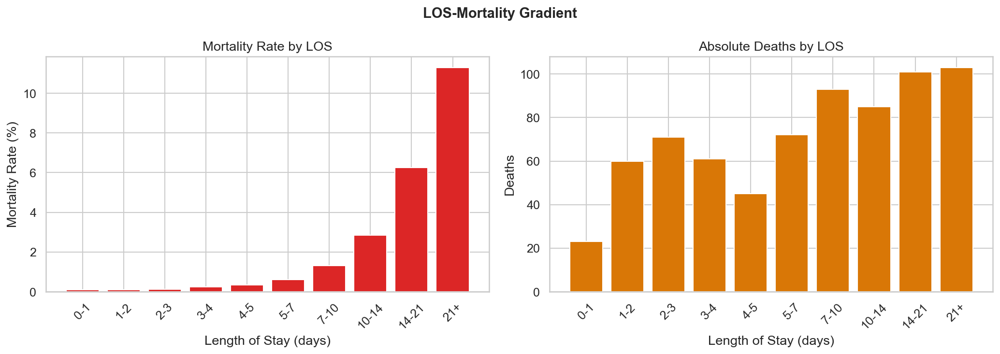
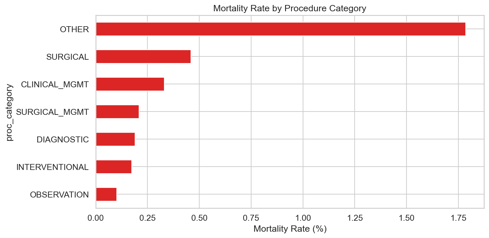
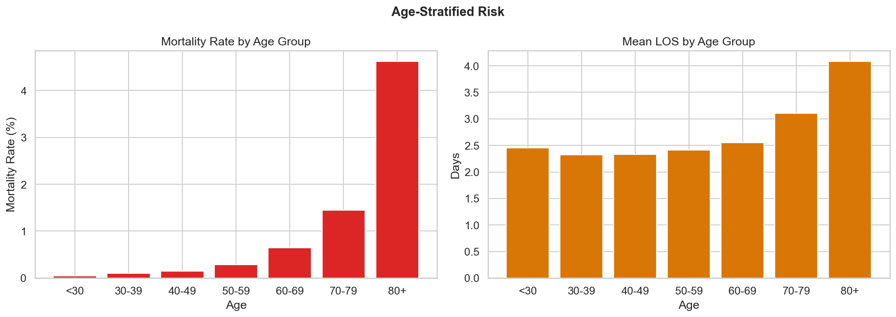

# Relatório 07 — Mortalidade e Desfechos (RQ5)

> **Pergunta de Pesquisa:** Podemos reduzir a mortalidade?

**Notebook:** `notebooks/07_mortality_outcomes.ipynb`
**Tipo:** Análise de gradiente LOS-mortalidade com estratificação por idade e uso de UTI
**Escopo:** 714 óbitos · 206.500 internações · mortalidade geral 0,346%

---

## Método

1. **Gradiente LOS-mortalidade:** Mortalidade computada por faixa de LOS (0–1, 1–2, ..., 21+ dias)
2. **Mortalidade por procedimento:** Taxa de mortalidade por categoria funcional
3. **Risco estratificado por idade:** Seis faixas etárias com taxa de mortalidade e LOS médio
4. **Utilização de UTI:** Comparação de mortalidade entre pacientes com e sem uso de UTI
5. **Vidas salvávies:** Estimativa contrafactual — se todos os pacientes com >7 dias de internação tivessem a mortalidade dos pacientes com ≤7 dias

---

## Principais Achados

### 1. Gradiente LOS-Mortalidade: 21x Maior para Longas Permanências

A mortalidade escala dramaticamente com o tempo de internação:

| LOS | Mortalidade | Óbitos | Internações |
|---|---|---|---|
| 0–1 dias | 0,09% | 23 | 26.023 |
| 1–2 dias | 0,09% | 60 | 63.282 |
| 2–3 dias | 0,13% | 71 | 53.468 |
| 5–7 dias | 0,61% | 72 | 11.892 |
| 7–10 dias | **1,32%** | 93 | 7.022 |
| 14–21 dias | **6,26%** | 101 | 1.613 |
| 21+ dias | **11,29%** | 103 | 912 |

A mortalidade para pacientes >7 dias (3,83%) é **21,1x maior** que para pacientes ≤7 dias (0,18%).

### 2. Mortalidade por Categoria de Procedimento

| Categoria | Mortalidade | Óbitos | LOS Médio |
|---|---|---|---|
| OUTROS | **1,79%** | 63 | 4,03d |
| CIRÚRGICO | 0,46% | 408 | 2,61d |
| MANEJO CLÍNICO | 0,33% | 77 | 2,39d |
| MANEJO CIRÚRGICO | 0,21% | 43 | 2,25d |
| DIAGNÓSTICO | 0,19% | 79 | 2,69d |
| INTERVENCIONISTA | 0,17% | 35 | 2,13d |
| OBSERVAÇÃO | 0,10% | 9 | 0,58d |

Procedimentos cirúrgicos concentram 57% dos óbitos (408 de 714). A categoria "OUTROS" tem a maior mortalidade (1,79%), mas são casos raros e geralmente complexos.

### 3. Risco Cresce Exponencialmente com a Idade

| Faixa Etária | Mortalidade | Óbitos | LOS Médio |
|---|---|---|---|
| <30 | 0,05% | 15 | 2,45d |
| 30–39 | 0,10% | 40 | 2,32d |
| 40–49 | 0,15% | 72 | 2,33d |
| 50–59 | 0,29% | 130 | 2,42d |
| 60–69 | 0,65% | 195 | 2,55d |
| 70–79 | **1,45%** | 157 | 3,11d |
| 80+ | **4,62%** | 105 | 4,08d |

Pacientes com 80+ anos têm mortalidade **95x maior** que pacientes <30 anos. A faixa 60–69 concentra o maior número absoluto de óbitos (195).

### 4. UTI: 2,5% dos Pacientes, 82x Mais Mortalidade

| Grupo | Mortalidade | LOS Médio | Internações |
|---|---|---|---|
| Sem UTI | 0,15% | 2,30d | 201.422 |
| Com UTI | **8,21%** | 8,54d | 5.078 |

Apenas 2,5% das internações usam UTI, mas com mortalidade 55x maior e LOS 3,7x mais longo.

### 5. Vidas Potencialmente Salvávies: 340

Se os 9.330 pacientes com >7 dias de internação tivessem a mortalidade dos pacientes com ≤7 dias (0,18% vs 3,83%), o sistema teria **340 mortes a menos**.

**ATENÇÃO:** Isso é correlação, não causalidade. Pacientes que ficam mais tempo estão mais doentes — a longa permanência é consequência da gravidade, não causa da morte. A estimativa de 340 vidas é um limite superior teórico.

---

## Discussão

**Resposta à RQ5:** Sim, é possível reduzir a mortalidade, mas com ressalvas importantes. O gradiente LOS-mortalidade (21,1x) é forte e consistente, mas reflete confundimento por gravidade — pacientes mais doentes ficam mais tempo E morrem mais. A estimativa de 340 vidas salvávies assume que a longa permanência causa a mortalidade, o que é apenas parcialmente verdadeiro.

As intervenções mais promissoras são:
1. **Identificação precoce de pacientes de alto risco** (idosos >70, uso de UTI) para protocolos de cuidado intensificado
2. **Redução de longas permanências evitáveis** — não por alta precoce, mas por resolução cirúrgica mais rápida
3. **Atenção especial ao grupo 60–79 anos** — concentra 352 óbitos (49% do total) e tem LOS médio elevado

O achado sobre UTI (2,5% dos pacientes, 8,21% de mortalidade) sugere que o sistema identifica corretamente os casos graves, mas a taxa de mortalidade em UTI de 8,21% merece investigação — pode estar dentro do esperado para complicações urológicas ou pode indicar admissão tardia à UTI.

## Ameaças à Validade

- **Confundimento por gravidade:** O gradiente LOS-mortalidade é confundido pela gravidade do caso. Pacientes que ficam >7 dias provavelmente têm complicações que justificam tanto a longa permanência quanto a maior mortalidade
- **Mortalidade intra-hospitalar apenas:** O SIH registra apenas óbitos durante a internação. Mortes pós-alta não são capturadas, subestimando a mortalidade real
- **Sem dados de comorbidades:** Idade é um proxy grosseiro de risco. Sem dados de comorbidades (diabetes, hipertensão, insuficiência renal), a estratificação é incompleta
- **Estimativa de vidas salvas é um limite superior:** Assume que reduzir LOS reduziria mortalidade na mesma proporção, o que ignora que parte da mortalidade é inevitável
- **Sem vinculação de pacientes:** Não é possível identificar readmissões ou mortes em internações subsequentes pelo mesmo problema

---

## Glossário

| Sigla | Significado |
|---|---|
| **LOS** | Length of Stay — tempo de permanência hospitalar (em dias) |
| **SUS** | Sistema Único de Saúde — sistema público de saúde brasileiro |
| **SIH** | Sistema de Informações Hospitalares — base de dados de internações |
| **UTI** | Unidade de Terapia Intensiva |
| **IC** | Intervalo de Confiança |
| **BRL / R$** | Real brasileiro — moeda corrente |
| **RQ** | Research Question — pergunta de pesquisa |
