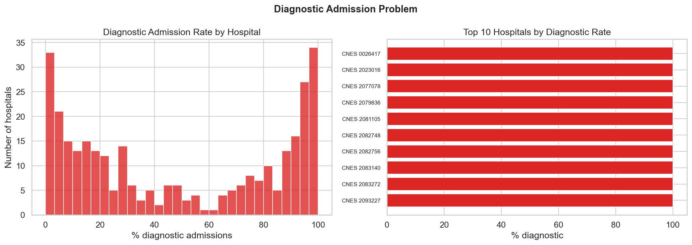
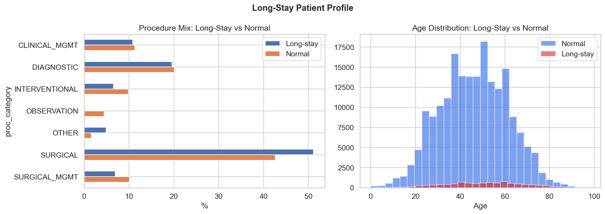
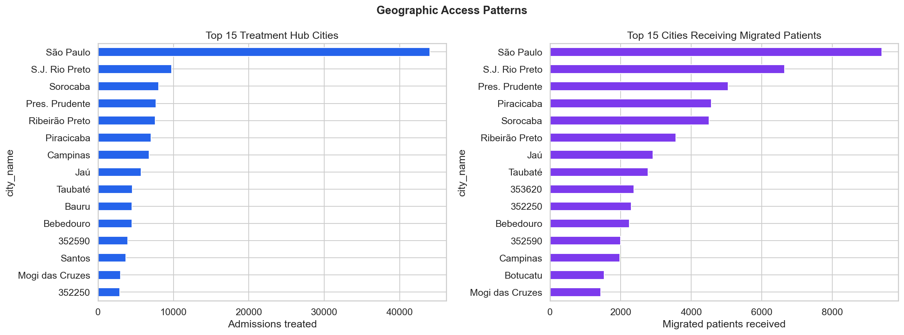
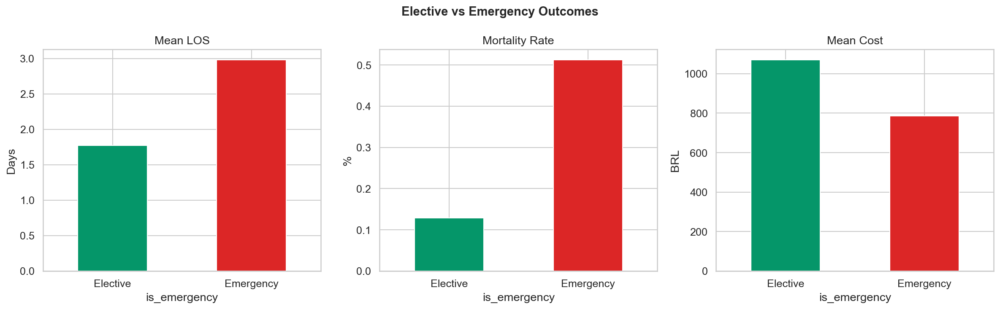
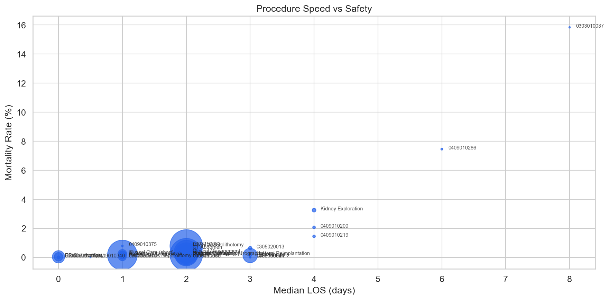

# Relatório 08 — Velocidade de Resolução (RQ6)

> **Pergunta de Pesquisa:** O que torna a resolução do tratamento mais rápida?

**Notebook:** `notebooks/08_resolution_speed.ipynb`
**Tipo:** Investigação de três gargalos operacionais
**Escopo:** 206.500 internações · 143 hospitais com >50% diagnóstico · 305 cidades · taxa de migração 36,5%

---

## Método

Três gargalos de resolução foram investigados:
1. **Internações diagnósticas:** Por que pacientes são internados para exames que poderiam ser ambulatoriais?
2. **Longas permanências (Pareto):** Quem são os 4,5% de pacientes que ficam >7 dias e o que os diferencia?
3. **Acesso geográfico e escolha de procedimento:** Como a localização e o tipo de procedimento afetam a velocidade de resolução?

---

## Principais Achados

### 1. O Problema Diagnóstico: 143 Hospitais com >50% de Internações para Exames

Das 41.487 internações diagnósticas (20,1% do total), a grande maioria ocorre em hospitais com alta concentração de diagnósticos:

| Grupo | Hospitais |
|---|---|
| >50% internações diagnósticas | **143** |
| >90% internações diagnósticas | **76** |

76 hospitais têm mais de 90% de suas internações por cálculo renal dedicadas a exames de imagem. Esses hospitais provavelmente não realizam cirurgia — recebem pacientes, fazem exames e transferem. Cada internação diagnóstica ocupa um leito por em média 2,69 dias para um procedimento que, com infraestrutura ambulatorial, seria feito em horas.

### 2. Longas Permanências: 4,5% dos Pacientes, 23,5% dos Leitos-Dia

| Grupo | Internações | LOS Médio | Idade | % Urgência | Mortalidade | Custo Médio | Leitos-Dia |
|---|---|---|---|---|---|---|---|
| Normal (≤7d) | 197.170 | 1,97d | 46,1 | 55,4% | 0,18% | R$847 | 388.167 |
| Longa (>7d) | 9.330 | **12,79d** | 50,1 | **79,5%** | **3,83%** | R$2.232 | 119.298 |

Pacientes de longa permanência são:
- **Mais velhos** (50,1 vs 46,1 anos)
- **Muito mais de urgência** (79,5% vs 55,4%)
- **21x mais mortais** (3,83% vs 0,18%)
- **2,6x mais caros** (R$2.232 vs R$847)

### 3. Acesso Geográfico: 36,5% dos Pacientes São Tratados Fora de Casa

| Métrica | Valor |
|---|---|
| Cidades com capacidade cirúrgica | 138 |
| Cidades sem capacidade cirúrgica | 167 |
| Taxa de migração | **36,5%** |

Mais de um terço dos pacientes precisa viajar para outro município para receber tratamento. Das 305 cidades analisadas, 167 (54,8%) não possuem nenhum hospital com capacidade cirúrgica para litíase renal. Isso significa que pacientes dessas cidades dependem de encaminhamento — e quando o encaminhamento falha, acabam no pronto-socorro (ver RQ7).

### 4. Urgência vs Eletiva: O Efeito no Tempo de Resolução

| Tipo | Internações | LOS Médio | LOS Mediano | Mortalidade | Custo Médio |
|---|---|---|---|---|---|
| Eletiva | 89.828 | 1,78d | 1,0d | 0,13% | R$1.071 |
| Urgência | 116.672 | **2,98d** | 2,0d | **0,51%** | R$786 |

Internações eletivas são 40% mais rápidas (1,78d vs 2,98d) e 4x mais seguras (0,13% vs 0,51% mortalidade). O custo mais alto da eletiva (R$1.071 vs R$786) reflete o mix de procedimentos — eletivas incluem mais cirurgias remuneradas (ver RQ3).

### 5. Resolução por Procedimento

Procedimentos que resolvem mais rápido e com melhor desfecho são os que combinam técnica minimamente invasiva com admissão eletiva — especialmente ureteroscopia eletiva (LOS mediano: 1 dia).

---

## Discussão

**Resposta à RQ6:** Três fatores determinam a velocidade de resolução:

1. **Via de admissão (urgência vs eletiva):** Eletivas são 40% mais rápidas e 4x mais seguras. Converter urgências evitáveis em eletivas (ver RQ7) é a intervenção mais direta.

2. **Capacidade cirúrgica local:** 167 cidades sem cirurgia forçam 36,5% dos pacientes a migrar. Pacientes que não conseguem migrar acabam na urgência local com internações diagnósticas que não resolvem o problema.

3. **Protocolo de admissão:** 143 hospitais com >50% de internações diagnósticas estão usando internação como substituto de ambulatório. Isso ocupa leitos sem resolver o caso — o paciente ainda precisará de cirurgia em outro momento e lugar.

O padrão é claro: **resolução rápida = eletiva + cirúrgica + hospital com capacidade**. Toda barreira a esse caminho (falta de vaga eletiva, falta de cirurgião, falta de acesso geográfico) gera internações mais longas, mais caras e mais perigosas.

## Ameaças à Validade

- **Capacidade cirúrgica como binário:** Classificar cidades como "com" ou "sem" capacidade cirúrgica simplifica a realidade — há gradações de capacidade, filas e disponibilidade
- **Migração pode ser positiva:** Pacientes que migram para centros de referência podem ter melhores desfechos justamente por receberem tratamento especializado
- **Internações diagnósticas nem sempre são evitáveis:** Pacientes com cólica renal aguda necessitam de internação para controle de dor e diagnóstico diferencial
- **LOS mediano de 1 dia para eletivas pode subestimar a complexidade:** Casos mais simples são mais fáceis de agendar como eletiva, criando viés de seleção

---

## Glossário

| Sigla | Significado |
|---|---|
| **LOS** | Length of Stay — tempo de permanência hospitalar (em dias) |
| **SUS** | Sistema Único de Saúde — sistema público de saúde brasileiro |
| **SIH** | Sistema de Informações Hospitalares — base de dados de internações |
| **SIA** | Sistema de Informações Ambulatoriais |
| **CNES** | Cadastro Nacional de Estabelecimentos de Saúde |
| **UTI** | Unidade de Terapia Intensiva |
| **BRL / R$** | Real brasileiro — moeda corrente |
| **RQ** | Research Question — pergunta de pesquisa |
