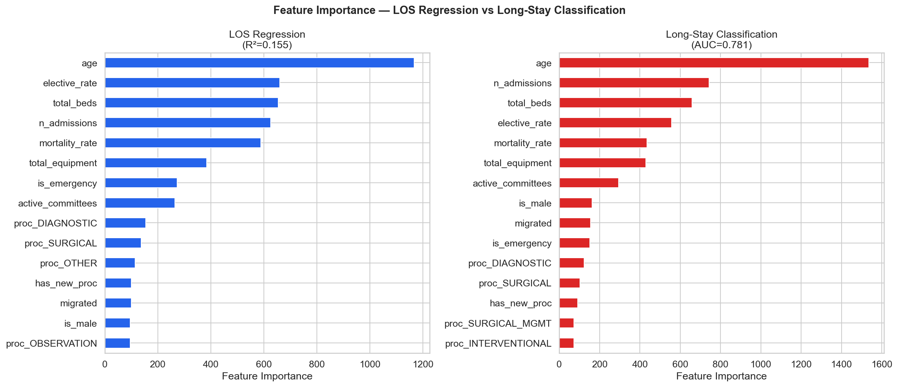
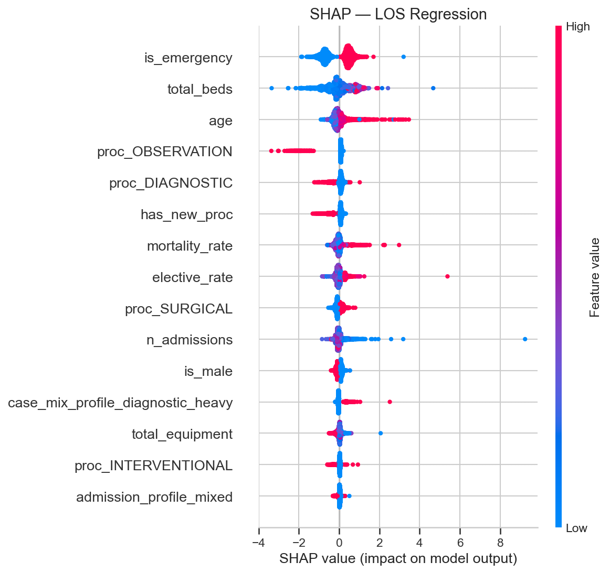
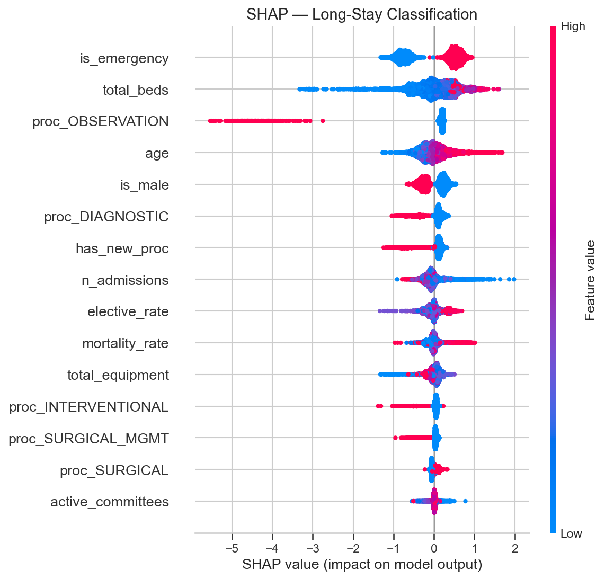

# Relatório 09 — Modelos de Machine Learning (Suporte)

> **Propósito:** Modelos preditivos de suporte às perguntas de pesquisa — não é uma investigação em si, mas uma ferramenta analítica.

**Notebook:** `notebooks/09_ml_models.ipynb`
**Tipo:** LightGBM + SHAP com validação cruzada 5-fold
**Escopo:** 206.500 internações · 32 features · 2 modelos (regressão LOS + classificação longa permanência)

---

## Método

Dois modelos LightGBM foram treinados com validação cruzada 5-fold:
1. **Regressão de LOS:** Predição do tempo de permanência em dias
2. **Classificação de longa permanência:** Classificação binária (>7 dias vs ≤7 dias)

32 features foram usadas, incluindo: idade, sexo, tipo de admissão (urgência/eletiva), procedimento, migração, características do hospital (volume, taxa de eletivas, leitos, equipamentos, equipe, comitês).

Interpretação via SHAP (SHapley Additive exPlanations).

---

## Principais Achados

### 1. Regressão de LOS: R² = 0,155

| Métrica | Valor |
|---|---|
| R² (5-fold CV) | **0,155 ± 0,024** |
| MAE | **1,49 ± 0,08 dias** |

O R² baixo (15,5%) indica que as features disponíveis explicam apenas uma fração pequena da variância do LOS. Isso não é surpreendente — fatores clínicos não capturados no SIH (tamanho do cálculo, presença de infecção, comorbidades) provavelmente dominam a determinação do LOS individual.

O erro absoluto médio de 1,49 dias é relevante — para um LOS médio de 2,4 dias, o modelo erra em mais de metade do valor.

### 2. Classificação de Longa Permanência: AUC = 0,781

| Métrica | Valor |
|---|---|
| AUC-ROC (5-fold CV) | **0,781 ± 0,016** |
| Prevalência de longa permanência | **4,5%** |

O modelo de classificação tem desempenho razoável (AUC 0,78), sugerindo que é possível identificar pacientes em risco de longa permanência no momento da admissão, mesmo sem dados clínicos detalhados.

### 3. Features Mais Importantes

A feature mais importante em ambos os modelos é **idade** — consistente com os achados da RQ5 (mortalidade escala exponencialmente com idade).

Outras features relevantes:
- **Tipo de admissão** (urgência vs eletiva) — urgência prediz maior LOS
- **Volume do hospital** — hospitais com mais casos tendem a ser mais eficientes
- **Taxa de eletivas** — hospitais com maior proporção de eletivas têm menor LOS
- **Procedimento realizado** — categoria funcional do procedimento

### 4. Interpretação SHAP

Os gráficos SHAP confirmam as direções esperadas:
- Maior idade → maior LOS e maior risco de longa permanência
- Admissão por urgência → maior LOS
- Procedimentos diagnósticos → efeito moderado no LOS
- Mais leitos hospitalares → efeito misto (hospitais maiores são mais complexos)

---

## Discussão

**O que os modelos dizem:** Os fatores disponíveis no SIH explicam apenas 15,5% da variância do LOS individual, mas conseguem identificar pacientes em risco de longa permanência com AUC de 0,78. Isso significa que um sistema de triagem baseado em idade, tipo de admissão e perfil hospitalar poderia sinalizar pacientes em risco no momento da internação.

**O que os modelos NÃO dizem:** A maior parte da variância do LOS é determinada por fatores clínicos não disponíveis nos dados administrativos — tamanho e localização do cálculo, presença de infecção ou obstrução, comorbidades, resposta ao tratamento inicial.

**Limitação principal:** R² de 0,155 é baixo para uso preditivo individual. O modelo é mais útil para análise de fatores populacionais (quais variáveis importam?) do que para predição caso-a-caso (quanto tempo esse paciente vai ficar?).

## Ameaças à Validade

- **Dados administrativos limitados:** O SIH não contém variáveis clínicas cruciais (gravidade, comorbidades, procedimentos secundários)
- **Validação cruzada sem hold-out temporal:** Os modelos foram validados por amostragem aleatória, não por período temporal. Desempenho em dados futuros pode ser diferente
- **Overfitting potencial:** LightGBM com 32 features em 206K amostras pode capturar padrões espúrios
- **SHAP é descritivo, não causal:** As importâncias SHAP mostram quais features são associadas ao LOS, não o que causa diferenças no LOS

---

## Glossário

| Sigla | Significado |
|---|---|
| **LOS** | Length of Stay — tempo de permanência hospitalar (em dias) |
| **R²** | Coeficiente de determinação — proporção da variância explicada pelo modelo |
| **MAE** | Mean Absolute Error — erro absoluto médio |
| **AUC-ROC** | Area Under the Receiver Operating Characteristic Curve — medida de desempenho de classificação |
| **SHAP** | SHapley Additive exPlanations — método de interpretação de modelos de ML |
| **LightGBM** | Light Gradient Boosting Machine — algoritmo de ML por ensemble de árvores |
| **CV** | Cross-Validation — validação cruzada |
| **SIH** | Sistema de Informações Hospitalares |
| **RQ** | Research Question — pergunta de pesquisa |
