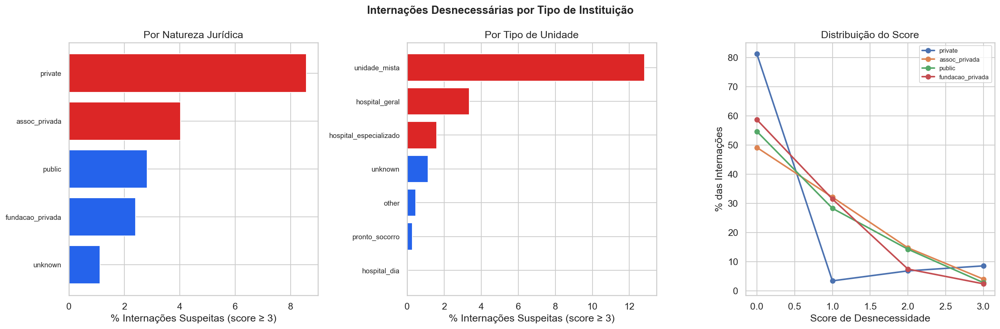
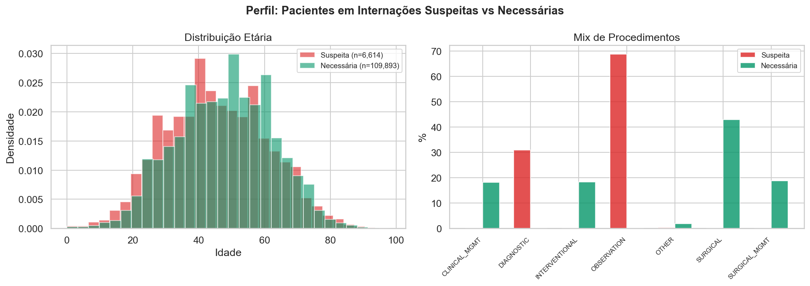

# Relatório 09 — Internações Potencialmente Desnecessárias (RQ9)

> **Pergunta de Pesquisa:** Como identificar e quantificar internações desnecessárias? Quem faz mais? Que tipo de instituição? Por quê?

**Notebook:** `notebooks/09_unnecessary_admissions.ipynb`
**Tipo:** Análise composita com score de desnecessidade, ranking hospitalar, análise institucional e cruzamento com eficiência
**Escopo:** 206.500 internações · 283 hospitais analisados (≥30 internações) · 510 hospitais no total

---

## Método

1. **Score de desnecessidade (0–4)** — cada internação recebe flags binárias cuja soma indica probabilidade de ser ambulatorial.
   O score distingue procedimentos terapêuticos (cirúrgicos/intervencionistas) de não-terapêuticos (diagnósticos/observação).
   D0 e baixo custo só contam como indicadores de desnecessidade quando o procedimento **não foi terapêutico** —
   uma ureteroscopia D0 é eficiência clínica, não desnecessidade:
   - `sem_tratamento`: proc_category ∈ {DIAGNOSTIC, OBSERVATION} — não houve intervenção terapêutica
   - `sia_disponível`: mesmo procedimento existe na produção ambulatorial (SIA)
   - `d0_sem_terapia`: DIAS_PERM = 0 **AND** procedimento não é cirúrgico/intervencionista
   - `baixo_custo_sem_terapia`: VAL_TOT < P25 **AND** procedimento não é cirúrgico/intervencionista
2. **Ranking hospitalar** — % de internações com score ≥ 3, com natureza jurídica e tipo de unidade
3. **Análise por tipo de instituição** — comparação por natureza jurídica (pública, assoc. privada, fundação) e tipo de unidade (hospital geral, dia, especializado, PS)
4. **Testes de hipótese** — Kruskal-Wallis para efeito da natureza jurídica, Spearman para correlações
5. **Cruzamento com eficiência** — score de eficiência (RQ3/5) vs taxa de desnecessidade

---

## Principais Achados

### 1. Distribuição do Score

| Score | Internações | % | Custo | LOS | Mortalidade | % Terapêutico |
|---|---|---|---|---|---|---|
| 0 (necessária) | 109.893 | 53,2% | R$135,1M | 2,3d | 0,25% | **80%** |
| 1 (baixa suspeita) | 62.165 | 30,1% | R$45,7M | 3,0d | 0,63% | 67% |
| 2 (moderada) | 27.828 | 13,5% | R$6,0M | 2,2d | 0,14% | 0% |
| ≥3 (alta suspeita) | 6.614 | **3,2%** | **R$937k** | **0,0d** | 0,09% | **0%** |

**Achado:** Internações de alta suspeita são exclusivamente não-terapêuticas (0% terapêutico),
com LOS = 0 e custo baixo — genuinamente candidatas a ambulatório. Nenhuma cirurgia D0 é classificada
como suspeita; o score protege procedimentos terapêuticos.

### 2. Quem Faz Mais — Top 20 Hospitais

| Hospital | Natureza | N | Susp% | Sem Trat.% | D0 não-terap.% | Terapêutico% |
|---|---|---|---|---|---|---|
| Hosp. Universitário UFSCar | privada | 59 | **39,0%** | 69,5% | 61,0% | 8,5% |
| Santa Casa de Monte Alto | assoc. privada | 393 | **28,5%** | 36,1% | 32,8% | 52,4% |
| Hosp. São Luiz | fundação | 137 | **25,5%** | 75,9% | 27,7% | 21,9% |
| Un. Retaguarda Urg. Diag. | pública | 48 | **25,0%** | 100,0% | 25,0% | 0,0% |
| Santa Casa de Vinhedo | assoc. privada | 1.101 | 22,5% | 28,5% | 47,1% | 19,4% |
| Hosp. Univ. São Francisco (Bragança) | assoc. privada | 1.975 | 22,3% | 30,0% | 22,4% | 68,6% |
| Hosp. Geral Vila Penteado | pública | 172 | 20,9% | 95,9% | 22,1% | 0,0% |
| Hosp. de Urgência | pública | 670 | 16,0% | 96,9% | 16,7% | 0,0% |

**Padrões:**

- **Hospitais 100% diagnósticos (Un. Retaguarda, Hosp. Vila Penteado, Hosp. Urgência):** Não fazem terapia — internam para exame porque não há ambulatório. Taxa de 16–25%
- **Hospitais universitários (UFSCar):** Alta taxa de D0 não-terapêutico (61%) e baixo % terapêutico (8,5%). Internações para ensino ou protocolo institucional
- **Santa Casas (Monte Alto, Vinhedo):** Mix de diagnóstico e terapêutico. Parte das internações D0 são genuinamente desnecessárias
- **Hospitais-dia:** Taxa de 0,0% — são 99,9% terapêuticos (cirurgias D0), e o score corretamente reconhece isso como eficiência

### 3. Tipo de Instituição — Quem Faz Mais?

#### Por Natureza Jurídica

| Natureza | N | Hospitais | Susp% | Sem Trat.% | Terapêutico% | Mortalidade | Custo |
|---|---|---|---|---|---|---|---|
| Privada | 292 | 5 | **8,6%** | 15,1% | 79,8% | 0,00% | R$652 |
| Assoc. Privada (Santa Casas) | 75.091 | 257 | **4,0%** | 25,0% | 60,7% | 0,45% | R$896 |
| Pública | 100.724 | 211 | 2,8% | 26,6% | 62,2% | 0,29% | R$881 |
| Fundação Privada | 30.215 | 23 | 2,4% | 15,1% | 69,3% | 0,27% | R$1.045 |

Kruskal-Wallis: H = 1.453, **p ≈ 0** — diferença altamente significativa.

**Achado:** As associações privadas (Santa Casas) lideram com 4,0%, seguidas por públicos (2,8%). Fundações privadas têm a menor taxa (2,4%) — são centros de referência com alta taxa terapêutica (69,3%).

#### Por Tipo de Unidade

| Tipo | N | Susp% | Sem Trat.% | Terapêutico% | Mortalidade |
|---|---|---|---|---|---|
| Unidade Mista | 39 | **12,8%** | 94,9% | 0,0% | 0,00% |
| Hospital Geral | 194.988 | 3,4% | 25,1% | 61,3% | 0,36% |
| Hospital Especializado | 3.098 | 1,6% | 12,4% | 82,8% | 0,19% |
| Hospital Dia | 7.264 | **0,0%** | 0,0% | 99,9% | 0,00% |

**Achado:** Unidades mistas lideram (12,8%) porque são 94,9% não-terapêuticas — genuinamente diagnósticas.
Hospitais-dia têm 0,0% de suspeitas porque são 99,9% terapêuticos (cirurgias D0 = eficiência).
Hospitais especializados têm a menor taxa (1,6%) entre os que fazem diagnóstico — resolvem cirurgicamente.

### 4. Por Quê?

#### Incentivo Financeiro (H9.1)
A correlação entre uso de procedimentos SIA-disponíveis e taxa de desnecessidade **não é significativa** (ρ = 0,032, p = 0,59). O incentivo financeiro não explica a taxa de internações genuinamente desnecessárias.

#### Falta de Infraestrutura Ambulatorial (H9.2)
Hospitais com >30% de procedimentos sem tratamento AND >70% de emergência — proxy para "não tem AME na região" — têm taxa de desnecessidade significativamente maior: 4,5% vs 3,5% (Mann-Whitney U, p = 0,031). **A hipótese de infraestrutura se confirma.** Hospitais que recebem muita urgência e fazem muitos diagnósticos sem terapia internam porque não há alternativa ambulatorial na região.

#### Decomposição dos Flags
| Flag | Prevalência Geral | Entre Suspeitas (≥3) |
|---|---|---|
| Sem tratamento (diag/obs) | 24,4% | **99,7%** |
| D0 sem terapia | 5,4% | **100%** |
| Baixo custo sem terapia | 16,7% | **100%** |
| Disponível SIA | 20,2% | 0,3% |

**Todo caso de alta suspeita é: sem tratamento + D0 + baixo custo.** Isso descreve internações genuinamente diagnósticas — o paciente entrou, fez exame, saiu no mesmo dia, pagou pouco. O flag SIA quase não contribui (0,3%), porque os procedimentos SIA-disponíveis são cirúrgicos e o score os protege.

### 5. Impacto

| Categoria | Internações | % do Total | Custo | % do Custo | Leitos-dia |
|---|---|---|---|---|---|
| Alta suspeita (≥3) | 6.614 | 3,2% | R$937k | **0,5%** | **0** |
| Moderada (=2) | 27.828 | 13,5% | R$6,0M | 3,2% | 62.000 |

**H9.3 Confirmada:** O impacto financeiro é pequeno (0,5% do custo total). O impacto administrativo permanece real — internações D0 não-terapêuticas passam por todo o processo de admissão hospitalar sem necessidade.

As internações moderadas (score = 2) são mais relevantes: 27.828 casos (13,5%) com custo de R$6M. São pacientes não-terapêuticos (0% terapêutico) que ficam em média 2,2 dias — candidatos a protocolos ambulatoriais.

### 6. Cruzamento: Eficiência vs Desnecessidade

| Quadrante | Hospitais | % |
|---|---|---|
| Eficiente + Poucas desnecessárias | 55 | 20% |
| Eficiente + Muitas desnecessárias | 81 | **30%** |
| Ineficiente + Poucas desnecessárias | 80 | **30%** |
| Ineficiente + Muitas desnecessárias | 55 | 20% |

Correlação: ρ = +0,269 (p < 10⁻⁵).

**Interpretação:** Hospitais eficientes tendem a ser centros de alto volume que também processam
internações diagnósticas (exames pré-operatórios, estadiamento) que poderiam ser ambulatoriais.
Centros eficientes concentram TANTO os melhores resultados cirúrgicos QUANTO o maior volume de
diagnósticos desnecessariamente internados — um achado real, não um artefato do score.

### 7. Tendência Temporal

| Ano | Internações | Suspeitas | Susp% | Score Médio | Sem Trat.% | D0 não-terap.% | Terapêutico% |
|---|---|---|---|---|---|---|---|
| 2016 | 14.234 | 447 | 3,1% | 0,80 | 31,8% | 4,1% | 55,0% |
| 2019 | 17.757 | 554 | 3,1% | 0,75 | 28,6% | 4,2% | 57,6% |
| 2022 | 20.588 | 680 | 3,3% | 0,66 | 23,5% | 5,9% | 62,5% |
| 2025 | 31.362 | 830 | **2,6%** | **0,55** | 19,2% | 6,2% | 68,2% |

Tendência Kendall: τ = +0,055, p = 0,879 — **sem tendência significativa**.

O score médio está caindo (0,80 → 0,55), impulsionado por dois fenômenos:
1. **Queda do % sem tratamento** (31,8% → 19,2%) — menos internações diagnósticas
2. **Aumento do % terapêutico** (55,0% → 68,2%) — mais cirurgias sendo realizadas

O sistema está se tornando mais cirúrgico e menos diagnóstico ao longo do tempo.

### 8. Perfil do Paciente

| Métrica | Suspeita (≥3) | Necessária (0) |
|---|---|---|
| Idade média | 45,3 | 47,8 |
| % Masculino | 48,0% | 46,6% |
| % Emergência | **59,3%** | 37,9% |
| % Migrado | **25,7%** | **41,5%** |
| LOS médio | 0,0d | 2,3d |
| Custo médio | R$142 | R$1.230 |
| Mortalidade | 0,091% | 0,254% |

**Achado:** Pacientes de internações suspeitas são locais (25,7% migrados vs 41,5%) e chegam pela urgência (59,3% vs 37,9%) — reforçando a hipótese de infraestrutura: não há ambulatório na região, o PS é a única opção, e o hospital interna para fazer o exame.

---

## Discussão

**Resposta à RQ9:** Internações potencialmente desnecessárias representam 3,2% do volume (6.614 casos) e apenas 0,5% do custo. O impacto financeiro é mínimo; o achado principal é qualitativo — quem são e por quê.

**Quem faz mais:** Unidades mistas (12,8%) lideram — são quase 100% não-terapêuticas. Hospitais-dia têm 0,0% porque são cirúrgicos. Entre hospitais gerais, Santa Casas (4,0%) superam públicos (2,8%) e fundações (2,4%).

**Por quê:**
1. **Incentivo financeiro** — **não confirmado** (ρ = 0,032, p = 0,59). Procedimentos SIA-disponíveis são cirúrgicos e não contribuem para internações desnecessárias
2. **Falta de infraestrutura** — **confirmada** (p = 0,031). Hospitais com >30% sem tratamento e >70% emergência têm 4,5% de suspeitas vs 3,5% dos demais. A falta de AME/ambulatório na região força internações diagnósticas
3. **Categorização administrativa** — unidades mistas e PS internam para diagnóstico porque não há alternativa. É limitação do sistema, não fraude

**Cruzamento com eficiência:** A correlação positiva (ρ = +0,269) reflete um fenômeno real: centros eficientes são hospitais de alto volume que concentram tanto bons resultados cirúrgicos quanto internações diagnósticas que poderiam ser ambulatoriais.

**Implicação acionável:**
1. **Investir em infraestrutura ambulatorial** (AMEs) nas regiões de hospitais com alta taxa de internação diagnóstica — a falta de alternativa é o principal driver
2. **Focar nas internações moderadas (score = 2)** — são 27.828 casos com LOS = 2,2d, 0% terapêuticos. Candidatos reais a protocolos ambulatoriais
3. **O sistema está melhorando sozinho** — a taxa de terapêuticos subiu de 55% (2016) para 68% (2025)

## Ameaças à Validade

- **"Desnecessário" é um julgamento, não um fato clínico.** Uma internação diagnóstica D0 pode ser clinicamente apropriada (paciente chegou à noite, precisou de observação)
- **Baixo custo ≠ desnecessário.** Alguns procedimentos reais são baratos (observação, cateterismo simples)
- **O score não detecta sobrecodificação.** Se um hospital registra consulta ambulatorial como internação cirúrgica, escapa da detecção
- **SIA-disponibilidade não prova que o caso era ambulatorial.** A gravidade dentro do mesmo procedimento varia
- **A classificação terapêutico/não-terapêutico depende da taxonomia de procedimentos.** Reclassificações alteram o score

---

## Resumo de Resultados — RQ9

### Hipóteses Formais

| Hipótese | Resultado | Evidência |
|---|---|---|
| **H9.1:** Hospitais com maior utilização do prêmio SIH/SIA têm mais internações desnecessárias | **Não confirmada** | ρ = 0,032, p = 0,59. Procedimentos SIA-disponíveis são cirúrgicos e o score os protege |
| **H9.2:** Hospitais sem infraestrutura ambulatorial têm mais internações diagnósticas | **Confirmada** | Hospitais >30% sem tratamento AND >70% emergência: 4,5% vs 3,5% (Mann-Whitney U, p = 0,031) |
| **H9.3:** Impacto financeiro pequeno (<5%), impacto em leitos-dia desproporcional | **Confirmada** | Score ≥3: 0,5% do custo (R$937k), 0 leitos-dia (tudo D0). Score 2: 3,2% custo, 62k leitos-dia |
| **H9.4:** Natureza jurídica prediz taxa de desnecessidade | **Confirmada** | Santa Casas: 4,0%. Públicos: 2,8%. Fundações: 2,4%. Kruskal-Wallis p ≈ 0. Hospital-dia: 0,0% |

### Perguntas de Pesquisa

| Pergunta | Resultado | Evidência |
|---|---|---|
| Quantas internações são desnecessárias? | **3,2% de alta suspeita** (6.614 casos) | 0% terapêuticas, LOS = 0, custo R$937k |
| Quem faz mais? | **Unidades mistas (12,8%), Hosp. Universitário UFSCar (39%)** | Unidades 100% diagnósticas sem alternativa ambulatorial |
| Por quê? | **Falta de infraestrutura ambulatorial** | Incentivo financeiro descartado. Hospitais sem AME/ambulatório forçam internação |
| O sistema está melhorando? | **Sim** — tendência natural | % terapêutico: 55% (2016) → 68% (2025). Score médio: 0,80 → 0,55 |

**Conclusão:** Internações desnecessárias são um fenômeno real mas pequeno (3,2%, R$937k). O driver é **falta de infraestrutura ambulatorial**, não incentivo financeiro. O sistema está se corrigindo naturalmente com o aumento de procedimentos cirúrgicos. O score protege corretamente hospitais-dia e cirurgias D0 eficientes.

---

## Glossário

| Sigla | Significado |
|---|---|
| **Score de desnecessidade** | Soma de 4 flags binárias (0–4) que indicam se uma internação não-terapêutica poderia ter sido ambulatorial. D0 e baixo custo só contam se o procedimento não foi terapêutico |
| **D0** | Alta no mesmo dia da internação (DIAS_PERM = 0) |
| **SIA** | Sistema de Informações Ambulatoriais — faturamento de procedimentos ambulatoriais |
| **SIH** | Sistema de Informações Hospitalares — faturamento de internações |
| **AME** | Ambulatório Médico de Especialidades — unidade ambulatorial do SUS em SP |
| **Santa Casa** | Irmandade de Misericórdia / Associação Privada — entidade filantrópica que opera hospitais |
| **Kruskal-Wallis** | Teste não-paramétrico para comparar distribuições de múltiplos grupos |
| **Spearman ρ** | Correlação de postos — mede associação monotônica entre duas variáveis |
| **LOS** | Length of Stay — tempo de permanência hospitalar |
| **P25** | Percentil 25 — o valor abaixo do qual estão 25% das observações |
| **NAT_JUR** | Natureza Jurídica — classificação legal da instituição (CNES) |
