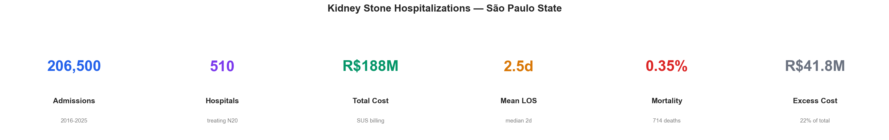
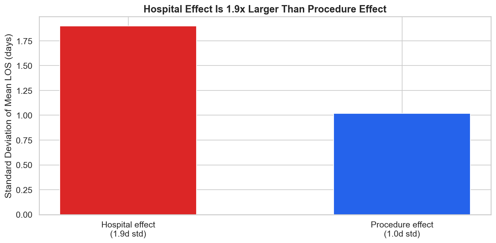
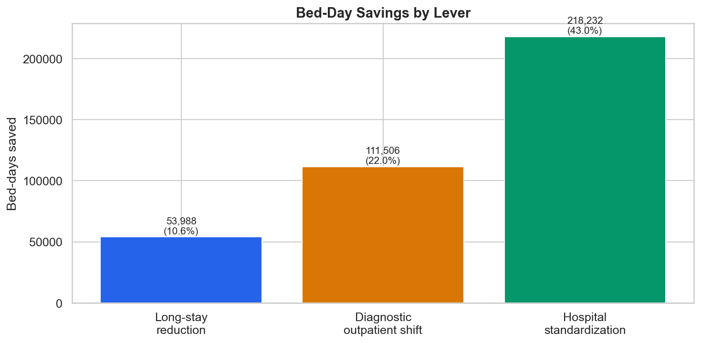
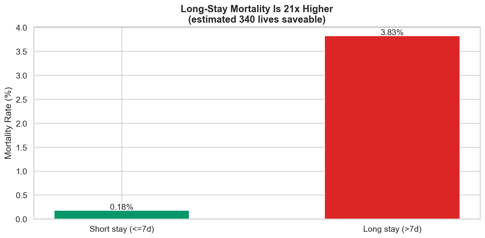
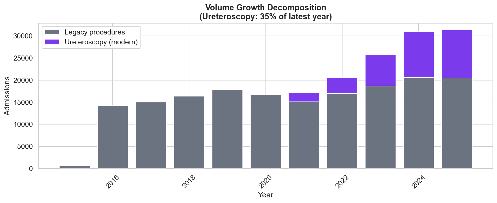
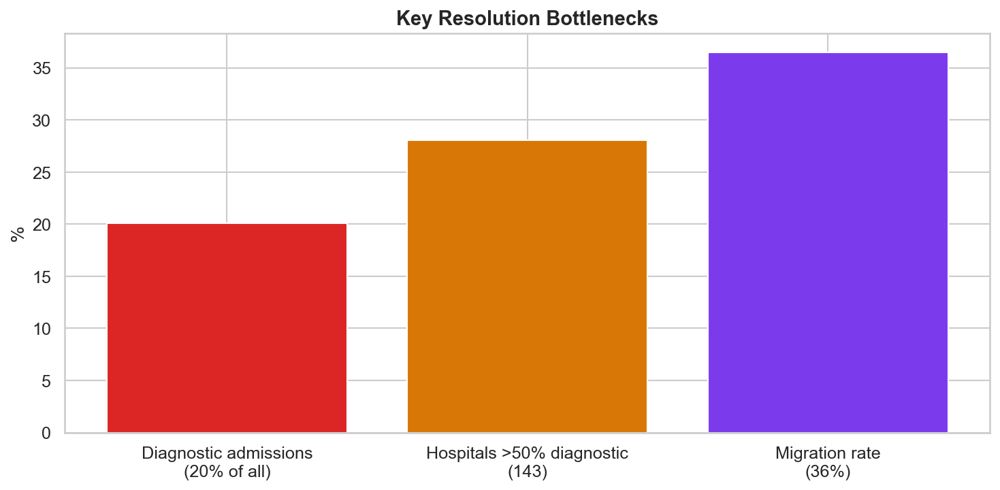

# Relatório 10 — Resumo Executivo

> **Propósito:** Síntese visual e narrativa para tomadores de decisão. Um gráfico por achado-chave, conectando a história de RQ1 a RQ8.

**Notebook:** `notebooks/10_executive_summary.ipynb`
**Tipo:** Síntese — não análise nova
**Escopo:** Consolidação dos achados de 10 notebooks de pesquisa

---

## Números-Chave

| Métrica | Valor |
|---|---|
| Internações analisadas | **206.500** |
| Hospitais | **510** |
| Custo total (2016–2025) | **R$187,8M** |
| Custo excedente | **R$41,8M (22%)** |
| Óbitos totais | **714** |
| Vidas potencialmente salvávies | **340** |
| Leitos-dia economizáveis (conservador) | **268.608** |

---

## Achados Principais

### 1. O Hospital Importa Mais que o Procedimento (RQ2)

A variação de LOS entre hospitais é **1,9x maior** que entre categorias de procedimento. Dois hospitais realizando a mesma cirurgia podem diferir mais em tempo de internação do que a diferença entre uma cirurgia e um exame. Padronizar práticas entre hospitais do mesmo perfil é a alavanca mais impactante.

### 2. Três Alavancas para Liberar Leitos (RQ4)

| Alavanca | Leitos-Dia | % do Total |
|---|---|---|
| Padronização hospitalar | 218.232 | 43,0% |
| Migração diagnóstica para ambulatorial | 111.506 | 22,0% |
| Redução de longas permanências | 53.988 | 10,6% |
| **Cenário conservador combinado** | **268.608** | **52,9%** |

### 3. Mortalidade Escala com o Tempo de Internação (RQ5)

Pacientes com >7 dias de internação têm mortalidade **21x maior** que pacientes com ≤7 dias (3,83% vs 0,18%). A cauda de 4,5% de longa permanência concentra 50% de todos os óbitos.

### 4. Volume Impulsionado por Política Pública, Não Epidemia (RQ1)

A Portaria SAES/MS nº 1.127/2020 introduziu a ureteroscopia no SIGTAP. Esse procedimento responde por **63,7%** de todo o crescimento de volume. O crescimento foi **aditivo** — reflete demanda reprimida sendo atendida, não aumento de incidência.

### 5. Urgência como Falha do Sistema (RQ7)

Todos os 20 procedimentos comparáveis mostram penalidade de urgência estatisticamente significativa. Cidades sem capacidade cirúrgica têm **96,6%** de taxa de urgência. O sistema perde **114.811 leitos-dia** e potencialmente **375 vidas** por forçar pacientes para a via de urgência.

### 6. Incentivos Desalinhados Degradam Qualidade (RQ8)

Hospitais com alto índice de desperdício (quartil Q4) têm LOS **75% maior** que hospitais eficientes (Q1). 12 hospitais com >50% de internações diagnósticas também apresentam desempenho cirúrgico **64% pior** — sugerindo problemas institucionais sistêmicos.

---

## Recomendações

### Curto Prazo (0–6 meses)
1. **Auditar os 10 hospitais com pior sobre-desempenho** (LOS 4,75d vs esperado 3,70d) — candidatos imediatos para melhoria operacional
2. **Auditar os 12 hospitais com >50% diagnósticos E mau desempenho cirúrgico** — possível problema de qualidade assistencial
3. **Monitorar a taxa de urgência por cidade** — 54 cidades com >96% urgência precisam de acesso a agendamento eletivo

### Médio Prazo (6–18 meses)
4. **Expandir capacidade de ureteroscopia** — 139 hospitais adotaram em 5 anos, mas a demanda continua crescendo
5. **Criar protocolos de fast-track** para procedimentos com LOS esperado ≤1 dia (ureteroscopia, ESWL, observação)
6. **Revisar a tabela SIGTAP** — reduzir o prêmio de internação para procedimentos diagnósticos (5,5x–22x mais caro que ambulatorial)

### Longo Prazo (18+ meses)
7. **Descentralizar capacidade cirúrgica** — 167 cidades sem cirurgia forçam migração e urgência
8. **Investir em capacidade ambulatorial diagnóstica** — reduzir as 41.487 internações diagnósticas/ano
9. **Sistema de triagem baseado em risco** — modelo preditivo (AUC 0,78) pode sinalizar pacientes em risco de longa permanência no momento da internação

---

## Glossário

| Sigla | Significado |
|---|---|
| **LOS** | Length of Stay — tempo de permanência hospitalar (em dias) |
| **SUS** | Sistema Único de Saúde — sistema público de saúde brasileiro |
| **SIH** | Sistema de Informações Hospitalares |
| **SIA** | Sistema de Informações Ambulatoriais |
| **SIGTAP** | Sistema de Gerenciamento da Tabela de Procedimentos do SUS |
| **CNES** | Cadastro Nacional de Estabelecimentos de Saúde |
| **ESWL** | Extracorporeal Shock Wave Lithotripsy — litotripsia extracorpórea |
| **UTI** | Unidade de Terapia Intensiva |
| **AUC** | Area Under the Curve — medida de desempenho de modelo preditivo |
| **BRL / R$** | Real brasileiro — moeda corrente |
| **RQ** | Research Question — pergunta de pesquisa |
