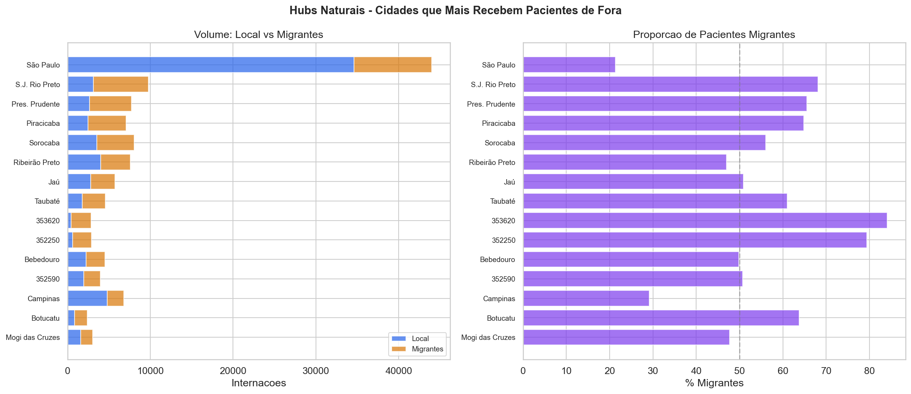
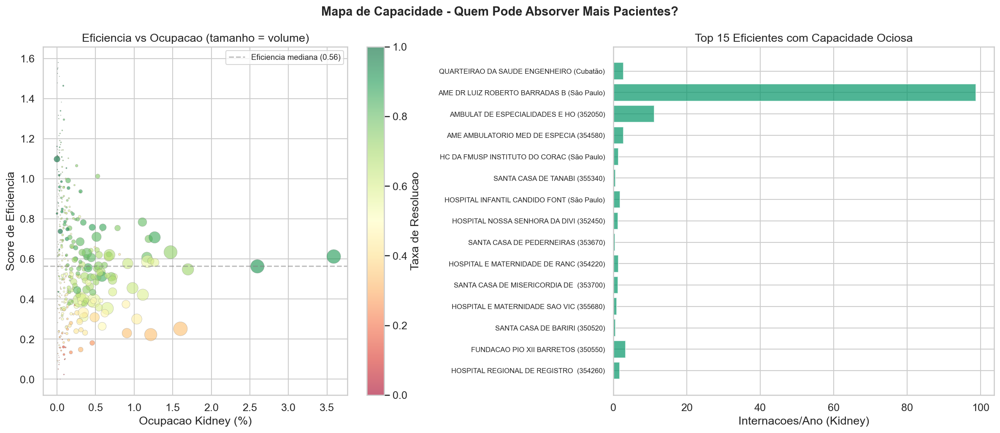
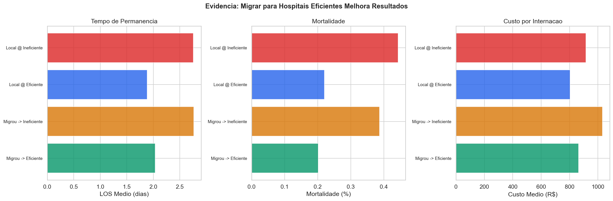
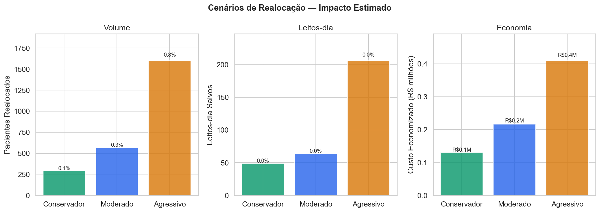
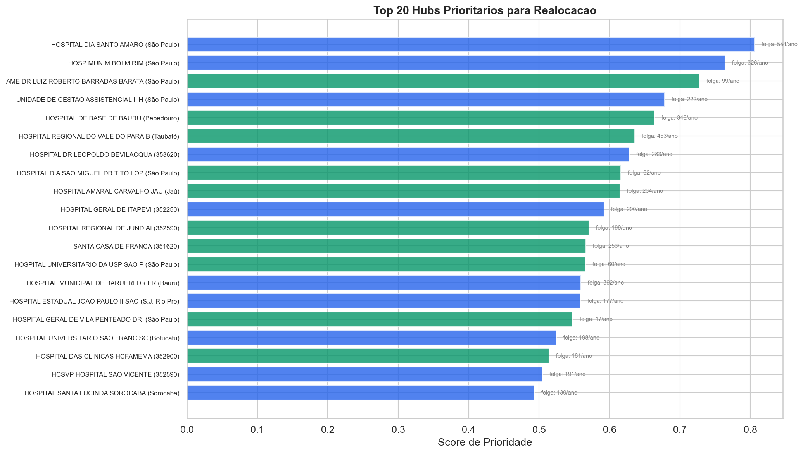

# Relatório 10 — Realocação Inteligente de Pacientes (RQ10)

> **Pergunta de Pesquisa:** Como realocar pacientes de litíase renal a centros mais eficientes sem exceder a capacidade hospitalar?

**Notebook:** `notebooks/10_patient_reallocation.ipynb`
**Tipo:** Análise de fluxo geográfico, capacidade hospitalar, simulação de realocação com restrições
**Escopo:** 206.500 internações · 404 hospitais com score de eficiência · 49 microrregiões com destinos disponíveis

---

## Método

1. **Matriz origem-destino** — cruzamento `MUNIC_RES × MUNIC_MOV` para mapear os fluxos existentes de migração de pacientes
2. **Identificação de hubs naturais** — cidades que mais recebem migrantes, volume local vs externo
3. **Capacidade ociosa** — estimativa com base em leitos totais (CNES) e volume atual de kidney, com limite conservador (hospital pode dobrar caseload kidney sem impacto estrutural, pois kidney usa ~2-5% dos leitos)
4. **Evidência observacional** — comparação de outcomes (LOS, mortalidade, custo) entre 4 grupos: local@eficiente, local@ineficiente, migrou→eficiente, migrou→ineficiente
5. **Simulação de realocação** — pacientes terapêuticos em hospitais abaixo da mediana de eficiência são redirecionados ao hospital eficiente mais próximo (mesma microrregião IBGE), respeitando limites de capacidade
6. **Cenários** — conservador (top 10 hubs), moderado (top 30), agressivo (todos com capacidade)

---

## Principais Achados

### 1. Fluxos de Migração — Quem Vai Para Onde

36,5% dos pacientes (75.293) já migram para tratamento em outra cidade.

**Top 5 fluxos:**

| Origem | Destino | Volume | LOS | Terapêutico% |
|---|---|---|---|---|
| Guarulhos | São Paulo | 1.424 | 3,0d | 67,5% |
| Limeira | Piracicaba | 761 | 0,9d | 99,5% |
| (Avaré) | Botucatu | 704 | 1,5d | 69,5% |
| Pindamonhangaba | Taubaté | 612 | 2,5d | 97,2% |
| (Lençóis Paulista) | Bauru | 592 | 2,8d | 33,3% |

**Top 5 hubs naturais (cidades que mais recebem migrantes):**

| Cidade | Migrantes | Origens | Vol. Total | % Migrante |
|---|---|---|---|---|
| São Paulo | 9.400 | 313 | 43.995 | 21,4% |
| S.J. Rio Preto | 6.649 | 173 | 9.759 | **68,1%** |
| Pres. Prudente | 5.049 | 92 | 7.705 | **65,5%** |
| Piracicaba | 4.571 | 61 | 7.049 | **64,8%** |
| Sorocaba | 4.502 | 74 | 8.030 | 56,1% |

**Achado:** São Paulo lidera em volume absoluto, mas é predominantemente local (21% migrante). S.J. Rio Preto, Pres. Prudente e Piracicaba são hubs de referência regionais — mais de 60% dos seus pacientes são migrantes.

### 2. Capacidade Ociosa

104 hospitais eficientes têm capacidade para absorver mais pacientes (de 202 eficientes no total). A capacidade ociosa total estimada é de ~7.585 internações/ano.

**Hospitais eficientes com maior capacidade:**

| Hospital | Cidade | Eficiência | Leitos | Vol/ano | Resolução |
|---|---|---|---|---|---|
| Hosp. Dia Santo Amaro | São Paulo | 0,61 | — | 554 | 90,2% |
| Hosp. Regional do Vale | Taubaté | 0,63 | — | 453 | 73,3% |
| Hosp. Mun. Barueri | Bauru | 0,59 | — | 392 | 54,9% |
| Hosp. Base Bauru | Bebedouro | 0,71 | — | 346 | 85,4% |
| Hosp. Mun. M'Boi Mirim | São Paulo | 0,62 | — | 326 | 68,4% |

### 3. Evidência Observacional — Migrar para Hospitais Eficientes Funciona

| Grupo | N | LOS | Mortalidade | Custo | Terapêutico% |
|---|---|---|---|---|---|
| Local @ Eficiente | 48.593 | **1,9d** | **0,22%** | R$804 | 58,4% |
| Local @ Ineficiente | 82.614 | 2,8d | 0,44% | R$916 | 56,5% |
| Migrou → Eficiente | 27.260 | **2,0d** | **0,20%** | R$863 | 71,9% |
| Migrou → Ineficiente | 48.033 | 2,8d | 0,39% | R$1.032 | 72,2% |

**H10.1 Confirmada:** Pacientes que migram para hospitais eficientes têm resultados significativamente melhores:
- LOS: −0,7 dias vs local@ineficiente (p < 10⁻²⁸¹)
- Mortalidade: −0,24 pp vs local@ineficiente (p < 10⁻⁸)
- Custo: não significativo (p = 1,0) — o custo é comparável

**Pacientes migrados são diferentes:** 72% terapêuticos (vs 57% locais) — quem migra já tende a buscar tratamento cirúrgico, não diagnóstico.

**H10.4 Não confirmada:** Migrantes NÃO buscam cidades eficientes (ρ = −0,373, p < 10⁻⁷). Buscam cidades **grandes**. São Paulo recebe mais migrantes que qualquer outra cidade, mas não é a mais eficiente. A migração segue tamanho e infraestrutura, não qualidade.

### 4. Simulação de Realocação

| Cenário | Pacientes | Destinos | Leitos-dia Salvos | % do Total | Custo Salvo | Mortes Evitáveis |
|---|---|---|---|---|---|---|
| Conservador (top 10) | 294 | 10 | 49 | 0,01% | R$130k | 1,0 |
| Moderado (top 30) | 564 | 30 | 64 | 0,01% | R$216k | 1,4 |
| Agressivo (todos) | 1.601 | 49 | 206 | 0,04% | R$410k | 2,2 |

**Contexto:** Total do sistema: 507.465 leitos-dia, R$187,8M, 714 óbitos.

**H10.3 Não confirmada:** Mesmo o cenário agressivo salva apenas 0,04% dos leitos-dia — muito abaixo dos 5% esperados. O principal limitador é a capacidade: apenas 49 microrregiões (32%) têm hospitais eficientes com folga, e a folga por hospital é limitada.

**Achado central:** O problema não é falta de eficiência — é falta de escala. Os hospitais eficientes já operam com volume significativo. Para ampliar o impacto, seria necessário **criar capacidade** (novos leitos, novas unidades ambulatoriais), não apenas **redistribuir pacientes**.

### 5. Hubs Prioritários

| Hospital | Cidade | Eficiência | Folga/ano | Migrantes | Resolução |
|---|---|---|---|---|---|
| Hosp. Dia Santo Amaro | São Paulo | 0,61 | 554 | 9.400 | 90,2% |
| Hosp. Mun. M'Boi Mirim | São Paulo | 0,62 | 326 | 9.400 | 68,4% |
| AME Dr. Luiz Roberto | São Paulo | 1,10 | 99 | 9.400 | 100% |
| Hosp. Base Bauru | Bebedouro | 0,71 | 346 | 2.248 | 85,4% |
| Hosp. Regional Vale Paraíba | Taubaté | 0,63 | 453 | 2.778 | 73,3% |

**Top 5 cidades-hub:**

| Cidade | Hospitais | Folga Total | Eficiência Média | Migrantes |
|---|---|---|---|---|
| São Paulo | múltiplos | alta | 0,71 | 9.400 |
| Taubaté | 1 | 453 | 0,63 | 2.778 |
| Jaú | 1 | 234 | 0,71 | 2.916 |
| Bebedouro | 1 | 346 | 0,71 | 2.248 |
| Jundiaí | 1 | 199 | 0,78 | 2.001 |

---

## Discussão

**Resposta à RQ10:** A realocação de pacientes para hospitais mais eficientes é viável e produz melhores resultados clinicamente (−0,7d LOS, −0,24pp mortalidade). Entretanto, o impacto sistêmico de uma política de realocação é limitado pela capacidade existente — mesmo o cenário mais agressivo moveria apenas 1.601 pacientes (0,8% do total) com economia de R$410k.

**O que já funciona:** 36,5% dos pacientes já migram, e os que vão para hospitais eficientes têm resultados melhores. Mas a migração atual segue tamanho e infraestrutura (São Paulo atrai mais), não eficiência.

**O que não funciona:**
1. **Capacidade é o gargalo** — hospitais eficientes não têm folga ilimitada. Dobrar o caseload kidney é o máximo conservador
2. **Cobertura geográfica** — apenas 32% das microrregiões têm um hospital eficiente com capacidade ociosa. 68% dos pacientes não têm para onde ir na sua região
3. **Migração não é gratuita** — custos de transporte, suporte familiar, e preferência do paciente não são modelados

**Implicação acionável:**
1. **Investir em capacidade** nos hubs prioritários (São Paulo, Taubaté, Jaú, Bebedouro, Jundiaí) — mais leitos e mais equipes cirúrgicas
2. **Criar AMEs regionais** nas 68% de microrregiões sem hospital eficiente — resolver localmente em vez de migrar
3. **Usar regulação para direcionar casos complexos** — os fluxos naturais já existem, mas não seguem eficiência. Uma regulação baseada em dados poderia direcionar para hubs de alta resolução

## Ameaças à Validade

- **Viés de seleção:** Pacientes que migram podem ser sistematicamente diferentes (mais jovens, mais saudáveis, mais informados) dos que ficam — a comparação de outcomes não é causal
- **Capacidade incompleta:** O modelo usa apenas leitos totais do CNES, não ocupação real. A folga estimada pode não refletir a realidade operacional
- **Microrregião como proxy de distância:** Usar os 4 primeiros dígitos do IBGE é uma aproximação. Municípios na mesma microrregião podem estar a 100km de distância
- **Kidney-only:** A simulação não considera competição com outras especialidades pelos mesmos leitos
- **Custos de transporte:** Não modelados. A economia hospitalar pode ser anulada pelo custo de deslocamento do paciente
- **Cenário estático:** A simulação assume eficiência constante mesmo com aumento de volume — hospitais podem perder eficiência ao receber mais pacientes

---

## Resumo de Resultados — RQ10

### Hipóteses Formais

| Hipótese | Resultado | Evidência |
|---|---|---|
| **H10.1:** Pacientes que migram para hospitais eficientes têm menor LOS e mortalidade | **Confirmada** | −0,7d LOS (p < 10⁻²⁸¹), −0,24pp mortalidade (p < 10⁻⁸) vs local@ineficiente |
| **H10.2:** Capacidade ociosa significativa existe nos hospitais mais eficientes | **Parcialmente confirmada** | 104 hospitais eficientes com folga (~7.585 adm./ano), mas limitada e geograficamente concentrada |
| **H10.3:** Realocação conservadora salva ≥5% dos leitos-dia | **Não confirmada** | Cenário agressivo: 0,04% dos leitos-dia (206 de 507.465). Capacidade é o limitador |
| **H10.4:** Migração natural flui para hospitais mais eficientes | **Não confirmada** | ρ = −0,373 (p < 10⁻⁷). Migrantes buscam cidades **grandes**, não eficientes |

### Perguntas de Pesquisa

| Pergunta | Resultado | Evidência |
|---|---|---|
| Migrar para hospital eficiente funciona? | **Sim** — resultados significativamente melhores | LOS 2,0d (migrou→eficiente) vs 2,8d (local@ineficiente). Mortalidade 0,20% vs 0,44% |
| Existe capacidade para absorver mais? | **Limitada** — 32% das microrregiões | 49 microrregiões com destinos. 68% dos pacientes sem alternativa na sua região |
| Qual o impacto da realocação? | **Modesto** — R$410k economia (cenário agressivo) | 1.601 pacientes, 206 leitos-dia, 2,2 mortes evitáveis |
| O que impede maior impacto? | **Falta de escala, não de eficiência** | Hospitais eficientes já operam com volume alto. Necessário criar capacidade, não redistribuir |

**Conclusão:** A realocação para hospitais eficientes produz melhores resultados clínicos (confirmado observacionalmente), mas o impacto sistêmico é limitado pela **capacidade existente**. O problema não é falta de eficiência — é falta de escala. A solução passa por investir em capacidade nos hubs prioritários e criar AMEs regionais nas 68% de microrregiões sem hospital eficiente disponível.

---

## Glossário

| Sigla | Significado |
|---|---|
| **Hub natural** | Cidade que já recebe alto volume de pacientes migrantes de outras cidades |
| **Capacidade ociosa** | Estimativa de quantos pacientes adicionais um hospital pode absorver sem comprometer operações |
| **Microrregião** | Agrupamento geográfico do IBGE (4 primeiros dígitos do código municipal) usado como proxy de proximidade |
| **Score de eficiência** | resolution_rate / cost_ratio — mede resultado clínico por unidade de custo |
| **Migração** | Paciente cujo MUNIC_RES (residência) difere do MUNIC_MOV (local de tratamento) |
| **LOS** | Length of Stay — tempo de permanência hospitalar |
| **D0** | Alta no mesmo dia da internação |
| **Mann-Whitney U** | Teste não-paramétrico para comparar distribuições de dois grupos independentes |
| **Spearman ρ** | Correlação de postos — mede associação monotônica entre duas variáveis |
| **MUNIC_RES** | Município de residência do paciente (código IBGE) |
| **MUNIC_MOV** | Município onde o tratamento foi realizado (código IBGE) |
