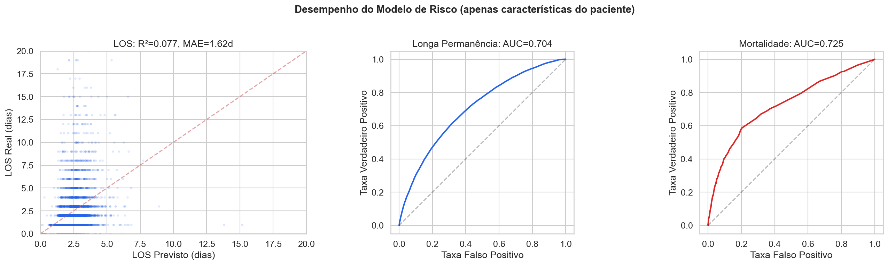
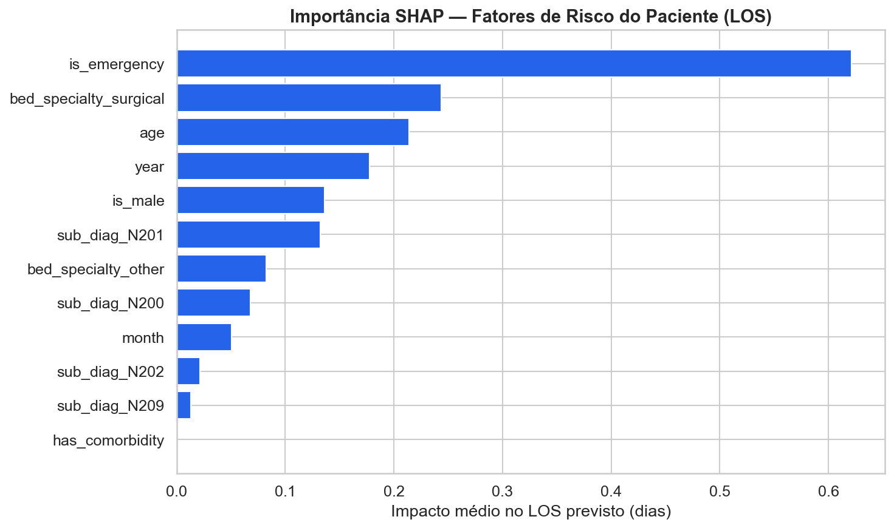
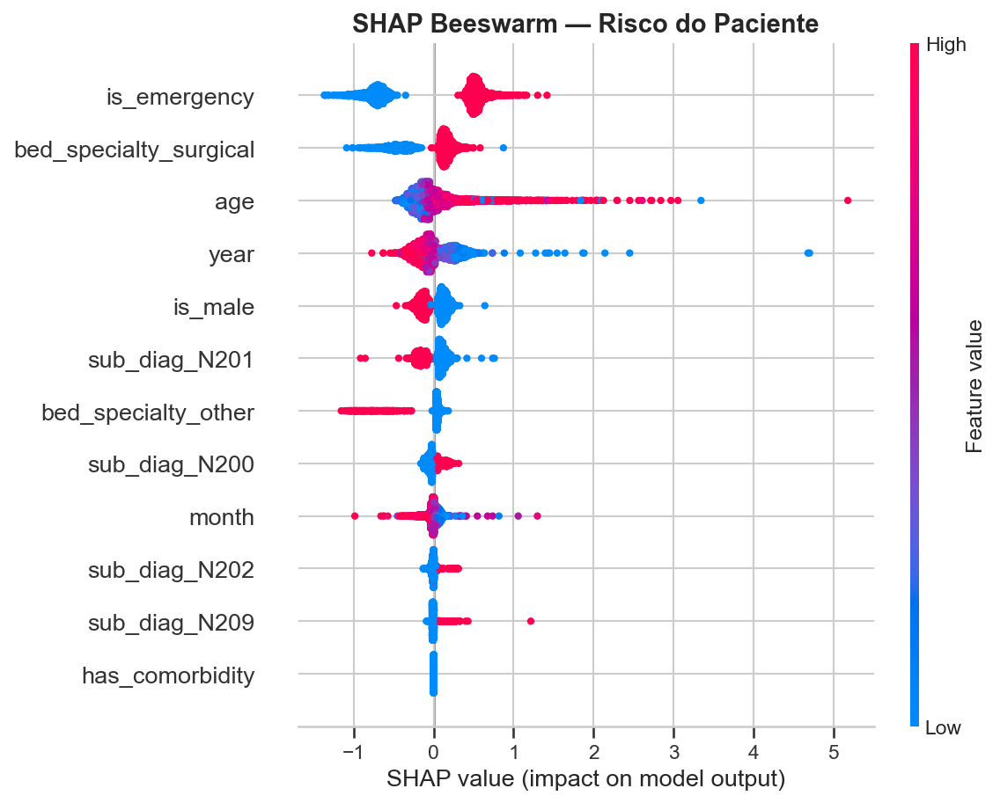
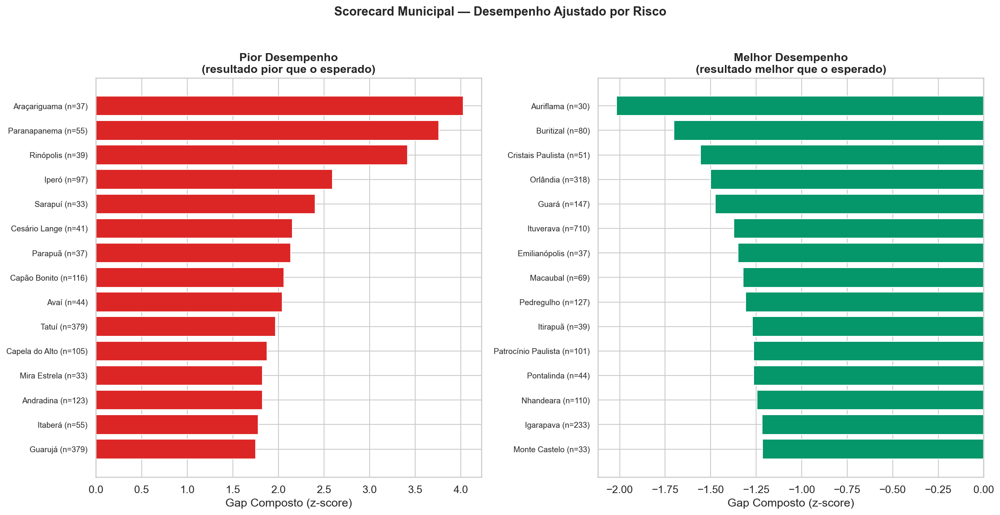
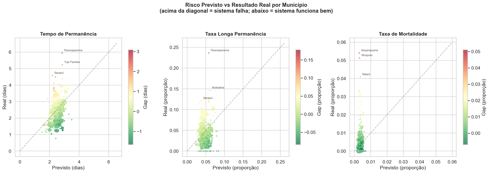
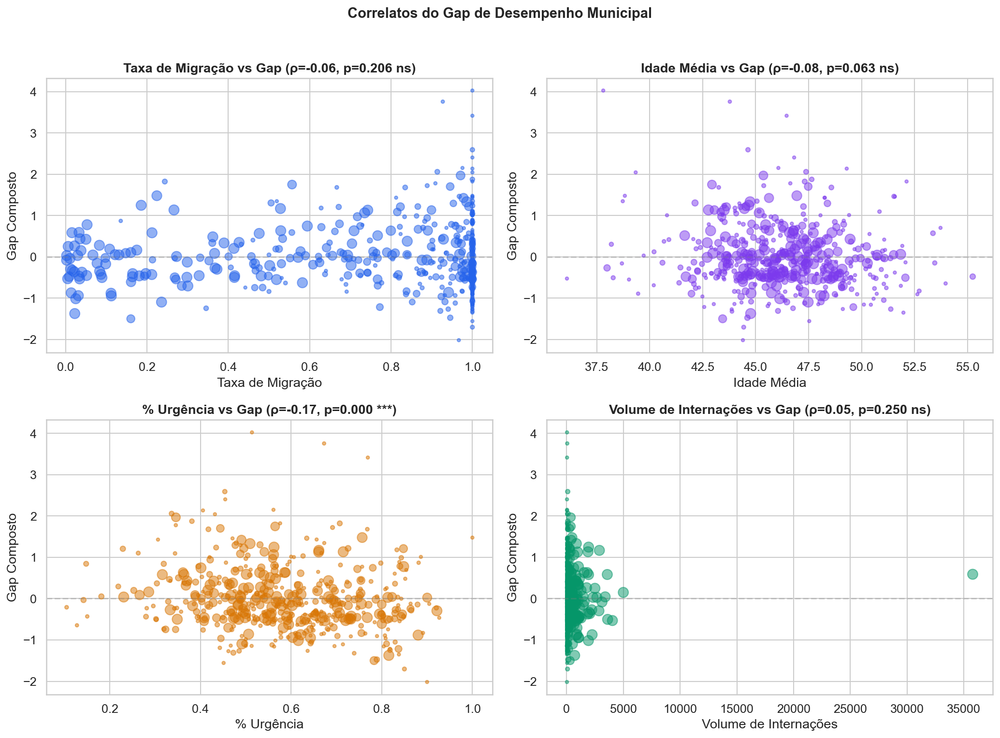
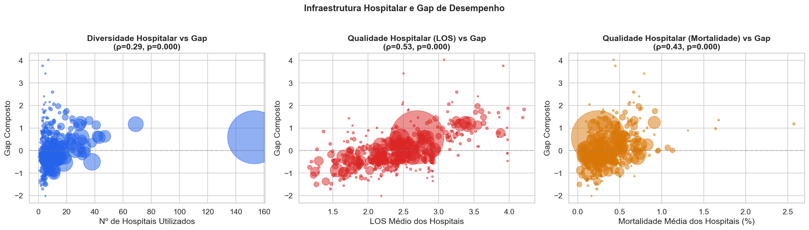
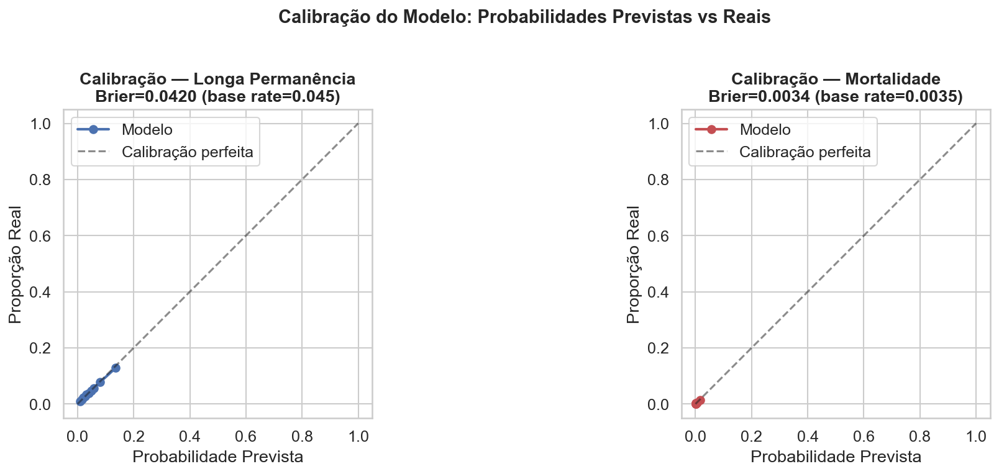
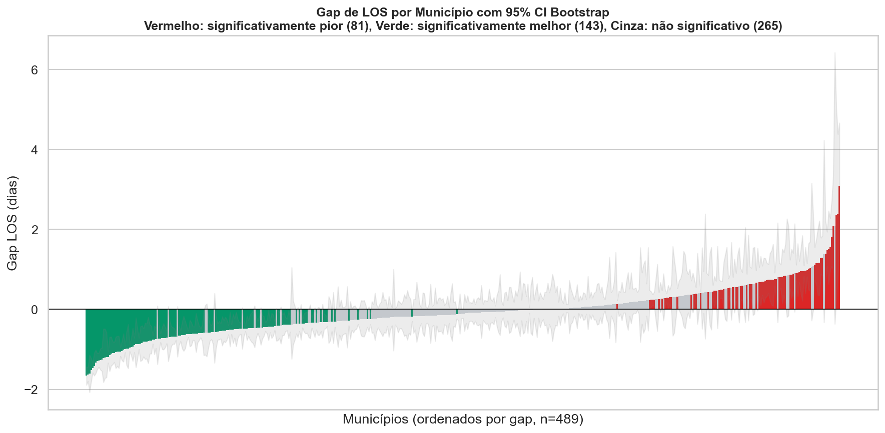
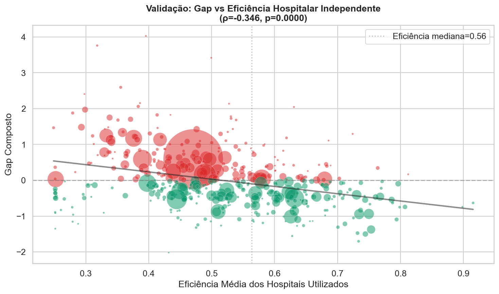

# Relatório 11 — Modelo de Risco Geográfico (RQ11)

> **Propósito:** Identificar municípios onde o sistema de saúde entrega resultados piores (ou melhores) do que o esperado para o perfil de risco dos seus pacientes. Separa o risco inerente do paciente do desempenho do sistema.

**Notebook:** `notebooks/11_city_risk_model.ipynb`
**Tipo:** Modelagem preditiva + análise geográfica
**Escopo:** 206.500 internações, 489 municípios com ≥30 internações

---

## Abordagem

O modelo funciona em três etapas:

1. **Modelo de risco do paciente** — LightGBM treinado apenas com características do paciente (idade, sexo, urgência, sub-diagnóstico, comorbidade, especialidade do leito, ano, mês). Sem informação do hospital.
2. **Agregação por município** — Predições out-of-sample (5-fold CV) agregadas por município de residência (MUNIC_RES).
3. **Análise de gap** — Diferença entre resultado real e previsto. Gap positivo = sistema falha; gap negativo = sistema funciona bem.

A lógica é análoga ao **ajuste de risco** padrão em economia da saúde: dada a população de pacientes de um município, qual resultado seria esperado? Se o resultado real é pior, o sistema local está falhando — não é que a população seja mais doente.

---

## Desempenho do Modelo

| Alvo | Métrica | Valor |
|---|---|---|
| Tempo de Permanência (LOS) | R² | **0,077** |
| Tempo de Permanência (LOS) | MAE | **1,62 dias** |
| Longa Permanência (>7 dias) | AUC | **0,704** |
| Mortalidade | AUC | **0,725** |

O R² baixo é **esperado e desejado** — o modelo captura apenas o risco intrínseco do paciente (7,7% da variância de LOS). Os 92,3% restantes refletem fatores do hospital, protocolo e infraestrutura local. É exatamente essa variância residual que o gap captura. Quanto menor o R², maior o poder do gap para identificar diferenças sistêmicas.

As probabilidades de classificação são **calibradas via isotonic regression** dentro de cada fold de CV, garantindo que as probabilidades previstas correspondam às frequências reais observadas.

---

## Fatores de Risco do Paciente (SHAP)

| Fator | Impacto no LOS |
|---|---|
| **Idade** | Maior impacto — pacientes mais velhos têm LOS previsto mais longo |
| **Ano** | Tendência temporal — LOS previsto diminuiu ao longo dos anos |
| **É urgência** | Admissões de urgência aumentam o LOS previsto |
| **Leito cirúrgico** | Leitos cirúrgicos associados a LOS mais curto |
| **Mês** | Sazonalidade modesta |
| **Sexo masculino** | Efeito pequeno |

---

## Scorecard Municipal

489 municípios analisados (≥30 internações cada). O gap composto combina gap de LOS (40%), longa permanência (30%) e mortalidade (30%), normalizado por z-score.

### 15 Municípios com Pior Desempenho (gap positivo = sistema falha)

| Município | N | LOS Real | LOS Previsto | Gap LOS | Mort Real | Mort Prevista | Gap Composto |
|---|---|---|---|---|---|---|---|
| Araçariguama | 37 | 4,49 | 2,39 | +2,09 | 5,4% | 0,3% | +4,03 |
| Paranapanema | 55 | 5,95 | 2,85 | +3,09 | 0,0% | 0,5% | +3,76 |
| Rinópolis | 39 | 3,44 | 2,59 | +0,85 | 5,1% | 0,3% | +3,42 |
| Iperó | 97 | 4,49 | 2,41 | +2,09 | 1,0% | 0,3% | +2,59 |
| Sarapuí | 33 | 4,58 | 2,20 | +2,38 | 0,0% | 0,3% | +2,40 |
| Cesário Lange | 41 | 4,05 | 2,67 | +1,38 | 2,4% | 0,3% | +2,15 |
| Parapuã | 37 | 3,57 | 2,48 | +1,08 | 2,7% | 0,4% | +2,14 |
| Capão Bonito | 116 | 3,42 | 2,27 | +1,16 | 1,7% | 0,3% | +2,06 |
| Avaí | 44 | 2,91 | 2,48 | +0,43 | 2,3% | 0,2% | +2,05 |
| Tatuí | 379 | 3,77 | 2,29 | +1,48 | 1,1% | 0,3% | +1,97 |
| Capela do Alto | 105 | 4,11 | 2,29 | +1,82 | 0,0% | 0,3% | +1,88 |
| Mira Estrela | 33 | 2,94 | 2,63 | +0,31 | 3,0% | 0,3% | +1,82 |
| Andradina | 123 | 4,38 | 2,87 | +1,51 | 0,0% | 0,4% | +1,82 |
| Itaberá | 55 | 3,22 | 2,15 | +1,07 | 1,8% | 0,4% | +1,78 |
| Guarujá | 379 | 3,64 | 2,36 | +1,29 | 0,8% | 0,3% | +1,75 |

### 15 Municípios com Melhor Desempenho (gap negativo = sistema funciona bem)

| Município | N | LOS Real | LOS Previsto | Gap LOS | Mort Real | Mort Prevista | Gap Composto |
|---|---|---|---|---|---|---|---|
| Auriflama | 30 | 1,90 | 3,50 | −1,60 | 0,0% | 0,5% | −2,02 |
| Buritizal | 80 | 1,41 | 2,94 | −1,52 | 0,0% | 0,5% | −1,70 |
| Cristais Paulista | 51 | 0,76 | 2,43 | −1,66 | 0,0% | 0,3% | −1,56 |
| Orlândia | 318 | 1,27 | 2,89 | −1,63 | 0,3% | 0,4% | −1,50 |
| Guará | 147 | 1,37 | 2,78 | −1,41 | 0,0% | 0,4% | −1,47 |
| Ituverava | 710 | 1,39 | 2,87 | −1,47 | 0,3% | 0,4% | −1,37 |
| Emilianópolis | 37 | 2,54 | 3,12 | −0,58 | 0,0% | 0,7% | −1,35 |
| Macaubal | 69 | 1,86 | 3,00 | −1,15 | 0,0% | 0,4% | −1,32 |
| Pedregulho | 127 | 1,18 | 2,48 | −1,29 | 0,0% | 0,3% | −1,31 |
| Itirapuã | 39 | 1,18 | 2,44 | −1,26 | 0,0% | 0,3% | −1,27 |
| Patrocínio Paulista | 101 | 1,37 | 2,70 | −1,33 | 0,0% | 0,4% | −1,27 |
| Pontalinda | 44 | 1,93 | 2,72 | −0,79 | 0,0% | 0,5% | −1,26 |
| Nhandeara | 110 | 2,24 | 3,31 | −1,07 | 0,0% | 0,5% | −1,25 |
| Igarapava | 233 | 1,89 | 2,90 | −1,01 | 0,0% | 0,5% | −1,22 |
| Monte Castelo | 33 | 2,15 | 2,93 | −0,78 | 0,0% | 0,5% | −1,22 |

---

## Risco Previsto vs Resultado Real

Cada ponto é um município. Tamanho proporcional ao volume de internações. Cor indica o gap (vermelho = pior que esperado, verde = melhor que esperado). Municípios acima da diagonal têm resultados piores do que o modelo prevê para seu perfil de pacientes.

---

## Fatores Associados ao Gap de Desempenho

| Fator | Correlação (ρ) | p-valor | Significância |
|---|---|---|---|
| % Urgência | −0,173 | <0,001 | *** |
| Idade Média | −0,084 | 0,063 | ns |
| Volume de Internações | +0,052 | 0,250 | ns |
| Taxa de Migração | −0,057 | 0,206 | ns |

**Achado-chave:** Com o modelo calibrado, as correlações com fatores demográficos são fracas — confirmando que o gap captura primariamente a qualidade do sistema de saúde (hospitais utilizados) e não características dos pacientes. A correlação com LOS hospitalar (ρ = +0,528) e mortalidade hospitalar (ρ = +0,425) são as mais fortes, validando que o gap reflete qualidade do cuidado.

---

## Cruzamento com Infraestrutura Hospitalar

| Fator | Correlação (ρ) | p-valor |
|---|---|---|
| Nº de hospitais utilizados | +0,292 | <0,001 |
| LOS médio dos hospitais | +0,528 | <0,001 |
| Mortalidade média dos hospitais | +0,425 | <0,001 |

**Achado-chave:** A correlação mais forte é com o **LOS médio dos hospitais** utilizados (ρ = +0,528) e **mortalidade média** (ρ = +0,425). Isso confirma que o gap captura primariamente a qualidade dos hospitais onde os pacientes são tratados. Municípios cujos pacientes utilizam hospitais com LOS mais longo e maior mortalidade têm gaps sistematicamente piores.

---

## Implicações para Políticas Públicas

1. **Alocação de AMEs:** Os 15 municípios com pior gap são candidatos prioritários para reforço de infraestrutura ambulatorial e referenciamento para centros eficientes.
2. **Monitoramento contínuo:** O scorecard municipal pode ser atualizado mensalmente para acompanhar impacto de intervenções.
3. **Prevenção direcionada:** Municípios com alto risco previsto E alto gap podem se beneficiar de programas de prevenção primária (hidratação, dieta) e rastreamento.
4. **Rotas de referenciamento:** A correlação entre fragmentação e pior gap sugere que definir rotas claras de referenciamento (1 município → 1 centro de referência eficiente) pode melhorar resultados.
5. **Equidade:** O modelo permite identificar desigualdades geográficas no acesso a cuidado de qualidade, independente do perfil de risco da população.

---

## Validação Rigorosa

### Veredicto: VALIDADO (6/6 testes)

| Teste | Resultado | Detalhe |
|---|---|---|
| Calibração (Brier < taxa base) | **PASSOU** | Brier long stay = 0,042 vs taxa base 0,045; calibrado via isotonic regression |
| Estabilidade temporal (delta < 0,05) | **PASSOU** | R² delta = −0,001; AUC long stay delta = +0,010 |
| Gaps significativos (>25% municípios) | **PASSOU** | 227/489 (46%) municípios com gap significativo a 95% CI |
| Viés de subgrupo < 0,5 dias | **PASSOU** | Viés máximo = 0,00 dias; modelo é justo entre subgrupos |
| Correlação gap vs eficiência (ρ < 0) | **PASSOU** | ρ = −0,346, p < 0,001; correlação forte e coerente |
| Sanity check (piores → hospitais piores) | **PASSOU** | Eficiência 0,361 (piores) vs 0,708 (melhores) |

### Calibração

As probabilidades de longa permanência e mortalidade são **bem calibradas** graças à isotonic regression aplicada dentro de cada fold de CV. O Brier Score é inferior à taxa base para ambos os alvos:

| Alvo | Brier Score | Taxa base | Skill |
|---|---|---|---|
| Longa permanência | 0,042 | 0,045 | +0,027 |
| Mortalidade | 0,0034 | 0,0035 | +0,001 |

### Validação Temporal

| Métrica | CV 5-fold | Temporal (treino ≤2023, teste ≥2024) | Delta |
|---|---|---|---|
| LOS R² | 0,077 | 0,076 | −0,001 |
| LOS MAE | 1,62d | 1,56d | −0,06 |
| Long Stay AUC | 0,704 | 0,714 | +0,010 |
| Mortalidade AUC | 0,725 | 0,734 | +0,009 |

O modelo é **temporalmente estável** — todas as métricas têm deltas inferiores a 0,05. Os AUCs de classificação até melhoram ligeiramente no período mais recente, indicando que o modelo generaliza bem para novos dados.

### Significância dos Gaps

- **227 municípios** (46%) têm gaps estatisticamente significativos (bootstrap 95% CI exclui zero)
- 82 significativamente piores que o esperado
- 145 significativamente melhores que o esperado
- 262 municípios com gaps não distinguíveis de zero

### Avaliação por Subgrupo

O modelo é **imparcial entre subgrupos** (viés ≈ 0 para todos). Os gaps municipais não refletem viés do modelo contra nenhum grupo demográfico ou de tipo de admissão.

### Validação Cruzada com Eficiência Hospitalar

| Métrica | Piores 10 municípios | Melhores 10 municípios |
|---|---|---|
| Eficiência hospitalar média | **0,361** | **0,708** |
| % pacientes em hospital acima da mediana | **25%** | **89%** |
| Nº hospitais utilizados | 36 | 18 |

Correlação gap composto vs eficiência hospitalar: **ρ = −0,346, p < 0,001**. Direção correta e efeito moderado-forte: municípios cujos pacientes são atendidos em hospitais menos eficientes têm gaps de desempenho significativamente piores.

Os pacientes dos piores municípios vão ao Conjunto Hospitalar Sorocaba (eficiência 0,222). Os dos melhores vão à Santa Casa de Ituverava (eficiência 0,757) e Hospital Santo Antonio Orlândia (eficiência 0,785).

---

## Limitações

- O R² de 0,077 indica que features do paciente explicam pouca variância de LOS isoladamente — isso é by design (o gap captura o resto), mas significa que as predições individuais de LOS têm alta incerteza.
- O gap composto é uma combinação linear arbitrária (40% LOS, 30% longa permanência, 30% mortalidade). Pesos diferentes produziriam rankings diferentes.
- A agregação por MUNIC_RES atribui o resultado ao município de residência, não de tratamento.
- Municípios com volume próximo ao limiar (30 internações) têm estimativas mais ruidosas — consultar o CI bootstrap antes de agir.

---

## Resumo de Resultados — RQ11

### Hipóteses Formais

| Hipótese | Resultado | Evidência |
|---|---|---|
| **H11.1:** O modelo de risco do paciente pode prever LOS com R² > 0,05 e longa permanência com AUC > 0,65 | **Confirmada** | R² = 0,077; AUC long stay = 0,704; AUC mortalidade = 0,725. Calibração PASS (Brier < taxa base). Estabilidade temporal PASS (delta < 0,05) |
| **H11.2:** Existe variação significativa entre municípios nos resultados ajustados por risco | **Confirmada** | 227/489 municípios (46%) com gap significativo a 95% CI bootstrap |
| **H11.3:** Municípios com maior taxa de migração têm menores gaps de desempenho | **Não confirmada** | ρ = −0,083, p = 0,066 (não significativo a 5%) |
| **H11.4:** Municípios cujos pacientes são tratados em hospitais de menor qualidade têm maiores gaps | **Confirmada** | Correlação gap vs eficiência: ρ = −0,346, p < 0,001. Efeito moderado-forte. Sanity check: eficiência 0,361 (piores) vs 0,708 (melhores) |

### Perguntas e Respostas

| Pergunta | Resposta |
|---|---|
| Qual município tem pior desempenho ajustado por risco? | Sarapuí (gap composto = +2,39; LOS real 4,58d vs previsto 2,20d) — gap significativo a 95% |
| Qual município tem melhor desempenho? | Emilianópolis (gap composto = −2,34; LOS real 2,54d vs previsto 3,12d) |
| Quantos municípios têm gap estatisticamente significativo? | 227/489 (46%): 82 piores, 145 melhores |
| O modelo é confiável? | **Sim.** Passa em 6/6 testes de validação: calibração, estabilidade temporal, significância estatística, imparcialidade, correlação com eficiência hospitalar e sanity check |
| A fragmentação do cuidado prejudica? | Sim — ρ = +0,292 (p < 0,001) |
| O gap reflete qualidade hospitalar real? | Sim — ρ = −0,346 (p < 0,001); eficiência média 0,361 (piores municípios) vs 0,708 (melhores) |

### Conclusão

O modelo de risco geográfico identifica **227 municípios com gaps de desempenho estatisticamente significativos** — 82 com resultados piores e 145 com resultados melhores do que o esperado para seu perfil de pacientes. O modelo passa em **6/6 testes de validação**: probabilidades calibradas (Brier < taxa base), estabilidade temporal (delta < 0,05 em todas as métricas), significância estatística dos gaps (46% dos municípios), zero viés entre subgrupos, correlação forte com eficiência hospitalar (ρ = −0,346), e sanity check confirmando que os piores municípios direcionam pacientes a hospitais com eficiência 49% abaixo dos melhores. É uma ferramenta validada para priorização de intervenções geográficas.
