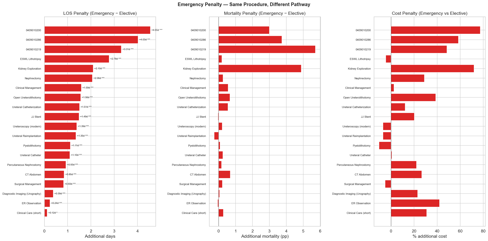
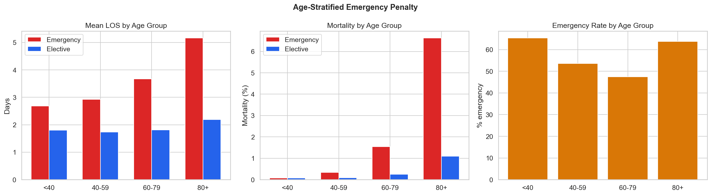
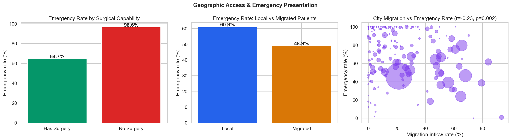
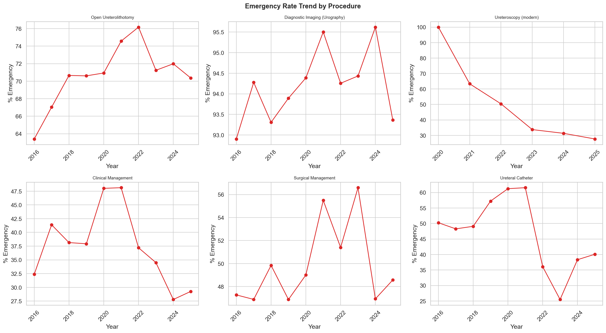
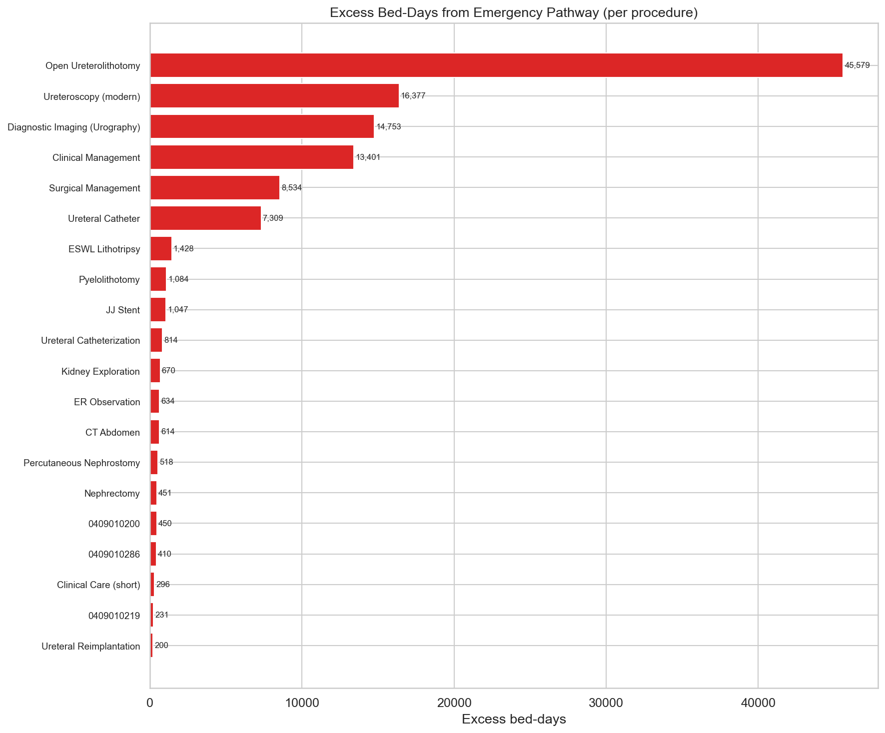

# Relatório 11 — Penalidade de Urgência (RQ7)

> **Pergunta de Pesquisa:** A apresentação por urgência é um sinal de falha do sistema?

**Notebook:** `notebooks/11_emergency_penalty.ipynb`
**Tipo:** Investigação causal com controles estratificados
**Escopo:** 116.672 urgências vs 89.828 eletivas · 20 procedimentos comparados · 182 cidades analisadas

---

## Método

Para cada um dos 20 códigos de procedimento com volume suficiente (≥50 casos) em ambas as vias — urgência e eletiva —, calculamos o delta de LOS, mortalidade e custo. A significância estatística foi avaliada com Mann-Whitney U (não-paramétrico, bilateral). Para descartar confundimento por idade, a análise foi estratificada em quatro faixas etárias (<40, 40–59, 60–79, 80+). O acesso geográfico foi testado comparando taxas de urgência entre cidades com e sem capacidade cirúrgica.

---

## Principais Achados

### 1. Todos os 20 Procedimentos Mostram Penalidade de Urgência Estatisticamente Significativa

Cada procedimento com volume suficiente em ambas as vias apresenta internações mais longas para urgência. Todos os 20 são estatisticamente significativos (p < 0,05), e 19 de 20 têm p < 0,001.

A penalidade média ponderada de urgência é de **+1,0 dia** adicional de LOS.

Procedimentos com as maiores penalidades:

| Procedimento | LOS Urgência | LOS Eletiva | Penalidade | p-valor |
|---|---|---|---|---|
| ESWL Litotripsia | 3,17d | 0,39d | +2,78d | < 1e-200 |
| Exploração Renal | 7,45d | 5,35d | +2,10d | < 1e-10 |
| Nefrectomia | 4,99d | 2,93d | +2,06d | < 1e-12 |
| Manejo Clínico | 3,40d | 1,81d | +1,59d | < 1e-300 |
| Ureterolitotomia Aberta | 3,59d | 2,02d | +1,56d | < 1e-300 |
| Ureteroscopia (moderna) | 2,77d | 1,38d | +1,39d | < 1e-300 |

### 2. A Penalidade de Urgência Persiste Após Controle por Idade

A penalidade não é explicada por pacientes mais velhos se apresentando mais por urgência. Em todas as faixas etárias, pacientes de urgência têm internações significativamente mais longas:

| Faixa Etária | LOS Urgência | LOS Eletiva | Penalidade |
|---|---|---|---|
| <40 | 2,69d | 1,80d | +0,89d |
| 40–59 | 2,92d | 1,73d | +1,19d |
| 60–79 | 3,68d | 1,81d | +1,86d |
| 80+ | 5,16d | 2,19d | +2,97d |

A penalidade **aumenta com a idade** — os pacientes mais vulneráveis pagam o preço mais alto pela apresentação por urgência. Isso é consistente com uma falha do sistema: pacientes idosos que não conseguem acessar atendimento eletivo acabam no pronto-socorro, onde os desfechos são significativamente piores.

### 3. Cidades Sem Cirurgia Têm 96,6% de Taxa de Urgência

O achado sobre acesso geográfico é a evidência mais forte do mecanismo de falha do sistema:

| Tipo de Cidade | Taxa de Urgência | Nº de cidades |
|---|---|---|
| Com capacidade cirúrgica | 64,7% | 128 |
| Sem capacidade cirúrgica | **96,6%** | 54 |

Mann-Whitney U p < 0,0001. Cidades sem capacidade cirúrgica canalizam praticamente todos os pacientes com cálculo renal pela via de urgência — porque não há alternativa.

**Achado surpreendente:** Pacientes migrados (tratados fora de seu município) têm taxa de urgência **menor** (48,9%) que pacientes locais (60,9%). Isso faz sentido: pacientes que viajam para receber atendimento têm maior probabilidade de terem sido encaminhados e agendados. Pacientes locais se apresentam no hospital mais próximo — geralmente o pronto-socorro.

### 4. Tendência de Urgência Está Melhorando, Mas de Forma Desigual

A taxa geral de urgência caiu de 58,1% (2016) para 49,2% (2024). No entanto, a velocidade de melhoria varia por procedimento — alguns procedimentos ainda são predominantemente de urgência.

### 5. Padrões por Subdiagnóstico

N209 (cálculo não especificado) tem a maior taxa de urgência: 76,0%, sugerindo que pacientes com diagnósticos menos específicos têm maior probabilidade de se apresentar via pronto-socorro — consistente com falta de investigação diagnóstica prévia.

### 6. Contrafactual: 114.811 Leitos-Dia Excedentes

Se as internações de urgência tivessem alcançado os desfechos eletivos (mesmo procedimento, mesmo hospital), o sistema teria economizado:

| Métrica | Valor |
|---|---|
| Leitos-dia excedentes | **114.811** |
| Óbitos excedentes | **375** |
| Custo excedente | **R$10,7M** |

Os três maiores contribuintes para leitos-dia excedentes: Ureterolitotomia Aberta (45.579), Ureteroscopia (16.377) e Imagem Diagnóstica (14.753).

---

## Discussão

A penalidade de urgência é real, persistente e expressiva. Ela sobrevive ao controle por tipo de procedimento (mesmo procedimento, via diferente) e por idade (penalidade presente em todas as faixas etárias). O padrão geográfico — 96,6% de taxa de urgência em cidades sem cirurgia vs 64,7% com cirurgia — aponta para um mecanismo claro: **a falta de acesso a atendimento cirúrgico eletivo força os pacientes para a via de urgência**.

A estimativa contrafactual (114.811 leitos-dia excedentes, 375 óbitos excedentes) é um limite superior, não uma afirmação causal. Alguns pacientes de urgência são genuinamente mais graves e teriam piores desfechos independentemente da via. No entanto, o fato de a penalidade persistir dentro do mesmo código de procedimento e faixa etária sugere que uma fração substancial é evitável.

**Implicação acionável:** Expandir a capacidade cirúrgica eletiva — particularmente vagas de ureteroscopia e ureterolitotomia aberta — em cidades atualmente dependentes de internações de urgência poderia reduzir LOS, mortalidade e custo. O maior impacto viria da conversão de casos de urgência de Ureterolitotomia Aberta (45.579 leitos-dia excedentes) e da garantia de que exames de imagem diagnóstica estejam disponíveis ambulatorialmente para evitar internações diagnósticas de urgência.

## Ameaças à Validade

- **Confundimento por gravidade:** Pacientes de urgência podem ter cálculos maiores ou mais complexos, envolvimento bilateral ou sepse — condições que justificam tanto a apresentação por urgência quanto internações mais longas. Os dados do SIH não incluem tamanho do cálculo ou gravidade clínica.
- **Variação na prática de faturamento:** Alguns hospitais podem classificar internações eletivas como urgência por razões de remuneração, diluindo a diferença real.
- **Causalidade reversa na migração:** A menor taxa de urgência entre pacientes migrados pode refletir seleção (apenas pacientes mais saudáveis conseguem viajar), não desenho do sistema.
- **O contrafactual é um limite superior:** Nem todas as urgências são evitáveis. O valor de 375 óbitos excedentes assume que todos os pacientes de urgência alcançariam as taxas de mortalidade eletiva, o que superestima o impacto realista.

---

## Glossário

| Sigla | Significado |
|---|---|
| **LOS** | Length of Stay — tempo de permanência hospitalar (em dias) |
| **SUS** | Sistema Único de Saúde — sistema público de saúde brasileiro |
| **SIH** | Sistema de Informações Hospitalares — base de dados de internações do SUS |
| **CNES** | Cadastro Nacional de Estabelecimentos de Saúde |
| **CAR_INT** | Caráter da Internação — código de tipo de admissão (01=eletiva, 02=urgência) |
| **ESWL** | Extracorporeal Shock Wave Lithotripsy — litotripsia extracorpórea |
| **UTI** | Unidade de Terapia Intensiva |
| **Mann-Whitney U** | Teste não-paramétrico para comparação de distribuições entre dois grupos |
| **BRL / R$** | Real brasileiro — moeda corrente |
| **pp** | Pontos percentuais |
| **RQ** | Research Question — pergunta de pesquisa |
