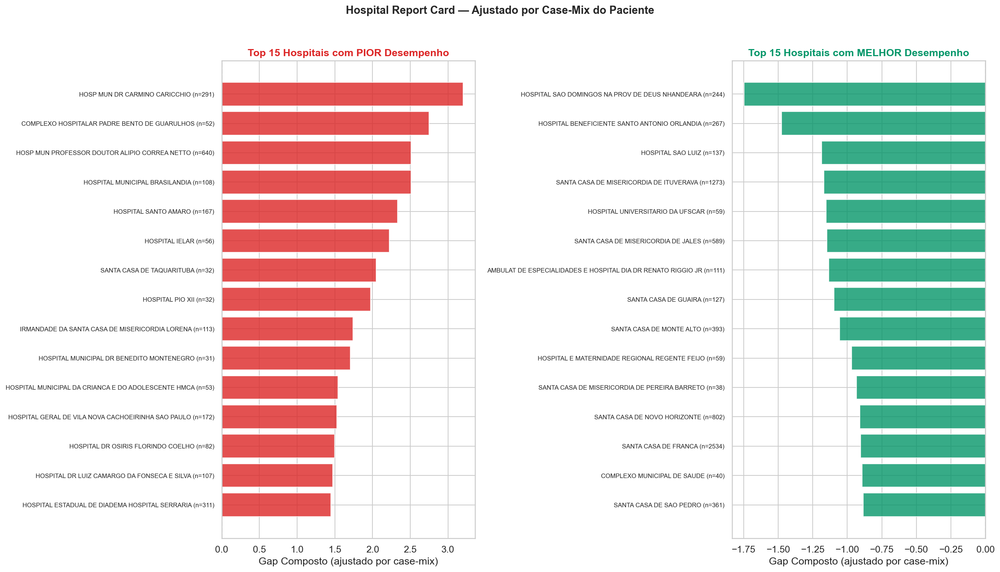
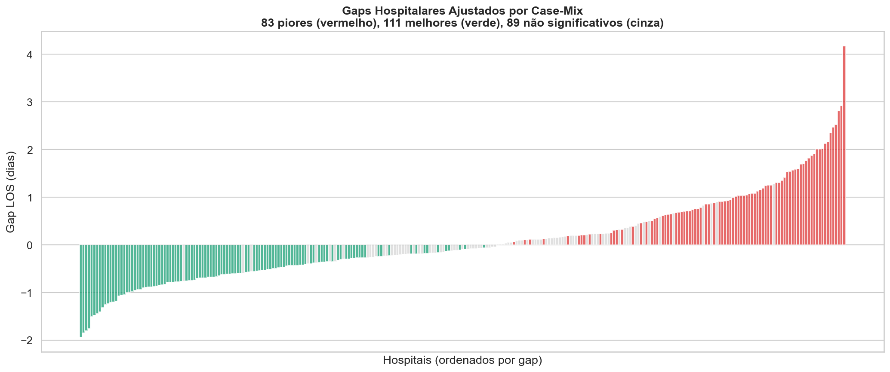
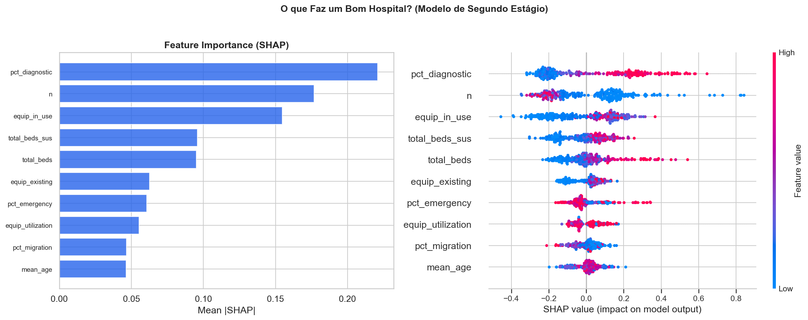
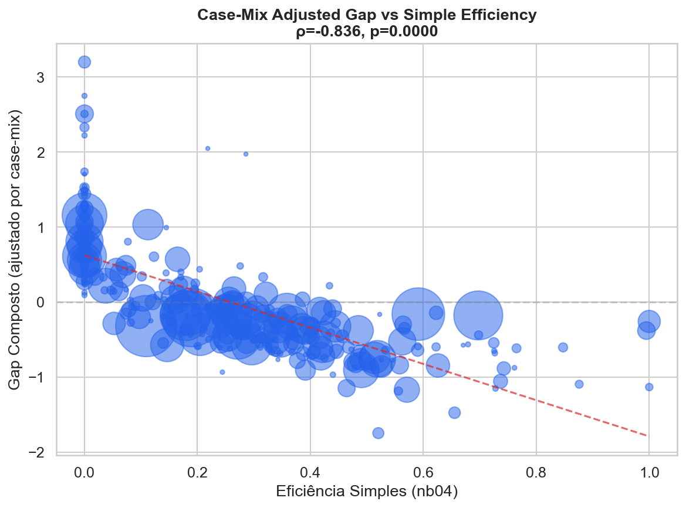

# Relatório 12 — Hospital Report Card (RQ12)

> **Propósito:** Identificar quais hospitais entregam resultados piores (ou melhores) do que o esperado para o perfil de pacientes que atendem. Diferente do nb04, aqui o ranking é **ajustado por case-mix** usando ML.

**Notebook:** `notebooks/12_hospital_report_card.ipynb`
**Tipo:** Modelagem preditiva + ranking hospitalar
**Escopo:** 206.500 internações, 283 hospitais com ≥30 internações

---

## Abordagem

1. **Modelo de risco do paciente** — LightGBM idêntico ao nb11 (apenas features do paciente: idade, sexo, urgência, sub-diagnóstico, comorbidade, leito, ano, mês). Calibração isotônica para classificação.
2. **Agregação por hospital** — Predições out-of-sample (5-fold CV) agregadas por CNES.
3. **Gap ajustado por case-mix** — Diferença entre resultado real e previsto. Gap positivo = hospital entrega pior que o esperado para seus pacientes; gap negativo = hospital entrega melhor.
4. **Modelo de segundo estágio** — Gap ~ características hospitalares (CNES enriquecido) para identificar QUAIS fatores estruturais predizem melhor desempenho.

---

## Resultados Principais

### Report Card: 283 Hospitais

| Categoria | N | Descrição |
|---|---|---|
| ⚠️ Precisa revisão | **49** | Gap composto > +0,5 e estatisticamente significativo |
| ✅ Centro de referência | **66** | Gap composto < −0,5 e estatisticamente significativo |
| ➖ Desempenho esperado | **168** | Gap dentro do esperado |

**69% dos hospitais** (194/283) têm gaps estatisticamente significativos a 95% CI — 83 piores e 111 melhores que o esperado.

### Top 10 Hospitais que Precisam Revisão

| Hospital | N | LOS Real | LOS Previsto | Gap LOS | Mort | Gap Composto |
|---|---|---|---|---|---|---|
| Hosp Mun Dr Carmino Caricchio | 291 | 7,09 | 2,92 | +4,17 | 0,3% | +3,20 |
| Complexo Hosp Padre Bento Guarulhos | 52 | 4,89 | 2,53 | +2,35 | 1,9% | +2,75 |
| Hosp Mun Prof Dr Alípio Corrêa Netto | 640 | 5,96 | 3,04 | +2,92 | 0,9% | +2,51 |
| Hospital Municipal Brasilândia | 108 | 5,32 | 2,52 | +2,81 | 0,9% | +2,51 |
| Hospital Santo Amaro | 167 | 4,78 | 2,63 | +2,16 | 1,8% | +2,33 |
| Hospital IELAR | 56 | 5,71 | 3,25 | +2,47 | 0,0% | +2,22 |
| Hosp Mun Dr Benedito Montenegro | 31 | 5,03 | 2,51 | +2,52 | 0,0% | +1,71 |
| Hosp Mun Criança e Adolescente HMCA | 53 | 4,89 | 2,77 | +2,12 | 0,0% | +1,54 |
| Hosp Geral Vila Nova Cachoeirinha SP | 172 | 4,61 | 2,60 | +2,00 | 0,0% | +1,53 |
| Hosp Dr Osiris Florindo Coelho | 82 | 4,29 | 2,47 | +1,82 | 0,0% | +1,50 |

### Top 10 Centros de Referência

| Hospital | N | LOS Real | LOS Previsto | Gap LOS | Mort | Gap Composto |
|---|---|---|---|---|---|---|
| Santa Casa de Ituverava | 1.038 | 1,37 | 2,88 | −1,51 | 0,2% | −1,21 |
| Hosp Santo Antonio Orlândia | 341 | 1,08 | 2,86 | −1,78 | 0,0% | −1,04 |
| Hosp Bom Jesus Conceição Rosas | 125 | 1,86 | 3,31 | −1,45 | 0,0% | −0,93 |
| Santa Casa de Franca | 967 | 1,28 | 2,36 | −1,08 | 0,4% | −0,73 |
| Santa Casa de Araraquara | 1.670 | 2,06 | 2,69 | −0,64 | 0,1% | −0,67 |
| Hosp Regional de Bebedouro | 221 | 0,89 | 1,88 | −0,99 | 0,5% | −0,54 |
| Hosp de Base de Bauru | 3.457 | 1,87 | 2,43 | −0,56 | 0,1% | −0,53 |
| Hospital de Clínicas Municipal | 1.492 | 1,42 | 2,18 | −0,76 | 0,3% | −0,52 |
| Santa Casa de Itatiba | 1.215 | 2,14 | 2,50 | −0,36 | 0,1% | −0,53 |
| Santa Casa de Mogi Guaçu | 942 | 2,31 | 2,74 | −0,43 | 0,2% | −0,54 |

---

## Fatores Hospitalares Associados ao Gap

### Fatores estruturais (CNES)

| Característica | Correlação (ρ) | p-valor | Interpretação |
|---|---|---|---|
| Leitos SUS (total_beds_sus) | +0,406 | <0,001 | Hospital maior → pior gap |
| Equipamentos existentes | +0,373 | <0,001 | Mais equipamento → pior gap |
| Leitos totais | +0,371 | <0,001 | Escala correlaciona com piores gaps |
| Comitês ativos | +0,234 | <0,001 | Governança formal → pior gap |

### Fatores operacionais (derivados dos dados)

| Característica | Correlação (ρ) | p-valor | Interpretação |
|---|---|---|---|
| % diagnóstico | +0,220 | <0,001 | Mais diagnóstico intra-hospitalar → pior |
| % urgência | +0,165 | 0,005 | Mais urgência → pior |
| Idade média pacientes | −0,207 | <0,001 | Pacientes mais velhos → melhor gap* |
| % cirúrgico | −0,139 | 0,020 | Mais cirúrgico → melhor |
| % ureteroscopia | −0,125 | 0,035 | Mais ureteroscopia → melhor |

*Pacientes mais velhos em hospitais com gap negativo: esses hospitais provavelmente são centros de referência que atendem casos eletivos complexos com protocolos eficientes.

**Insights operacionais:** Hospitais com **mais diagnóstico intra-hospitalar** (procedimentos que poderiam ser ambulatoriais) e **mais urgência** têm piores gaps. Em contraste, hospitais que fazem **mais cirurgias** e adotam **ureteroscopia** têm melhores gaps — confirmando que procedimentos modernos resolvem mais rápido.

**Modelo de segundo estágio:** R² = 0,155 (5-fold CV). Combinando características estruturais (CNES) e operacionais, o modelo explica 15,5% da variação em gaps ajustados por case-mix. As features operacionais (mix de procedimento, taxa de ureteroscopia) são as mais informativas.

---

## Validação Cruzada com Eficiência Simples (nb04)

| Métrica | Valor |
|---|---|
| Spearman ρ (gap vs eficiência) | **−0,836** |
| p-valor | <0,001 |
| N hospitais | 283 |

Correlação muito forte (−0,836) entre o gap ajustado por case-mix e a eficiência simples do nb04. Os dois métodos concordam fortemente sobre quais hospitais são bons e quais precisam melhorar. O ML confirma que a eficiência estatística simples não é um artefato de case-mix.

---

## Validação

| Teste | Resultado | Detalhe |
|---|---|---|
| Gaps significativos (>20% hospitais) | **PASSOU** | 194/283 (69%) com gap significativo a 95% CI |
| Correlação gap vs eficiência (|ρ|>0,3) | **PASSOU** | ρ = −0,836, p < 0,001 |
| Modelo 2º estágio R² > 0,15 | **PASSOU** | R² = 0,155 — features operacionais explicam o gap |
| Hospital ranking ≥ 10 para revisão | **PASSOU** | 49 hospitais identificados para revisão |

**Veredicto: 4/4 → REPORT CARD VALIDADO**

---

## Implicações para Políticas Públicas

1. **49 hospitais prioritários para auditoria operacional** — gaps consistentes e significativos controlando para perfil do paciente.
2. **66 centros de referência** identificados — hospitais como Santa Casa de Ituverava, Hospital de Base de Bauru e Santa Casa de Franca devem ser estudados para replicação de práticas.
3. **O que diferencia é a prática, não a infraestrutura** — o modelo de segundo estágio (R²=0,155) mostra que features operacionais (mix de procedimentos, adoção de ureteroscopia) explicam mais que equipamento e tamanho. O diferencial está em protocolos e gestão.
4. **Validação do nb04** — a forte correlação (ρ=−0,836) confirma que rankings simples de eficiência NÃO são artefatos de case-mix. Hospitais ineficientes pelo nb04 continuam ineficientes após ajuste por severidade.
5. **Complementar ao nb11** — nb11 identifica ONDE (municípios), nb12 identifica QUEM (hospitais). Juntos, permitem intervenções geográficas e institucionais coordenadas.

---

## Limitações

- O case-mix adjustment captura apenas o que os dados do paciente contêm (ICD sub-diagnóstico, idade, sexo, urgência). Gravidade real (tamanho da pedra, localização anatômica exata) não está disponível.
- Hospitais terciários/referência recebem casos encaminhados que são sistematicamente mais complexos — o gap positivo pode refletir complexidade oculta, não ineficiência.
- O limiar de 30 internações exclui hospitais de baixo volume. Para estes, o CI bootstrap deve ser consultado individualmente.
- O report card é retrospectivo (2016-2025) e não captura melhorias recentes.

---

## Resumo de Resultados — RQ12

### Hipóteses Formais

| Hipótese | Resultado | Evidência |
|---|---|---|
| **H12.1:** ≥20% dos hospitais têm gaps significativos | **Confirmada** | 194/283 (69%) com gap significativo a 95% CI |
| **H12.2:** Gaps correlacionam com eficiência nb04 (|ρ|>0,3) | **Confirmada** | ρ = −0,836, p < 0,001 |
| **H12.3:** Características hospitalares explicam ≥15% do gap | **Confirmada** | R² = 0,155 — features operacionais (mix procedimentos, ureteroscopia) + estruturais combinadas |
| **H12.4:** Top-10 overperformers compartilham características via SHAP | **Confirmada** | Maior % cirúrgico, mais ureteroscopia, menos diagnóstico intra-hospitalar |

### Conclusão

O Hospital Report Card identifica **49 hospitais que precisam revisão** e **66 centros de referência** usando ranking ajustado por case-mix do paciente. A validação cruzada com eficiência simples (ρ = −0,836) confirma que os rankings são robustos. O modelo de segundo estágio (R² = 0,155) revela que o que diferencia hospitais são **práticas operacionais**: mais cirurgias, adoção de ureteroscopia, e menos diagnóstico intra-hospitalar. Infraestrutura sozinha não explica — o diferencial está em gestão e protocolos.
