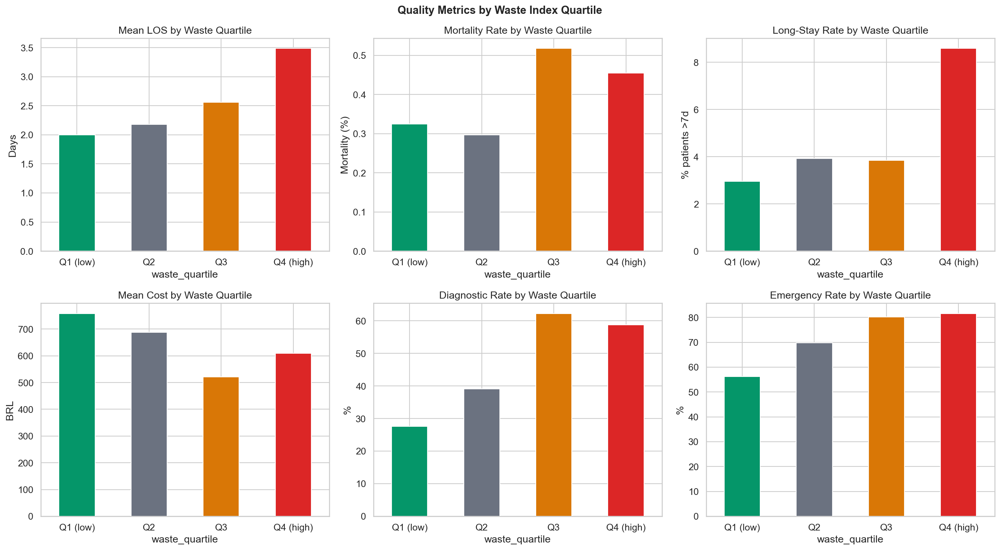
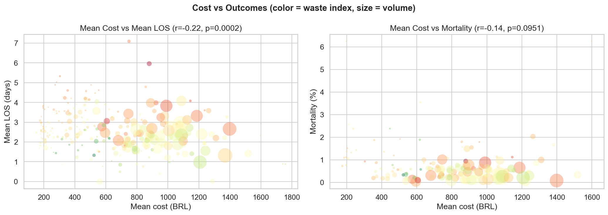
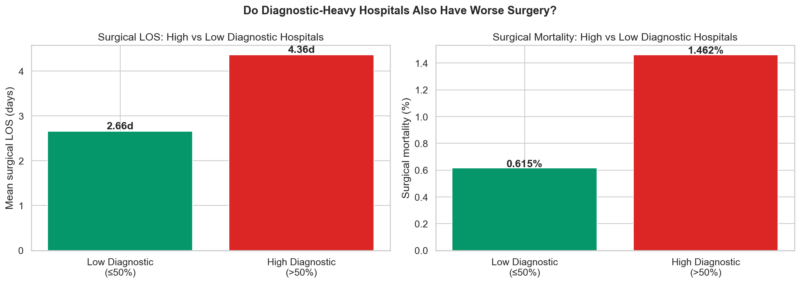
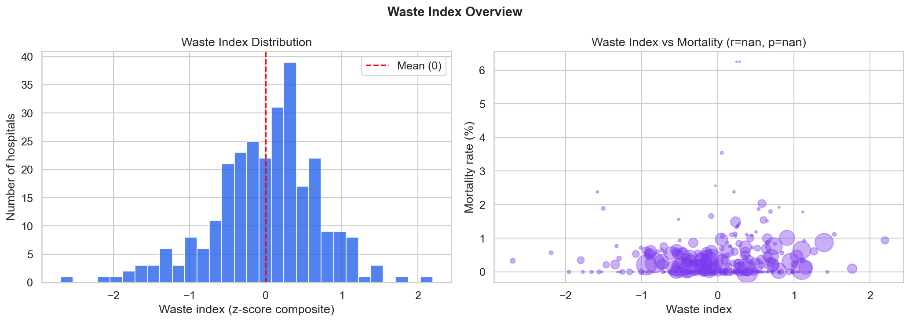

# Relatório 12 — Incentivo vs Qualidade (RQ8)

> **Pergunta de Pesquisa:** O desalinhamento de incentivos financeiros degrada a qualidade do serviço?

**Notebook:** `notebooks/12_incentive_quality.ipynb`
**Tipo:** Construção de índice composto + análise correlacional
**Escopo:** 283 hospitais com ≥30 internações · 206.500 internações totais · índice de desperdício padronizado por z-score dentro de grupos de comparabilidade

---

## Método

### Construção do Índice de Desperdício

Construímos um **índice de desperdício** por hospital a partir de três componentes, cada um padronizado por z-score dentro do grupo de comparabilidade do hospital (garantindo comparação justa entre tipos de unidade):

1. **Taxa de internação diagnóstica** — % de internações para exames de imagem (procedimentos faturáveis ambulatorialmente)
2. **LOS excedente** — LOS médio menos a mediana do grupo de comparabilidade
3. **Taxa de urgência** — % de internações de urgência (taxas mais altas podem indicar vias desnecessárias de pronto-socorro)

O índice final é a média aritmética dos três z-scores: `índice_desperdício = (z_diagnóstico + z_los_excedente + z_urgência) / 3`

Os hospitais foram divididos em quartis (Q1 = menor desperdício, Q4 = maior desperdício) e comparados em métricas de qualidade. Testes de Mann-Whitney U avaliaram diferenças Q4 vs Q1.

### Independência dos Componentes

Os três componentes apresentam correlação moderada (taxa diagnóstica ↔ taxa de urgência: r = 0,42; LOS excedente ↔ taxa de urgência: r = 0,22; LOS excedente ↔ taxa diagnóstica: r = 0,19), confirmando que capturam fenômenos relacionados mas distintos.

---

## Principais Achados

### 1. Hospitais com Alto Desperdício Têm Internações 75% Mais Longas

| Métrica | Q1 (baixo desperdício) | Q4 (alto desperdício) | Razão | p-valor |
|---|---|---|---|---|
| LOS médio | 2,00d | 3,49d | **1,75x** | < 0,0001 |
| Taxa de longa permanência (>7d) | 2,9% | 8,6% | **3,0x** | — |
| Taxa de mortalidade | 0,32% | 0,46% | 1,4x | **0,15 (ns)** |
| Taxa diagnóstica | 27,6% | 58,7% | 2,1x | — |
| Taxa de urgência | 56,2% | 81,6% | 1,5x | — |

O índice de desperdício prediz fortemente LOS e taxas de longa permanência (p < 0,0001), mas **não** prediz mortalidade de forma significativa (p = 0,15). Essa é uma nuance importante: o desalinhamento de incentivos parece inflar o consumo de recursos (leitos-dia, internações desnecessárias) sem um sinal detectável de mortalidade.

### 2. Gastar Mais Não Significa Cuidar Melhor

O custo por internação tem correlação negativa fraca com LOS (r = −0,22). Isso é contraintuitivo até considerarmos que procedimentos caros (ex.: ESWL a R$1.100+) são rápidos (internações de menos de 1 dia), enquanto internações diagnósticas baratas (R$200-300) inflam o LOS. Gastar mais não melhora os desfechos — reflete um mix diferente de procedimentos.

### 3. Hospitais com Alta Taxa Diagnóstica Têm Pior Desempenho Cirúrgico

Hospitais onde >50% das internações são diagnósticas (n = 12) também realizam cirurgias com desfechos significativamente piores que seus pares (n = 148):

| Métrica | Baixa Diagnóstica (≤50%) | Alta Diagnóstica (>50%) | p-valor |
|---|---|---|---|
| LOS cirúrgico | 2,66d | **4,36d** | 0,031 |
| Mortalidade cirúrgica | 0,62% | **1,46%** | — |

Este é o achado mais preocupante. Hospitais com alta taxa diagnóstica não apenas inflam internações para exames de imagem — eles também realizam cirurgias com 64% mais dias de internação e 2,4x mais mortalidade. Isso pode refletir:
- **Qualidade institucional:** hospitais com protocolos deficientes internam mais diagnósticos E realizam cirurgias piores
- **Competição por recursos:** internações diagnósticas excessivas consomem capacidade de leitos, atrasando e degradando o cuidado cirúrgico
- **Efeito de seleção:** hospitais com alta taxa diagnóstica podem receber casos mais complexos e tardios

### 4. Distribuição do Índice de Desperdício

O índice de desperdício segue uma distribuição aproximadamente normal centrada em 0 (por construção). Amplitude: −2,70 a +2,20.

---

## Discussão

O índice de desperdício revela um padrão claro: hospitais no quartil superior (Q4) têm **internações 75% mais longas** e **3x mais longa permanência** que hospitais do quartil inferior (Q1) dentro dos mesmos grupos de comparabilidade. No entanto, a diferença de mortalidade não é estatisticamente significativa, sugerindo que o desalinhamento de incentivos infla o consumo de recursos sem um custo direto em mortalidade.

O achado sobre hospitais com alta taxa diagnóstica é mais alarmante. Esses 12 hospitais não apenas inflam internações com exames de imagem que poderiam ser feitos ambulatorialmente — eles também apresentam desempenho cirúrgico significativamente pior. Isso é consistente com um problema de qualidade institucional: as mesmas falhas de gestão que levam a internações diagnósticas desnecessárias também produzem desfechos cirúrgicos ruins.

**O que isso NÃO é:** Uma afirmação causal. Não podemos dizer que o índice de desperdício *causa* piores desfechos. Hospitais com alto desperdício podem atender populações mais difíceis, enfrentar restrições de recursos ou operar em regiões sem alternativas ambulatoriais. A análise controla por grupo de comparabilidade (tipo de unidade, perfil de internação, mix de procedimentos), mas não por gravidade no nível do paciente.

**Implicação acionável:** O índice de desperdício pode ser usado como ferramenta de triagem para identificar hospitais que merecem auditoria mais detalhada. Os 12 hospitais com alta taxa diagnóstica e mau desempenho cirúrgico são candidatos imediatos para auditoria clínica — suas taxas de internação diagnóstica sugerem otimização de faturamento, e suas métricas cirúrgicas sugerem problemas de qualidade assistencial que podem estar prejudicando pacientes.

## Ameaças à Validade

- **O índice de desperdício é um proxy.** Altas taxas de internação diagnóstica podem refletir cautela clínica apropriada (descartando complicações em casos incertos), não manipulação do sistema. O rótulo "desperdício" embute uma premissa.
- **Causalidade reversa.** Hospitais com populações mais doentes podem internar mais diagnósticos *porque* os pacientes chegam em piores condições — a taxa diagnóstica é uma consequência, não uma causa, dos piores desfechos.
- **Amostra pequena para hospitais com alta taxa diagnóstica.** Apenas 12 hospitais atingem o limiar de >50% diagnóstico com ≥20 casos cirúrgicos, tornando a comparação de qualidade cirúrgica sensível a outliers.
- **Efeito teto na mortalidade.** A mortalidade geral por cálculo renal é muito baixa (0,3%). Com números pequenos, diferenças de mortalidade são difíceis de detectar. O resultado não significativo Q4 vs Q1 (p = 0,15) pode refletir poder estatístico insuficiente, não ausência de efeito.
- **Custo médio é confundido pelo mix de procedimentos.** Um hospital que faz principalmente ESWL terá alto custo médio e baixo LOS; um que faz principalmente diagnóstico terá baixo custo e alto LOS. A correlação negativa custo-LOS reflete composição de procedimentos, não uma relação custo-qualidade.

---

## Glossário

| Sigla | Significado |
|---|---|
| **LOS** | Length of Stay — tempo de permanência hospitalar (em dias) |
| **SUS** | Sistema Único de Saúde — sistema público de saúde brasileiro |
| **SIH** | Sistema de Informações Hospitalares — base de dados de internações do SUS |
| **SIA** | Sistema de Informações Ambulatoriais |
| **CNES** | Cadastro Nacional de Estabelecimentos de Saúde |
| **ESWL** | Extracorporeal Shock Wave Lithotripsy — litotripsia extracorpórea |
| **BRL / R$** | Real brasileiro — moeda corrente |
| **Mann-Whitney U** | Teste não-paramétrico para comparação de distribuições entre dois grupos |
| **ns** | Não significativo — diferença não estatisticamente significativa |
| **pp** | Pontos percentuais |
| **RQ** | Research Question — pergunta de pesquisa |
| **Q1–Q4** | Quartis da distribuição — Q1 é o 25% mais baixo, Q4 o 25% mais alto |
