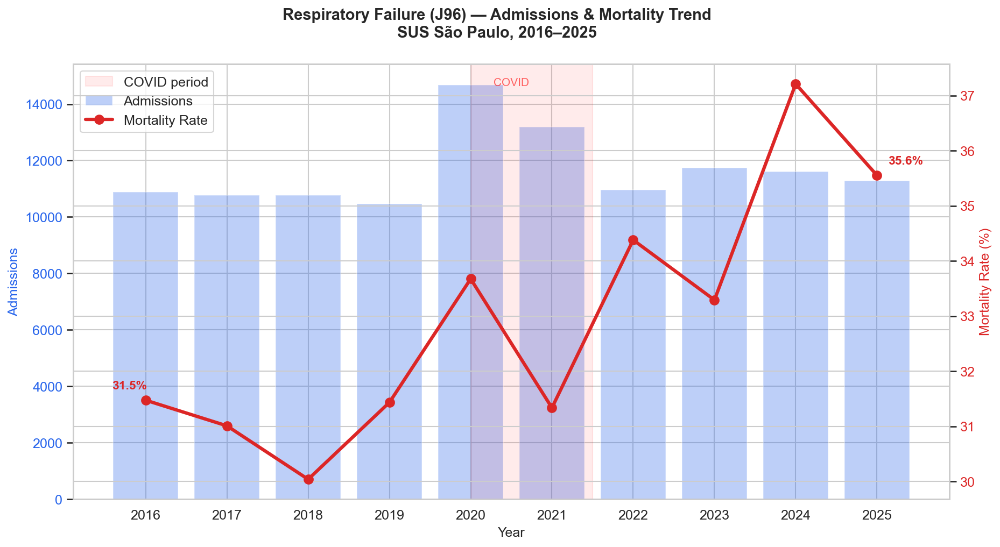
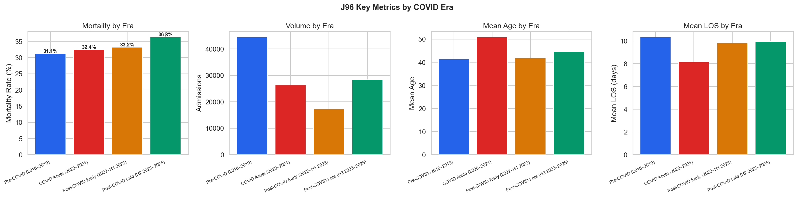
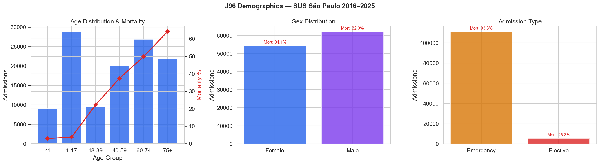
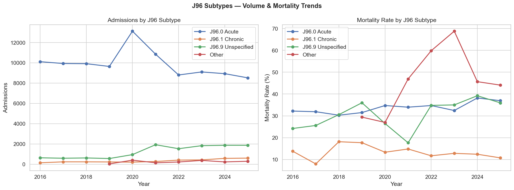
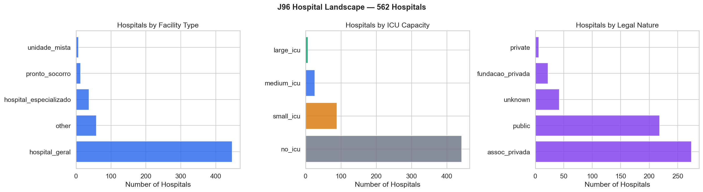
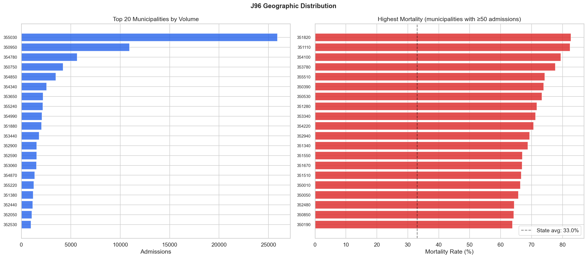
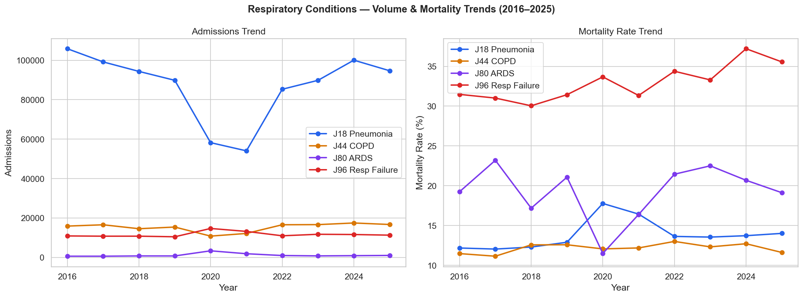
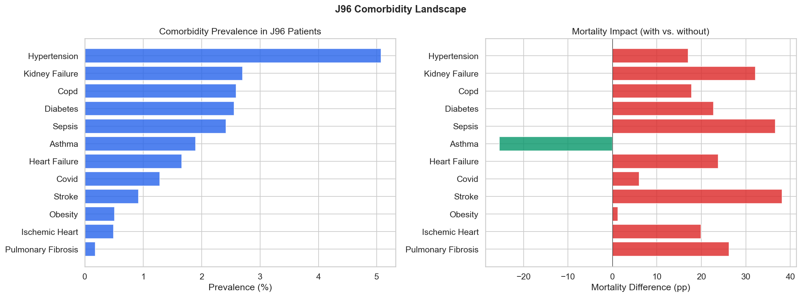
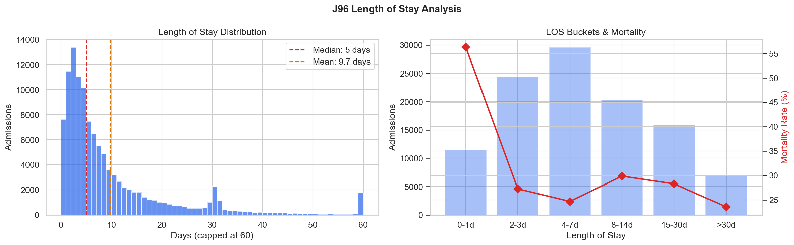

# Relatório 02 — Visão Geral

> **Pergunta de Pesquisa (RQ1):** Qual é a escala e a trajetória da crise de mortalidade por insuficiência respiratória?

**Notebook:** `notebooks/02_general_overview.ipynb`
**Tipo:** Análise descritiva exploratória — sem hipóteses pré-registradas
**Escopo:** 116.374 internações · 562 hospitais · Estado de São Paulo · 2016–2025

---

## Método

Todas as internações faturadas pelo SUS com diagnóstico principal CID-10 J96 (insuficiência respiratória) foram extraídas da base SIH AIH Reduzida para São Paulo. Os dados abrangem arquivos mensais em formato parquet (jan/2016 – dez/2025). Características das unidades de saúde foram vinculadas a partir do CNES (foto mais recente). Hospitais foram classificados por tipo de estabelecimento, natureza jurídica e capacidade de UTI.

---

## Principais Achados

### 1. Escala: Uma em Cada Três Internações Resulta em Óbito

| Métrica | Valor |
|---|---|
| Total de internações (2016–2025) | 116.374 |
| Total de óbitos | 38.384 |
| Taxa de mortalidade | **33,0%** |
| Total de leitos-dia | 1.125.335 |
| Total de dias de UTI | 407.892 |
| Permanência média | 9,7 dias |
| Permanência mediana | 5 dias |
| Custo total | R$ 383.471.537 |
| Hospitais tratando J96 | 562 |
| Municípios | 321 |

Um em cada três pacientes internados por insuficiência respiratória morre no hospital. A condição consome mais de 1 milhão de leitos-dia no período.

### 2. Tendência de Mortalidade — O Achado Central

A mortalidade subiu de **31,5% (2016) para 35,6% (2025)**, um aumento de +4,1 pontos percentuais. A tendência não é uniforme:

| Ano | Internações | Óbitos | Mortalidade |
|---|---|---|---|
| 2016 | 10.891 | 3.428 | 31,5% |
| 2017 | 10.764 | 3.338 | 31,0% |
| 2018 | 10.772 | 3.236 | **30,0%** (menor) |
| 2019 | 10.466 | 3.290 | 31,4% |
| 2020 | 14.681 | 4.944 | 33,7% (surto COVID) |
| 2021 | 13.195 | 4.135 | 31,3% |
| 2022 | 10.968 | 3.771 | 34,4% |
| 2023 | 11.738 | 3.908 | 33,3% |
| 2024 | 11.612 | 4.321 | **37,2%** (maior) |
| 2025 | 11.287 | 4.013 | 35,6% |

Observações-chave:
- Pré-COVID (2016–2019): mortalidade oscilou em torno de 30–31%, com leve queda em 2018
- COVID agudo (2020): volume disparou 40%, mas mortalidade subiu moderadamente para 33,7%
- Pós-COVID (2022+): **a mortalidade acelerou enquanto o volume retornou à linha de base** — esta é a crise
- 2024 atingiu o pico de **37,2%** — o pior ano registrado
- 2025 mostra leve melhora (35,6%), mas permanece bem acima dos níveis pré-COVID

### 3. Comparação por Era COVID

| Era | Internações | Mortalidade | Permanência Média | Idade Média |
|---|---|---|---|---|
| Pré-COVID (2016–2019) | 44.447 | **31,1%** | 10,3 dias | 41,4 |
| COVID Agudo (2020–2021) | 26.322 | 32,4% | 8,2 dias | **50,9** |
| Pós-COVID Inicial (2022–1S 2023) | 17.248 | 33,2% | 9,8 dias | 41,9 |
| Pós-COVID Tardio (2S 2023–2025) | 28.357 | **36,3%** | 9,9 dias | 44,5 |

A era COVID trouxe pacientes mais velhos (idade média saltou de 41 para 51), mas isso se reverteu no pós-COVID. O aumento de mortalidade na era pós-COVID tardio (+5,2pp vs pré-COVID) persiste mesmo com idade média apenas ligeiramente superior (44,5 vs 41,4). Isso sugere que a elevação da mortalidade **não é totalmente explicada pela demografia dos pacientes** — algo estrutural mudou.

### 4. Demografia

- **Idade média:** 44,4 anos (mediana 53)
- **Sexo:** 53,3% masculino, 46,7% feminino
- **Tipo de internação:** **95,4% urgência** — quase todos os pacientes J96 chegam pela emergência
- **Gradiente etário:** A mortalidade sobe acentuadamente com a idade. O grupo 75+ tem a maior mortalidade, enquanto o grupo <1 (neonatal) tem um perfil completamente diferente.

### 5. Subtipos de J96

| Subtipo | Internações | Proporção | Mortalidade |
|---|---|---|---|
| J96.0 Aguda | 98.919 | 85,0% | 33,6% |
| J96.9 Não especificada | 12.395 | 10,7% | 31,2% |
| J96.1 Crônica | 3.350 | 2,9% | 12,8% |
| Outros | 1.710 | 1,5% | 47,7% |

A crise é predominantemente de insuficiência respiratória **aguda**. A forma crônica (J96.1) tem mortalidade muito menor (12,8%) e representa uma população clínica diferente. A categoria "Outros" tem a maior mortalidade (47,7%) — necessita investigação.

### 6. Panorama Hospitalar — O Gap de UTI

**O achado mais impactante desta visão geral:**

| Capacidade de UTI | Hospitais | Internações | Mortalidade |
|---|---|---|---|
| Sem UTI | 442 (79%) | 59.520 | **40,6%** |
| UTI pequena (1–10 leitos) | 88 (16%) | 36.118 | 26,7% |
| UTI média (11–30 leitos) | 26 (5%) | 17.752 | 22,2% |
| UTI grande (>30 leitos) | 6 (1%) | 2.984 | 21,5% |

**51% dos pacientes J96 são tratados em hospitais sem leitos de UTI** — e sua mortalidade é quase o dobro da mortalidade em hospitais com UTIs grandes (40,6% vs 21,5%). Esse gap de 19 pontos percentuais é o achado mais acionável até o momento.

Por tipo de estabelecimento:
- Hospital geral: 33,6% mortalidade (104.559 internações — 90% do volume)
- Hospital especializado: 25,0% (6.114 internações)
- Pronto socorro: 40,2% (1.028 internações)
- Unidade mista: 46,2% (104 internações)

### 7. Distribuição Geográfica

O tratamento é concentrado em poucos polos regionais, com São Paulo capital dominando em volume absoluto. Municípios menores apresentam mortalidade mais variável, refletindo diferenças de infraestrutura.

### 8. Condições Respiratórias Relacionadas (2024 vs 2016)

| Condição | Variação de Volume | Variação de Mortalidade |
|---|---|---|
| J96 Insuficiência Respiratória | +7% | **+5,7pp** |
| J80 SDRA | +45% | +1,4pp |
| J44 DPOC | +10% | +1,2pp |
| J18 Pneumonia | -5% | +1,5pp |

J96 tem o **maior aumento de mortalidade** entre todas as condições respiratórias (+5,7pp vs próxima mais alta +1,5pp). A SDRA (J80) teve aumento dramático de volume (+45%), mas variação de mortalidade comparativamente modesta. Isso sugere que a crise de mortalidade do J96 é específica ao manejo desses pacientes, e não uma degradação geral do cuidado respiratório.

### 9. Impacto das Comorbidades

Comorbidades que mais amplificam a mortalidade:

| Comorbidade | Prevalência | Mortalidade Com | Mortalidade Sem | Impacto |
|---|---|---|---|---|
| AVC | 0,9% | 70,8% | 32,6% | **+38,1pp** |
| Sepse | 2,4% | 68,7% | 32,1% | **+36,6pp** |
| Insuficiência Renal | 2,7% | 64,2% | 32,1% | **+32,1pp** |
| Fibrose Pulmonar | 0,2% | 59,1% | 32,9% | +26,2pp |
| Insuficiência Cardíaca | 1,7% | 56,4% | 32,6% | +23,8pp |
| Diabetes | 2,6% | 55,1% | 32,4% | +22,7pp |
| Hipertensão | 5,1% | 49,1% | 32,1% | +17,0pp |

Asma é **protetora** (-25,4pp) — insuficiência respiratória por asma tipicamente afeta pacientes mais jovens e é mais reversível.

Nota: a prevalência de comorbidades é baixa no geral (média 0,22 por paciente), sugerindo **subnotificação significativa** dos diagnósticos secundários. A carga real de comorbidades é provavelmente muito maior.

### 10. Perfil de Permanência

- Média: 9,7 dias, Mediana: 5 dias (fortemente assimétrica à direita)
- P90: 26 dias, P95: 32 dias
- 6,0% dos pacientes permanecem >30 dias

---

## Discussão

Cinco padrões demandam investigação nos notebooks subsequentes:

1. **A crise é real e está piorando** — mortalidade subiu +4,1pp (2016–2025), com o pior ano sendo 2024 (37,2%). O aumento é 4x maior que qualquer outra condição respiratória → RQ2 (Drivers)
2. **Efeito estrutural pós-COVID** — mortalidade acelerou após a COVID mesmo com volume normalizado. Algo no sistema mudou permanentemente? → RQ4 (COVID Echo)
3. **O gap de UTI é massivo** — 19pp de diferença entre hospitais sem UTI e com UTI grande. 51% dos pacientes vão para hospitais sem UTI → RQ3 (ICU Capacity)
4. **Quase todas urgências** — 95,4% chegam pela emergência, limitando oportunidades de intervenção planejada
5. **Amplificadores de comorbidade** — sepse, insuficiência renal e AVC aumentam drasticamente a mortalidade, mas são infrequentes (ou subnotificados)

## Ameaças à Validade

- **Marcador de UTI (MARCA_UTI):** Mostra 0% de uso de UTI quando filtrado para valores 1–6, mas 407.892 dias de UTI (UTI_MES_TO) estão registrados. A codificação parece usar valores diferentes do esperado. Dias de UTI são utilizáveis, marcador binário não.
- **Registros pré-2016:** 847 registros com datas anteriores a 2016 (atraso de faturamento) foram excluídos filtrando ano >= 2016.
- **Subnotificação de comorbidades:** Contagem média de 0,22 é implausivelmente baixa para cuidados intensivos. Diagnósticos secundários são subutilizados.
- **Apenas SUS:** Exclui internações de planos privados.
- **Sem vinculação de pacientes:** Não é possível identificar reinternações ou episódios do mesmo paciente.
- **CNES como foto estática:** Dados de infraestrutura vêm da foto mais recente, não contemporânea a cada internação.

---

## Glossário

| Sigla | Significado |
|---|---|
| **SUS** | Sistema Único de Saúde — sistema público de saúde brasileiro |
| **SIH** | Sistema de Informações Hospitalares — base de dados de internações do SUS |
| **CNES** | Cadastro Nacional de Estabelecimentos de Saúde |
| **CID-10** | Classificação Internacional de Doenças, 10ª revisão (J96 = insuficiência respiratória) |
| **DATASUS** | Departamento de Informática do SUS — órgão responsável pela publicação dos dados |
| **UTI** | Unidade de Terapia Intensiva |
| **SDRA** | Síndrome do Desconforto Respiratório Agudo (J80) |
| **DPOC** | Doença Pulmonar Obstrutiva Crônica (J44) |
| **LOS** | Length of Stay — tempo de permanência hospitalar (em dias) |
| **pp** | Pontos percentuais |
| **RQ** | Research Question — pergunta de pesquisa |
| **AIH** | Autorização de Internação Hospitalar |
