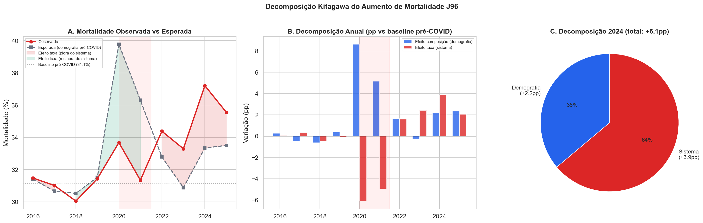
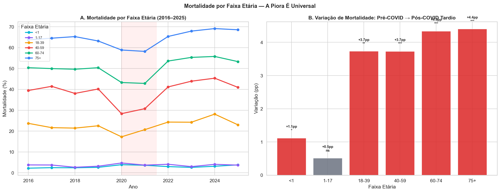
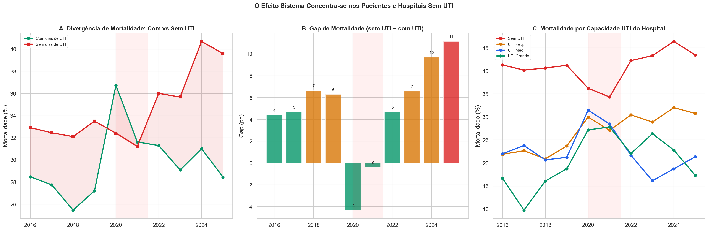
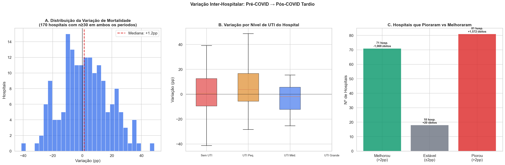
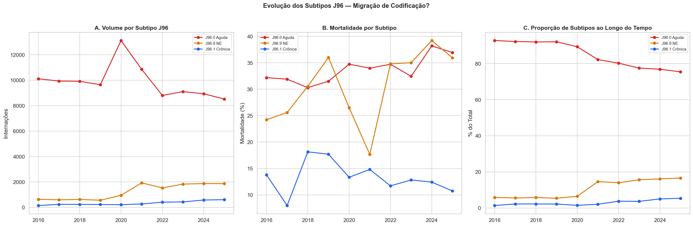
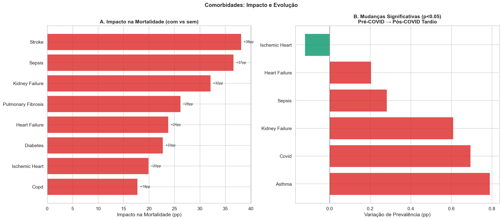
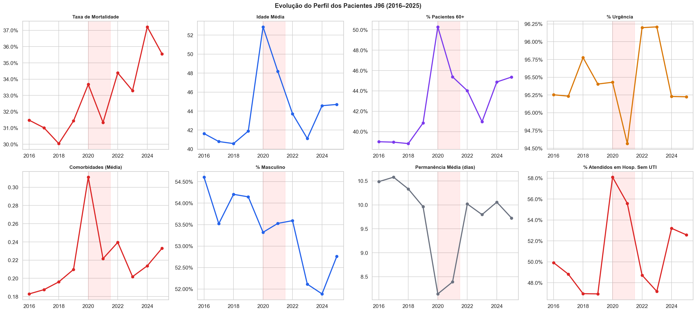

# Relatório 03 — Drivers da Mortalidade (RQ2)

> **Pergunta de Pesquisa:** O que está impulsionando o aumento da mortalidade por insuficiência respiratória?

**Notebook:** `notebooks/03_mortality_drivers.ipynb`
**Tipo:** Decomposição de mortalidade com triangulação por três eixos independentes
**Escopo:** 116.374 internações · 170 hospitais com volume suficiente para comparação (n≥30 em ambos os períodos) · 2016–2025

---

## Método

Três eixos de análise independentes foram utilizados para isolar a causa do aumento de mortalidade:

1. **Decomposição de Kitagawa (padronização direta):** As taxas de mortalidade por [faixa etária × sexo] do período pré-COVID (2016–2019) foram aplicadas à composição demográfica de cada ano subsequente. A diferença entre mortalidade observada e esperada separa o *efeito composição* (pacientes mais graves) do *efeito taxa* (sistema pior).

2. **Análise dentro-de-estrato:** Comparação da mortalidade de cada faixa etária entre períodos, com teste χ² de significância. Se a mortalidade sobe dentro das mesmas faixas, não é efeito de composição.

3. **Variação inter-hospitalar:** Comparação hospital-a-hospital entre pré-COVID e pós-COVID tardio, com classificação por nível de UTI.

---

## Principais Achados

### 1. Decomposição Kitagawa: 64% é Efeito Sistema

Em 2024 (pior ano), a mortalidade subiu +6,1pp acima da baseline pré-COVID (31,1%):

| Componente | Contribuição | % do Total |
|---|---|---|
| Efeito composição (demografia) | +2,2pp | **36%** |
| **Efeito taxa (sistema)** | **+3,9pp** | **64%** |
| **Total** | **+6,1pp** | 100% |

**Dois terços do aumento não são explicados por mudanças no perfil dos pacientes.**

Nota: durante a COVID aguda (2020), ocorreu o efeito oposto — a mortalidade observada foi 6,1pp MENOR que a esperada pela demografia (pacientes mais velhos receberam cuidado mais intensivo). Isso prova que o sistema *pode* compensar pacientes mais graves quando se mobiliza.

### 2. Análise Dentro-de-Estrato: 5 de 6 Faixas Etárias Pioraram Significativamente

A mortalidade subiu dentro de cada faixa etária adulta, com significância estatística:

| Faixa Etária | Pré-COVID | Pós-COVID Tardio | Variação | χ² | p-value |
|---|---|---|---|---|---|
| <1 ano | 2,4% | 3,6% | +1,1pp | 6,2 | 0,013* |
| 1–17 | 3,3% | 3,8% | +0,5pp | 3,4 | 0,065 ns |
| 18–39 | 22,4% | 26,2% | **+3,7pp** | 9,7 | 0,002** |
| 40–59 | 39,7% | 43,5% | **+3,7pp** | 15,0 | 0,0001*** |
| 60–74 | 50,0% | 54,3% | **+4,3pp** | 28,8 | <0,0001*** |
| 75+ | 64,3% | 68,7% | **+4,4pp** | 28,5 | <0,0001*** |

O aumento é generalizado e altamente significativo em adultos (+3,7pp a +4,4pp). Isso descarta a hipótese de que o aumento seria específico de um grupo demográfico — é uma piora sistêmica.

### 3. A Crise Concentra-se nos Pacientes Sem UTI

O gap de mortalidade entre pacientes com e sem dias de UTI mais que dobrou:

| Ano | % com UTI | Mort. com UTI | Mort. sem UTI | Gap |
|---|---|---|---|---|
| 2016 | 32,5% | 28,5% | 32,9% | 4,4pp |
| 2018 | 31,1% | 25,5% | 32,1% | 6,6pp |
| 2020 | 29,1% | 36,7% | 32,4% | −4,3pp (COVID inverteu) |
| 2022 | 34,6% | 31,3% | 36,0% | 4,7pp |
| 2024 | 36,0% | 31,0% | 40,7% | **9,7pp** |
| 2025 | 36,4% | 28,5% | 39,6% | **11,1pp** |

A mortalidade dos pacientes com UTI é relativamente estável ao longo do tempo (28,5% → 28,5%). Mas a mortalidade dos pacientes SEM UTI — que são **64% do total** — disparou de 32,9% para 39,6% (+6,7pp). A crise está concentrada fora da UTI.

A análise por nível de UTI do hospital confirma o padrão: hospitais sem UTI tiveram a maior piora de mortalidade, enquanto hospitais com UTI grande mantiveram taxas mais estáveis.

### 4. Variação Inter-Hospitalar: 48% dos Hospitais Pioraram

Dos 170 hospitais com volume suficiente para comparação (n≥30 em ambos os períodos):

| Grupo | Hospitais | % | Excesso de Óbitos |
|---|---|---|---|
| Melhoraram (>2pp) | 71 | 42% | −1.049 |
| Estáveis (±2pp) | 18 | 11% | 0 |
| **Pioraram (>2pp)** | **81** | **48%** | **+1.572** |

A variação mediana foi de +1,2pp — ou seja, o hospital típico piorou. Os 81 hospitais que pioraram >2pp concentram +1.572 óbitos excedentes no período pós-COVID tardio.

### 5. Os 10 Hospitais com Maior Excesso de Óbitos

| Hospital | Mortalidade Pré | Mortalidade Pós | Variação | Excesso | UTI |
|---|---|---|---|---|---|
| Centro Hosp. Santo André (Dr. Newton Brandão) | 25,5% | 51,9% | +26,5pp | **+163** | Pequena |
| Complexo Hosp. Irmã Dulce | 50,8% | 85,8% | +35,0pp | +64 | Pequena |
| Santa Casa de São Paulo (Hospital Central) | 18,0% | 39,6% | +21,6pp | +57 | Pequena |
| Hospital Santa Lydia (Ribeirão Preto) | 7,2% | 41,4% | +34,2pp | +53 | **Sem UTI** |
| ICESP (Instituto do Câncer de SP) | 54,1% | 69,5% | +15,4pp | +52 | Média |
| Santa Casa de Rio Claro | 5,1% | 24,5% | +19,4pp | +49 | **Sem UTI** |
| Hosp. Mun. Pimentas-Bonsucesso (Guarulhos) | 27,3% | 66,4% | +39,1pp | +45 | **Sem UTI** |
| Complexo Hosp. Prefeito Edivaldo Orsi (Campinas) | 7,2% | 14,9% | +7,7pp | +43 | Média |
| HC-FAEPA Ribeirão Preto | 7,4% | 29,3% | +22,0pp | +41 | Grande |
| Hosp. Escola Emílio Carlos (Catanduva) | 77,0% | 96,3% | +19,3pp | +41 | **Sem UTI** |

O Centro Hospitalar de Santo André é o outlier mais preocupante: mortalidade dobrou (25,5% → 51,9%), gerando +163 óbitos excedentes. O Hospital Santa Lydia (Ribeirão Preto, sem UTI) saltou de 7,2% para 41,4% — uma mudança dramática que pode indicar alteração no perfil de pacientes atendidos.

### 6. Subtipos: Migração de Codificação, Não Causa da Crise

| Subtipo | Share 2016 | Share 2024 | Δ Share | Mort. 2016 | Mort. 2024 | Δ Mort. |
|---|---|---|---|---|---|---|
| J96.0 Aguda | 92,8% | 76,9% | −15,9pp | 32,2% | 38,2% | +6,0pp |
| J96.9 NE | 5,8% | 16,1% | +10,3pp | 24,2% | 39,2% | +15,0pp |
| J96.1 Crônica | 1,3% | 5,0% | +3,7pp | 13,8% | 12,4% | −1,4pp |

Houve migração de J96.0 para J96.9 (não especificada). Mas a mortalidade subiu **dentro** de ambos os subtipos (J96.0: +6,0pp, J96.9: +15,0pp), indicando que a migração de codificação não explica o aumento — a piora é real dentro de cada subtipo.

O J96.9 teve o maior aumento de mortalidade (+15,0pp), possivelmente refletindo pacientes mais complexos sendo codificados como "não especificados".

O procedimento dominante (0303140135 — tratamento clínico) manteve share estável de 80–83% em todas as eras, com mortalidade crescente de 32,0% para 35,9%.

### 7. Comorbidades: Prevalência Estável, Impacto Brutal

As comorbidades que mais amplificam a mortalidade:

| Comorbidade | Impacto | Prev. Pré | Prev. Pós | Δ Prev. | Sig. |
|---|---|---|---|---|---|
| AVC | +38,1pp | 1,03% | 1,00% | −0,03pp | ns |
| Sepse | +36,6pp | 2,50% | 2,78% | +0,28pp | * |
| Insuficiência Renal | +32,1pp | 2,41% | 3,02% | +0,61pp | *** |
| Fibrose Pulmonar | +26,2pp | 0,18% | 0,21% | +0,03pp | ns |
| Insuficiência Cardíaca | +23,8pp | 1,60% | 1,81% | +0,20pp | * |

As comorbidades mais letais (AVC, sepse) têm prevalência baixa e estável — não explicam o aumento. A insuficiência renal é a única com aumento significativo de prevalência (+0,61pp, p<0,001), mas isso adiciona no máximo ~0,2pp à mortalidade geral (0,61% × 32pp de impacto).

Asma é protetora (−25,4pp), refletindo pacientes mais jovens com insuficiência respiratória reversível. Sua prevalência aumentou significativamente (1,47% → 2,26%), mas isso **reduz** a mortalidade média.

### 8. Evolução do Perfil dos Pacientes

Tendências de Kendall τ para variáveis de perfil (2016–2025):

| Variável | τ | p-value | Tendência |
|---|---|---|---|
| Mortalidade | 0,556 | 0,029* | Crescente |
| Idade média | 0,333 | 0,216 | ns |
| % 60+ | 0,422 | 0,108 | ns |
| % sem UTI (hospital) | 0,067 | 0,862 | ns |

A mortalidade tem tendência significativa de alta, mas a idade e o acesso a hospitais com UTI não têm tendência significativa. O perfil dos pacientes não está se deteriorando de forma monotônica.

---

## Discussão

### O que é

O aumento de mortalidade por insuficiência respiratória é predominantemente um **efeito do sistema de cuidado**, não uma mudança no perfil dos pacientes. Três linhas de evidência independentes convergem:

1. **Kitagawa** diz que 64% do aumento em 2024 é efeito taxa (sistema), não composição (demografia)
2. **Análise dentro-de-estrato** mostra que a mortalidade subiu significativamente em 5 de 6 faixas etárias — a piora é universal
3. **Variação inter-hospitalar** mostra que 48% dos hospitais pioraram, com o gap UTI vs sem-UTI mais que dobrando (4,4pp → 11,1pp)

### O que não é

- **Não é envelhecimento da população** — a idade média dos pacientes J96 não tem tendência significativa (τ=0,333, p=0,22)
- **Não é mudança de codificação** — a mortalidade subiu dentro de todos os subtipos, não apenas entre eles
- **Não é aumento de comorbidades** — a prevalência de comorbidades não mudou significativamente (exceto insuficiência renal, com efeito marginal)
- **Não é mudança de procedimentos** — o mix de procedimentos é notavelmente estável (0303140135 = 80–83% em todas as eras)

### O que provavelmente é

A convergência das evidências aponta para um problema de **acesso a cuidado intensivo**:
- Pacientes com UTI mantêm mortalidade estável (~28–31%)
- Pacientes sem UTI pioraram dramaticamente (32,9% → 39,6%)
- O gap mais que dobrou (4,4pp → 11,1pp)
- Durante a COVID, quando o sistema se mobilizou, o gap quase desapareceu (−4,3pp em 2020)
- Após a desmobilização, o gap voltou pior que antes

A hipótese central para o notebook 04 é: **a desmobilização pós-COVID removeu capacidade de cuidado intensivo que mantinha esses pacientes vivos**.

### Nota interpretativa: correlação ≠ causalidade

A associação entre falta de UTI e mortalidade não é necessariamente causal no nível individual — pacientes que não vão para UTI podem ser aqueles com pior prognóstico (cuidado paliativo, DNR). Porém, o fato de que o gap está **piorando ao longo do tempo** enquanto o perfil dos pacientes está **estável** sugere uma mudança sistêmica, não uma mudança na seleção de pacientes.

## Ameaças à Validade

- **Confundimento por severidade:** O SIH não inclui scores de gravidade (APACHE, SOFA). Pacientes sem UTI podem ser sistematicamente mais graves por razões não capturadas nos dados
- **Subnotificação de comorbidades:** Prevalência média de 0,22 comorbidades é implausível para pacientes de cuidado intensivo. Mudanças na notificação podem mascarar mudanças reais na complexidade dos pacientes
- **Decomposição de Kitagawa com 2 variáveis:** Apenas idade e sexo foram usados. Variáveis não observadas (severidade, comorbidades reais) podem estar contribuindo para o "efeito composição" não capturado
- **Limiar de comparação hospitalar:** O filtro de n≥30 em ambos os períodos exclui hospitais menores (392 hospitais analisados de 562 totais)
- **Efeito calendário no pós-COVID tardio:** O período pós-COVID tardio (H2 2023–2025) pode conter efeitos sazonais ou pandêmicos residuais não capturados pela classificação por eras

---

## Resumo de Resultados — RQ2

| Pergunta | Resultado | Evidência |
|---|---|---|
| Os pacientes estão mais graves? | **Parcialmente** — idade média sem tendência significativa | Kitagawa: 36% composição, 64% taxa. Kendall τ idade: 0,333, p=0,22 |
| A mortalidade sobe em todas as faixas etárias? | **Sim** — 5 de 6 faixas com aumento significativo | χ²: p<0,05 em <1, 18-39, 40-59, 60-74, 75+. Aumento médio: +3,5pp |
| Subtipos/procedimentos explicam? | **Não** — mortalidade sobe dentro de cada subtipo | J96.0: +6,0pp, J96.9: +15,0pp. Mix de procedimentos estável (80–83%) |
| Comorbidades explicam? | **Não** — prevalência estável | Única mudança significativa: insuficiência renal (+0,61pp, efeito marginal) |
| Onde se concentra a piora? | **Pacientes e hospitais sem UTI** | Gap UTI 4,4pp (2016) → 11,1pp (2025). 48% dos hospitais pioraram >2pp |

**Conclusão:** O aumento de mortalidade é predominantemente efeito SISTEMA, concentrado em pacientes sem acesso a UTI e em hospitais sem capacidade de UTI. A piora é universal (todas as faixas etárias), não é explicada por mudanças demográficas, de codificação ou de comorbidades, e é potencialmente reversível (como demonstrado pela mobilização durante a COVID).

---

## Glossário

| Sigla | Significado |
|---|---|
| **Kitagawa** | Método de decomposição que separa mudanças em taxas (efeito taxa) de mudanças na composição populacional (efeito composição) |
| **Efeito composição** | Mudança na mortalidade causada por mudança no perfil demográfico dos pacientes |
| **Efeito taxa** | Mudança na mortalidade causada por mudança nas taxas dentro dos mesmos estratos demográficos — proxy para mudança no sistema |
| **χ²** | Teste qui-quadrado de independência — avalia se duas variáveis categóricas são associadas |
| **Kendall τ** | Coeficiente de correlação de postos — mede tendência monotônica |
| **pp** | Pontos percentuais |
| **UTI** | Unidade de Terapia Intensiva |
| **SUS** | Sistema Único de Saúde |
| **SIH** | Sistema de Informações Hospitalares |
| **CNES** | Cadastro Nacional de Estabelecimentos de Saúde |
| **RQ** | Research Question — pergunta de pesquisa |
| **DNR** | Do Not Resuscitate — ordem de não ressuscitar |
