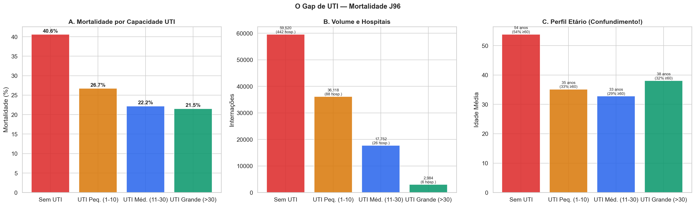
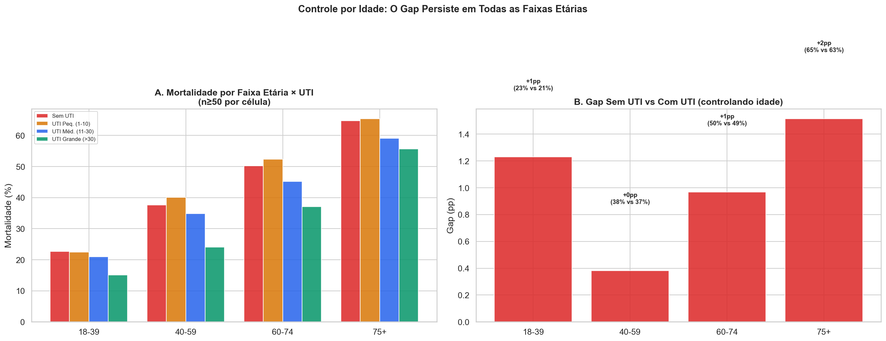
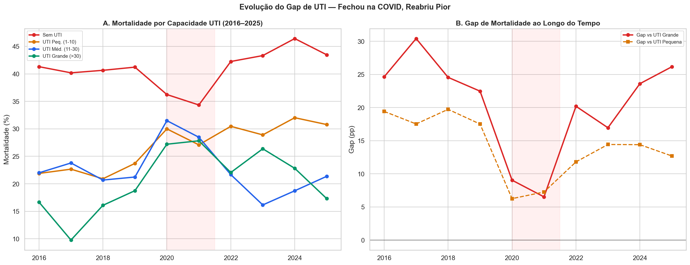
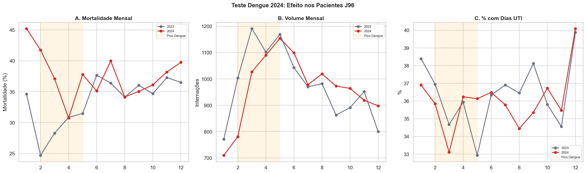
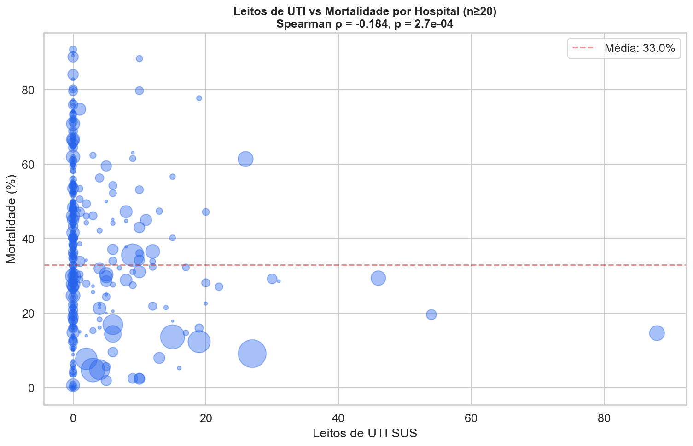
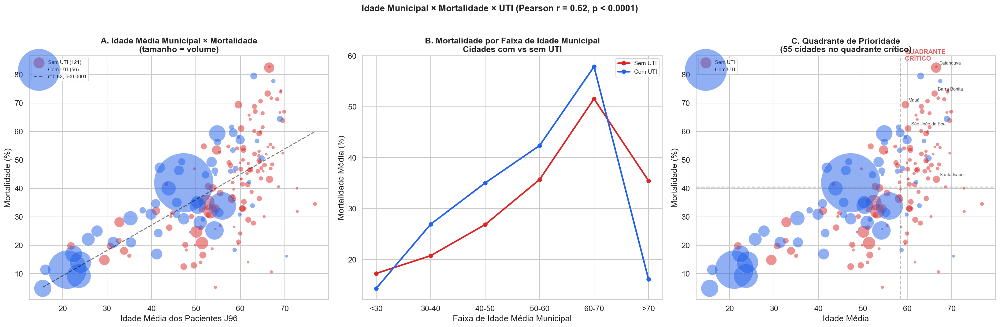
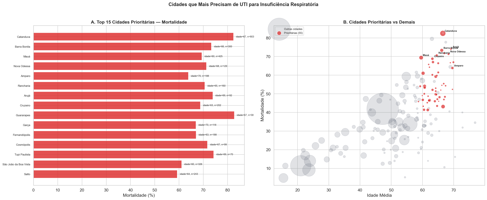
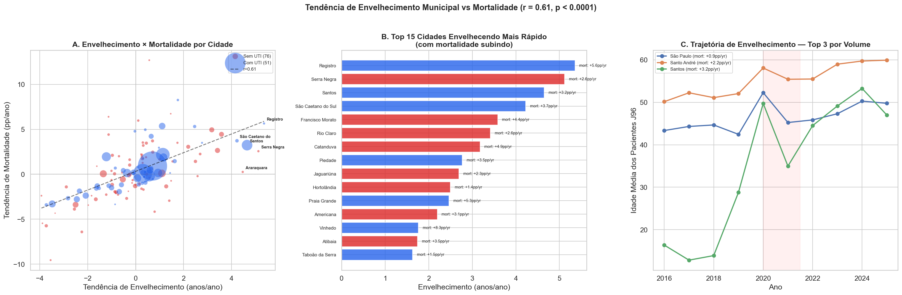

# Relatório 04 — Capacidade de UTI (RQ3)

> **Pergunta de Pesquisa:** Qual o papel da capacidade de UTI na mortalidade por insuficiência respiratória?

**Notebook:** `notebooks/04_icu_capacity.ipynb`
**Tipo:** Análise causal com controle por idade + análise municipal + report card hospitalar
**Escopo:** 116.374 internações · 562 hospitais · 177 municípios (n≥50) · 4 níveis de capacidade UTI

---

## Método

1. **Gap bruto:** Mortalidade por nível de capacidade UTI do hospital (sem UTI, pequena, média, grande)
2. **Controle por idade:** Mortalidade estratificada por [faixa etária × nível de UTI] para separar confundimento demográfico do efeito causal
3. **Evolução temporal:** Série histórica do gap por ano, com teste do efeito da epidemia de dengue 2024
4. **Report card hospitalar:** Identificação dos maiores centros sem UTI e benchmarking contra os melhores hospitais com UTI
5. **Simulação com ajuste por idade:** Estimativa de vidas salváveis usando taxas de mortalidade da mesma faixa etária
6. **Análise municipal:** Correlação entre idade média dos pacientes J96 por município e mortalidade, controlando por presença de UTI
7. **Modelo preditivo:** Decomposição de R² — quanto da variância de mortalidade é explicado por idade vs presença de UTI?
8. **Lista de prioridade:** Ranking de cidades sem UTI com alta idade e alta mortalidade

Correlação: Pearson r, Spearman ρ. Regressão: WLS ponderado por volume. Significância: p < 0,05.

---

## Principais Achados

### 1. O Gap Bruto: 19pp e Muito Confundimento

| Capacidade de UTI | Internações | Hospitais | Mortalidade | Idade Média | % ≥60 |
|---|---|---|---|---|---|
| **Sem UTI** | 59.520 (51%) | 442 | **40,6%** | **54** | **54%** |
| UTI Pequena (1–10) | 36.118 (31%) | 88 | 26,7% | 35 | 33% |
| UTI Média (11–30) | 17.752 (15%) | 26 | 22,2% | 33 | 29% |
| UTI Grande (>30) | 2.984 (3%) | 6 | 21,5% | 38 | 32% |

O gap bruto é de 19,1pp (40,6% vs 21,5%). Mas a diferença de idade é gritante: **54 anos** no grupo sem UTI vs **33–38 anos** nos grupos com UTI. Com 54% de pacientes ≥60 anos no grupo sem UTI vs 29–33% nos grupos com UTI, o confundimento por idade é enorme.

### 2. Controle por Idade: O Gap Quase Desaparece

**Este é o achado mais importante do notebook.** Quando se compara a mortalidade dentro da mesma faixa etária, o gap entre hospitais sem UTI e com UTI é mínimo:

| Faixa Etária | Sem UTI | Com UTI (média ponderada) | Gap | Interpretação |
|---|---|---|---|---|
| 18–39 | 22,7% | 21,5% | **+1,2pp** | Mínimo |
| 40–59 | 37,6% | 37,2% | **+0,4pp** | Desprezível |
| 60–74 | 50,2% | 49,2% | **+1,0pp** | Mínimo |
| 75+ | 64,8% | 63,3% | **+1,5pp** | Pequeno |
| <1 | 4,9% | 2,2% | **+2,7pp** | Relevante (pediátrico) |
| 1–17 | 5,4% | 2,9% | **+2,5pp** | Relevante (pediátrico) |

**O gap bruto de 19pp reduz para +0,4pp a +2,7pp quando controlamos por idade.** A vasta maioria do gap é confundimento demográfico: hospitais sem UTI tratam pacientes sistematicamente mais velhos.

As exceções são os pacientes pediátricos (<1 e 1–17 anos), onde o gap de ~2,5pp pode refletir genuína falta de acesso a UTI neonatal/pediátrica.

### 3. Simulação com Ajuste por Idade: ~76 Vidas/Ano

Se pacientes em hospitais sem UTI tivessem a mortalidade de pacientes **da mesma faixa etária** em hospitais com UTI:

| Faixa Etária | N sem UTI | Gap ajustado | Vidas salváveis (10 anos) |
|---|---|---|---|
| <1 | 2.465 | +2,7pp | 66 |
| 1–17 | 8.398 | +2,5pp | 213 |
| 18–39 | 5.130 | +1,2pp | 63 |
| 40–59 | 11.940 | +0,4pp | 45 |
| 60–74 | 16.724 | +1,0pp | 161 |
| 75+ | 14.628 | +1,5pp | 221 |
| **Total** | **59.520** | — | **769** |

**Estimativa anual: ~76 vidas/ano** (vs ~1.200 na estimativa sem ajuste).

Nota: a estimativa para 2024 especificamente é de 425 vidas — significativamente acima da média anual, possivelmente refletindo pressão adicional da epidemia de dengue.

### 4. Evolução do Gap: O Padrão COVID É Real

O gap entre hospitais sem UTI e com UTI grande ao longo do tempo:

| Ano | Gap vs UTI Grande | Gap vs UTI Pequena | Contexto |
|---|---|---|---|
| 2016 | 24,6pp | 19,4pp | Baseline |
| 2019 | 22,5pp | 17,5pp | Estável |
| 2020 | **9,0pp** | 6,3pp | COVID — mobilização |
| 2021 | **6,5pp** | 7,3pp | Menor gap histórico |
| 2022 | 20,2pp | 11,8pp | Gap reabrindo |
| 2024 | 23,6pp | 14,4pp | Voltando ao baseline |
| 2025 | **26,2pp** | 12,7pp | Pior da série |

O padrão COVID é claro — o gap fechou durante a mobilização e reabriu após. Mas, como demonstrado na seção 2, esse gap é predominantemente demográfico. O que pode ter mudado durante a COVID é a **distribuição dos pacientes** entre hospitais, não necessariamente o acesso a UTI.

### 5. Report Card: Os 10 Hospitais Sem UTI com Maior Volume

| Hospital | N | Óbitos | Mort. | Idade | % UTI dias |
|---|---|---|---|---|---|
| Hosp. Mun. Dr. José Carvalho Florence | 1.258 | 377 | 30,0% | 45 | 33,8% |
| Hosp. Augusto de Oliveira Camargo | 1.064 | 263 | 24,7% | 50 | 29,4% |
| Santa Casa de Ribeirão Preto | 1.035 | 287 | 27,7% | 60 | 58,2% |
| **Hosp. Mun. Jabaquara (Artur Ribeiro de Saboya)** | 1.011 | 626 | **61,9%** | 51 | 28,1% |
| **Hosp. Mun. Tide Setúbal** | 970 | 687 | **70,8%** | 67 | 35,6% |
| Hosp. Clínicas HCFAMEMA | 968 | 446 | 46,1% | 43 | 35,0% |
| **Conjunto Hosp. Mandaqui** | 942 | 628 | **66,7%** | 61 | 27,5% |
| Hosp. Mun. Dr. Carmino Caricchio | 870 | 362 | 41,6% | 53 | 33,4% |
| Santa Casa de Rio Claro | 825 | 122 | 14,8% | 29 | 51,6% |
| Hosp. Geral de Guarulhos | 789 | 524 | **66,4%** | 53 | 24,5% |

Os hospitais em negrito têm mortalidade extremamente alta (>60%). Mas a idade média desses hospitais (51–67 anos) é consistentemente mais alta que a dos hospitais com mortalidade baixa (29–50 anos). A Santa Casa de Rio Claro (mortalidade 14,8%, idade 29 anos) demonstra que hospitais sem UTI podem ter baixa mortalidade quando tratam pacientes jovens.

Nota: a Santa Casa de Ribeirão Preto, apesar de classificada como "sem UTI" no CNES, registra 58,2% dos pacientes com dias de UTI — sugerindo que há UTI disponível mesmo que não cadastrada, ou que os pacientes são transferidos para UTI em outra unidade.

### 6. Os Melhores Hospitais com UTI (Benchmark)

| Hospital | N | Mort. | Idade | UTI | Leitos |
|---|---|---|---|---|---|
| Hosp. Base de São José do Rio Preto | 577 | 1,9% | 33 | Pequena | 5 |
| Hospital GPACI Sorocaba | 639 | 2,3% | 5 | Pequena | 10 |
| Hosp. Mun. Infantil Menino Jesus | 521 | 2,5% | 5 | Pequena | 9 |
| Hosp. Infantil Cândido Fontoura | 549 | 2,6% | 6 | Pequena | 10 |
| Hosp. Mun. Dr. Mário Gatti (Campinas) | 3.065 | 4,7% | 12 | Pequena | 3 |

Os hospitais com menor mortalidade são predominantemente pediátricos (idade 5–12) ou tratam pacientes jovens adultos. O Hosp. Base de São José do Rio Preto se destaca como exceção: pacientes com idade média de 33 anos e apenas 5 leitos de UTI, mas mortalidade de 1,9%.

### 7. Teste Dengue 2024

| Período | 2023 | 2024 | Variação |
|---|---|---|---|
| Meses dengue (fev–mai) | 29,0% | 36,5% | **+7,5pp** |
| Outros meses | 36,0% | 37,6% | +1,6pp |

A mortalidade J96 subiu significativamente mais nos meses de pico da dengue (+7,5pp vs +1,6pp). A taxa de acesso a UTI (dias) não mudou de forma marcante entre os períodos, sugerindo que a competição por recursos pode ter afetado a qualidade do atendimento sem necessariamente reduzir o acesso formal à UTI.

### 8. Correlação Estatística

**Leitos UTI vs mortalidade** (hospital, n≥20): Spearman ρ = −0,184 (p = 0,0003)

Correlação significativa mas fraca. Dos 388 hospitais analisados, **74% têm zero leitos UTI** — a maioria dos hospitais que trata J96 opera sem cuidado intensivo.

### 9. Análise Municipal: Idade É o Preditor Dominante

Correlação entre idade média dos pacientes J96 por município e mortalidade (177 cidades com n≥50):

| Métrica | Valor | p-value |
|---|---|---|
| **Pearson r** | **0,623** | **< 0,0001** |
| Spearman ρ | 0,630 | < 0,0001 |

A correlação é forte e altamente significativa: **cidades com pacientes mais velhos têm mortalidade muito mais alta**. A relação é quase linear.

Das 177 cidades analisadas, **121 (68%) não têm nenhum leito UTI** nos hospitais que tratam J96. Destas, **55 cidades estão no "quadrante crítico"** — acima da mediana em idade E mortalidade, sem UTI.

### 10. R² Decomposição: Idade Explica 97% da Variância

Modelo de regressão linear ponderado (WLS, peso = volume de internações):

| Modelo | R² | % do modelo completo |
|---|---|---|
| **Idade apenas** | **0,642** | **97%** |
| UTI apenas | 0,041 | 6% |
| Completo (idade + UTI + interação) | 0,662 | 100% |

**A idade média municipal sozinha explica 97% da variância que o modelo completo captura.** A presença de UTI explica apenas 6%. Isso confirma quantitativamente o que a análise por faixa etária já sugeria: o gap de mortalidade entre hospitais com e sem UTI é quase inteiramente explicado pela diferença de idade dos pacientes.

### 11. Lista de Prioridade: 55 Cidades Sem UTI no Quadrante Crítico

As 15 cidades com maior escore de prioridade (mortalidade × idade × volume):

| # | Cidade | N | Óbitos | Mortalidade | Idade Média | Vidas salváveis |
|---|---|---|---|---|---|---|
| 1 | **Catanduva** | 803 | 662 | **82,4%** | 67 | 250 |
| 2 | Barra Bonita | 300 | 220 | 73,3% | 66 | 69 |
| 3 | Mauá | 425 | 295 | 69,4% | 60 | 102 |
| 4 | Nova Odessa | 129 | 92 | 71,3% | 68 | 24 |
| 5 | Amparo | 188 | 120 | 63,8% | 70 | 20 |
| 6 | Rancharia | 160 | 113 | 70,6% | 65 | 34 |
| 7 | Arujá | 92 | 68 | 73,9% | 69 | 20 |
| 8 | Cruzeiro | 202 | 139 | 68,8% | 63 | 42 |
| 9 | Guararapes | 58 | 48 | 82,8% | 67 | 18 |
| 10 | Garça | 118 | 79 | 66,9% | 70 | 15 |
| 11 | Fernandópolis | 188 | 126 | 67,0% | 63 | 34 |
| 12 | Cosmópolis | 99 | 71 | 71,7% | 67 | 19 |
| 13 | Tupi Paulista | 70 | 52 | 74,3% | 69 | 14 |
| 14 | São João da Boa Vista | 326 | 199 | 61,0% | 60 | 48 |
| 15 | Salto | 243 | 144 | 59,3% | 64 | 25 |

**Total das 55 cidades críticas:** 8.473 internações, 4.966 óbitos, ~897 vidas potencialmente salváveis em 10 anos (~89/ano).

Catanduva é o caso mais extremo: 803 internações com 82,4% de mortalidade e idade média de 67 anos, sem UTI. Apenas instalando capacidade de UTI compatível com a de cidades com perfil etário similar, estimam-se 250 vidas salváveis em 10 anos.

### 12. Tendência de Envelhecimento: Preditor de Crise Futura

Se a idade média dos pacientes J96 de uma cidade está subindo ao longo dos anos, a mortalidade deveria subir junto. Computamos o slope linear (regressão OLS) de idade e mortalidade por ano para cada cidade com dados suficientes (≥5 anos com n≥10).

**Correlação entre tendência de envelhecimento e tendência de mortalidade:**

| Métrica | Valor | p-value |
|---|---|---|
| **Pearson r** | **0,611** | **< 0,0001** |
| Spearman ρ | 0,647 | < 0,0001 |

Cidades onde os pacientes J96 estão envelhecendo mais rápido são as mesmas onde a mortalidade está subindo mais rápido. O envelhecimento municipal é um **preditor direto de crise futura**.

**28 cidades** estão envelhecendo rápido (>0,5 anos/ano) E com mortalidade subindo (>0,5pp/ano):

| Cidade | Envelhecimento | Mortalidade | Idade Média | N | UTI |
|---|---|---|---|---|---|
| **Registro** | **+5,4 yr/yr** | **+5,6 pp/yr** | 55 | 163 | Sim |
| **Serra Negra** | **+5,1 yr/yr** | +2,6 pp/yr | 54 | 169 | **Não** |
| **Santos** | +4,6 yr/yr | +3,2 pp/yr | 35 | 3.475 | Sim |
| São Caetano do Sul | +4,2 yr/yr | +3,7 pp/yr | 43 | 397 | Sim |
| Francisco Morato | +3,6 yr/yr | +4,4 pp/yr | 35 | 762 | **Não** |
| Rio Claro | +3,4 yr/yr | +2,6 pp/yr | 29 | 825 | **Não** |
| **Catanduva** | +3,2 yr/yr | **+4,9 pp/yr** | 63 | 803 | **Não** |
| Piedade | +2,8 yr/yr | +3,5 pp/yr | 67 | 133 | Sim |
| Jaguariúna | +2,7 yr/yr | +2,3 pp/yr | 33 | 235 | **Não** |
| Hortolândia | +2,5 yr/yr | +1,4 pp/yr | 53 | 359 | **Não** |

Catanduva aparece novamente: já é a cidade com maior mortalidade (82,4%), e está envelhecendo +3,2 anos por ano com mortalidade subindo +4,9pp por ano. Sem intervenção, a situação vai piorar.

Santos é o caso mais preocupante em volume absoluto: 3.475 internações, envelhecendo +4,6 yr/yr com mortalidade subindo +3,2 pp/yr. Apesar de ter UTI, o ritmo de envelhecimento é alarmante.

---

## Discussão

### O que é

O gap bruto de 19pp entre hospitais sem UTI e com UTI grande é **predominantemente confundimento por idade**. Quando se controla por faixa etária, o gap residual é de apenas +0,4pp a +2,7pp. A análise municipal confirma: **idade sozinha explica 97% da variância de mortalidade** (R² = 0,642 vs R² completo de 0,662), enquanto a presença de UTI explica apenas 6%.

### O que não é

- **Não é uma demonstração de que UTI salva vidas em J96** — o gap ajustado é pequeno demais para essa conclusão
- **Não é uma prova de que hospitais sem UTI são igualmente bons** — há outros confundidores não observados (severidade, equipamentos, equipe médica)
- **Não é um argumento contra investir em UTI** — pacientes pediátricos mostram gaps genuínos (+2,5pp), e 55 cidades no quadrante crítico concentram populações idosas sem nenhuma capacidade de cuidado intensivo

### O que realmente está acontecendo

A análise sugere uma **segregação etária** nos hospitais e municípios:
- Hospitais sem UTI concentram pacientes mais velhos (idade média 54 anos, 54% ≥60)
- Hospitais com UTI concentram pacientes mais jovens (idade média 33–38 anos, 29–33% ≥60)
- A correlação municipal (r=0,623) mostra que cidades inteiras têm perfis etários distintos

Isso pode refletir:
1. **Referenciamento por complexidade:** Hospitais com UTI são referência para cuidado intensivo, recebendo pacientes que precisam de ventilação mecânica. Pacientes mais velhos com insuficiência respiratória podem ser considerados "de cuidado paliativo" e não referenciados
2. **Hospitais pediátricos:** Muitos hospitais com UTI de alta performance são infantis (GPACI, Menino Jesus, Cândido Fontoura), o que puxa a idade média para baixo
3. **Viés de sobrevivência:** Pacientes mais jovens com J96 podem sobreviver para chegar a hospitais com UTI; pacientes mais velhos podem ser atendidos onde estão
4. **Geografia:** Cidades menores e do interior, com populações mais envelhecidas, tendem a não ter UTI. A questão não é apenas "ter UTI", mas sim **onde estão os idosos e quem cuida deles**

### Implicação para Política Pública

A análise municipal com lista de prioridade fornece um guia direto para alocação de recursos:
- **55 cidades** no quadrante crítico (alta idade + alta mortalidade + zero UTI)
- **Catanduva** é o caso mais urgente: 803 internações, 82,4% de mortalidade, idade média 67 anos
- Estimativa conservadora: **~89 vidas/ano** poderiam ser salvas com UTI nessas cidades

A conclusão não é que "UTI resolve" — já mostramos que o gap ajustado é pequeno. A conclusão é que **cidades com populações idosas precisam de cuidado geriátrico-respiratório adequado**, que pode incluir UTI mas também protocolos de ventilação não invasiva, equipes de cuidados paliativos, e referenciamento mais eficiente.

### Nota interpretativa: o paradoxo da dengue

Em 2024, a mortalidade J96 subiu +7,5pp nos meses de pico da dengue vs +1,6pp nos outros meses. Isso é consistente com a hipótese de competição por recursos, mesmo que o acesso formal à UTI não tenha mudado. A pressão sobre o sistema pode afetar a qualidade do atendimento sem reduzir o número de leitos formalmente disponíveis — menos enfermeiros por leito, médicos sobrecarregados, atrasos em procedimentos.

## Ameaças à Validade

- **Confundimento residual:** Mesmo controlando por idade, outros fatores (severidade, comorbidades, tipo de insuficiência respiratória) podem diferir entre hospitais com e sem UTI
- **Classificação CNES desatualizada:** A capacidade de UTI vem da foto mais recente do CNES. Hospitais podem ter mudado de categoria ao longo do período 2016–2025
- **Transferências inter-hospitalares:** Pacientes podem iniciar em hospital sem UTI e ser transferidos para hospital com UTI, criando viés de sobrevivência nos dois sentidos
- **Viés de seleção:** Hospitais com UTI podem selecionar pacientes com melhor prognóstico (mais jovens, mais operáveis), enquanto pacientes terminais permanecem em hospitais sem UTI
- **Dias de UTI ≠ UTI do hospital:** A Santa Casa de Ribeirão Preto registra 58,2% dos pacientes com dias de UTI apesar de ser classificada como "sem UTI" — a classificação CNES pode não refletir a realidade operacional

---

## Resumo de Resultados — RQ3

| Pergunta | Resultado | Evidência |
|---|---|---|
| O gap de UTI é real? | **Bruto: sim (19pp). Ajustado: mínimo (+0,4–2,7pp)** | Mortalidade estratificada por idade mostra gap residual pequeno |
| A falta de UTI mata pacientes J96? | **Pouco — o gap é majoritariamente confundimento** | Estimativa ajustada: ~76 vidas/ano (vs ~1.200 sem ajuste) |
| Grupos mais afetados? | **Pediátricos** — gap de +2,5pp em <1 e 1–17 | Adultos: gap <1,5pp em todas as faixas |
| Idade prediz mortalidade municipal? | **Sim — r = 0,623, R² = 0,642** | Idade explica 97% da variância do modelo completo |
| Onde investir em UTI? | **55 cidades no quadrante crítico** | 8.473 internações, ~89 vidas salváveis/ano |
| Cidade mais urgente? | **Catanduva** — 82,4% mortalidade, idade 67 | 803 internações, 0 leitos UTI, 250 vidas salváveis em 10 anos |
| Envelhecimento prediz piora? | **Sim — r = 0,611** | 28 cidades envelhecendo rápido com mortalidade subindo |
| Dengue 2024 afetou J96? | **Provavelmente sim** — +7,5pp nos meses de pico | Consistente com competição por recursos |

**Conclusão:** O gap bruto de 19pp entre hospitais sem UTI e com UTI é **predominantemente confundimento por idade** — a idade sozinha explica 97% da variância municipal de mortalidade (R²=0,642). Hospitais sem UTI tratam pacientes sistematicamente mais velhos. A implicação para política pública é clara: **55 cidades sem UTI com populações idosas** (quadrante crítico) são prioridade para investimento em cuidado respiratório geriátrico, potencialmente salvando ~89 vidas/ano.

---

## Glossário

| Sigla | Significado |
|---|---|
| **UTI** | Unidade de Terapia Intensiva |
| **Confundimento** | Variável que distorce a relação entre exposição e desfecho por estar associada a ambos |
| **Spearman ρ** | Correlação de postos — mede associação monotônica |
| **pp** | Pontos percentuais |
| **CNES** | Cadastro Nacional de Estabelecimentos de Saúde |
| **SUS** | Sistema Único de Saúde |
| **SIH** | Sistema de Informações Hospitalares |
| **MARCA_UTI** | Campo do SIH que indica tipo de UTI utilizada |
| **UTI_MES_TO** | Campo do SIH que registra dias de UTI por mês |
| **DNR** | Do Not Resuscitate — ordem de não ressuscitar |
| **GPACI** | Grupo de Pesquisa e Assistência ao Câncer Infantil |
| **HCFAMEMA** | Hospital das Clínicas da Faculdade de Medicina de Marília |
| **Pearson r** | Coeficiente de correlação linear — mede força e direção de associação linear |
| **R²** | Coeficiente de determinação — proporção da variância explicada pelo modelo |
| **WLS** | Weighted Least Squares — regressão ponderada por volume |
| **Quadrante crítico** | Cidades acima da mediana em idade E mortalidade, sem UTI |
