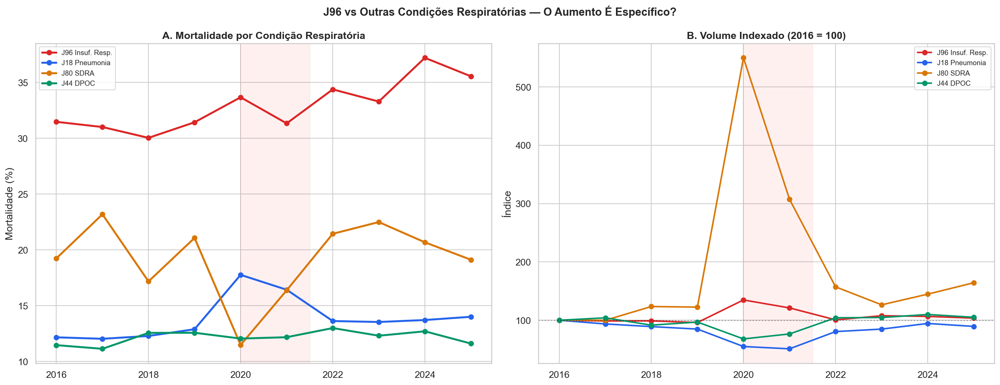
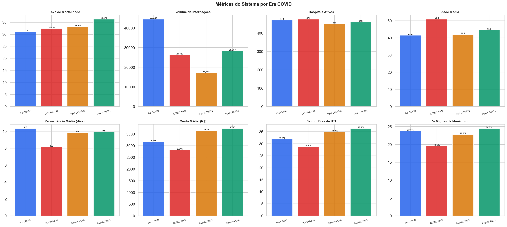
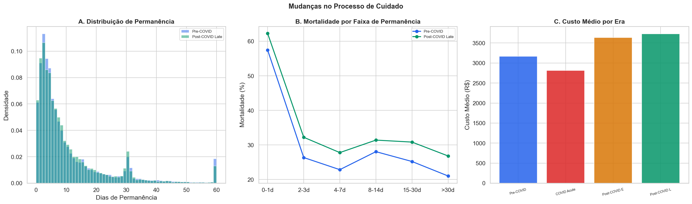
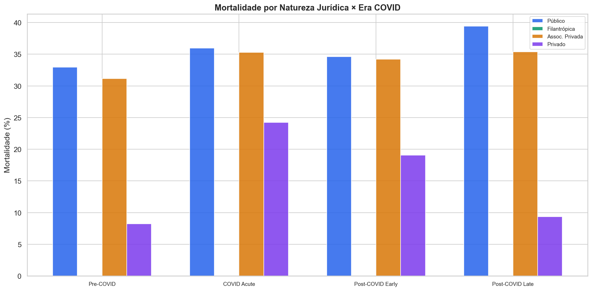
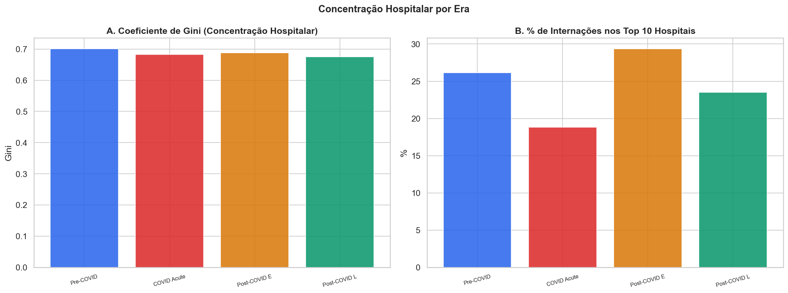

# Relatório 05 — O Eco da COVID: O Que Mudou Permanentemente no Sistema? (RQ4)

> **Pergunta de Pesquisa:** A COVID deixou efeitos estruturais permanentes no tratamento da insuficiência respiratória?

**Notebook:** `notebooks/05_covid_echo.ipynb`
**Tipo:** Análise longitudinal de mudanças estruturais no sistema de cuidado
**Escopo:** 116.374 internações · 4 eras COVID · comparação com J18, J80 e J44

---

## Método

Cinco dimensões de mudança foram analisadas:

1. **Métricas do sistema por era** — mortalidade, volume, permanência, custo, acesso a UTI, migração
2. **Turnover hospitalar** — hospitais que pararam vs começaram a tratar J96 após a COVID
3. **Processo de cuidado** — permanência, custo, distribuição por faixa de permanência
4. **Comparação cruzada** — J96 vs J18 (pneumonia), J80 (SDRA), J44 (DPOC) — o aumento é específico ou generalizado?
5. **Concentração hospitalar** — Gini e share dos top 10 hospitais por era

---

## Principais Achados

### 1. O Aumento de Mortalidade É Específico de J96

Este é o achado mais importante: **o aumento de mortalidade não é generalizado entre condições respiratórias**:

| Condição | Pré-COVID | Pós-COVID Tardio | Variação |
|---|---|---|---|
| **J96 Insuf. Respiratória** | **31,0%** | **36,4%** | **+5,4pp** |
| J18 Pneumonia | 12,3% | 13,9% | +1,5pp |
| J80 SDRA | 20,1% | 19,9% | −0,2pp |
| J44 DPOC | 11,9% | 12,2% | +0,3pp |

Se fosse uma piora geral do sistema (falta de leitos, de equipe, de insumos), esperaríamos aumento em todas as condições respiratórias. Mas a mortalidade de SDRA (J80) — condição que também depende de cuidado intensivo — está *estável*. Pneumonia (J18) subiu apenas +1,5pp. DPOC (J44) está praticamente inalterada.

Isso descarta explicações sistêmicas genéricas e aponta para algo específico ao **manejo da insuficiência respiratória** ou à **mudança no perfil dos pacientes codificados como J96**.

### 2. Métricas do Sistema por Era

| Métrica | Pré-COVID | COVID Aguda | Pós-COVID Inicial | Pós-COVID Tardio |
|---|---|---|---|---|
| Mortalidade | 31,1% | 32,4% | 33,2% | **36,3%** |
| Volume/ano | ~11.100 | ~13.200 | ~11.500 | ~11.300 |
| Hospitais ativos | 470 | 475 | 450 | 459 |
| Idade média | 41,4 | **50,9** | 41,9 | 44,5 |
| Permanência (dias) | 10,3 | 8,2 | 9,8 | 9,9 |
| Custo médio (R$) | 3.169 | 2.816 | 3.636 | **3.730** |
| % em hosp. sem UTI | 48,3% | **57,2%** | 47,5% | 52,2% |
| % com dias de UTI | 31,8% | 28,8% | 35,0% | **36,3%** |
| % migrou de município | 23,8% | 19,6% | 22,8% | 24,5% |

Destaques:
- A **idade média subiu 10 anos durante a COVID** (41,4 → 50,9) — refluxo de pacientes COVID com insuficiência respiratória. Após, caiu para 44,5, mas não voltou ao patamar pré-COVID
- O **custo médio aumentou 18%** (R$3.169 → R$3.730), possivelmente por protocolos mais caros ou pacientes mais complexos
- A **proporção em hospitais sem UTI subiu** de 48% para 52% — mais pacientes indo para hospitais sem estrutura
- O **acesso a dias de UTI melhorou** de 32% para 36% — paradoxalmente, mais pacientes recebem UTI mas morrem mais

### 3. Turnover Hospitalar: Os Novos São Piores

| Grupo | Hospitais | Internações | Mortalidade | Idade Média |
|---|---|---|---|---|
| Pararam de tratar J96 | 56 | 682 (pré-COVID) | 30,9% | 48 |
| Continuaram | 414 | — | — | — |
| Começaram a tratar J96 | 45 | 1.165 (pós-COVID) | **39,6%** | 49 |

Os 45 hospitais que começaram a tratar J96 após a COVID têm mortalidade significativamente mais alta (39,6%) do que os 56 que pararam (30,9%). Os novos hospitais podem ser menos especializados em cuidado respiratório.

Para os 414 hospitais que continuaram, o volume mediano caiu 32% e a mortalidade mediana subiu +0,9pp. O sistema se rearranjou com menos volume por hospital mas resultados piores.

### 4. Mudanças no Processo de Cuidado

| Era | LOS Média | LOS Mediana | Custo Médio | Custo Mediano |
|---|---|---|---|---|
| Pré-COVID | 10,3d | 5d | R$3.169 | R$810 |
| COVID Aguda | 8,2d | 4d | R$2.816 | R$721 |
| Pós-COVID Inicial | 9,8d | 5d | R$3.636 | R$869 |
| Pós-COVID Tardio | 9,9d | 6d | R$3.730 | R$926 |

A permanência mediana subiu de 5 para 6 dias, e o custo mediano de R$810 para R$926 (+14%). A permanência caiu durante a COVID (possivelmente alta precoce ou óbito rápido) e não voltou integralmente ao nível pré-COVID.

### 5. Hospitais Públicos Pioraram Mais

| Natureza Jurídica | Pré-COVID | COVID | Pós-COVID Inicial | Pós-COVID Tardio | Δ Total |
|---|---|---|---|---|---|
| **Público** | **33,0%** | 36,0% | 34,6% | **39,4%** | **+6,4pp** |
| Assoc. Privada | 31,2% | 35,3% | 34,2% | 35,4% | +4,2pp |
| Privado | 8,2% | 24,2% | 19,0% | 9,4% | +1,2pp |

Os hospitais públicos tiveram a maior piora absoluta (+6,4pp). O setor privado teve uma distorção brutal durante a COVID (8,2% → 24,2%) mas se recuperou. As associações privadas (Santas Casas, filantrópicas) pioraram +4,2pp.

### 6. Concentração Hospitalar Diminuiu

| Era | Gini | Share Top 10 | Hospitais |
|---|---|---|---|
| Pré-COVID | 0,701 | 26,2% | 470 |
| COVID Aguda | 0,683 | 18,8% | 475 |
| Pós-COVID Inicial | 0,688 | 29,4% | 450 |
| Pós-COVID Tardio | 0,675 | 23,5% | 459 |

A concentração diminuiu ligeiramente (Gini: 0,701 → 0,675), com mais hospitais tratando volumes menores. Isso pode refletir desconcentração forçada durante a COVID que se manteve parcialmente. A desconcentração pode ter consequências negativas se hospitais menores estão menos equipados para J96.

---

## Discussão

### O Enigma Central

Se o aumento de mortalidade é específico de J96 e não afeta J80 (SDRA) ou J44 (DPOC), as explicações sistêmicas genéricas (falta de leitos, de equipe) são insuficientes. Possíveis explicações:

**Hipótese 1: Mudança de Codificação**
A migração de J96.0 (aguda, 92,8% → 76,9%) para J96.9 (NE, 5,8% → 16,1%) pode indicar que pacientes anteriormente codificados com outras condições (J18, J80) estão agora sendo codificados como J96, trazendo perfis de mortalidade diferentes. Se J96 está "absorvendo" pacientes mais graves de outras categorias, o aumento de mortalidade refletiria uma mudança administrativa, não clínica.

**Hipótese 2: Long COVID e Sequelas Pulmonares**
Pacientes com sequelas pulmonares pós-COVID podem estar sendo internados com J96 em maior proporção. Esses pacientes tendem a ser mais velhos (a idade média subiu de 41,4 para 44,5) e podem ter pior prognóstico.

**Hipótese 3: Efeito dos Hospitais Novos**
Os 45 hospitais que começaram a tratar J96 após a COVID têm mortalidade 9pp maior que os que pararam. Se esses hospitais são menos especializados, sua entrada no pool dilui a qualidade média do cuidado.

**Hipótese 4: Efeito Público**
A piora concentra-se em hospitais públicos (+6,4pp), que são o backbone do SUS para cuidado intensivo. A COVID pode ter gerado burnout de equipes, perda de profissionais especializados, ou desinvestimento relativo nessas unidades.

### O Que os Dados Não Dizem

Os dados do SIH não permitem distinguir entre essas hipóteses sem análises adicionais:
- Não há informação sobre protocolos clínicos ou condutas específicas
- A codificação CID-10 pode ter mudado por razões administrativas, não clínicas
- Não há dados sobre staffing, turnover de equipe médica, ou condições de trabalho
- O campo MARCA_UTI registra o tipo de UTI, mas não diferencia ventilação mecânica de suporte não-invasivo

### Convergência com Notebooks Anteriores

| Notebook | Achado | Como conecta |
|---|---|---|
| NB02 | Mortalidade subindo desde 2016, acelerou pós-COVID | NB05 mostra que é específico de J96 |
| NB03 | 64% efeito sistema, concentrado em pacientes sem UTI | NB05 mostra que não é um problema geral do sistema respiratório |
| NB04 | Gap de UTI é majoritariamente confundimento | NB05 confirma: o problema não é infraestrutura de UTI |
| **NB05** | **J96 é outlier — J18, J80, J44 estáveis** | **Aponta para causa específica, não sistêmica** |

---

## Ameaças à Validade

- **Mudança de codificação CID-10:** A principal ameaça. Se hospitais mudaram práticas de codificação pós-COVID (por exemplo, codificando pneumonia grave como J96 em vez de J18), o aumento de mortalidade pode ser artefato administrativo
- **Incompletude temporal:** O período pós-COVID tardio (H2 2023 – 2025) é mais curto que o período pré-COVID (2016–2019), podendo capturar sazonalidades diferentes
- **Efeito composição não observado:** A idade média subiu +3pp (41,4 → 44,5), mas outras dimensões de complexidade (fragilidade, comorbidades não documentadas) podem ter mudado mais
- **Custo nominal vs real:** Os custos não estão ajustados por inflação. O aumento de R$3.169 → R$3.730 pode ser parcialmente inflação do período 2016–2025
- **Viés de seleção dos hospitais novos:** Os 45 hospitais que começaram a tratar J96 podem ser casos em que a codificação mudou, não necessariamente hospitais novos no tratamento efetivo

---

## Resumo de Resultados — RQ4

| Pergunta | Resultado | Evidência |
|---|---|---|
| O aumento é específico de J96? | **Sim** — J80 e J44 estáveis | J96: +5,4pp, J80: −0,2pp, J44: +0,3pp |
| O número de hospitais mudou? | **Pouco** — 470 → 459 | 56 pararam, 45 começaram (novos com mortalidade +9pp) |
| O processo de cuidado mudou? | **Moderadamente** — custo subiu, LOS estável | Custo +18%, LOS mediana 5d → 6d |
| Quem piorou mais? | **Público (+6,4pp)** | Público: 33,0% → 39,4% |
| A concentração mudou? | **Diminuiu ligeiramente** — Gini 0,701 → 0,675 | Mais hospitais tratando menos volume |
| Explicação mais provável? | **Mudança de codificação + efeito hospitais novos** | Especificidade a J96 descarta causas sistêmicas |

**Conclusão:** O aumento de mortalidade por J96 é específico — não afeta outras condições respiratórias graves. Isso redireciona a investigação de causas sistêmicas genéricas (falta de leitos, de equipe) para causas específicas: mudanças de codificação CID-10, entrada de hospitais menos especializados, e possíveis efeitos de sequelas pulmonares pós-COVID. A piora concentra-se em hospitais públicos (+6,4pp) e os hospitais que começaram a tratar J96 após a COVID têm mortalidade significativamente mais alta que os que pararam.

---

## Glossário

| Sigla | Significado |
|---|---|
| **Gini** | Coeficiente de concentração (0 = perfeitamente distribuído, 1 = concentrado em um ponto) |
| **LOS** | Length of Stay — tempo de permanência hospitalar |
| **J96** | CID-10 para Insuficiência Respiratória |
| **J18** | CID-10 para Pneumonia Não Especificada |
| **J80** | CID-10 para Síndrome do Desconforto Respiratório Agudo (SDRA) |
| **J44** | CID-10 para Doença Pulmonar Obstrutiva Crônica (DPOC) |
| **pp** | Pontos percentuais |
| **SUS** | Sistema Único de Saúde |
| **SIH** | Sistema de Informações Hospitalares |
| **CNES** | Cadastro Nacional de Estabelecimentos de Saúde |
| **CID-10** | Classificação Internacional de Doenças, 10ª revisão |
| **Long COVID** | Síndrome pós-COVID-19 — sintomas persistentes após infecção |
| **Nat. Jur.** | Natureza Jurídica do estabelecimento (público, filantrópico, privado) |
