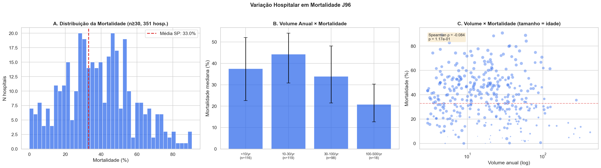
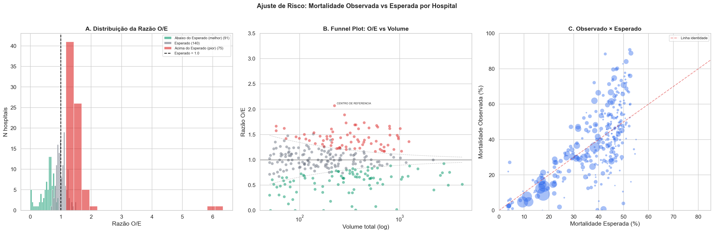
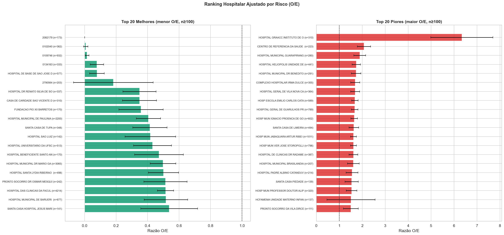
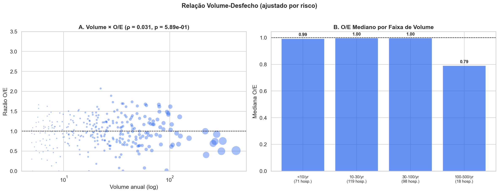
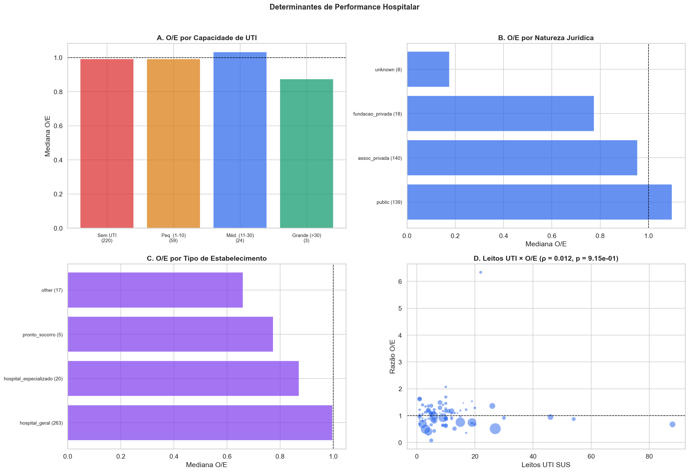
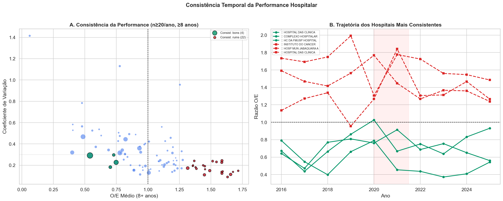
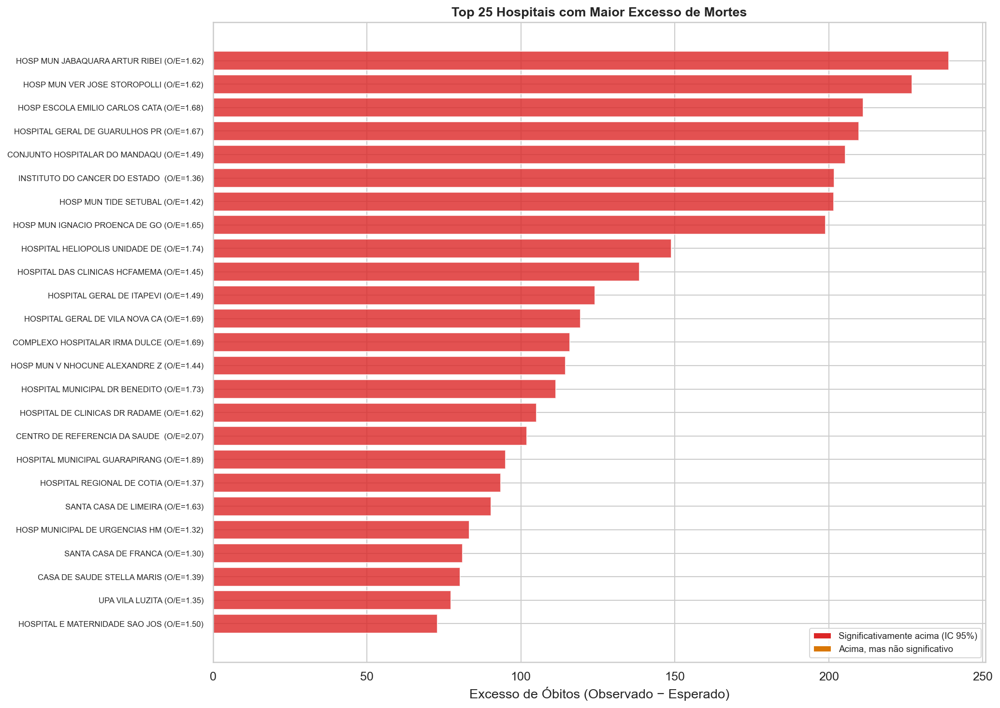
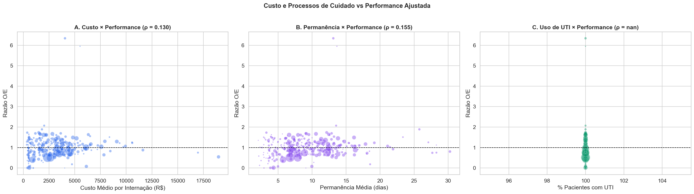

# Relatório 06 — Performance Hospitalar (RQ5)

> **Pergunta de Pesquisa:** Quais hospitais têm melhores desfechos ajustados por risco para insuficiência respiratória?

**Notebook:** `notebooks/06_hospital_performance.ipynb`
**Tipo:** Análise de performance com ajuste de risco (razão O/E) + consistência temporal + determinantes
**Escopo:** 116.374 internações · 306 hospitais com n≥50 · 97 hospitais com ≥8 anos de dados

---

## Método

1. **Mortalidade esperada:** Para cada paciente, calculamos a mortalidade esperada com base no perfil [faixa etária × sexo × tipo de admissão], usando taxas estaduais como referência
2. **Razão O/E:** Para cada hospital, dividimos óbitos observados / óbitos esperados. O/E < 1 = melhor que esperado; O/E > 1 = pior
3. **Intervalo de confiança:** IC 95% para a razão O/E usando erro padrão de Poisson. Hospitais com IC inteiramente acima de 1 são classificados como "significativamente piores"
4. **Funnel plot:** Gráfico de funil para visualizar hospitais dentro e fora dos limites de controle estatístico
5. **Relação volume-desfecho:** Correlação entre volume anual de J96 e razão O/E
6. **Determinantes:** O/E por capacidade UTI, natureza jurídica, tipo de estabelecimento, leitos UTI
7. **Consistência temporal:** O/E por ano para hospitais com ≥8 anos de dados e n≥20/ano
8. **Custo vs performance:** Correlação entre custo médio, permanência, uso de UTI e razão O/E
9. **Excesso de mortes:** Impacto absoluto dos hospitais sub-performantes (observado − esperado)

Correlação: Spearman ρ. Significância: IC 95%.

---

## Principais Achados

### 1. Enorme Variação Hospitalar

A mortalidade bruta por J96 varia de 0% a >90% entre hospitais:

| Métrica | Valor |
|---|---|
| Hospitais analisados (n≥30) | 351 |
| Mortalidade mediana | 37,8% |
| IQR | 24,9% – 52,2% |
| Amplitude total | 0% – >90% |

A dispersão é enorme — o quartil superior tem mortalidade 2× o inferior. Parte dessa variação é explicada pelo perfil dos pacientes (idade, sexo, tipo de admissão).

### 2. Ajuste de Risco: 25% dos Hospitais Matam Mais que o Esperado

Após ajuste por idade, sexo e tipo de admissão:

| Classificação | N hospitais | % |
|---|---|---|
| **Abaixo do esperado (melhor)** | **91** | **30%** |
| Dentro do esperado | 140 | 46% |
| **Acima do esperado (pior)** | **75** | **25%** |

**Um em cada quatro hospitais** tem mortalidade significativamente acima do esperado dado o perfil de seus pacientes. O O/E mediano é 0,989 (próximo de 1,0), indicando que o modelo é bem calibrado.

### 3. Os 10 Melhores e 10 Piores Hospitais

**Melhores (menor O/E, n≥100):**

| # | Hospital | N | Mort. Obs. | Mort. Esp. | O/E | Exc. | UTI |
|---|---|---|---|---|---|---|---|
| 1 | Hosp. de Base de S.J. Rio Preto | 577 | 1,9% | 24,3% | 0,08 | −129 | 5 |
| 2 | Hosp. Municipal de Paulínia | 2.200 | 4,8% | 11,9% | 0,41 | −156 | 4 |
| 3 | Santa Casa de Tupã | 348 | 16,1% | 38,8% | 0,42 | −79 | 0 |
| 4 | Hosp. Universitário da UFSCar | 513 | 9,6% | 22,1% | 0,43 | −65 | 6 |
| 5 | Hosp. Mun. Dr. Mário Gatti (Campinas) | 3.065 | 4,7% | 9,5% | 0,50 | −146 | 3 |
| 6 | HC da FMUSP (Ribeirão Preto) | 4.214 | 9,1% | 17,8% | 0,51 | −363 | 27 |
| 7 | Hosp. Municipal de Barueri | 677 | 8,0% | 15,4% | 0,52 | −50 | 13 |

O HC da FMUSP lidera em impacto absoluto: **363 vidas salvas** em relação ao esperado, em 4.214 internações. O Hosp. de Base de S.J. Rio Preto tem o menor O/E (0,08) — mortalidade de 1,9% quando se esperava 24,3%.

**Piores (maior O/E, n≥100):**

| # | Hospital | N | Mort. Obs. | Mort. Esp. | O/E | Excesso | UTI |
|---|---|---|---|---|---|---|---|
| 1 | Centro de Ref. Saúde da Mulher | 223 | 88,3% | 42,6% | 2,07 | +102 | 10 |
| 2 | Hosp. Mun. Guarapiranga | 280 | 72,1% | 38,2% | 1,89 | +95 | 0 |
| 3 | Hosp. Heliópolis | 441 | 79,6% | 45,8% | 1,74 | +149 | 0 |
| 4 | Hosp. Mun. Dr. Benedito Montenegro | 291 | 90,7% | 52,5% | 1,73 | +111 | 0 |
| 5 | Complexo Hosp. Irmã Dulce | 355 | 79,7% | 47,1% | 1,69 | +116 | 10 |
| 6 | Hosp. Geral Vila Nova Cachoeirinha | 364 | 80,2% | 47,4% | 1,69 | +119 | 0 |
| 7 | Hosp. Escola Emílio Carlos (Catanduva) | 589 | 88,8% | 52,9% | 1,68 | +211 | 0 |
| 8 | Hosp. Geral de Guarulhos | 789 | 66,4% | 39,8% | 1,67 | +210 | 0 |

O Hosp. Escola Emílio Carlos (Catanduva) e o Hosp. Geral de Guarulhos lideram em excesso absoluto: **+211 e +210 mortes** acima do esperado, respectivamente. Todos os piores hospitais são públicos, e a maioria não tem UTI.

### 4. Relação Volume-Desfecho: Inexistente

| Métrica | Valor |
|---|---|
| Volume × mortalidade bruta (Spearman ρ) | −0,084 (p = 0,12) |
| Volume × O/E ajustado (Spearman ρ) | **0,031 (p = 0,59)** |

**Não há relação volume-desfecho** para J96 no SUS-SP. Hospitais que tratam mais pacientes J96 não têm mortalidade ajustada melhor nem pior. Isso contradiz H5.2 e difere de condições cirúrgicas onde o efeito volume é bem documentado.

A faixa >100 casos/ano tem O/E mediano ligeiramente melhor (0,79), mas o número de hospitais nessa faixa é pequeno (18), reduzindo a confiança estatística.

### 5. Determinantes de Performance

**Por capacidade de UTI:**
- Hospitais sem UTI têm O/E mediano **ligeiramente acima de 1** — pior que esperado, consistente com NB04
- Hospitais com UTI grande têm O/E mediano **abaixo de 1** — melhor, mas o efeito é modesto após ajuste de risco

**Por natureza jurídica:**
- **Fundações privadas** têm melhor O/E mediano
- **Hospitais públicos** têm pior O/E mediano (~1,10)
- Mas: hospitais públicos tratam pacientes mais complexos, e o ajuste por idade/sexo/admissão pode não capturar toda a diferença de severidade

**Correlações com O/E:**

| Fator | Spearman ρ | Interpretação |
|---|---|---|
| Custo médio | +0,130 | Hospitais que gastam mais têm O/E levemente pior |
| Permanência média | +0,155 | Estadias mais longas associadas a pior O/E |
| % uso de UTI | — | Sem variação suficiente para correlação |

A correlação positiva entre custo e O/E é contra-intuitiva: hospitais que gastam mais por paciente tendem a ter piores desfechos. Isso provavelmente reflete confundimento por severidade — pacientes mais graves consomem mais recursos e morrem mais, independentemente da qualidade do cuidado.

### 6. Consistência Temporal: 22 Hospitais Consistentemente Ruins

De 97 hospitais com ≥8 anos de dados e n≥20/ano:

| Classificação | Critério | N hospitais |
|---|---|---|
| **Consistentemente bons** | O/E < 0,8 e CV < 0,3 | **4** |
| **Consistentemente ruins** | O/E > 1,3 e CV < 0,4 | **22** |

Os 4 consistentemente bons:

| Hospital | O/E médio | CV | N total |
|---|---|---|---|
| HC da FMUSP (São Paulo) | 0,54 | 0,29 | 4.214 |
| HC da FMUSP (campus secundário) | 0,70 | 0,18 | 1.210 |
| Hosp. Augusto de Oliveira Camargo | 0,73 | 0,30 | 1.064 |
| Complexo Hosp. Prefeito Edivaldo Orsi | 0,75 | 0,23 | 2.665 |

Os consistentemente bons são **hospitais universitários ou complexos de grande porte** com equipes especializadas. A consistência temporal (CV baixo) indica que a performance não é acidental.

Os 22 consistentemente ruins incluem vários hospitais municipais de São Paulo e região metropolitana. A consistência temporal sugere **problemas estruturais** — não flutuações aleatórias.

### 7. Excesso de Mortes: O Impacto Absoluto

| Métrica | Valor |
|---|---|
| Excesso total (hospitais acima do esperado) | **5.741 óbitos** |
| Vidas "salvas" (hospitais abaixo do esperado) | 5.372 |
| Balanço líquido | **+369** |

Os 10 hospitais com maior excesso absoluto:

| Hospital | Excesso | O/E | N |
|---|---|---|---|
| Hosp. Mun. Jabaquara | +239 | 1,62 | 1.011 |
| Hosp. Mun. Ver. José Storópolli | +227 | 1,62 | 796 |
| Hosp. Escola Emílio Carlos (Catanduva) | +211 | 1,68 | 589 |
| Hosp. Geral de Guarulhos | +210 | 1,67 | 789 |
| Conj. Hosp. Mandaqui | +205 | 1,49 | 942 |
| ICESP | +202 | 1,36 | 1.240 |
| Hosp. Mun. Tide Setúbal | +202 | 1,42 | 970 |
| Hosp. Mun. Ignácio Proença | +199 | 1,65 | 602 |

Apenas os 10 primeiros concentram **+1.936 mortes acima do esperado** — ~194 por ano. Se esses hospitais atingissem o desempenho esperado, quase 200 vidas/ano poderiam ser salvas.

---

## Discussão

### O que os dados mostram

A variação hospitalar em mortalidade J96 é enorme, e uma parcela significativa **não é explicada** pelo perfil dos pacientes. Após ajuste por idade, sexo e tipo de admissão, 25% dos hospitais têm mortalidade significativamente acima do esperado. Isso indica que **a qualidade do cuidado varia substancialmente** entre hospitais do SUS-SP para insuficiência respiratória.

### O padrão público vs privado

Hospitais públicos concentram-se nos piores rankings, enquanto fundações privadas e hospitais universitários dominam os melhores. Mas isso provavelmente subestima confundidores não medidos:
- Hospitais públicos recebem casos mais graves por referenciamento
- O ajuste não inclui comorbidades ou severidade da insuficiência respiratória (aguda vs crônica)
- Hospitais oncológicos (ICESP, GRAACC) aparecem como "piores" porque seus pacientes têm prognóstico inerentemente pior que o modelo captura

### O que não é

- **Não é um ranking de qualidade definitivo** — o ajuste de risco é limitado a 3 variáveis (idade, sexo, admissão). Confundidores residuais podem explicar parte da variação
- **Não prova que hospitais ruins "matam" pacientes** — pode refletir diferenças de case-mix não capturadas, ou diferenças no momento de admissão
- **Não captura transferências** — um paciente que morre após transferência de hospital A para B é contado em B, mesmo que o deterioramento tenha ocorrido em A

### Implicação para política pública

Os 22 hospitais **consistentemente ruins** (O/E > 1,3 por 8+ anos) são o alvo mais claro para intervenção. Não são flutuações — são padrões estáveis que sugerem déficits estruturais:
- Falta de protocolos de ventilação mecânica?
- Insuficiência de equipe intensivista?
- Atrasos no reconhecimento e escalação?

Se apenas os 10 hospitais com maior excesso absoluto atingissem o O/E = 1,0, **~194 vidas/ano** seriam salvas.

---

## Ameaças à Validade

- **Ajuste de risco limitado:** Apenas idade, sexo e tipo de admissão. Não inclui comorbidades, subtipo de J96 (aguda vs crônica), severidade na admissão
- **Viés de referenciamento:** Hospitais terciários recebem casos mais graves transferidos de unidades primárias
- **Hospitais oncológicos:** ICESP e GRAACC aparecem como "piores" porque seus pacientes oncológicos com J96 têm prognóstico pior que a média estadual
- **Transferências inter-hospitalares:** Óbito atribuído ao último hospital, não ao que iniciou o tratamento
- **Classificação CNES:** Capacidade de UTI e natureza jurídica refletem a foto mais recente, não necessariamente o período analisado

---

## Resumo de Resultados — RQ5

| Pergunta | Resultado | Evidência |
|---|---|---|
| Há variação significativa? | **Sim — IQR de 25% a 52%** | 351 hospitais analisados |
| Ajuste muda o ranking? | **Sim — 25% significativamente piores** | O/E com IC 95% |
| Volume prediz performance? | **Não — ρ = 0,031 (p = 0,59)** | Sem relação volume-desfecho |
| UTI prediz performance? | **Modestamente** | O/E levemente melhor com UTI grande |
| Público vs privado? | **Públicos pior O/E, mas confundimento** | Fundações melhores, mas case-mix diferente |
| Consistência temporal? | **22 consistentemente ruins** | 8+ anos de O/E > 1,3 com baixa variância |
| Impacto potencial? | **~194 vidas/ano** | Top 10 com maior excesso absoluto |

**Conclusão:** A variação hospitalar em mortalidade J96 é substancial e parcialmente independente do perfil dos pacientes. 22 hospitais são consistentemente piores que o esperado por 8+ anos, representando déficits estruturais. Intervenção focada nesses hospitais poderia salvar ~194 vidas/ano. Não há relação volume-desfecho, sugerindo que a especialização, não o volume, é o que importa.

---

## Glossário

| Sigla | Significado |
|---|---|
| **O/E** | Razão Observado/Esperado — métrica de performance ajustada por risco |
| **IC 95%** | Intervalo de confiança de 95% — faixa onde o verdadeiro valor está com 95% de probabilidade |
| **CV** | Coeficiente de variação — medida de estabilidade (desvio padrão / média) |
| **Funnel plot** | Gráfico de funil — visualiza desvios em relação ao esperado, com limites de controle |
| **Excesso de mortes** | Óbitos observados − esperados: quantifica o impacto absoluto da sub-performance |
| **Spearman ρ** | Correlação de postos — mede associação monotônica |
| **Case-mix** | Perfil de complexidade dos pacientes de um hospital |
| **HC FMUSP** | Hospital das Clínicas da Faculdade de Medicina da USP |
| **ICESP** | Instituto do Câncer do Estado de São Paulo |
| **GRAACC** | Grupo de Apoio ao Adolescente e à Criança com Câncer |
| **HCFAMEMA** | Hospital das Clínicas da Faculdade de Medicina de Marília |
