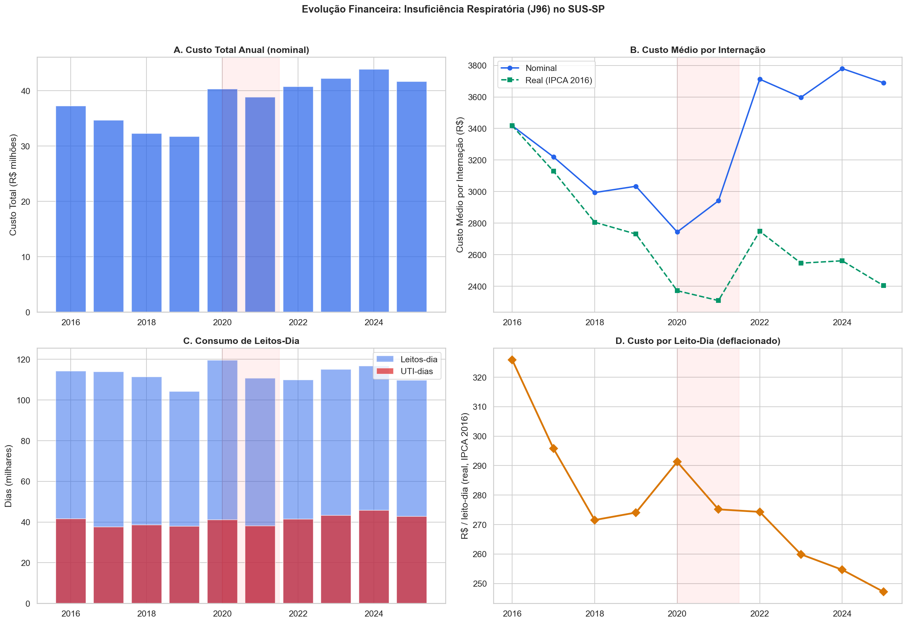
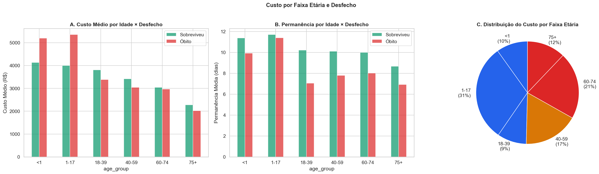
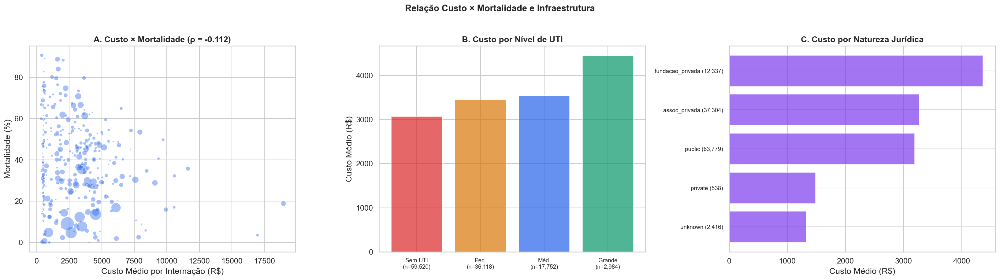
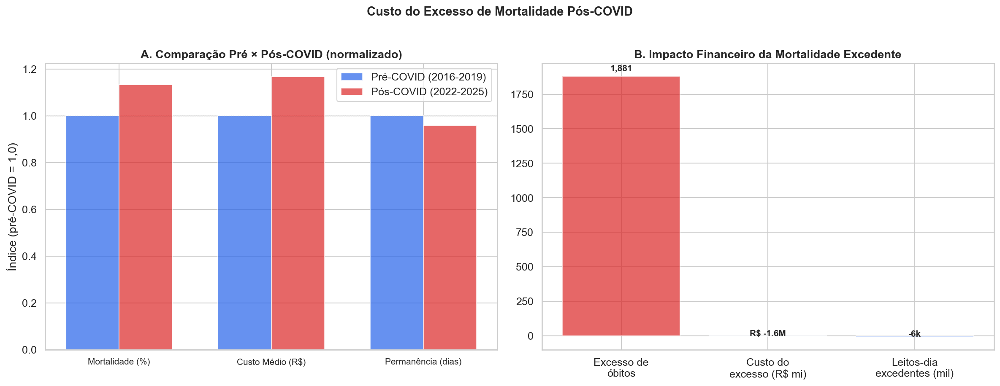

# Relatório 07 — Carga Financeira e Consumo de Leitos (RQ6)

> **Pergunta de Pesquisa:** Qual é o impacto financeiro e operacional da insuficiência respiratória no SUS-SP?

**Notebook:** `notebooks/07_financial_burden.ipynb`
**Tipo:** Análise de custos, consumo de leitos-dia e impacto financeiro da mortalidade excedente
**Escopo:** 116.374 internações · R$ 383 milhões · 1,1 milhão de leitos-dia · 408 mil UTI-dias

---

## Método

1. **Custo total e unitário:** Custo por internação, por leito-dia, por faixa etária e por desfecho (sobrevivente vs óbito)
2. **Evolução temporal:** Série 2016–2025 com deflação pelo IPCA (base 2016)
3. **Custo × mortalidade:** Correlação hospitalar entre gasto médio e mortalidade
4. **Custo por infraestrutura:** Comparação entre níveis de UTI e natureza jurídica
5. **Custo da mortalidade excedente:** Impacto financeiro e operacional da elevação pós-COVID

---

## Principais Achados

### 1. Visão Geral: R$ 38 milhões/ano

| Métrica | Total (10 anos) | Por ano | Sobreviventes | Óbitos |
|---|---|---|---|---|
| Internações | 116.374 | 11.637 | 77.990 (67%) | 38.384 (33%) |
| Custo Total | R$ 383M | R$ 38M | R$ 278M | R$ 105M |
| Custo/internação | R$ 3.295 | — | R$ 3.570 | R$ 2.738 |
| Leitos-dia | 1.125.335 | 112.534 | 826.418 | 298.917 |
| UTI-dias | 407.892 | 40.789 | 299.917 | 107.975 |
| Permanência média | 9,7 dias | — | 10,7 dias | 7,6 dias |

**Achado contra-intuitivo:** Pacientes que morrem custam **menos** que sobreviventes (R$ 2.738 vs R$ 3.570) e ficam menos tempo internados (7,6 vs 10,7 dias). Isso reflete que óbitos ocorrem cedo na internação — antes de consumir recursos de recuperação prolongada.

### 2. Custo Real Caiu 30%

| Ano | Custo Médio Nominal | Custo Real (IPCA 2016) |
|---|---|---|
| 2016 | R$ 3.418 | R$ 3.418 |
| 2025 | R$ 3.689 | R$ 2.404 |
| **Variação** | +7,9% | **−29,7%** |

O custo nominal subiu levemente, mas **em termos reais caiu quase 30%**. A tabela SUS não acompanhou a inflação. Isso significa que os hospitais estão recebendo cada vez menos por tratar J96 — uma pressão financeira que pode estar afetando a qualidade do cuidado.

### 3. Quem Custa Mais: Jovens

| Faixa Etária | Custo Sobrevivente | Custo Óbito | LOS Sobrevivente | LOS Óbito |
|---|---|---|---|---|
| <1 | R$ 4.133 | R$ 5.197 | 11,4d | 9,9d |
| 1–17 | R$ 4.001 | R$ 5.355 | 11,7d | 11,4d |
| 18–39 | R$ 3.819 | R$ 4.164 | 11,2d | 10,9d |
| 40–59 | R$ 3.272 | R$ 3.039 | 10,0d | 7,8d |
| 60–74 | R$ 3.039 | R$ 2.968 | 10,0d | 8,0d |
| 75+ | R$ 2.280 | R$ 2.021 | 8,7d | 6,9d |

Pacientes jovens custam mais (internações mais longas, procedimentos mais intensivos). Pacientes 75+ custam menos — estadias mais curtas, desfechos mais rápidos. A faixa 60–74 concentra a maior parcela do custo total pelo volume.

### 4. Gastar Mais NÃO Salva Vidas

| Correlação (hospital, n≥30) | Spearman ρ | p |
|---|---|---|
| Custo × mortalidade | **−0,112** | 0,037 |

A correlação é fraca e **negativa** — hospitais que gastam mais têm mortalidade levemente menor, mas o efeito é mínimo. Confirma H6.3: gastar mais não é uma alavanca significativa para reduzir mortalidade. A variação de qualidade entre hospitais (NB06) não é explicada pelo gasto.

**Custo por nível de UTI:**

| Nível | Custo Médio | LOS |
|---|---|---|
| Sem UTI | R$ 3.074 | 9,5d |
| UTI Pequena | R$ 3.445 | 9,4d |
| UTI Média | R$ 3.539 | 10,4d |
| UTI Grande | R$ 4.448 | 12,9d |

Hospitais com UTI grande gastam 45% mais por internação — mas como mostrado no NB04, a mortalidade ajustada por idade é similar. O custo adicional reflete a intensidade do cuidado, não necessariamente melhor desfecho.

### 5. O Custo da Mortalidade Excedente

| Métrica | Valor |
|---|---|
| Mortalidade pré-COVID | 31,0% |
| Mortalidade pós-COVID | 35,1% |
| Excesso | **+4,1pp** |
| Óbitos excedentes (2022–2025) | **1.881** |
| Excesso anual | **470 óbitos/ano** |

Se a mortalidade tivesse permanecido no nível pré-COVID, 1.881 pacientes teriam sobrevivido nos 4 anos pós-COVID. Como sobreviventes ficam mais tempo e custam mais que óbitos, a sobrevivência desses pacientes teria **aumentado** o gasto total — mas com vidas salvas.

---

## Discussão

### O paradoxo do custo

Os dados revelam um paradoxo: **óbitos custam menos que sobreviventes**. Isso não significa que tratar menos é melhor — significa que pacientes que morrem consomem menos recursos porque morrem rápido (7,6 dias vs 10,7 dias). A implicação é que **reduzir mortalidade aumentará custos unitários**, pois mais pacientes sobreviverão para consumir dias adicionais de recuperação.

### A erosão real do financiamento

O custo real por internação J96 caiu 30% em uma década. Os hospitais estão tratando pacientes mais velhos e complexos (NB03) com menos recursos reais por paciente. Essa pressão financeira pode ser um fator contribuinte para a queda de qualidade observada em 22 hospitais consistentemente sub-performantes (NB06).

### O que NÃO funciona: gastar mais

A correlação custo-mortalidade é fraca (ρ = −0,112). Aumentar o gasto por si só não é uma estratégia viável. As intervenções identificadas no NB08 (detecção precoce, melhoria de protocolos, cuidado geriátrico) são mais eficazes e potencialmente menos custosas.

---

## Ameaças à Validade

- **Custo SIH ≠ custo real:** O valor registrado no SIH é o reembolso SUS, não o custo hospitalar real. Hospitais podem gastar significativamente mais do que recebem
- **Deflator aproximado:** O IPCA é um deflator geral, não específico para saúde. A inflação médica pode ser maior
- **Custos indiretos ausentes:** O SIH não captura custos de reabilitação pós-alta, readmissões, produtividade perdida
- **Viés de sobrevivência no custo:** Pacientes que morrem no primeiro dia custam muito pouco, puxando a média para baixo

---

## Resumo de Resultados — RQ6

| Pergunta | Resultado | Evidência |
|---|---|---|
| Custo anual total? | **R$ 38M/ano** | 11.637 internações/ano |
| Custo cresceu acima da inflação? | **Não — caiu 30% em termos reais** | IPCA deflacionado 2016–2025 |
| Gastar mais = menos mortes? | **Não — ρ = −0,112 (fraco)** | Correlação hospitalar |
| Quem custa mais? | **Jovens (R$ 4–5k) > idosos (R$ 2k)** | Por faixa etária e desfecho |
| Sobreviventes vs óbitos? | **Sobreviventes custam mais (R$ 3.570 vs R$ 2.738)** | Estadias mais longas |
| Excesso pós-COVID? | **470 óbitos excedentes/ano** | +4,1pp mortalidade pós-2022 |

**Conclusão:** J96 custa R$ 38M/ano ao SUS-SP, mas o custo real por internação caiu 30% em uma década. Gastar mais não reduz mortalidade. O paradoxo central: **reduzir mortalidade aumentará custos** (sobreviventes consomem mais recursos), mas isso é exatamente o resultado desejado. O financiamento atual está sendo corroído pela inflação, possivelmente contribuindo para a deterioração da qualidade.

---

## Glossário

| Sigla | Significado |
|---|---|
| **VAL_TOT** | Campo do SIH que registra o valor total reembolsado pelo SUS |
| **IPCA** | Índice de Preços ao Consumidor Amplo — inflação oficial do Brasil |
| **Leito-dia** | Uma cama hospitalar ocupada por um paciente por um dia |
| **UTI-dia** | Um leito de UTI ocupado por um paciente por um dia |
| **LOS** | Length of Stay — tempo de permanência hospitalar |
| **Custo real** | Valor ajustado pela inflação, comparável ao longo do tempo |
