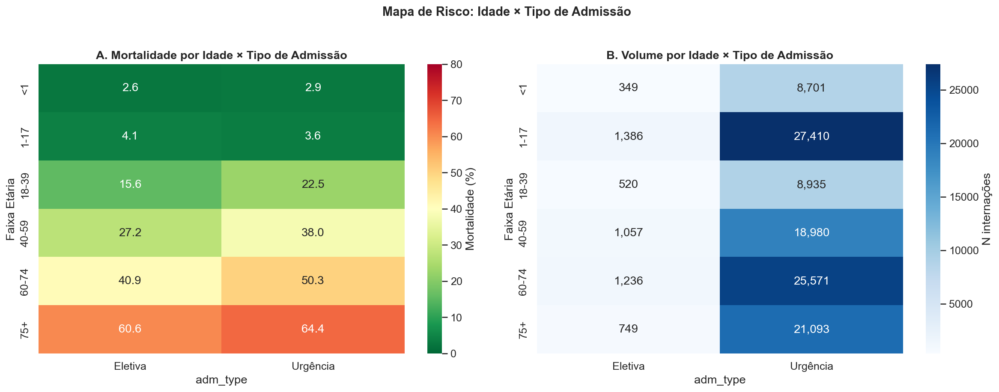
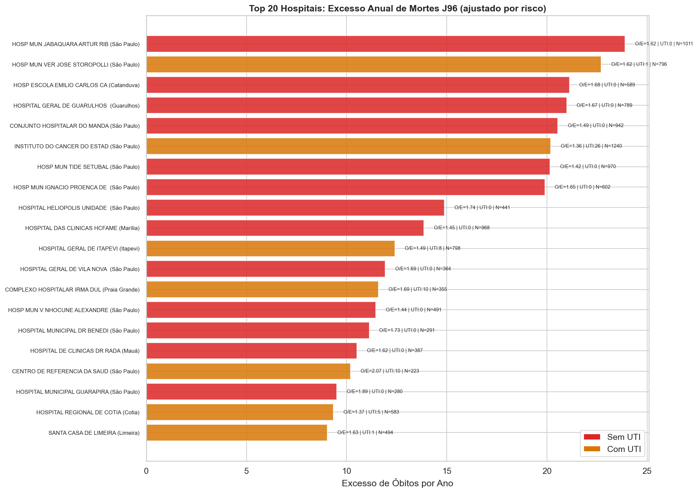
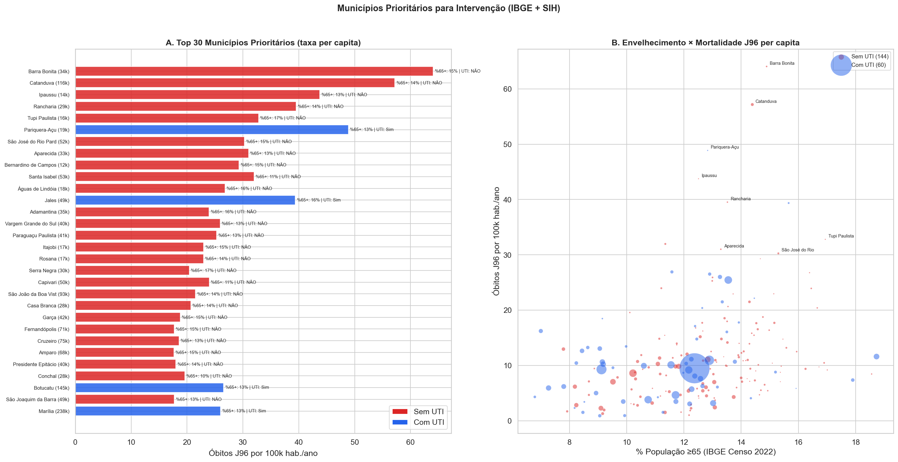
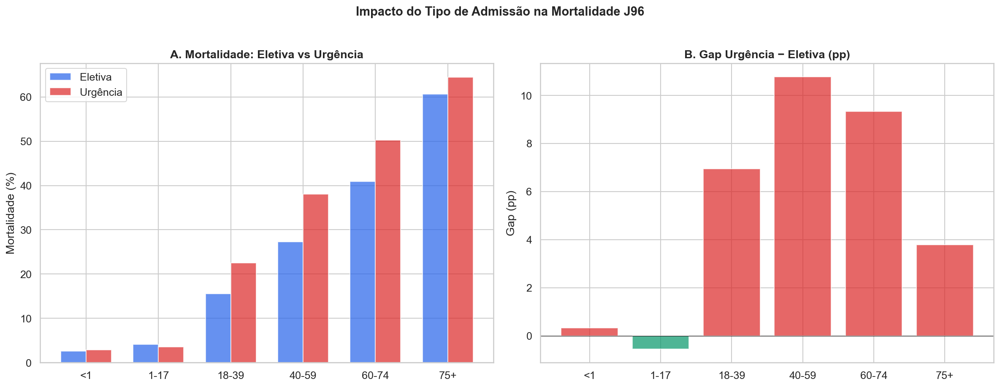
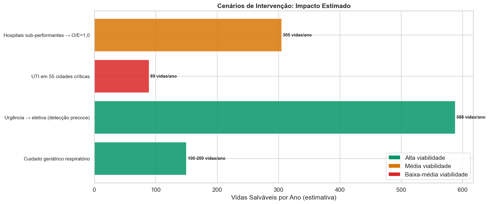
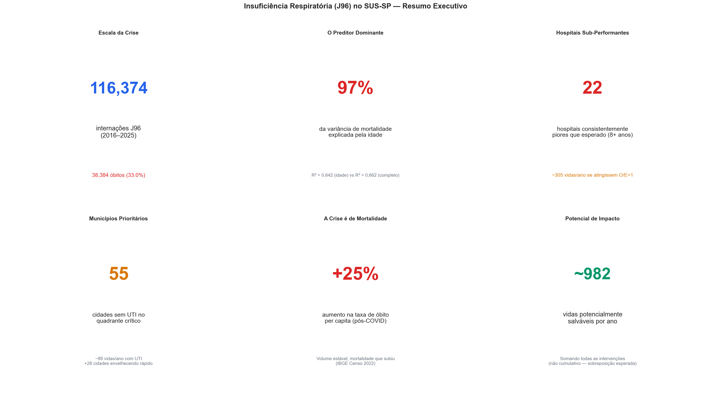

# Relatório 08 — Fatores Modificáveis e Pontos de Intervenção (RQ7)

> **Pergunta de Pesquisa:** Quais são os fatores de risco modificáveis e onde intervir para reduzir a mortalidade por insuficiência respiratória?

**Notebook:** `notebooks/08_modifiable_factors.ipynb`
**Tipo:** Síntese de todos os achados anteriores (NB 02–06) em recomendações acionáveis
**Escopo:** 116.374 internações · 38.384 óbitos · 3.838 óbitos/ano · 562 hospitais · 645 municípios (IBGE)

---

## Método

1. **Mapa de risco:** Mortalidade cruzada por [faixa etária × tipo de admissão] para identificar subgrupos de maior risco
2. **Excesso hospitalar:** Ranking de hospitais por excesso absoluto de mortes (observado − esperado), filtrado para alvos modificáveis
3. **Prioridade municipal:** Ranking de municípios por taxa de óbito J96 per capita (IBGE), ponderado por envelhecimento e ausência de UTI
4. **Gap urgência/eletiva:** Contrafactual — se pacientes de urgência tivessem mortalidade de eletivos da mesma faixa etária
5. **Cenários de impacto:** Simulação de quatro intervenções distintas com estimativa de vidas salváveis/ano

Fontes: SIH 2016–2025, CNES, IBGE Censo 2022, estimativas populacionais 2001–2025.

---

## Principais Achados

### 1. O Subgrupo de Maior Risco: Urgência 75+

| Subgrupo | N | Mortalidade | % de todos os óbitos |
|---|---|---|---|
| **Urgência 75+** | **22.668** | **64,0%** | **37,8%** |
| Urgência 60–74 | 23.819 | 49,5% | 30,7% |
| Urgência 40–59 | 16.397 | 37,3% | 15,9% |
| Eletiva (todas as idades) | 5.309 | 26,3% | 3,6% |

Quase **4 em cada 10 óbitos J96** concentram-se em pacientes idosos (75+) admitidos por urgência. Esse é o grupo com maior volume de mortes E maior mortalidade individual.

### 2. Intervenção #1: Hospitais Sub-Performantes

Os 20 hospitais com maior excesso absoluto de mortes concentram **~305 vidas/ano** acima do esperado. São hospitais que, dado o perfil de seus pacientes (idade, sexo, tipo de admissão), matam mais do que deveriam.

**Características comuns:**
- Maioria é pública (municipal)
- Maioria sem UTI ou com UTI pequena
- Concentrados na região metropolitana de São Paulo e cidades médias do interior
- **22 hospitais** mantêm esse padrão por 8+ anos consecutivos — não são flutuações

Se apenas esses 20 hospitais atingissem performance esperada (O/E = 1,0): **~305 vidas/ano**.

### 3. Intervenção #2: Municípios Prioritários

Usando dados IBGE para normalizar por população:

| Métrica | Valor |
|---|---|
| Municípios sem UTI (n≥30 J96) | 144 |
| Óbitos nesses municípios | 11.171 (29% do total) |
| Municípios no quadrante crítico (alta mortalidade + alta idade + sem UTI) | 55 |
| Vidas salváveis com UTI (ajustado por idade) | ~89/ano |

Cidades pequenas do interior com populações idosas têm taxas de óbito J96 per capita **3–5× maiores** que grandes centros — são invisíveis em rankings de volume absoluto.

### 4. Intervenção #3: Detecção Precoce (Urgência → Eletiva)

| Tipo | N | Mortalidade | Idade Média | LOS | Custo Médio |
|---|---|---|---|---|---|
| Eletiva | 5.309 | 26,3% | 43 | 15,1 dias | R$ 5.151 |
| Urgência | 111.065 | 33,3% | 44 | 9,4 dias | R$ 3.206 |

O gap urgência-eletiva é de **+7,0pp** (33,3% vs 26,3%). Pacientes eletivos têm permanência maior mas mortalidade menor — são identificados antes da deterioração crítica.

Contrafactual: se pacientes de urgência tivessem a mortalidade de eletivos da mesma faixa etária, **~588 vidas/ano** seriam salvas. Essa é a maior alavanca individual — mas também a mais difícil de operacionalizar completamente (nem toda urgência é prevenível).

### 5. Cenários de Impacto Consolidados

| Intervenção | Vidas/ano | % redução | Viabilidade |
|---|---|---|---|
| **Hospitais sub-performantes → O/E=1** | **305** | 8,0% | Média |
| **UTI em 55 cidades críticas** | **89** | 2,3% | Baixa-média |
| **Detecção precoce (urgência → eletiva)** | **588** | 15,3% | Alta |
| **Cuidado geriátrico respiratório** | **100–200** | 2–5% | Alta |

**Total potencial: ~982 vidas/ano** (não cumulativo — sobreposição esperada entre intervenções).

### 6. Dashboard Executivo

---

## Discussão

### Priorização por viabilidade

1. **Detecção precoce** (588 vidas/ano, viabilidade alta): Protocolos de alerta precoce para deterioração respiratória, telemedicina para reconhecimento de sinais em UBS, critérios de referenciamento mais agressivos. Não requer investimento de capital.

2. **Hospitais sub-performantes** (305 vidas/ano, viabilidade média): Os 22 hospitais consistentemente piores precisam de diagnóstico individualizado. Possíveis causas: falta de protocolos de ventilação mecânica, insuficiência de equipe intensivista, atrasos no reconhecimento de gravidade. Requer auditoria clínica e investimento operacional.

3. **Cuidado geriátrico** (100–200 vidas/ano, viabilidade alta): Equipes multidisciplinares para ventilação não invasiva (VNI), cuidados paliativos estruturados, programas de reabilitação pulmonar nos municípios envelhecidos. Baixo custo, alto impacto per capita.

4. **Expansão de UTI** (89 vidas/ano, viabilidade baixa-média): O impacto ajustado é modesto (NB04 mostrou que o gap de UTI é majoritariamente confundimento por idade). UTI sozinha não resolve — precisa de equipe e protocolos.

### O que NÃO funciona

- **Mais leitos sem equipe:** Leitos de UTI sem intensivistas e enfermeiros treinados não reduzem mortalidade
- **Focar em volume absoluto:** Grandes centros como São Paulo concentram muitos casos, mas têm baixas taxas per capita. O investimento marginal tem mais retorno nas cidades pequenas
- **Tratar J96 como problema genérico:** Pacientes pediátricos (<1 e 1–17) e geriátricos (75+) têm perfis radicalmente diferentes. Intervenções devem ser segmentadas

### Limitações

- Contrafactuais são estimativas otimistas — assumem que toda diferença é modificável
- A sobreposição entre intervenções não foi quantificada — o total de 982 vidas/ano provavelmente superestima o efeito combinado
- Dados de processo (protocolos, medicações, momento de intubação) não estão disponíveis no SIH
- O ajuste de risco usa apenas 3 variáveis — confundidores residuais podem inflar os excessos

---

## Resumo de Resultados — RQ7

| Pergunta | Resultado | Evidência |
|---|---|---|
| Quem morre mais? | **Urgência 75+: 64% mortalidade, 38% dos óbitos** | 22.668 pacientes |
| Onde intervir (hospitais)? | **22 hospitais, ~305 vidas/ano** | O/E > 1,3 por 8+ anos |
| Onde intervir (cidades)? | **55 cidades sem UTI, ~89 vidas/ano** | Quadrante crítico IBGE |
| O que reduz mais mortes? | **Detecção precoce: ~588 vidas/ano** | Gap urgência-eletiva ajustado |
| Total potencial? | **~982 vidas/ano** | Soma das intervenções (não cumulativo) |
| A crise é de volume? | **Não — taxa per capita estável, mortalidade +25%** | IBGE + SIH |

**Conclusão:** A mortalidade por J96 no SUS-SP é modificável. Aproximadamente **~982 vidas/ano** poderiam ser salvas com intervenções focadas: detecção precoce de deterioração respiratória (maior impacto), melhoria dos 22 hospitais consistentemente piores, e cuidado geriátrico nos municípios envelhecidos. A crise não é de falta de leitos — é de **qualidade de cuidado, timing e adequação à população idosa**.

---

## Glossário

| Sigla | Significado |
|---|---|
| **O/E** | Razão Observado/Esperado — mortalidade observada dividida pela esperada dado o perfil dos pacientes |
| **Contrafactual** | Cenário hipotético — "o que aconteceria se..." |
| **VNI** | Ventilação Não Invasiva — técnica de suporte respiratório sem intubação |
| **Gap urgência-eletiva** | Diferença de mortalidade entre admissões de urgência e eletivas |
| **Quadrante crítico** | Municípios com alta mortalidade + alta idade + sem UTI |
| **Taxa per capita** | Eventos por 100.000 habitantes/ano — permite comparação entre cidades de diferentes tamanhos |
| **UBS** | Unidade Básica de Saúde — porta de entrada da atenção primária |
| **IBGE** | Instituto Brasileiro de Geografia e Estatística |
