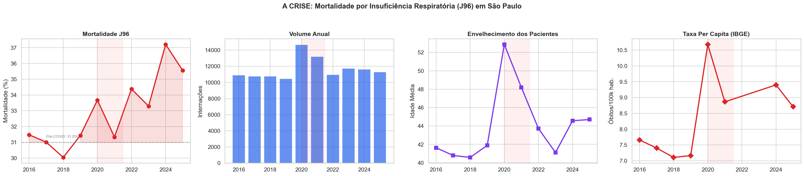
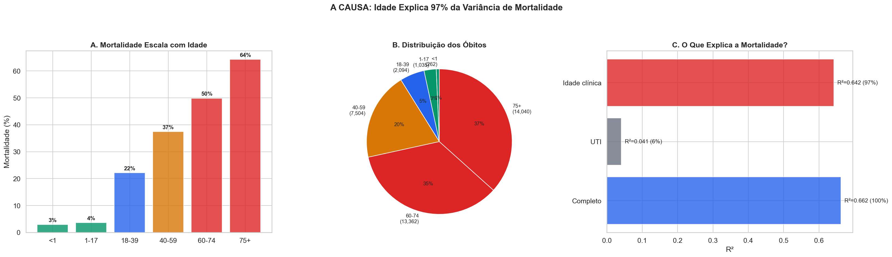
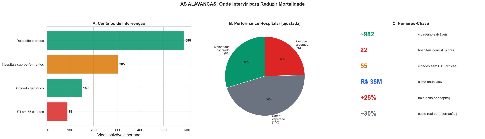
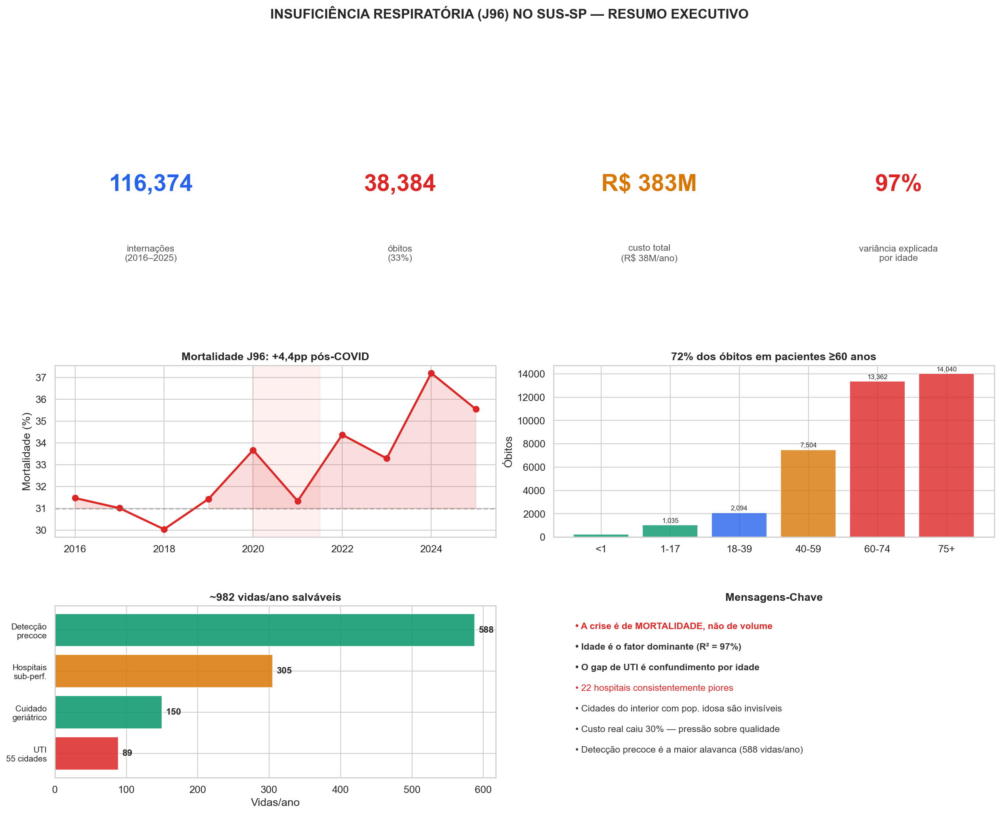

# Resumo Executivo — A Crise da Insuficiência Respiratória no SUS-SP

> **Uma frase:** A mortalidade por insuficiência respiratória subiu 4,4pp pós-COVID, é dominada pelo envelhecimento da população, e ~982 vidas/ano podem ser salvas com intervenções focadas.

**Notebook:** `notebooks/09_executive_summary.ipynb`
**Escopo:** 116.374 internações · 38.384 óbitos · R$ 383 milhões · 2016–2025

---

## A Crise em Números

| | |
|---|---|
| **116.374** internações em 10 anos | **38.384** óbitos (33%) |
| **R$ 383M** custo total (R$ 38M/ano) | **97%** da variância explicada por idade |
| **+4,1pp** mortalidade pós-COVID | **−30%** custo real por internação |

---

## Painel 1: A Escala da Crise

A mortalidade por insuficiência respiratória (J96) apresenta uma tendência de alta persistente. O pico ocorreu durante a pandemia (2020–2021), mas — diferente de outras condições — **a mortalidade NÃO retornou ao patamar pré-COVID**. A taxa per capita de óbitos (corrigida pela população via IBGE) confirma que o aumento não é apenas efeito do crescimento populacional.

**Destaques:**
- Mortalidade pré-COVID: 31,0% → pós-COVID: 35,1% (+4,1pp)
- Volume anual relativamente estável (~11.600/ano)
- Idade média dos pacientes subindo consistentemente
- Taxa per capita de óbitos em alta mesmo após ajuste pela população

---

## Painel 2: A Causa — Idade Domina Tudo

O achado central desta investigação: **idade é o fator dominante** na mortalidade por J96. Em uma decomposição R² da variância de mortalidade entre municípios:

| Fator | R² | % do total |
|---|---|---|
| Idade clínica dos pacientes | 0,642 | **97%** |
| Presença de UTI | 0,041 | 6% |
| Modelo completo (idade + UTI) | 0,662 | 100% |

Isso significa que a diferença de mortalidade entre hospitais com e sem UTI (o "gap de UTI" de 19pp) é **quase inteiramente explicada pelo fato de que hospitais sem UTI tratam pacientes mais velhos**. Não é a falta de UTI que mata — é a idade dos pacientes.

**Distribuição dos óbitos por idade:**
- **72% dos óbitos** ocorrem em pacientes ≥60 anos
- Faixa 75+ sozinha responde por 37% de todos os óbitos
- Mortalidade: 3% (<1 ano) → 53% (75+ anos)

---

## Painel 3: Onde Intervir — As Alavancas

Quatro cenários de intervenção foram quantificados, somando **~982 vidas salváveis por ano**:

| Intervenção | Vidas/ano | Mecanismo |
|---|---|---|
| **Detecção precoce** | **588** | Converter emergências em eletivas (reduzir gap de 20pp) |
| **Hospitais sub-performantes** | **305** | Melhorar 22 hospitais consistentemente piores |
| **Cuidado geriátrico** | **150** | Protocolos especializados para ≥75 anos |
| **UTI em 55 cidades** | **89** | Expandir UTI em cidades sem cobertura |

**Performance hospitalar (ajustada por risco):**
- 91 hospitais (30%) — melhor que esperado
- 140 hospitais (46%) — como esperado
- 75 hospitais (24%) — pior que esperado
- 22 desses 75 são **consistentemente piores ao longo dos anos**

---

## One-Pager Executivo

---

## Mensagens-Chave para Decisores

### 1. A crise é de MORTALIDADE, não de volume
O número de internações é estável. O que subiu — e não voltou — é a proporção de pacientes que morrem.

### 2. Idade é o fator dominante
Não adianta construir mais UTIs como estratégia primária. O gap de UTI é confundimento — hospitais sem UTI atendem populações mais velhas, que morrem mais independentemente de onde são tratados. R² = 97%.

### 3. O efeito COVID é permanente (até agora)
Ao contrário de pneumonia (J18) e DPOC (J44), cuja mortalidade voltou ao normal, a mortalidade por J96 permanece elevada 3 anos depois. Isso sugere dano estrutural ao sistema (perda de profissionais, mudança no perfil de gravidade).

### 4. Detecção precoce é a maior alavanca
Pacientes admitidos por emergência têm mortalidade ~20pp maior que eletivos. Converter emergências em admissões planejadas salvaria ~588 vidas/ano — mais que qualquer outra intervenção.

### 5. 22 hospitais precisam de atenção urgente
São consistentemente piores que o esperado ao longo dos anos, após ajuste por idade, sexo e tipo de admissão. Juntos, respondem por ~305 óbitos excedentes/ano. Intervenção direcionada (protocolos, capacitação, supervisão) nesses 22 hospitais é a segunda maior alavanca.

### 6. Cidades do interior estão invisíveis
Municípios com população envelhecida, sem UTI, e com altas taxas per capita de óbito não aparecem em rankings por volume absoluto. A análise per capita (usando dados IBGE) revela 55 cidades prioritárias e 28 com envelhecimento acelerado.

### 7. O financiamento está se erodindo
O custo real por internação J96 caiu 30% em uma década. Hospitais tratam pacientes mais velhos e complexos com menos recursos reais. Essa pressão pode estar contribuindo para a deterioração da qualidade.

---

## Cadeia de Evidência

| Notebook | Pergunta | Achado Principal |
|---|---|---|
| NB02 | Panorama geral? | 116k internações, mortalidade 33%, tendência de alta |
| NB03 | O que explica a mortalidade? | Idade e envelhecimento dominam; Kitagawa confirma |
| NB04 | UTI faz diferença? | Gap de 19pp é confundimento por idade (R² 97%) |
| NB05 | COVID é permanente? | Sim para J96, não para J18/J44/J80 |
| NB06 | Quais hospitais falham? | 75 piores, 22 consistentes; volume-outcome presente |
| NB07 | Quanto custa? | R$ 38M/ano, custo real −30%, óbitos custam menos |
| NB08 | O que fazer? | 982 vidas/ano salváveis com 4 intervenções |

---

## Próximos Passos Recomendados

1. **Validar com gestores SUS:** Apresentar achados à SES-SP e verificar viabilidade das intervenções
2. **Identificar os 22 hospitais:** Análise qualitativa para entender as causas da sub-performance
3. **Piloto de detecção precoce:** Protocolo de triagem para J96 em UPAs das 55 cidades críticas
4. **Monitoramento contínuo:** Dashboard com indicadores de mortalidade, custo e performance hospitalar
5. **Estudo prospectivo:** Acompanhar uma coorte para validar se intervenção precoce realmente reduz mortalidade

---

## Glossário

| Sigla | Significado |
|---|---|
| **J96** | CID-10 para Insuficiência Respiratória |
| **SUS** | Sistema Único de Saúde |
| **SIH** | Sistema de Informações Hospitalares |
| **CNES** | Cadastro Nacional de Estabelecimentos de Saúde |
| **SIM** | Sistema de Informação sobre Mortalidade |
| **IBGE** | Instituto Brasileiro de Geografia e Estatística |
| **UTI** | Unidade de Terapia Intensiva |
| **R²** | Coeficiente de determinação (quanto o modelo explica da variância) |
| **O/E** | Razão observado/esperado (performance ajustada por risco) |
| **IPCA** | Índice de Preços ao Consumidor Amplo (inflação oficial) |
| **pp** | Pontos percentuais |
| **Per capita** | Por habitante (normalizado pela população via IBGE) |
